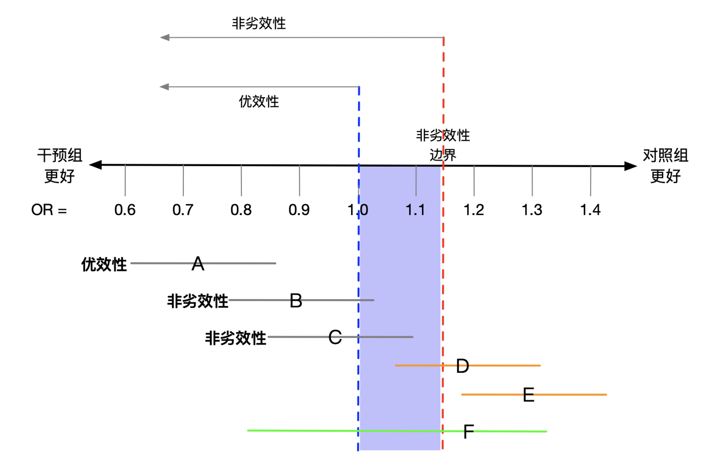

# Randomized Controlled Trials

## The magic of randomization

Intuitively, randomization is like tossing a coin. A patient with intracerebral hemorrhage receives surgery if the coin lands heads and conservative treatment if it lands tails. Under randomization, the risk of death arising from the patient's own characteristics is the same in either treatment group: the probability of receiving surgery is unrelated to those characteristics. Likewise, the risk of death caused by every factor other than treatment is the same in either group: the probability of receiving surgery is unrelated to any other factor. Formally, the groups are said to be exchangeable. Exchangeability means that the risk of death under surgery is the same for the heads and tails groups, as is the risk of death under conservative treatment. Equivalently, potential outcomes and treatment are independent. In the language of Chapter 1, randomization ensures exchangeability between groups in expectation and thereby supports the exchangeability, positivity, and other conditions required to identify causal effects. This is the fundamental reason randomized controlled trials are regarded as the gold standard for causal inference.

## Common randomized controlled trial designs

### Parallel-group design

This is the most commonly used RCT design. Eligible participants are randomly assigned to an experimental or control group and then receive the corresponding intervention. The two groups are observed in the same environment, and investigators use objective outcome measures to assess the effect. The allocation ratio is most often 1:1, although the experimental group may be assigned a larger share when prior non-randomized evidence suggests that it may provide substantially greater benefit.

### Cluster-randomized design

Cluster designs are mainly used when it is unsuitable to randomize individuals. If trial participants share a ward, hospital, or community, individual allocation can easily blur the distinction between intervention and non-intervention. A cluster RCT therefore randomizes entire wards, hospitals, or communities, which then receive the intervention or control condition. Apart from the unit being randomized, its design and requirements are similar to a parallel RCT. Cluster trials generally require much larger sample sizes, and the number of clusters and within-cluster correlation must be specified in advance.

### Crossover randomized trial

Unlike an ordinary RCT, a crossover trial has two periods. In the first period group A receives the experimental treatment and group B the control; in the second period the treatments are exchanged. A washout period is placed between periods to eliminate effects of the first treatment. This design can mitigate the ethical concern that the control group is denied an effective treatment and, in one sense, increases the information contributed by each participant.

### Stepped-wedge randomized trial

A stepped-wedge design is most often used for cluster RCTs. Participants are divided into and label several groups (for example A, B, C, D, E, and F). Before the study begins, the number of groups starting the intervention at each step (for example two) and the time interval (for example three months) are specified. The first two groups in the predetermined order receive the intervention, while the remaining groups wait as controls. Three months later the next two groups begin the intervention, and three months after that the final two groups do so. Over time every group receives the intervention and the study ends. This design substantially reduces the ethical burden, maximizes participant benefit, and retains both randomization and control. It cannot usually be double-blind: at most the outcome assessor can be blinded. Delayed intervention effects require careful consideration and an appropriate step length.

## Randomization methods

### Simple randomization

Simple randomization is the most basic form. A coin toss can assign a participant to group A when heads occurs and group B when tails occurs. In clinical research, a random-number table may also be used: select a row or column of digits arranged at random, assigning odd numbers to A and even numbers to B. Its main advantage is ease of implementation. Its main disadvantage is that small samples may be markedly unbalanced between groups, reducing power to detect a true difference. For example, with 20 participants, the probability that the group ratio lies between 12:8 and 8:12 is about 50%.

An incorrect alternative is alternating allocation (for example, ABABAB...). This is not random. Except for the first participant, investigators and participants know the upcoming assignment, which can introduce bias. Preventing investigators and participants from knowing the forthcoming group is called *allocation concealment*. Allocation concealment and blinding are different concepts: concealment keeps the allocation sequence unknown before assignment to prevent selective enrollment; blinding keeps participants, investigators, or assessors unaware of the assigned group after assignment. Both are essential means of reducing bias (Schulz and Grimes 2002). The design and reporting of RCTs can follow the CONSORT statement (Schulz et al. 2010).

### Block randomization

Block randomization avoids the imbalance that can arise with simple randomization. First choose a block size, for example four. Of the first four enrolled participants, randomly assign half to A and half to B; repeat this process for each succeeding block until all participants are randomized. A potential drawback is that, when block size is known and the trial is not double-blind, the final one or two assignments in a block may be predictable. With blocks of four, for example, after BAA the final assignment must be B; after BB the remaining two must be AA. This can be avoided by varying the block size, randomly choosing among sizes such as 2, 4, 6, and 8 after each completed block.

### Stratified randomization

Some baseline characteristics are related to outcome; age, for example, is prognostic in many studies. Simple randomization may distribute prognostic factors unevenly between treatment and control groups. Stratified randomization helps make such factors comparable across groups. Each factor is divided into two or more subgroups (for example, male/female); the total number of strata is the product of the numbers of subgroups for all factors, and randomization is carried out within the stratum to which a participant belongs. In multicenter RCTs, center may be an important prognostic factor and should be used for stratification.

## Blinding

### Open-label trials

Open-label studies are usually easier and less costly to conduct, but their principal disadvantage is the possibility of bias. This is particularly important when outcomes depend on self-report or symptom assessment: both efficacy and safety reporting may be biased. Participants receiving a drug may exaggerate benefit because they believe it works, or exaggerate adverse effects because they fear them. Participants who expect benefit but are assigned to control may be dissatisfied and withdraw. Investigators may also introduce bias. In a trial of coronary artery bypass surgery versus medical treatment, the two groups had the same number of smokers at baseline, but smokers in the surgical group decreased markedly early in follow-up. A possible explanation is that unblinded surgeons gave more advice not to smoke to participants who underwent surgery.

### Single-blind trials

In a single-blind study only the participants do not know which intervention they receive. Its disadvantages resemble those of an open-label design. Investigators often prefer positive results, which may be more likely to appear in high-impact journals and bring conference invitations or funding. They may therefore unconsciously favor the intervention group while collecting data or evaluating and interpreting results. Concomitant treatments—any non-study treatment provided during the trial—can also introduce bias if they are used unequally between groups.

### Double-blind trials

In a double-blind study, neither participants nor investigators collecting data and assessing outcomes know the intervention assignment. This design is generally limited to trials of drugs or biological products and is rarely feasible for surgical RCTs. Its principal advantage is a reduced risk of bias. In drug trials requiring dose adjustment through monitoring adverse effects, an unblinded pharmacist or clinician independent of the investigators may perform the adjustment.

## Noninferiority trials

A noninferiority trial tests whether one intervention is not worse than another. A conventional superiority trial tests whether two interventions differ in efficacy. In a noninferiority trial, intervention A may be better than B, the same as B, or somewhat worse than B, provided that the difference does not exceed the noninferiority margin.

**Case 2.1**

Warfarin is commonly used for patients with atrial fibrillation, and several randomized trials have shown that it reduces ischemic stroke risk. Its adverse effect is bleeding. Suppose a new drug may be more effective and cause fewer adverse effects than warfarin; ignoring price, it would clearly be preferred. Even if it has the same efficacy but fewer adverse effects, it would still be preferred. Thus, even if superiority cannot be shown, use of the new drug is reasonable if it can be shown not to be worse than warfarin. A noninferiority trial can therefore compare their efficacy.

The key concept is the noninferiority margin. Assume that the odds ratio measures the effectiveness of the new drug versus warfarin. In a superiority trial, the 95% confidence interval for the odds ratio must lie below 1. In a noninferiority trial, an odds ratio of 1 is acceptable because it indicates that the new drug is not inferior. A threshold—the noninferiority margin—must be specified in advance, and the upper limit of the 95% confidence interval must fall below it for the new drug to be considered noninferior. The margin should be set at the design stage using efficacy established in prior placebo-controlled trials, usually retaining a specified proportion of the observed effect (the effect-retention approach); it must not be relaxed merely to improve power. The CONSORT extension provides guidance for design and reporting of noninferiority and equivalence trials (Piaggio et al. 2012).

::: {.text-center}
{fig-alt="Illustration of a noninferiority margin" width="80%"}

Figure 2.1 Illustration of the noninferiority margin.
:::

In Figure 2.1, the horizontal axis is the odds ratio. The blue dashed line at 1 is the null hypothesis for a superiority trial. An estimated odds ratio below 1 favors the new drug because the risk is lower. The red dashed line just to the right of 1 is the noninferiority margin: it represents a small, clinically unimportant disadvantage of the new drug that remains acceptable. A–F represent point estimates (the letter positions) and 95% confidence intervals (the line lengths) from six hypothetical trials.

In trial A, both the point estimate and the 95% confidence interval lie entirely below 1, indicating superiority of the new treatment. In trial B, the point estimate is below 1 but the 95% confidence interval includes 1; superiority cannot be claimed. However, the entire interval is below the noninferiority margin, so the new drug is noninferior. Trial C is likewise noninferior because the upper confidence limit is below the margin. Trial D fails noninferiority because its upper confidence limit exceeds the margin; indeed, its entire interval favors warfarin, indicating superiority of warfarin. Trial E indicates that the new drug is much worse than warfarin. Trial F has a very wide confidence interval and supports neither superiority nor noninferiority.

## Pragmatic clinical trials

Conventional clinical trials are often optimized: experienced research staff participate and highly selected participants are enrolled. They may overestimate benefit, underestimate harm, and be difficult to translate into practice. Pragmatic RCTs commonly ask whether a health policy or medical decision can improve participant outcomes. They seek to simulate usual care and have goals close to the real world. The distinction between pragmatic and explanatory trials was introduced by Schwartz and Lellouch (1967): pragmatic trials focus on effectiveness in usual care, whereas explanatory trials focus on efficacy under ideal conditions. The PRECIS-2 tool can be used to assess pragmatism across eligibility, follow-up, adherence, and other design domains (Loudon et al. 2015).

### Low complexity

Pragmatic trials minimize inclusion and exclusion criteria and reduce the number and complexity of follow-up visits, thereby increasing participation.

### Consent may be waived in special circumstances

With ethics approval, trials may sometimes proceed without informed consent. In the CRASH trial, more than 10,000 patients with head injury and impaired consciousness were randomized to determine whether corticosteroids affected mortality and neurologic disability compared with placebo. Because treatment had to be given very soon after injury, risk was considered minimal, usual care was not disrupted, and no extra follow-up was added, the investigators sought an ethics waiver of consent. The Declaration of Helsinki states that research may proceed without consent when it cannot be obtained and the research cannot be delayed.

### Blinding is usually not used

Blinded trials are not fully pragmatic, since treatments in routine practice are explicit. Allocation is therefore usually unmasked. To minimize bias, primary outcomes are commonly objectively assessable major events such as death or emergency admission.

### No additional follow-up

Follow-up in pragmatic research should not add burden to participants or staff, and no extra visits are required. This approach is most feasible in health systems with reliable, accessible electronic health records that capture events of interest.

### Assessment of adherence

Pragmatic research does not require every participant to complete the assigned regimen. Adherence itself can be analyzed as an outcome; poor adherence suggests that the treatment is not feasible in real-world practice.

### Outcome ascertainment and analysis

Pragmatic outcomes are usually simple to minimize data-collection requirements. The CRASH trial achieved considerable simplification with a two-page case-report form. In another catheter trial, the primary outcome was symptomatic catheter-associated urinary tract infection within six weeks after discharge rather than laboratory-confirmed in-hospital infection. Mail questionnaires or web-based forms are often used instead of clinic visits, substantially reducing cost.

## Adaptive clinical trials

An adaptive clinical trial uses information accumulated within and outside the trial to modify specified aspects of its design dynamically according to prespecified rules, without undermining validity, scientific rigor, or integrity. Modifications may include allocation ratios, total sample size, and eligibility criteria; a trial may extend from phase II to phase III or add or drop treatment arms. Adaptive designs may shorten completion time, reduce resource requirements and exposure to ineffective treatments, and improve the overall probability of success.

Common adaptive designs include sample-size re-estimation, response-adaptive randomization, dropping futile arms, adaptive enrichment, and seamless phase II–III designs. Sample size may be re-estimated using the observed event rate and actual power during the trial. Response-adaptive randomization changes allocation probabilities during the trial, so participants enrolled after favorable interim results are more likely to receive the intervention. Adaptive enrichment modifies eligibility or outcome assessment: when interim analysis indicates a favorable response in a subgroup, eligibility can be modified to recruit only or mainly that subgroup. Seamless designs continue from one phase to the next, typically phase II to phase III; phase II results can determine initial allocation ratios and planned total sample size, while phase III expands to a larger population.

Adaptive RCTs retain the principle of randomization and still require a sample-size calculation, but prespecified rules determine the next-stage sample size as the study proceeds. Conventional frequentist methods may not predict adjustments to individual treatment assignment well; Bayesian methods may therefore use prior information to predict treatment performance. Adaptive designs rely heavily on computer simulation. Investigators and trial statisticians must be convinced that expected benefits—fewer required participants, shorter completion, and fewer ineffective treatments—outweigh potential risks such as unstable interim effect estimates and reduced robustness of final analyses. Implementation usually involves repeated interim-analysis and decision cycles. Rules specified before the trial begins include mathematical criteria for stopping an arm or trial, changes in allocation ratios, sample-size re-estimation, narrowing eligibility, and selection of new arms.

The statistical analysis plan for an adaptive design includes simulations, interim analyses, and final analysis of the completed trial. A run-in period is needed, during which a prespecified number of patients may be enrolled at a fixed allocation ratio (usually 1:1) to ensure sufficient data and reasonable precision. Adaptation too early is vulnerable to random error from sparse data. A rule of thumb for response-adaptive randomization is to conduct the first interim analysis after at least 20–30 participants per group. Other adaptations, including sample-size re-estimation and enrichment, usually need a longer run-in and larger sample. In multi-arm adaptive trials, control allocation is often fixed (for example, 20% of the total sample), whereas allocation among experimental treatments is adjusted. All adaptation rules must be prespecified in the protocol, and computer simulations must control the overall type I error rate so repeated interim analyses do not inflate false positives. Methodological and reporting guidance is available from Bhatt and Mehta (2016) and Pallmann et al. (2018).

I-SPY 2 is an adaptive breast-cancer RCT intended to identify treatments according to tumor molecular biomarkers. All patients receive standard neoadjuvant chemotherapy while five novel drugs, each added to standard therapy, are tested. After baseline biopsy, imaging, and blood tests, patients are randomized to drug groups and response is assessed. To obtain early information, investigators model the relationship between response and biomarkers, continually evaluate results, and use them to determine randomization probabilities. Using Bayesian adaptive randomization, a drug that performs well in participants with a particular biomarker is preferentially assigned to later participants with that biomarker. When the probability that a drug is effective in all patients becomes sufficiently low, it leaves the trial. At the end, drugs more effective than standard therapy and their corresponding biomarker profiles are tested in further phase III trials. This approach can rapidly evaluate new drugs, identify effective drugs and combinations, and identify breast-cancer subtypes likely to benefit; information from each patient informs subsequent allocation.

In neurosurgery, GBM-AGILE is a seamless phase II/III glioma platform similar to I-SPY 2. In the first stage, multiple experimental arms are compared with a common control, using biomarker-based adaptive randomization to evaluate effects on survival. Arms showing substantial effects enter the second stage, where a fixed randomization design confirms effectiveness. This platform can accelerate access to treatment and speed drug registration and regulatory review.

### Basket trials

A drug with a clearly defined target can be regarded as a basket: studying different cancers carrying the same target gene in that basket is a basket trial. In essence, one drug is tested across different tumors. The crizotinib A8081013 trial (NCT01121588) is a basket trial including a range of malignancies. Basket trials targeting BRAF are also widely conducted. BRAF mutations have been detected in multiple myeloma, melanoma, ovarian cancer, colorectal cancer, thyroid cancer, choriocarcinoma, gastrointestinal tumors, lung cancer, craniopharyngioma, and other cancers.

### Umbrella trials

One disease may be driven by different genes; lung cancer, for example, may be driven by KRAS, EGFR, or ALK. Different subtypes of the same disease are gathered beneath one umbrella and receive distinct precision therapies according to their target genes. The I-SPY 2 and GBM-AGILE studies described above are umbrella trials.

## Interpreting negative randomized controlled trial results

Well-designed RCTs raise the level of evidence for clinical practice. It is common but unreasonable to classify a study as positive or negative solely according to whether its *p* value is below 0.05. A *p* value should instead be understood as continuous: smaller values provide stronger evidence for a treatment effect. Confidence intervals estimate the range of uncertainty around the effect. Interpretation should also consider the totality of evidence—primary, secondary, and safety outcomes—not just the primary endpoint.

Earlier evidence suggests that only 13.8% of new-drug clinical studies initiated by pharmaceutical companies ultimately receive approval (Wong et al. 2019). Negative trials understandably disappoint patients and manufacturers. In neurosurgical trials, failure can reflect biological properties of drugs or characteristics of disease, including pharmacokinetic issues, lack of reliable animal models, and the blood–brain barrier. However, negative results can also reflect poor design. Resource-constrained investigator-initiated trials sometimes have design flaws that lead to negative conclusions; avoiding such deficiencies is essential for future RCTs.

According to their hypothesis, RCTs may be superiority, noninferiority, or equivalence trials; according to their randomization unit, they may be ordinary, cluster, or crossover trials. Consider a study assessing the safety of withholding perioperative corticosteroids for pituitary tumors. Its primary hypothesis is that withholding corticosteroids does not cause more complications than using them; a noninferiority design is therefore more appropriate, but was not used. Another advantage of noninferiority design is substantially smaller sample size and greater efficiency. If postoperative adrenal insufficiency is expected in 5% of the corticosteroid group and 10% of the no-corticosteroid group, a superiority design would require 864 participants, whereas a noninferiority design would require only 118. Randomization was another potential limitation. If two participants are enrolled in the same ward on the same day, inadequate procedures or staffing may lead to corticosteroids being given to a participant assigned not to receive them—effectively switching groups. Cluster randomization can avoid this problem. The cluster is often a health-care institution, ward, or time period, so these units are randomized. It can improve adherence because nearby patients generally receive the same regimen, management is more uniform, and contamination between groups is reduced.

The population studied also matters because sensitivity to treatment may vary. CRASH-3 evaluated tranexamic acid in all types of traumatic brain injury with mortality as the endpoint. Mortality was 18.5% with tranexamic acid and 19.8% with placebo, with a risk ratio of 0.94 (95% CI 0.86–1.02; *p* > 0.05), a result that could be labeled negative. Stratified analyses showed different effects: in mild-to-moderate injury the risk ratio was 0.78 (95% CI 0.64–0.95), whereas in severe injury it was 0.99 (95% CI 0.91–1.07). The study therefore concluded that tranexamic acid may reduce mortality in mild-to-moderate injury. In STICH-I, surgery versus conservative treatment for spontaneous intracerebral hemorrhage did not differ on the primary endpoint, but subgroup analysis suggested better outcomes from early surgery in superficial cortical hematomas. STICH-II then studied superficial hematomas but likewise did not confirm surgical superiority; its subgroup analyses also suggested population heterogeneity, with patients of better prognosis possibly benefiting more from surgery. In EORTC 22033-26033, temozolomide versus radiotherapy for high-risk low-grade glioma was not positive in the overall population, but progression-free survival was longer with radiotherapy in the IDH-mutant/non-codeleted subgroup. Subgroup analysis is discussed further in Chapter 3.

Secondary outcomes can sometimes assist clinical decisions. In MISTIE-III, mortality was a secondary endpoint and was significantly lower with minimally invasive treatment than with conservative treatment, suggesting that minimally invasive treatment may reduce mortality in spontaneous intracerebral hemorrhage. Both subgroup and secondary-outcome findings, however, require caution when interpreting results or guiding decisions: they involve multiple comparisons and have a greater probability of type I error and false-positive findings.

Because of type I error constraints, RCTs often include only one primary endpoint. Some neurosurgical diseases have clear endpoints, such as survival in glioma or endocrine control in functioning pituitary tumors. For traumatic brain injury and hemorrhagic disease, however, functional status may be assessed by several scales, including the modified Rankin Scale (mRS) and Glasgow Outcome Scale (GOS), and different cut-points may be considered. A trial comparing decompressive craniectomy with conservative treatment for traumatic intracranial hypertension used GOS as its primary endpoint. An exploratory dichotomized analysis using severe upper-limb paresis or better as the cut-point did not show a statistically significant difference, so strictly speaking the trial was negative. Yet the GOS distribution showed that decompressive craniectomy significantly reduced mortality (26.9% versus 48.9%; *p* < 0.05). Moreover, when outcomes are repeatedly measured events, such as endocrine remission in trials of functioning pituitary tumors, conventional designs often use only the first event and ignore later events. Recent studies suggest that including repeatedly measured outcomes can improve power.

RCTs must also consider participant adherence, adherence by treatment providers, and protocol deviations. MISTIE-III enrolled 506 adults with spontaneous intracerebral hemorrhage and assessed neurologic status at 365 days, defining mRS 0–3 as a good outcome and 4–6 as a poor outcome. It found no evidence that minimally invasive surgery improved neurologic status versus conservative treatment. However, only 59% of participants achieved the target hematoma reduction (at least 15 mL), and earlier research showed a positive relation between evacuation volume and outcome. Treatment crossover is uncommon in blinded drug/placebo trials, but is a major issue in surgery/non-surgery trials. In STICH-II, although 294 participants were randomized to conservative treatment, 62 switched to surgery after randomization—a crossover rate of 21%.

Because negative results are defined statistically, statistical non-significance does not necessarily mean clinical irrelevance. In Corti-TC, hydrocortisone or fludrocortisone versus placebo did not statistically reduce hospital-acquired pneumonia after traumatic brain injury (risk ratio 0.75, 95% CI 0.55–1.03; *p* > 0.05). Nevertheless, a potential 25% risk reduction may be clinically important. In CeTeG/NOA-09, lomustine plus temozolomide versus temozolomide alone for MGMT-positive glioma had median survival as the primary endpoint and a hazard ratio of 0.60 (95% CI 0.35–1.03; *p* > 0.05), conventionally a negative result. Yet median survival was 48.1 months with combination treatment versus 31.4 months with temozolomide alone, an average increase of 17 months that is clinically meaningful.

After a negative trial, investigators should also ask whether the sample size was adequate. In Corti-TC, hospital-acquired pneumonia in the placebo group was much less frequent than anticipated, meaning more participants were actually needed to detect a difference. Another study compared minimally invasive neurosurgery with conservative treatment for intracerebral hemorrhage. Thirty-day mortality was 9.5% with minimally invasive treatment and 14.8% with conservative treatment; although the difference was not statistically significant, the total sample was only 96, far below the planned size.

Finally, intention-to-treat analysis is the principal method in almost all RCTs: every randomized participant is analyzed regardless of subsequent events. A negative intention-to-treat result can, however, arise when some participants deviate from protocol. Per-protocol analyses are now often presented as subsequent exploratory analyses in high-quality RCTs. In CeTeG/NOA-09, some centers showed selection bias; an exploratory analysis excluded these centers and used inverse-probability weighting to control confounding, suggesting that lomustine plus temozolomide may perform better. Per-protocol analyses can nevertheless remain biased in the presence of unmeasured confounding.

## References {.unnumbered}

1. Thorlund K, Haggstrom J, Park JJ, Mills EJ. Key design considerations for adaptive clinical trials: a primer for clinicians. *BMJ*. 2018;360:k698.
2. Friedman LM, Furberg CD, DeMets DL, Reboussin DM, Granger CB. *Fundamentals of Clinical Trials*. Springer; 2015.
3. Schulz KF, Grimes DA. Generation of allocation sequences in randomised trials: chance, not choice. *Lancet*. 2002;359(9305):515-519.
4. Schulz KF, Grimes DA. Allocation concealment in randomised trials: defending against deciphering. *Lancet*. 2002;359(9306):614-618.
5. Schulz KF, Grimes DA. Blinding in randomised trials: hiding who got what. *Lancet*. 2002;359(9307):696-700.
6. Schulz KF, Altman DG, Moher D, et al. CONSORT 2010 statement: updated guidelines for reporting parallel group randomised trials. *BMJ*. 2010;340:c332.
7. Piaggio G, Elbourne DR, Pocock SJ, et al. Reporting of noninferiority and equivalence randomized trials: extension of the CONSORT 2010 statement. *JAMA*. 2012;308(24):2594-2604.
8. Schwartz D, Lellouch J. Explanatory and pragmatic attitudes in therapeutical trials. *Journal of Chronic Diseases*. 1967;20(8):637-648.
9. Loudon K, Treweek S, Sullivan F, et al. The PRECIS-2 tool: designing trials that are fit for purpose. *BMJ*. 2015;350:h2147.
10. Bhatt DL, Mehta C. Adaptive designs for clinical trials. *New England Journal of Medicine*. 2016;375(1):65-74.
11. Pallmann P, Bedding AW, Choodari-Oskooei B, et al. Adaptive designs in clinical trials: why use them, and how to run and report them. *BMC Medicine*. 2018;16(1):29.
12. Wong CH, Siah KW, Lo AW. Estimation of clinical trial success rates and related parameters. *Biostatistics*. 2019;20(2):273-286.
