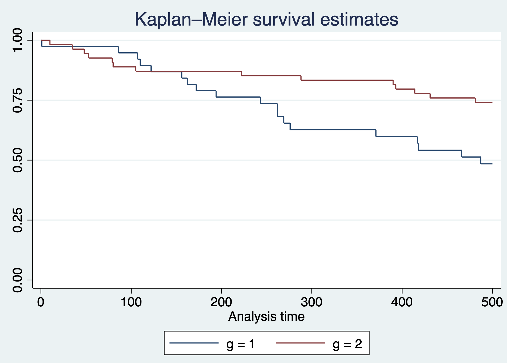
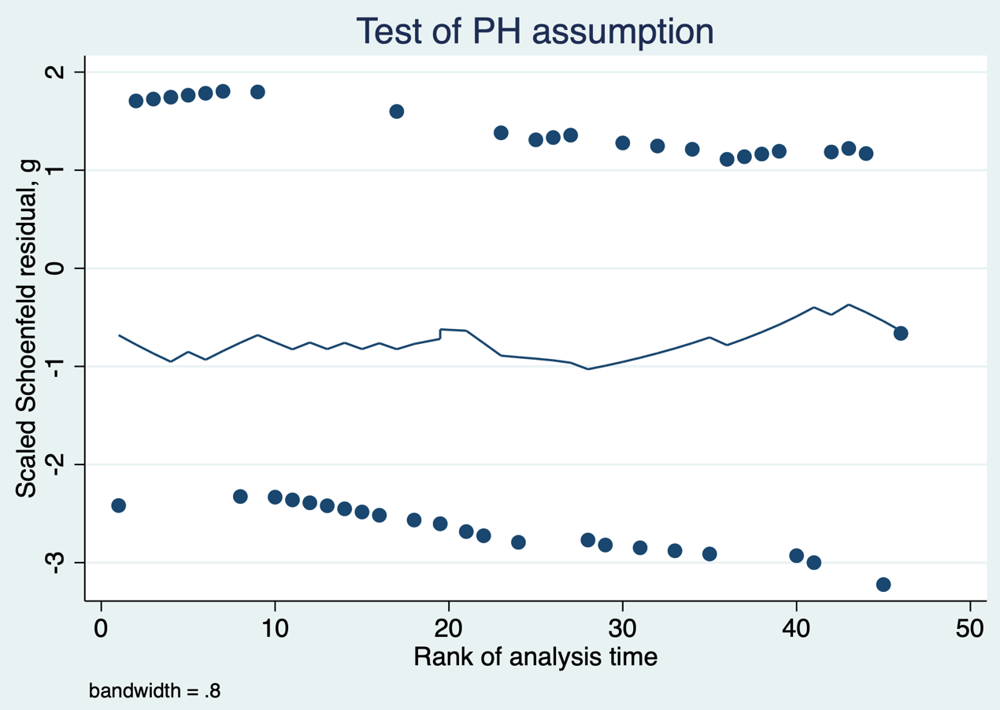
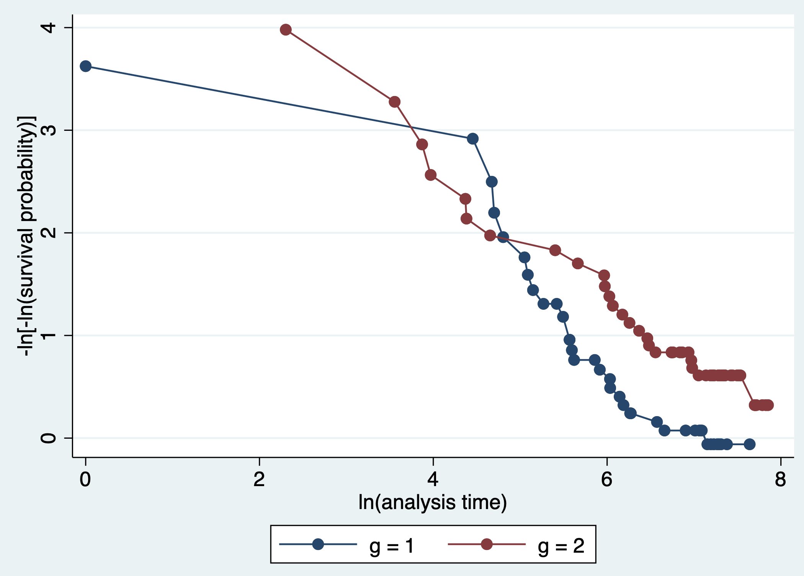
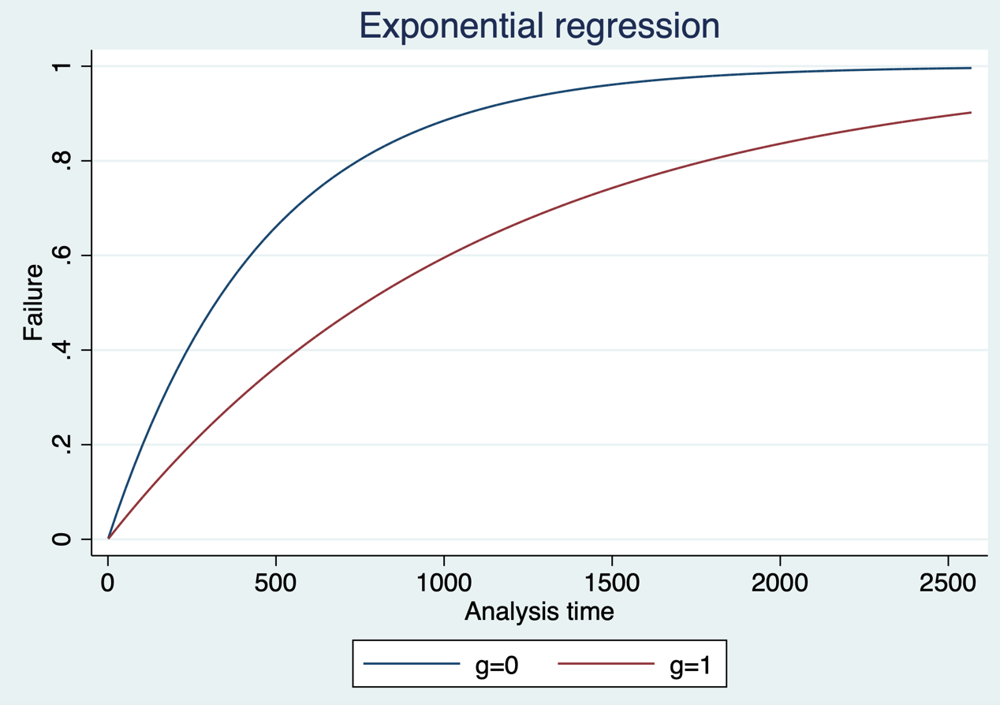
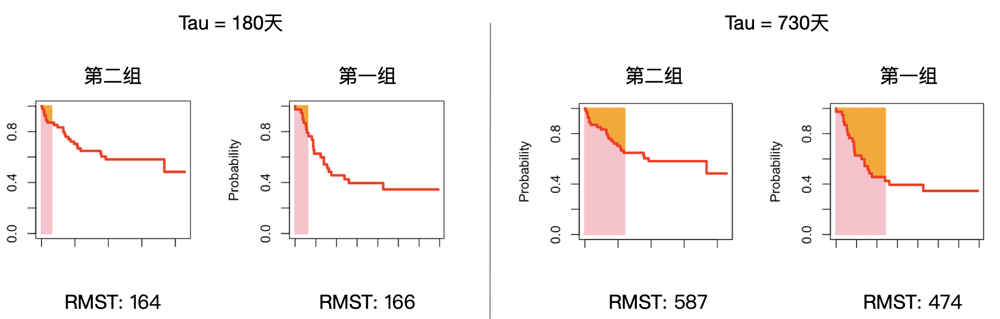
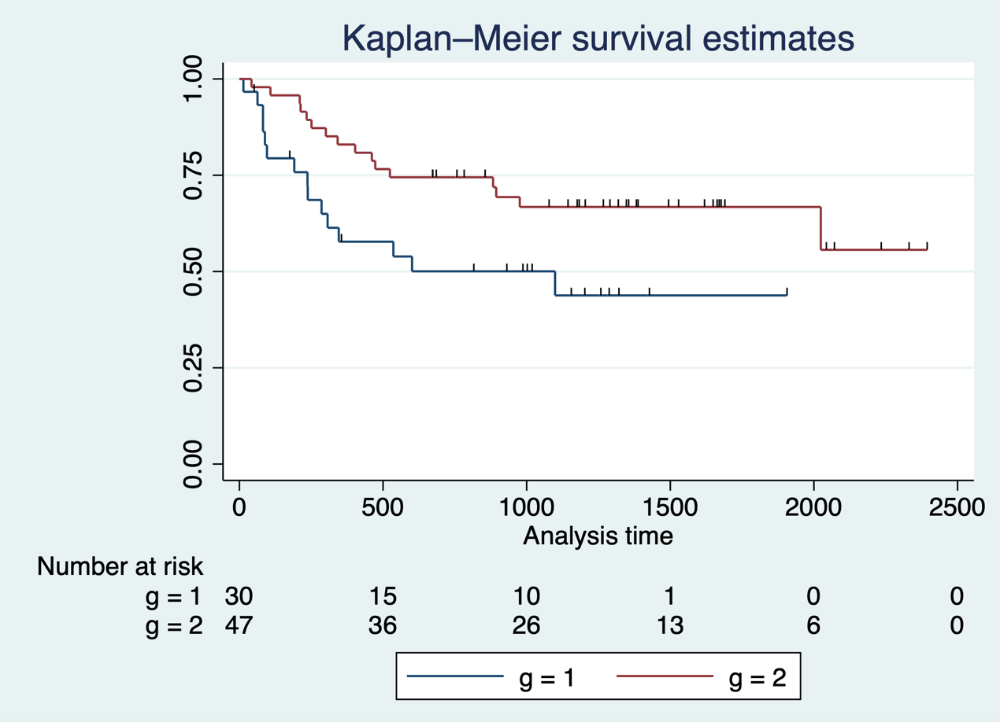
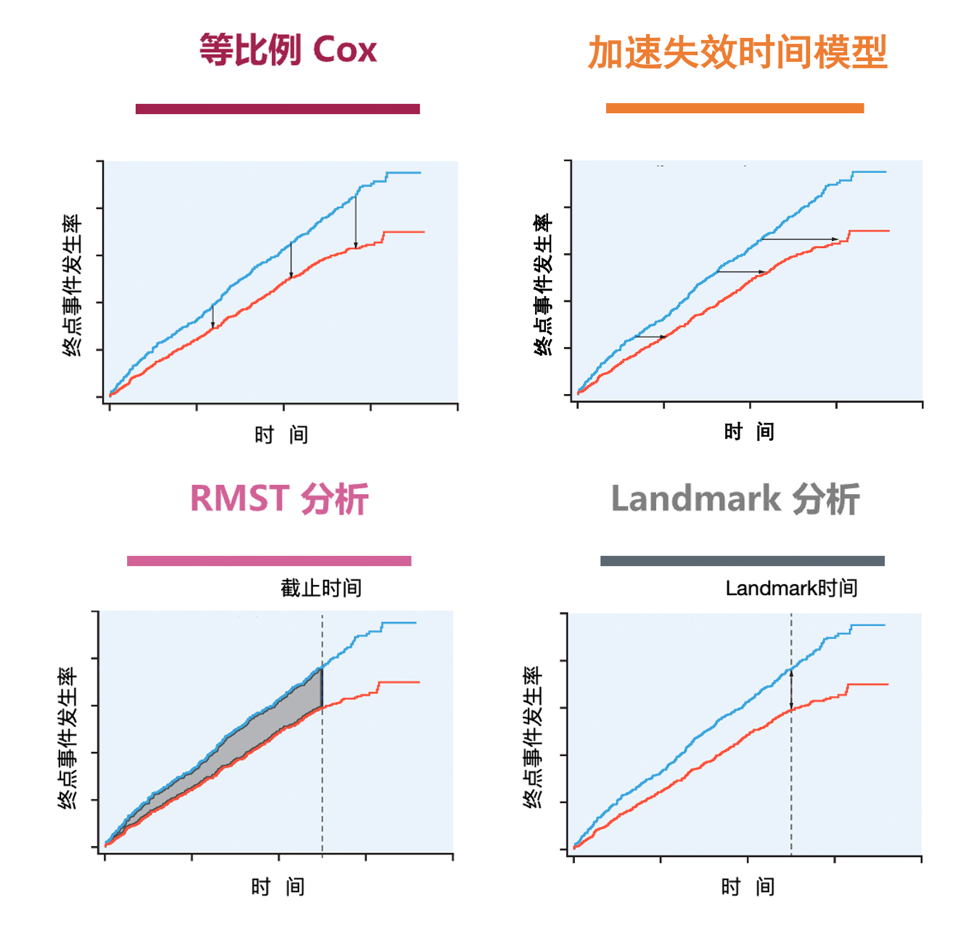
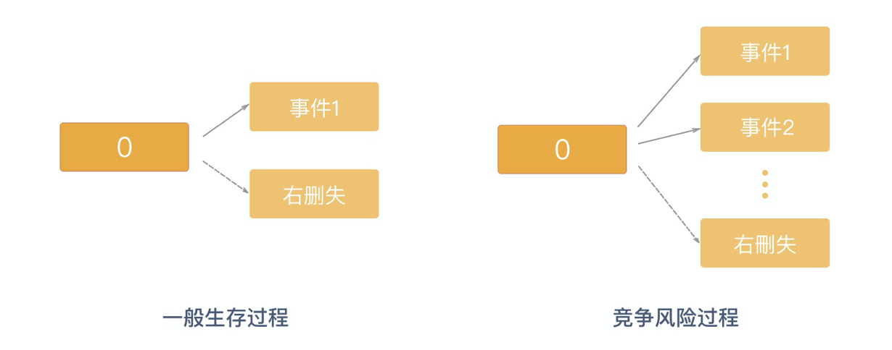
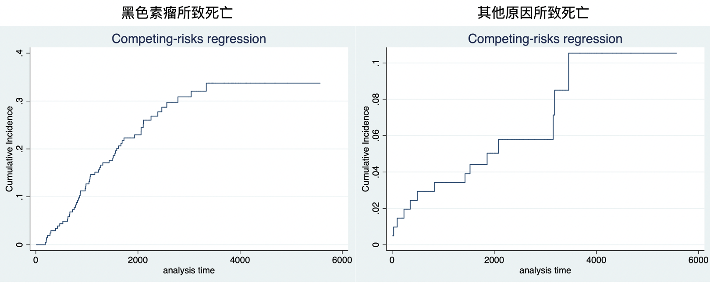
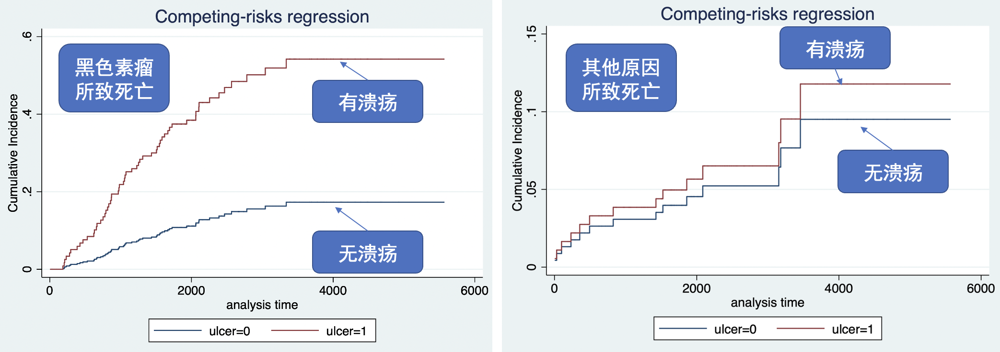

# Clinical Research with Survival Outcomes

Survival analysis analyzes and makes inferences about the time to a specified event and the relation between survival outcome and prognostic factors. It is a method for censored data, also called survival-rate analysis. Different questions call for different methods: life tables estimate survival at a specified time, such as 5-year survival; life tables and Kaplan–Meier methods estimate median survival; Kaplan–Meier methods compare survival across levels of one factor; and Cox regression assesses effects of multiple factors. Life tables and Kaplan–Meier methods are relatively straightforward and are not discussed further here.

The Cox proportional-hazards model, proposed by Cox in 1972, is a semiparametric regression model for the effect of one or more covariates on the rate of death or another event at a given time. It accommodates numeric and categorical covariates and is widely used in biomedical research. Life tables and the Kaplan–Meier method are nonparametric; the latter was proposed by Kaplan and Meier in 1958.

## The proportional-hazards assumption in Cox regression

The most important consideration in Cox regression is proportional hazards (PH): the ratio of hazards between groups does not change over time, so a factor has the same relative effect at every time point.

**Case 5.1**

This bone-marrow transplantation example includes patients with different leukemia types. `g` is group (1 = acute lymphoblastic leukemia; 2 = low-risk acute myeloid leukemia); `T1` is survival time in days after transplantation; and `delta1` is outcome (1 = death, 0 = alive). The clinical question is whether postoperative mortality differs between the two leukemia groups. To simplify the example, assume there is no confounding.

| g | T1 | delta1 |
|:--|--:|--:|
| … | … | … |
| 1 | 107 | 1 |
| 1 | 269 | 1 |
| 1 | 350 | 0 |
| 2 | 2569 | 0 |
| 2 | 2506 | 0 |
| 2 | 2409 | 0 |
| … | … | … |

First declare the survival-data format in Stata using `stset`, with `t1` as survival time and `delta1==1` as the clinical event. Plot group-specific Kaplan–Meier curves using `sts graph`.

::: {.callout-note appearance="simple" icon="false" title="Code 5.1"}
```stata
stset t1, failure(delta1==1)
sts graph, by(g)
```
:::

Three methods can assess PH. First, inspect whether Kaplan–Meier curves cross. Here the red curve falls more rapidly shortly after surgery than the blue curve, suggesting higher short-term mortality in low-risk AML, but the blue curve falls substantially in long follow-up. The curves cross, so PH is not satisfied.

::: {.text-center}
{width="100%"}

Code 5.1 output: Kaplan–Meier curves for the two groups.
:::

Second, plot Schoenfeld residuals against time. No clear time trend supports PH; an upward trend, as shown here, suggests a possible violation.

::: {.callout-note appearance="simple" icon="false" title="Code 5.2"}
```stata
stcox g
estat phtest, rank plot(g)
```
:::

::: {.text-center}
{width="100%"}

Code 5.2 output: Schoenfeld residuals versus time.
:::

Third, draw log-minus-log survival curves (log time on the x-axis and log of minus log survival on the y-axis). Approximately parallel curves support PH; crossing curves suggest its violation.

::: {.callout-note appearance="simple" icon="false" title="Code 5.3"}
```stata
stphplot, by(g)
```
:::

::: {.text-center}
{width="100%"}

Code 5.3 output: log-minus-log survival curves.
:::

### Cox regression when hazards are nonproportional

When PH does not hold, three useful strategies are accelerated failure-time (AFT) models, restricted mean survival time (RMST), and landmark analysis.

### Accelerated failure-time model

An AFT model studies the effect of intervention on the average time until an event. Intuitively, it compares the speed at which two interventions reach the outcome. Its regression coefficient represents the ratio of time required for the event; for death, it is a ratio of average survival time. After declaring survival data, use `streg`; exponential, Weibull, gamma, and other distributions can be chosen.

::: {.callout-note appearance="simple" icon="false" title="Code 5.4"}
```stata
stset t1, failure(delta1==1)
streg g, distribution(exponential) time
```
:::

::: {.callout-note appearance="simple" icon="false" title="Code 5.4 output"}
| Exponential AFT regression | Estimate |
|:--|--:|
| Subjects / failures | 92 / 46 |
| LR chi-square(1), p value | 8.47; 0.0036 |
| `g` coefficient (95% CI) | 0.871 (0.293 to 1.449) |
| Constant (95% CI) | 6.137 (5.223 to 7.050) |
:::

The coefficient for `g` is 0.871, indicating that the time to event in group `g=1` is prolonged by $(1-0.871)\%=12.9\%$. A failure curve also shows that events occur faster in `g=0`.

::: {.callout-note appearance="simple" icon="false" title="Code 5.5"}
```stata
stcurve, failure at(g=(0 1))
```
:::

::: {.text-center}
{width="100%"}

Code 5.5 output: accelerated failure curves.
:::

### Restricted mean survival time

RMST is the area under a survival curve up to a chosen time horizon (the pink area in Figure 5.1): the average survival time within that period. Longer RMST indicates better treatment. It does not depend on PH and is readily understood, but requires choosing a follow-up cutoff from clinical information; there is no universal choice.

::: {.text-center}
{width="100%"}

Figure 5.1 RMST for the two groups with cutoffs of 180 and 730 days.
:::

In Case 5.1, higher short-term mortality in low-risk AML may reflect acute postoperative reactions, usually lasting about three to six months. Let $\tau=180$ days and use `strmst2`.

::: {.callout-note appearance="simple" icon="false" title="Code 5.6"}
```stata
strmst2 g, tau(180)
```
:::

::: {.callout-note appearance="simple" icon="false" title="Code 5.6 output"}
| RMST at 180 days | Estimate | 95% CI / p value |
|:--|--:|:--|
| Arm 2 | 164.259 | 153.018 to 175.501 |
| Arm 1 | 166.211 | 154.886 to 177.535 |
| Difference (arm 2 − arm 1) | -1.951 | -17.908 to 14.005; 0.811 |
| Ratio (arm 2 / arm 1) | 0.988 | 0.897 to 1.088; 0.811 |
:::

At 180 days, RMST is 166 days in group 1 and 164 days in group 2, with no meaningful difference. To compare long-term effects, set a longer horizon such as 730 days. Group 1 has RMST 473 and group 2 has RMST 587; the difference and ratio have *p* values 0.035 and 0.042, respectively, so group 1 has shorter RMST through 730 days.

::: {.callout-note appearance="simple" icon="false" title="Code 5.7"}
```stata
strmst2 g, tau(730)
```
:::

::: {.callout-note appearance="simple" icon="false" title="Code 5.7 output"}
| RMST at 730 days | Estimate | 95% CI / p value |
|:--|--:|:--|
| Arm 2 | 586.704 | 523.148 to 650.260 |
| Arm 1 | 473.868 | 391.176 to 556.561 |
| Difference (arm 2 − arm 1) | 112.835 | 8.540 to 217.130; 0.034 |
| Ratio (arm 2 / arm 1) | 1.238 | 1.008 to 1.520; 0.042 |
:::

An important drawback is that data collected after the cutoff are excluded, wasting data and reducing power. RMST is especially useful as an alternative to the hazard ratio under nonproportional hazards (Royston and Parmar 2013).

### Landmark analysis

Landmark analysis divides a Kaplan–Meier curve into periods and fits Cox models separately before and after a landmark. It recognizes that event-time distributions can differ between interventions. For surgery versus non-surgery, short-term complications may lower early survival after surgery, while later survival can be better. By choosing a landmark time and including only participants alive at that time for the later comparison, it avoids using information not yet available (Dafni 2011).

In Case 5.1, choose 180 days from clinical knowledge. For the first 180 days, manually censor participants without an event at 180 days; the result shows no clear difference (*p*=0.373).

::: {.callout-note appearance="simple" icon="false" title="Code 5.8"}
```stata
gen L1 = t1 if t1 < 180
replace L1 = 180 if t1 >= 180
gen deltaL1 = delta1 if t1 < 180
replace deltaL1 = 0 if t1 >= 180
stset L1, failure(deltaL1==1)
stcox g
```
:::

::: {.callout-note appearance="simple" icon="false" title="Code 5.8 output"}
| Cox regression through 180 days | Value |
|:--|--:|
| Subjects / failures | 92 / 15 |
| HR for `g` (95% CI) | 0.630 (0.229 to 1.739) |
| p value | 0.373 |
:::

For time after 180 days, remove participants whose survival time is shorter than 180 days and restart follow-up at 180 days. Acute lymphoblastic leukemia then has lower survival than low-risk AML.

::: {.callout-note appearance="simple" icon="false" title="Code 5.9"}
```stata
gen L2 = t1 - 180
stset L2, failure(delta1==1)
stcox g if L2 > 0
sts graph if L2 > 0, by(g) risktable censored(single)
```
:::

::: {.callout-note appearance="simple" icon="false" title="Code 5.9 output"}
| Cox regression after 180 days | Value |
|:--|--:|
| Subjects / failures | 77 / 31 |
| HR for `g` (95% CI) | 0.466 (0.228 to 0.956) |
| p value | 0.037 |
:::

::: {.text-center}
{width="100%"}

Code 5.9 output: Kaplan–Meier curves after 180 days.
:::

PH Cox analysis assumes equal hazard ratios at all time points. RMST compares areas under curves before a specified cutoff; landmark analysis compares survival before and after a specified landmark (Figure 5.2).

::: {.text-center}
{width="100%"}

Figure 5.2 Alternatives to the Cox model in survival analysis.
:::

Post hoc assessment of PH can be informative, but formal PH tests can miss clinically important deviations in small studies and flag clinically trivial deviations in large studies. Graphical displays, including Kaplan–Meier and Schoenfeld-residual plots, are often more useful. Piecewise hazard models can be used when PH fails, but post hoc selection of intervals can exaggerate time variation and late-period hazard ratios include only survivors, so they are no longer genuinely randomized comparisons. Nonproportionality may also result from clinically distinct subgroups, when subgroup analyses or stratified Cox models may help, or from nonadherence and crossover, which make treatment groups more similar over time. This is especially problematic in noninferiority trials because dilution can falsely support noninferiority. Per-protocol methods that adjust for nonadherence and crossover, estimating the average causal effect among adherers, may help recover the treatment effect. A hazard-ratio noninferiority margin can be inappropriate or hard to interpret when PH clearly fails.

## Cox regression with time-dependent covariates

Ordinary Cox regression studies baseline variables, but many covariates change over time. Smoking status can change as a person quits and resumes; C-reactive protein (CRP) changes with clinical status in sepsis. RMST and landmark analysis are unsuitable when the exposure is time varying, when no clear cutoff or landmark exists, or when a landmark would exclude many participants.

**Case 5.2** considers CRP and death or serious complications in 100 patients with sepsis. `id` identifies participants; `status` is the composite outcome; `start` and `stop` are time in hours; `age` is age. A second data table contains CRP by `id`, measurement `time`, and `crp`. Before analysis, restructure data so that each row represents one period during which the time-varying covariate is constant. Patient 1 has only one CRP value during follow-up and needs one row. Patient 2 has several measurements and therefore several records: each record starts at one CRP measurement and stops at the next; the final record runs from the final pre-event measurement to the event time. This creates `tstart`, `tstop`, `endpt`, and `crp` variables.

In the restructured data, repeated records from each participant require clustering by participant. The Cox *p* value is 0.040, indicating an association between CRP and the composite of death or serious complications.

::: {.callout-note appearance="simple" icon="false" title="Code 5.10"}
```stata
gen time = tstop - tstart
stset time, failure(endpt == 1)
stcox crp, cluster(id)
```
:::

::: {.callout-note appearance="simple" icon="false" title="Code 5.10 output"}
| Clustered Cox regression | Value |
|:--|--:|
| Records / failures | 365 / 67 |
| HR for CRP (95% CI) | 0.9943 (0.9888 to 0.9997) |
| p value | 0.040 |
:::

## Competing-risk models

Conventional survival outcomes are often binary—death/non-death or recurrence/non-recurrence. In practice there may be multiple endpoints, some of which prevent the event of interest or alter its probability; these are competing risks. For stroke risk in diabetes, death prevents observation of stroke and is a competing risk. A simple solution is to use a composite endpoint such as stroke or death. When the risks of different events must be distinguished, use cumulative incidence functions, Fine–Gray subdistribution hazards, or cause-specific hazards (Fine and Gray 1999; Putter et al. 2007; Austin et al. 2016).

::: {.text-center}
{width="100%"}

Figure 5.3 Competing-risk events.
:::

**Case 5.3** includes 205 participants with melanoma. `time` is time after surgery; `status=1` is death from melanoma, `status=2` is censoring, and `status=3` is death from other causes. Death from melanoma and death from other causes compete because either prevents the other.

### Cumulative incidence function

The cumulative incidence function (CIF) depicts the time-varying occurrence of the event of interest while accounting for competing events. It is nonparametric and replaces ordinary survival curves in this setting. Events are mutually exclusive, and the sum of cause-specific cumulative incidences equals the cumulative incidence of the composite event.

::: {.callout-note appearance="simple" icon="false" title="Code 5.11"}
```stata
stset time, fail(status==1)
stcurve, cif
stset time, fail(status==3)
stcurve, cif
```
:::

::: {.text-center}
{width="100%"}

Code 5.11 output: cumulative-incidence curves for competing events.
:::

### Fine–Gray model

The Fine–Gray model is a semiparametric proportional-hazards model for the time-varying rate of the event of interest among people who have not experienced it. It tests associations between that event and covariates; its coefficient, SHR, is a subdistribution hazard ratio. For melanoma death, compare participants with and without ulceration using `stcrreg`. The result is strongly different (*p* < 0.001); by contrast, death from other causes does not differ by ulceration.

::: {.callout-note appearance="simple" icon="false" title="Code 5.12"}
```stata
stset time, fail(status == 1)
stcrreg ulcer, compete(status == 3)
```
:::

::: {.callout-note appearance="simple" icon="false" title="Code 5.12 output"}
| Fine–Gray model: melanoma death | Value |
|:--|--:|
| Participants / melanoma deaths / competing deaths | 205 / 57 / 14 |
| SHR for ulceration (95% CI) | 4.111 (2.333 to 7.246) |
| p value | <0.001 |
:::

::: {.callout-note appearance="simple" icon="false" title="Code 5.13"}
```stata
stset time, fail(status == 3)
stcrreg ulcer, compete(status == 1)
```
:::

::: {.callout-note appearance="simple" icon="false" title="Code 5.13 output"}
| Fine–Gray model: other-cause death | Value |
|:--|--:|
| SHR for ulceration (95% CI) | 1.255 (0.438 to 3.599) |
| p value | 0.673 |
:::

The corresponding CIF curves show higher melanoma-death cumulative incidence with ulceration and no clear difference in other-cause death.

::: {.callout-note appearance="simple" icon="false" title="Code 5.14"}
```stata
stset time, fail(status==1)
stcrreg ulcer, compete(status==3)
stcurve, cif at1(ulcer=0) at2(ulcer=1)
stset time, fail(status==3)
stcrreg ulcer, compete(status==1)
stcurve, cif at1(ulcer=0) at2(ulcer=1)
```
:::

::: {.text-center}
{width="100%"}

Code 5.14 output: group-specific cumulative-incidence curves.
:::

### Cause-specific hazard model

A simpler competing-risk analysis is the cause-specific hazard model: treat events not of interest as artificially censored and fit a Cox model in the resulting data. The result agrees with Fine–Gray: melanoma-death risk differs by ulceration, with *p* < 0.001.

::: {.callout-note appearance="simple" icon="false" title="Code 5.15"}
```stata
generate status_cause = 2
replace status_cause = 1 if status == 1
stset time, fail(status_cause==1)
stcox ulcer
```
:::

::: {.callout-note appearance="simple" icon="false" title="Code 5.15 output"}
| Cause-specific Cox model | Value |
|:--|--:|
| Participants / melanoma deaths | 205 / 57 |
| HR for ulceration (95% CI) | 4.357 (2.442 to 7.773) |
| p value | <0.001 |
:::

## Limitations of the hazard ratio

Three common summaries of survival outcomes are the hazard ratio (HR), median survival in each treatment group, and time-point survival such as 1-year progression-free or overall survival. HR uses information from the whole survival curve and summarizes relative treatment effect over follow-up; median survival uses one point of each curve, and a time-point survival probability is also limited. HR can be unadjusted (a univariable Cox model) or adjusted (a multivariable Cox model incorporating confounders such as age, sex, stage, and performance status). Medians and time-point probabilities derived from curves are usually unadjusted.

HR has important limitations. First, if curves substantially violate PH, an overall HR is hard to interpret because it changes markedly over time, and PH tests can have low power. Second, censoring can create selection bias if it is related to both intervention and outcome. Third, HR changes with the follow-up period—the values at 180 and 730 days in Case 5.1 differ—so a reported HR is an average. Fourth, HR is relative: statistical significance need not imply clinical importance. Clinicians should consider absolute measures with coherent clinical meaning, including time-point survival and median survival. Across tumors, HR=0.75 might mean a 50-day median-survival benefit or only about 10 days.

Finally, extending an HR beyond observed follow-up requires great caution. Without later information, continued PH cannot be assumed; subsequent or palliative therapies can markedly affect survival. Because the risk set changes as people die, later HRs may carry intrinsic selection bias even in randomized trials—“the hazards of hazard ratios” (Hernán 2010). Interpret HR together with survival curves, RMST, and absolute risk at specified times.

## References {.unnumbered}

1. Zhang Z, Reinikainen J, Adeleke KA, Pieterse ME, Groothuis-Oudshoorn CGM. Time-varying covariates and coefficients in Cox regression models. *Ann Transl Med*. 2018;6(7):121.
2. Gregson J, Sharples L, Stone GW, Burman CF, Öhrn F, Pocock S. Nonproportional hazards for time-to-event outcomes in clinical trials. *J Am Coll Cardiol*. 2019;74(16):2102-2112.
3. Cox DR. Regression models and life-tables. *Journal of the Royal Statistical Society: Series B*. 1972;34(2):187-220.
4. Kaplan EL, Meier P. Nonparametric estimation from incomplete observations. *JASA*. 1958;53(282):457-481.
5. Fine JP, Gray RJ. A proportional hazards model for the subdistribution of a competing risk. *JASA*. 1999;94(446):496-509.
6. Putter H, Fiocco M, Geskus RB. Competing risks and multi-state models. *Statistics in Medicine*. 2007;26(11):2389-2430.
7. Austin PC, Lee DS, Fine JP. Analysis of survival data in the presence of competing risks. *Circulation*. 2016;133(6):601-609.
8. Royston P, Parmar MK. Restricted mean survival time. *BMC Medical Research Methodology*. 2013;13:152.
9. Dafni U. Landmark analysis at the 25-year landmark point. *Circulation: Cardiovascular Quality and Outcomes*. 2011;4(3):363-371.
10. Hernán MA. The hazards of hazard ratios. *Epidemiology*. 2010;21(1):13-15.
