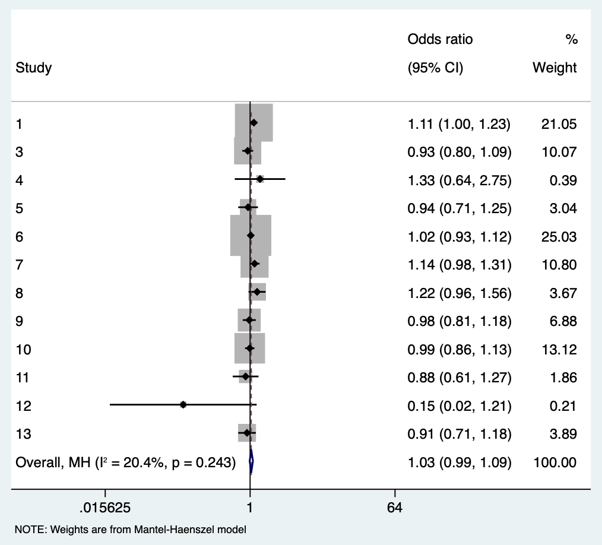
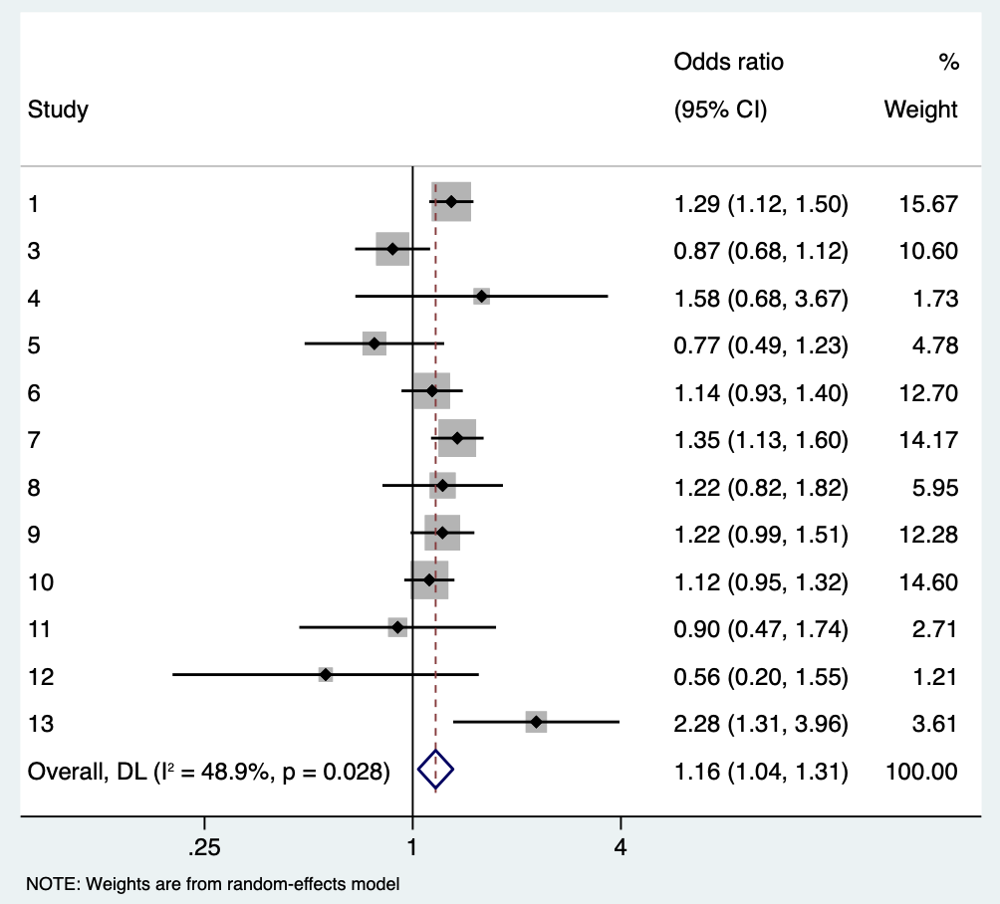
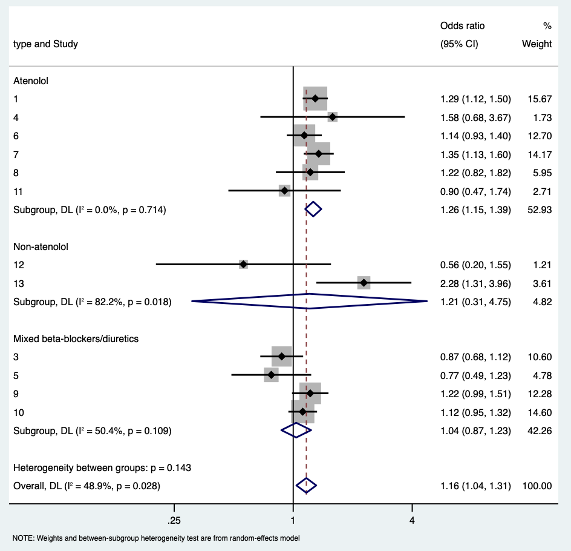
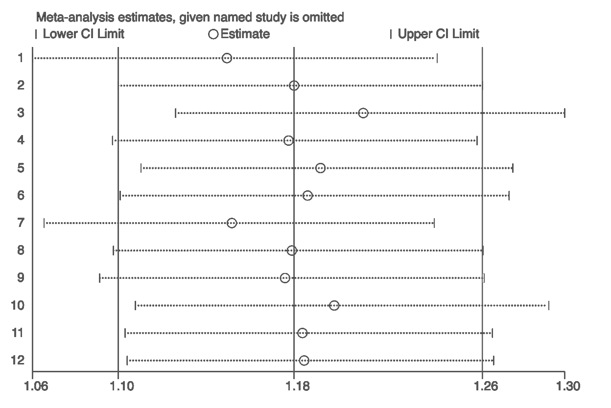
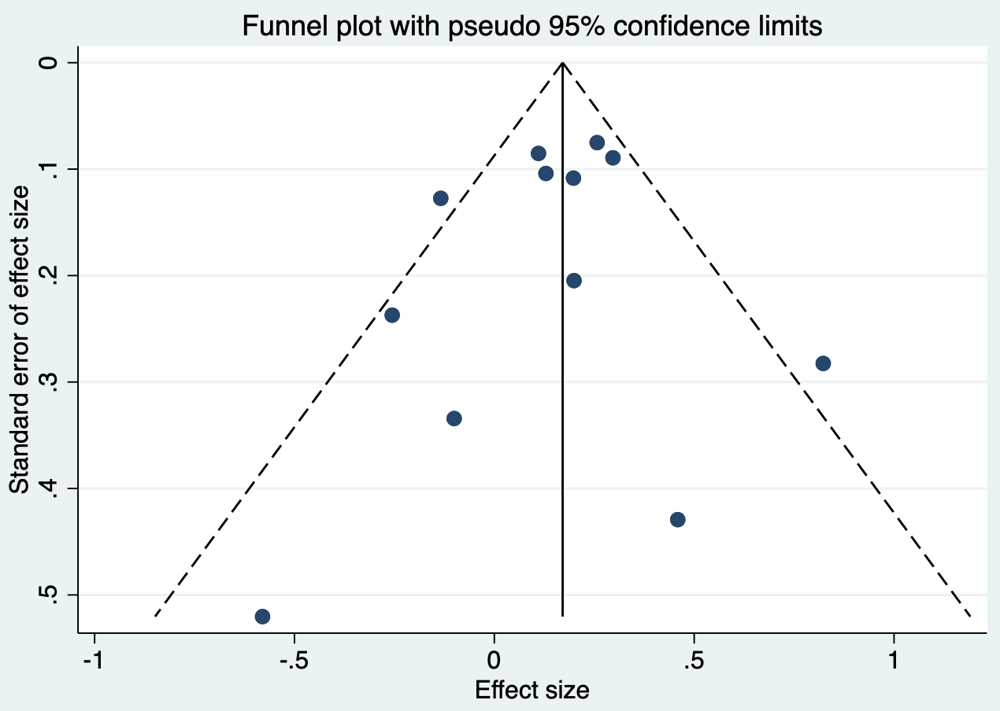
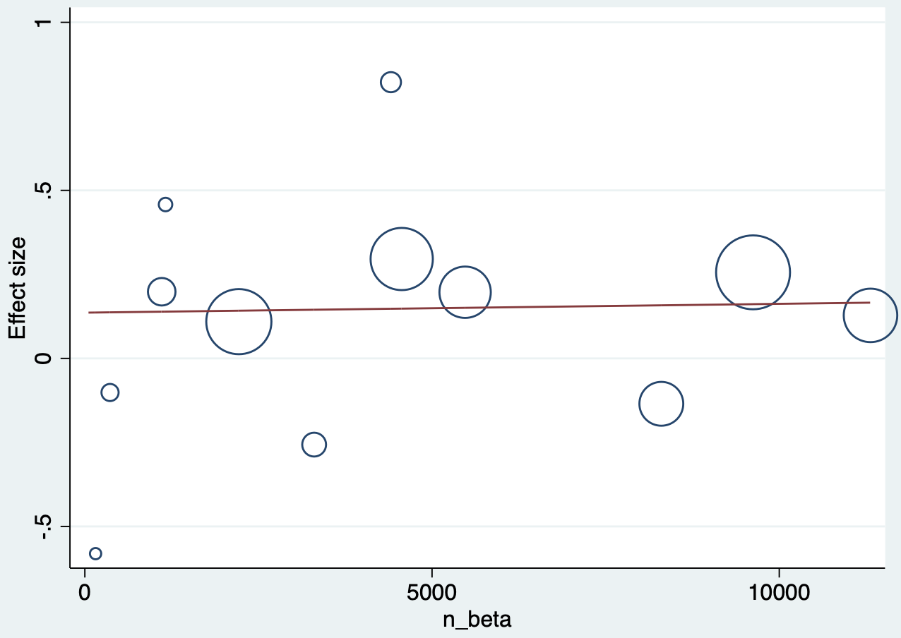
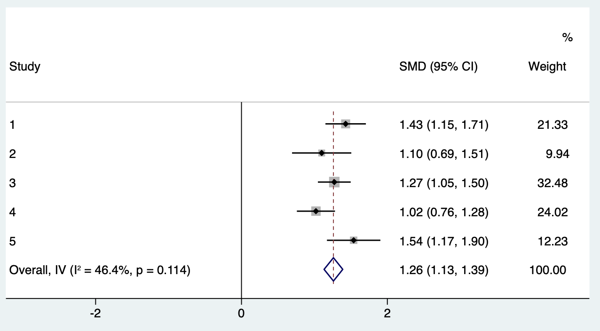

# Principles and Methods of Meta-analysis

Meta-analysis is a statistical method for comparing and synthesizing studies addressing the same scientific question. It is commonly the quantitative component of a systematic review. By integrating all relevant studies, it can estimate the effects of a health intervention or policy more precisely and explore consistency and differences across studies. When individual studies disagree or are individually non-significant, meta-analysis may provide a result closer to the underlying truth. Its conclusion, however, is only as meaningful as the quality of the included studies. Systematic reviews and meta-analyses are fundamental to evidence-based medicine; the *Cochrane Handbook* provides a standard framework.

The process can be considered in eight steps.

## Formulating the research question

Ask whether meta-analysis is needed. It is useful when several RCTs address one clinical question but give conflicting findings, or when each study is too small to give a definitive answer. It is not useful merely to combine already decisive evidence. For example, three similar RCTs found no benefit from adding bevacizumab to adjuvant chemotherapy for colorectal cancer; another meta-analysis would be redundant. Excessive meta-analysis can itself become research waste. The 2014 *Lancet* series on research waste emphasized setting the right research priorities; a methodologically correct but clinically irrelevant study is still wasteful.

## Writing a meta-analysis protocol

Use PICOS: **P**articipants (disease and sociodemographic characteristics); **I**ntervention; **C**omparator; **O**utcomes (clearly defined and classified as binary, time-to-event, or continuous for later extraction and analysis); and **S**tudy design (RCT, cohort, case-control, or cross-sectional study). Protocols can be registered in PROSPERO. Prospective registration helps avoid unnecessary duplication and improves transparency, reliability, and reproducibility by defining primary objectives, key design features, and planned analyses before the review starts.

## Searching for studies

Develop the strategy from three components. First, use Medical Subject Headings (MeSH) and free-text terms, generally derived from PICOS and including the disease and intervention. Second, select databases: Chinese databases commonly include Wanfang, VIP, and CNKI; English-language sources include PubMed, Web of Science, Embase, and the Cochrane Library. At minimum, search PubMed, Embase, and Cochrane. Third, state any restrictions on language and dates. Aim for both recall and precision; also search references of included studies and relevant reviews and conference material. Missing one or two key studies can change the conclusion, whereas retrieving too many records increases screening effort.

## Selecting studies

Use reference-management software such as EndNote or Mendeley and apply predefined inclusion and exclusion criteria. Record reasons and numbers for exclusion. Two reviewers should screen independently and resolve disagreement by discussion or a third reviewer. Screening is time-consuming: initial screening uses titles and abstracts; full-text screening examines Methods and Results.

## Assessing study quality

Quality assessment identifies possible bias and whether study design is adequate. RCTs can use the Cochrane risk-of-bias tool, which assesses selection, performance, detection, attrition, reporting, and other bias.

| Domain | Item | Low risk | High risk | Unclear risk |
|:--|:--|:--|:--|:--|
| Selection bias | Random sequence generation | Random-number table, computer-generated numbers, coin toss, shuffled envelopes/cards, dice, or minimization described | Non-random method such as birth date, admission date, record number, clinician judgment, patient preference, or laboratory result | Insufficient description |
| Selection bias | Allocation concealment | Central telephone/web/pharmacy allocation, identical sequential containers, or sequential opaque sealed envelopes | Open allocation list, inadequately protected envelopes, alternation, birth date, medical-record number | Insufficient description |
| Performance bias | Blinding of participants and personnel | Blinding maintained, or blinding cannot plausibly affect outcome | No/incomplete blinding likely affects outcome, or blinding broken | Not reported |
| Detection bias | Blinding of outcome assessment | Blinding maintained, or assessment not affected | No/incomplete/broken blinding likely affects assessment | Not reported |
| Attrition bias | Incomplete outcome data | No missing data, similar missingness, or appropriate handling | Imbalanced/much missing data or inappropriate handling | Insufficient information |
| Reporting bias | Selective reporting | All prespecified outcomes reported | Prespecified outcomes omitted or measured/analyzed differently | Prespecification/reporting unclear |
| Other bias | Other sources | No other source | Design problem, fraud, or other concern | Insufficient information |

Observational studies may use the Newcastle–Ottawa Scale, assessing selection, comparability, and outcome. For diagnostic studies comparing an index test with a reference standard, use QUADAS-2, which evaluates patient selection, index test, reference standard, and flow/timing, including both risk of bias and applicability.

## Data extraction

Extract bibliographic information, study type and methods, participant characteristics (demographics, diagnostic criteria, control-selection criteria), interventions, outcome measurement, effect measure, and sample size. Two reviewers should extract independently and resolve disagreements by discussion or adjudication. Record participant age, sex, race, comorbidity, group size, and location; random/non-random allocation, dose, method, duration, and co-interventions; outcome definition, unit, measurement, follow-up and loss to follow-up; means and standard deviations for continuous outcomes; event counts and totals for binary outcomes; ITT or PP analysis; and secondary outcomes.

## Data analysis

Analysis addresses pooling and heterogeneity, explores heterogeneity and result stability, and assesses publication bias. Common software includes Review Manager (RevMan), Stata, and R. RevMan is Cochrane’s standardized, user-friendly software; Stata and R are more comprehensive and can perform meta-regression, quantitative publication-bias assessment, and diagnostic meta-analysis.

**Case 6.1.** The question is whether beta-blockers, compared with other drugs, reduce stroke and mortality in primary hypertension. After searching and screening, 13 RCTs are included. Each row has study type, stroke and death events in beta-blocker and other-drug groups, and group totals.

| Study | Type | Stroke: beta/other | Death: beta/other | N: beta/other |
|:--|:--|:--|:--|:--|
| 1 | Atenolol | 422 / 327 | 820 / 738 | 9618 / 9639 |
| 2 | Non-atenolol | — | 5 / 4 | 53 / 53 |
| 3 | Mixed beta-blocker/diuretic | 118 / 133 | 319 / 337 | 8297 / 8179 |
| 4–13 | Atenolol, non-atenolol, or mixed | See study dataset | See study dataset | See study dataset |

### Pooling and forest plots

First pool mortality. In Stata, `metan` is supplied the deaths and totals in beta-blocker and other-drug groups; effects may be risk ratios or odds ratios. The pooled odds ratio is 1.034 (95% CI 0.985–1.085; *p*=0.174), so beta-blockers do not significantly reduce mortality compared with other drugs.

::: {.callout-note appearance="simple" icon="false" title="Code 6.1"}
```stata
metan mort_beta n_beta mort_other n_other, or
```
:::

::: {.callout-note appearance="simple" icon="false" title="Code 6.1 output"}
| Result | Odds ratio | 95% CI | Weight |
|:--|--:|:--|--:|
| Individual studies | 0.147–1.330 | Study-specific | 0.11%–25.00% |
| Overall, Mantel–Haenszel | 1.034 | 0.986–1.085 | 100.00% |
| Test of overall effect |  | *z*=1.370; *p*=0.171 |  |
:::

Each line in a forest plot is one study, with the pooled estimate in the final line. The size of the gray square represents sample size/weight.

::: {.text-center}
{width="100%"}

Code 6.1 output: forest plot.
:::

### Heterogeneity analysis

Heterogeneity assesses similarity across studies. The formal chi-square test often has low power. I-squared is another measure: below 25% is often considered low, and above 50% high. Low heterogeneity may support a fixed-effect model; high heterogeneity calls for a random-effects model. In the mortality example, I-squared is low. I-squared is the proportion of total variation attributable to between-study heterogeneity, but depends on the number and size of studies and should be interpreted with the Q test and clinical judgment (Higgins and Thompson 2002; Higgins et al. 2003).

| Heterogeneity measure | Value | df | p value / 95% CI |
|:--|--:|--:|:--|
| Mantel–Haenszel Q | 13.90 | 12 | 0.307 |
| H | 1.076 |  | 1.000–1.496 |
| I-squared | 13.7% |  | 0.0%–55.3% |

A fixed-effect model assumes all studies estimate one true effect and gives larger studies greater weight. A random-effects model allows true effects to follow a distribution and yields more balanced study weights and more conservative results. Unless studies are extremely similar, random effects are often preferred (DerSimonian and Laird 1986).

For stroke, I-squared is 48.9%, indicating heterogeneity; use a random-effects model. The pooled odds ratio is 1.165 (95% CI 1.038–1.308; *p*=0.010), indicating a difference in stroke risk between the two regimens.

::: {.callout-note appearance="simple" icon="false" title="Code 6.2"}
```stata
metan stroke_beta n_beta stroke_other n_other, or random
```
:::

::: {.callout-note appearance="simple" icon="false" title="Code 6.2 output"}
| Heterogeneity measure | Value |
|:--|--:|
| Q (df=11) | 21.53; *p*=0.028 |
| I-squared | 48.9% (0.0%–72.2%) |
| Overall random-effects OR | 1.165 (1.038–1.308); *p*=0.010 |
:::

::: {.text-center}
{width="100%"}

Code 6.2 output: random-effects forest plot.
:::

Explore heterogeneity with subgroup analyses. Here beta-blockers are atenolol, non-atenolol, or mixed beta-blocker/diuretic regimens. The atenolol subgroup has I-squared of zero and a pooled OR 1.263 (1.149–1.388); the two-study non-atenolol subgroup is heterogeneous; the mixed group also has substantial heterogeneity.

::: {.callout-note appearance="simple" icon="false" title="Code 6.3"}
```stata
metan stroke_beta n_beta stroke_other n_other, or random by(type)
```
:::

::: {.text-center}
{width="100%"}

Code 6.3 output: subgroup-analysis forest plot.
:::

### Sensitivity analysis

Sensitivity analysis asks how much each study affects the overall result: delete one included study, reanalyze the remainder, and repeat. In this example, no individual study materially changes the pooled result.

::: {.callout-note appearance="simple" icon="false" title="Code 6.4"}
```stata
metaninf stroke_beta n_beta stroke_other n_other
```
:::

::: {.text-center}
{width="100%"}

Code 6.4 output: leave-one-out sensitivity analysis.
:::

### Publication bias

Publication bias occurs when positive studies are more likely to be published than negative studies. A funnel plot has effect size on the x-axis and standard error on the y-axis. Large studies cluster at the top because they have smaller standard errors; small studies spread at the bottom. If small positive studies are preferentially published, the lower funnel is asymmetric around the reference line. No obvious bias is seen here. Egger regression can formally test asymmetry, but has low power with fewer than about 10 studies (Egger et al. 1997).

::: {.callout-note appearance="simple" icon="false" title="Code 6.5"}
```stata
metafunnel _ES _seES
```
:::

::: {.text-center}
{width="100%"}

Code 6.5 output: publication-bias funnel plot.
:::

### Meta-regression

Meta-regression explores whether a study-level characteristic is associated with the effect estimate. To ask whether the beta-blocker effect increases with sample size, regress effect size on `n_beta`; each bubble is a study and bubble size represents sample size. A nearly horizontal fitted line indicates no relation. Meta-regression is exploratory and vulnerable to ecological fallacy and multiple testing (Thompson and Higgins 2002).

::: {.callout-note appearance="simple" icon="false" title="Code 6.6"}
```stata
metareg _ES n_beta, wsse(_seES) graph
```
:::

::: {.text-center}
{width="100%"}

Code 6.6 output: meta-regression bubble plot.
:::

**Case 6.2.** Outcomes may be continuous. Five RCTs compare stimulation surgery with control for change in tremor score in Parkinson disease. For continuous outcomes, use the standardized mean difference (SMD) when measurement units or scales differ across studies; standardization removes differences caused by scale units. The pooled SMD is 1.261 (95% CI 1.132–1.389; *p*<0.001).

::: {.callout-note appearance="simple" icon="false" title="Code 6.7"}
```stata
metan stinumber stimean stisd controlnumber controlmean controlsd
```
:::

::: {.callout-note appearance="simple" icon="false" title="Code 6.7 output"}
| Study / overall | SMD | 95% CI |
|:--|--:|:--|
| Individual studies | 1.021–1.538 | Study-specific |
| Overall, inverse variance | 1.261 | 1.132–1.389; *p*<0.001 |
:::

::: {.text-center}
{width="100%"}

Code 6.7 output: forest plot for a continuous outcome.
:::

## Reporting a meta-analysis

Report systematic reviews and meta-analyses according to PRISMA. Its checklist covers title, abstract, rationale, objectives, eligibility criteria, information sources and search strategy, selection process, data collection, data items, risk-of-bias assessment, effect measures, synthesis methods, results, discussion, and funding. State all databases, registers, websites, organizations, reference lists and other sources searched, the date each was last searched, complete search strategies, independent screening/extraction procedures, outcome definitions, missing-data assumptions, risk-of-bias tool, model choice and heterogeneity assessment, and sensitivity/publication-bias analyses. See the PRISMA 2020 checklist at <http://prisma-statement.org/PRISMAStatement/Checklist.aspx>.

## References {.unnumbered}

1. Higgins JPT, Thompson SG. Quantifying heterogeneity in a meta-analysis. *Statistics in Medicine*. 2002;21:1539-1558.
2. Higgins JPT, Thompson SG, Deeks JJ, Altman DG. Measuring inconsistency in meta-analyses. *BMJ*. 2003;327:557-560.
3. DerSimonian R, Laird N. Meta-analysis in clinical trials. *Controlled Clinical Trials*. 1986;7:177-188.
4. Egger M, Smith GD, Schneider M, Minder C. Bias in meta-analysis detected by a simple graphical test. *BMJ*. 1997;315:629-634.
5. Thompson SG, Higgins JPT. How should meta-regression analyses be undertaken and interpreted? *Statistics in Medicine*. 2002;21:1559-1573.
6. Page MJ, McKenzie JE, Bossuyt PM, et al. The PRISMA 2020 statement. *BMJ*. 2021;372:n71.
7. Higgins JPT, Thomas J, Chandler J, et al., eds. *Cochrane Handbook for Systematic Reviews of Interventions*. 2nd ed. Wiley; 2019.
