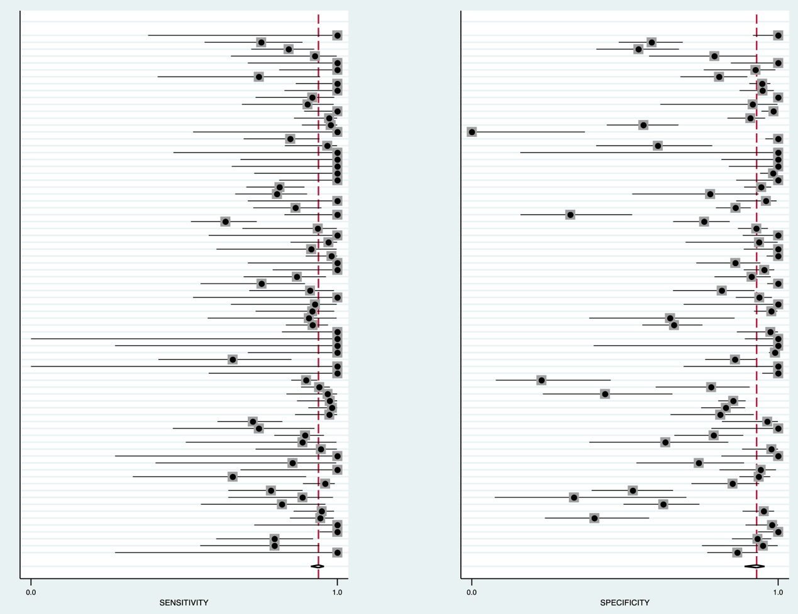
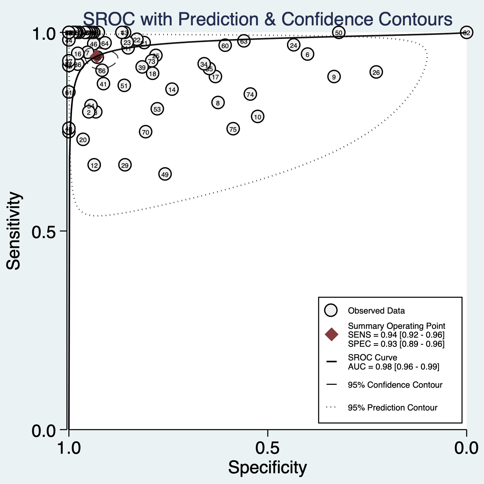
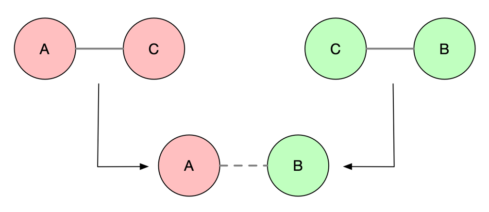
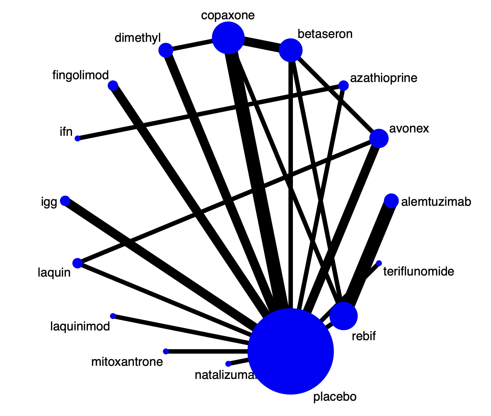
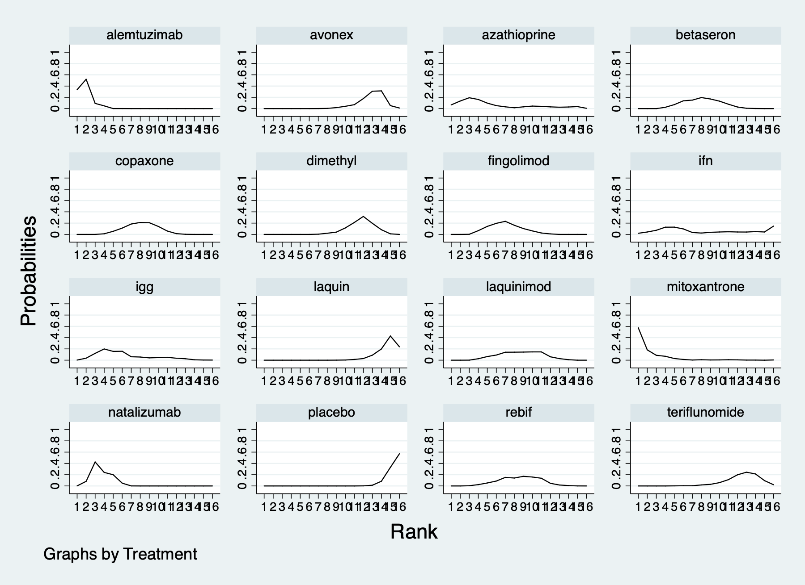
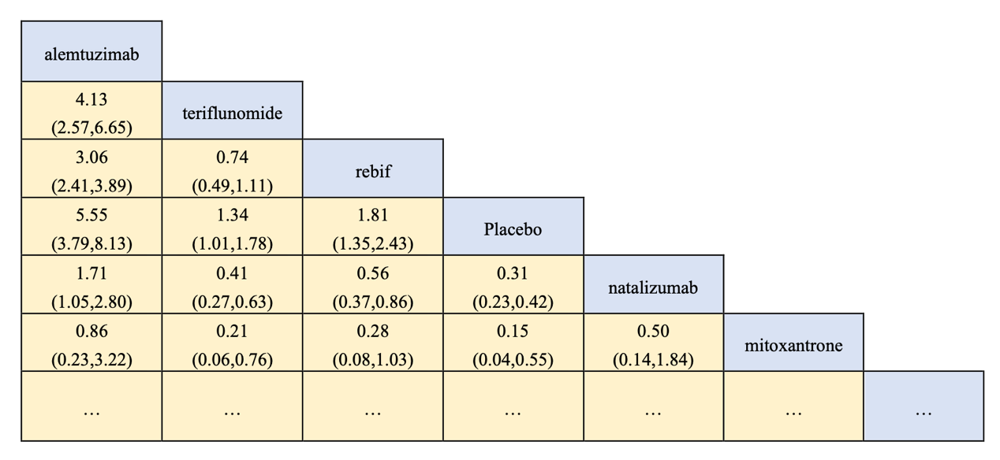
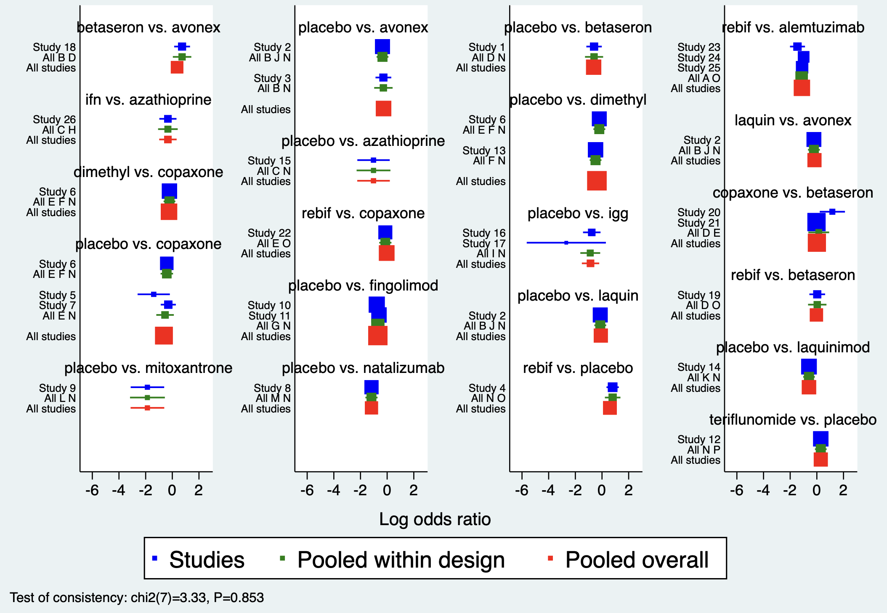
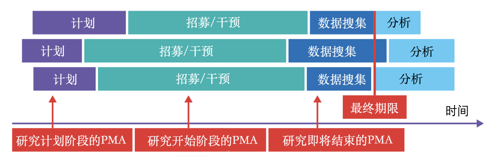

# Advanced Meta-analysis

Chapter 6 introduced literature searching, quality assessment, and standard meta-analytic methods. This chapter extends those foundations to diagnostic meta-analysis, network meta-analysis, and prospective meta-analysis.

## Meta-analysis of diagnostic studies

Published studies of the same diagnostic method can differ or conflict because of populations, settings, index tests, and conditions. As new technologies enter clinical practice, choices multiply, so their results must be assessed together. A single diagnostic study classifies a test as positive or negative and compares it with a positive or negative reference standard in a $2\times2$ table. Diagnostic meta-analysis synthesizes accuracy, sensitivity, specificity, likelihood ratios, and diagnostic odds ratios.

**Equation 7.1 Diagnostic odds ratio**

$$\text{Diagnostic odds ratio}=\frac{\text{true positive}\times\text{true negative}}{\text{false positive}\times\text{false negative}}$$

The diagnostic odds ratio can be used when weighting diagnostic studies in a meta-analysis.

**Case 7.1.** Increased 24-hour urinary free cortisol is one diagnostic test for Cushing syndrome, but reported accuracy varies. Extract true positives (test positive and reference-standard positive), false positives (test positive/reference-standard negative), true negatives, and false negatives; each row is a publication.

| Author | TP | TN | FP | FN |
|:--|--:|--:|--:|--:|
| Zukowski 2013 | 3 | 65 | 10 | 0 |
| Yanovski 1998 | 16 | 19 | 1 | 4 |
| Yaneva 2009 | 24 | 69 | 5 | 6 |
| Yaneva 2004 | 63 | 54 | 0 | 0 |
| Viardot 2005 | 12 | 49 | 1 | 0 |
| Valassi 2009 | 52 | 14 | 21 | 3 |
| Tsagarakis 1998 | 57 | 81 | 4 | 3 |
| Tous 2012 | 14 | 40 | 24 | 3 |
| … | … | … | … | … |

In Stata, `midas` performs diagnostic meta-analysis.

::: {.callout-note appearance="simple" icon="false" title="Code 7.1"}
```stata
midas tp fp fn tn, id(author) ms(0.75) bfor(dss)
```
:::

::: {.text-center}
{width="100%"}

Code 7.1 output: forest plots (sensitivity left, specificity right).
:::

Sensitivity and specificity forest plots resemble those used in conventional meta-analysis.

::: {.callout-note appearance="simple" icon="false" title="Code 7.2"}
```stata
midas tp fp fn tn, es(x) res(all)
```
:::

::: {.callout-note appearance="simple" icon="false" title="Code 7.2 output"}
| Measure | Estimate | 95% CI |
|:--|--:|:--|
| AUROC | 0.98 | 0.96–0.99 |
| Sensitivity | 0.94 | 0.92–0.96 |
| Specificity | 0.93 | 0.89–0.96 |
| Positive likelihood ratio | 13.4 | 8.5–21.2 |
| Negative likelihood ratio | 0.06 | 0.05–0.09 |
| Diagnostic odds ratio | 207 | 108–399 |
| Heterogeneity | LRT $Q=195.006$, $I^2=99\%$ |  |
:::

The pooled sensitivity is 94%, specificity 93%, and diagnostic odds ratio 207, with heterogeneity. A diagnostic odds ratio above 1 indicates useful discrimination and becomes better as it increases; below 1 means people without disease are more likely to test positive; 1 means no discrimination. Diagnostic accuracy reviews generally use a bivariate random-effects model to pool sensitivity and specificity and present a summary ROC (SROC) curve (Reitsma et al. 2005). Each study contributes a sensitivity/specificity point, dashed lines show 95% confidence limits, and the red point nearest the upper-left is the summary estimate.

::: {.callout-note appearance="simple" icon="false" title="Code 7.3"}
```stata
midas tp fp fn tn, plot sroc(both)
```
:::

::: {.text-center}
{width="100%"}

Code 7.3 output: summary ROC curve.
:::

## Network meta-analysis

Standard meta-analysis compares two interventions. In practice, a disease may have many options, but most RCTs compare only two—for example A versus placebo or A versus B. Network meta-analysis (NMA), also called multiple-treatment meta-analysis or mixed-treatment comparison, combines RCT evidence to compare all relevant treatments. It uses direct comparison (an RCT compares A with B) and indirect comparison (A versus C and B versus C allow C to link A with B even when no A-versus-B RCT exists).

::: {.text-center}
{width="100%"}

Figure 7.1 Direct and indirect comparisons.
:::

Compared with conventional meta-analysis, NMA can answer more clinically relevant questions, use all available evidence, give more precise comparisons, and rank treatments. Its reporting should follow PRISMA-NMA (Hutton et al. 2015). Its key assumption is **transitivity**: study populations and interventions are sufficiently similar across the network, or there is a sound theoretical basis to regard different forms of an intervention as substantively equivalent. This must be justified clinically and methodologically before analysis (Salanti 2012).

**Case 7.2.** About 14 interventions are FDA-approved for multiple sclerosis. In phase III trials, about 60% compare a drug with placebo and 40% compare drug A with drug B. Relapse within 24 months is the common outcome, summarized as a risk ratio. In network data, each study arm occupies a row with study name, treatment, events, and total sample size.

| Study | Events | Sample size | Treatment |
|:--|--:|--:|:--|
| IFNB MS Group | 18 | 123 | Placebo |
| IFNB MS Group | 59 | 249 | Betaseron |
| BRAVO | 227 | 450 | Placebo |
| BRAVO | 264 | 447 | Avonex |
| BRAVO | 233 | 434 | Laquin |
| MSCRG | 23 | 143 | Placebo |
| MSCRG | 32 | 158 | Avonex |
| PRISMS | 28 | 187 | Placebo |
| PRISMS | 105 | 373 | Rebif |
| … | … | … | … |

### Network setup

Use `network setup` to declare events and sample sizes, then draw a network map. Blue circles are interventions and circle size represents participant numbers. Black lines are direct comparisons and line width represents the number of head-to-head studies. Placebo has most participants; Copaxone versus placebo has the most direct studies. No line means no direct comparison.

::: {.callout-note appearance="simple" icon="false" title="Code 7.4"}
```stata
network setup responders samplesize, studyvar(study) trtvar(treatment)
network map
```
:::

::: {.text-center}
{width="100%"}

Code 7.4 output: network map.
:::

### Ranking interventions

The surface under the cumulative ranking curve (SUCRA) ranks treatments. Each intervention has a cumulative ranking curve: the x-axis is rank and the y-axis is the probability of that rank. In this example mitoxantrone has probability about 0.6 of rank 1, whereas placebo has probability about 0.6 of rank 16.

::: {.callout-note appearance="simple" icon="false" title="Code 7.5"}
```stata
network meta consistency
network rank max, all zero gen(prob)
sucra prob*, rankograms labels(alemtuzimab avonex azathioprine betaseron copaxone dimethyl fingolimod ifn igg laquin laquinimod mitoxantrone natalizumab placebo rebif teriflunomide)
```
:::

::: {.text-center}
{width="100%"}

Code 7.5 output: cumulative ranking curves.
:::

| Treatment | SUCRA | Probability best | Mean rank |
|:--|--:|--:|--:|
| Alemtuzumab | 94.3 | 33.6% | 1.9 |
| Mitoxantrone | 92.4 | 57.2% | 2.1 |
| Natalizumab | 81.6 | 0.1% | 3.8 |
| Azathioprine | 69.0 | 6.5% | 5.6 |
| Placebo | 3.5 | 0.0% | 15.5 |

Thus mitoxantrone ranks highest in this network. SUCRA reflects ranking probability, however, not whether differences are clinically meaningful (Salanti et al. 2011). A league table presents pairwise comparisons like scores in a football league: its cells give the relative effect and 95% confidence interval for the row versus column treatment; the redundant half is omitted.

::: {.callout-note appearance="simple" icon="false" title="Code 7.6"}
```stata
netleague, eform
```
:::

::: {.text-center}
{width="100%"}

Code 7.6 output: league table.
:::

### Network consistency

For a pair of interventions, direct and indirect evidence may both exist. Test whether they agree, and whether multiple indirect sources agree. In this example, the consistency forest plot has *p*=0.852; direct (blue) and indirect (green) comparisons are broadly concordant. If they disagree, use an inconsistency model.

::: {.callout-note appearance="simple" icon="false" title="Code 7.7"}
```stata
network meta inconsistency
network forest
```
:::

::: {.text-center}
{width="100%"}

Code 7.7 output: direct and indirect evidence.
:::

Node splitting separately estimates direct and indirect effects, estimates their difference, and tests whether that difference is zero.

::: {.callout-note appearance="simple" icon="false" title="Code 7.8"}
```stata
network sidesplit all, tau
```
:::

Treatment-effect modifiers may include trial methods, clinical characteristics, follow-up time, outcome definition, risk of bias, and analysis/reporting standards. Before NMA, select trials relevant to the clinical population and investigate systematic differences across comparisons. If node splitting shows inconsistency, seek explanations such as particular designs or studies at high risk of bias. If unexplained, model inconsistency as a mean-zero random effect to obtain an overall estimate while accounting for it.

NMA has limitations. SUCRA can rank treatments with trivial absolute differences; rankings may be imprecise with wide credible intervals; many studies can distract from risk of bias, validity, and evidence quality in individual trials. Strong transitivity assumptions can be hard to defend, and inferences that rely on indirect comparisons should receive cautions similar to observational studies.

## Network meta-analysis of multiple outcomes

Different trials for the same disease may report different outcomes. For example, in a meta-analysis of progesterone-receptor status and prognosis in endometrial cancer, four studies reported both cancer-specific and progression-free survival, while others reported only one. Restricting analysis to one outcome wastes information. Multivariate network meta-analysis models multiple outcomes and multiple treatments jointly, allowing more studies to contribute.

Copas and colleagues express loss of information from standard univariate analysis with the B statistic:

**Equation 7.2 B statistic**

$$B=100\times(1-E)$$

**Equation 7.3 Information efficiency**

$$E=\frac{\text{variance of synthesis based on direct and indirect evidence}}{\text{variance of synthesis based only on direct evidence}}$$

If $E=0.9$, standard meta-analysis is analogous to discarding 10% of available studies. B is the percentage reduction in variance from indirect evidence: 0% means results use direct evidence only; 100% means they are entirely indirect. Multivariate meta-analysis is especially valuable when direct evidence for an outcome is scarce, some studies omit that outcome but report related outcomes, or outcomes are strongly correlated within or between studies (for example, correlation greater than 0.5 or less than −0.5).

## Prospective meta-analysis

The defining feature of prospective meta-analysis (PMA) is that eligible studies are identified before their results are published and planned analyses are specified in advance. It is useful when a high-priority question needs a sample size too large for one center and a conventional multicenter RCT is impractical because of resources or coordination, or when investigators discover similar ongoing trials and can collaborate before results are known.

**Case 7.3.** PMA has four steps. First, establish that it is needed: the question must be high priority and unresolved, with ongoing studies; if a conventional retrospective meta-analysis would have adequate power, PMA is unnecessary. NeoProm studied whether high oxygen concentrations increase mortality in preterm infants. Earlier evidence was mainly observational, and 5,000 infants were needed to detect a 4% mortality difference—too many for one center and difficult for a multicenter trial.

Second, define PICO, eligibility, and protocol before results are published. NeoProm enrolled preterm infants within 24 hours of birth; the intervention targeted oxygen saturation 85%–89%, control 91%–95%, and the outcome was death or major disability at 18–24 months. Third, search trial registries and published protocols and contact leaders of ongoing trials. Five RCTs in Australia, New Zealand, Canada, the United Kingdom, and the United States planned nearly 5,000 infants; none had results published when PMA began. Fourth, collaborators can harmonize protocols and outcome definitions; after all component studies report, analysis proceeds like a conventional meta-analysis.

::: {.text-center}
{width="100%"}

Figure 7.2 Prospective meta-analysis.
:::

**Case 7.4.** The WHO Rapid Evidence Appraisal for COVID-19 Therapies Working Group published a PMA of seven RCTs of corticosteroids. The question was urgent because corticosteroid use in severe infection had long been controversial and early COVID-19 data were limited. By July 24, 2020, 55 corticosteroid COVID-19 studies were registered. When the RECOVERY trial reported a strong benefit, most ongoing trials stopped recruitment, leaving seven eligible studies.

Patients were enrolled in Australia, Brazil, Canada, China, Denmark, France, Ireland, the Netherlands, New Zealand, Spain, the United Kingdom, and the United States between February 26 and June 9, 2020, with final follow-up July 6. Of 1,703 patients, 678 received corticosteroids and 1,025 usual care or placebo. Median age was 60 years and 29% were women. The primary outcome was 28-day all-cause mortality and the secondary outcome was investigator-defined serious adverse events. There were 222 deaths among 678 corticosteroid recipients and 425 among 1,025 controls; fixed-effect pooling gave an odds ratio of 0.66. Results remained consistent excluding RECOVERY. WHO consequently strongly recommended systemic corticosteroids for severe or critical COVID-19 and did not recommend them for non-severe illness.

## References {.unnumbered}

1. Reitsma JB, Glas AS, Rutjes AW, et al. Bivariate analysis of sensitivity and specificity produces informative summary measures in diagnostic reviews. *Journal of Clinical Epidemiology*. 2005;58:982-990.
2. Salanti G, Ades AE, Ioannidis JP. Graphical methods and numerical summaries for multiple-treatment meta-analysis. *Journal of Clinical Epidemiology*. 2011;64:163-171.
3. Dias S, Welton NJ, Caldwell DM, Ades AE. Checking consistency in mixed treatment comparison meta-analysis. *Statistics in Medicine*. 2010;29:932-944.
4. Hutton B, Salanti G, Caldwell DM, et al. PRISMA extension for network meta-analysis. *Annals of Internal Medicine*. 2015;162:777-784.
5. Salanti G. Indirect and mixed-treatment comparison, network, or multiple-treatments meta-analysis. *Research Synthesis Methods*. 2012;3:80-97.
6. Riley RD, Jackson D, Salanti G, et al. Multivariate and network meta-analysis of multiple outcomes and treatments. *BMJ*. 2017;358:j3932.
7. Seidler AL, Hunter KE, Cheyne S, et al. A guide to prospective meta-analysis. *BMJ*. 2019;367:l5342.
8. Sterne JAC, Diaz J, Villar J, et al. Corticosteroid therapy for critically ill patients with COVID-19: protocol for PMA of randomized trials. *Trials*. 2020;21:734.
