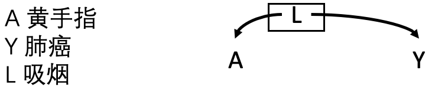
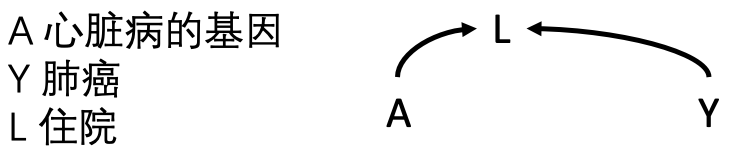
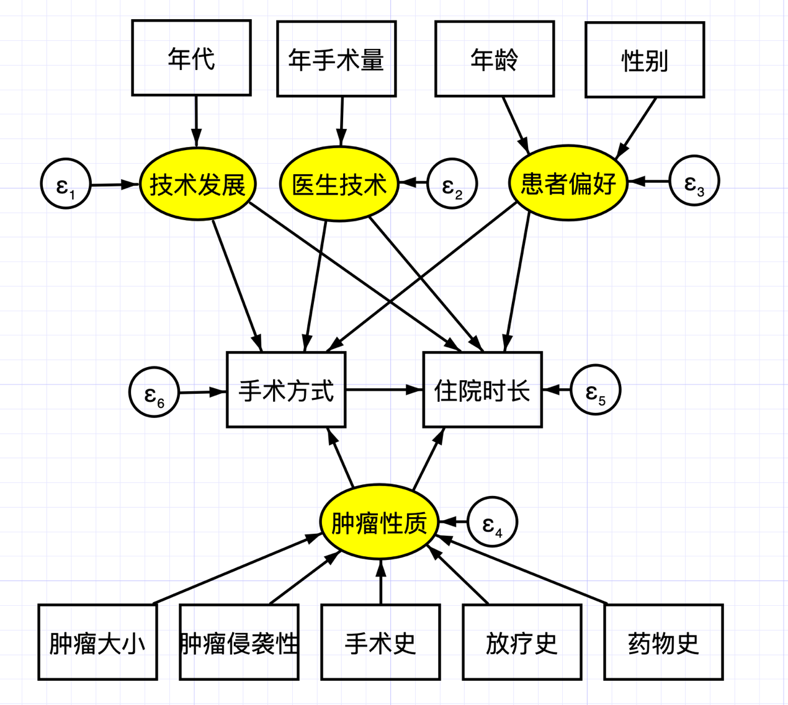

# Causal Graphs and Structural Causal Models

This chapter introduces theoretical concepts and practical methods for causal inference in observational research.

## Causal directed acyclic graphs

In mathematics, a graph consists of nodes and edges that connect them. If a directed path (an arrow) begins at node $X$ and ends at node $Y$, $X$ is an ancestor of $Y$ and $Y$ a descendant of $X$: edges run from parent to child. A directed path also represents the flow of time. A directed path that returns from $X$ to itself is a cycle, a form of time travel that is not considered here. A directed graph without cycles is a directed acyclic graph (DAG).

In a causal DAG, every parent node is a direct cause of its child. If changing $X$ can correspondingly change $Y$, then $X$ is a cause of $Y`; edges can therefore be regarded as causal relations. A key assumption is the causal Markov assumption: every node is conditionally independent of non-descendants given its parents. Thus, any common cause must be included in the graph. This says that beyond the associations displayed in the graph there are no hidden associations, consistent with conditional exchangeability in Chapter 1.

Forks and colliders are two important structures. If $S$ points to both $X$ and $Y$, this is a fork; if $X$ and $Y$ both point to $C$, this is a collider. In a fork, $X$ and $Y$ are dependent; in a collider, they are independent unless conditioning opens the path.

Causal graph models have limitations. First, they are nonparametric and qualitative: they neither specify the form of causal relations nor quantify their magnitude. A confounder may bias a result, but the graph itself does not measure that bias. Second, they are valid only with sufficiently complete background knowledge: all confounders must be represented and no unobserved confounder can remain for the causal interpretation to be correct. Greenland, Pearl, and Robins (1999) systematically introduced DAGs into epidemiologic causal inference. Software such as DAGitty can draw graphs and identify minimal adjustment sets for causal effects (Textor et al. 2016).

## Applications of causal DAGs

The following are five clinical examples of causal DAGs (Figure 8.1).

::: {.text-center}
{width="2.9in"}

Figure 8.1A.
:::

1. Smoking cessation causes weight gain: $A$ is a parent of $Y$, with no other node in the graph.

::: {.text-center}
{width="2.9in"}

Figure 8.1B.
:::

2. Smoking cessation increases food intake, which in turn increases weight. Increased food intake is a child of cessation and a parent of weight gain.

::: {.text-center}
{width="2.9in"}

Figure 8.1C.
:::

3. This is a fork: $L$ points to both $A$ and $Y$. Women may be more likely than men to stop smoking and, after menopause, more likely to gain weight. Sex is a common cause; smoking cessation and weight gain are not independent and become associated through sex.

::: {.text-center}
{width="2.94in"}

Figure 8.1D.
:::

4. This is another fork. Smoking causes yellow fingers and can cause lung cancer. In the full population, yellow fingers and lung cancer are associated; among smokers only—conditioning on smoking—they are independent.

::: {.text-center}
{width="2.94in"}

Figure 8.1E.
:::

5. This is a collider: $A$ and $Y$ both point to $L$. Genes predisposing to heart disease increase heart-disease and hospitalization risk; lung cancer also increases hospitalization risk. Carrying heart-disease genes and having lung cancer are independent before conditioning on hospitalization.

## The back-door criterion and d-separation

A direct connection between $X$ and $Y$ is a directed path. There can also be a back-door path, connecting variables through a common parent in a fork. When two variables are connected through a collider, the path is closed.

Conditioning on or controlling a variable can change a path from open to closed or from closed to open. This can be done through design or analysis, including restriction, stratification, matching, standardization, or multivariable regression. Controlling a parent in a fork closes that back-door path; controlling a collider or its descendant opens it and produces a noncausal association.

Three principles follow:

1. A causal relation between $X$ and $Y$ is identified only when there is no open back-door path.
2. Blocking any node on a back-door path blocks that path.
3. Conditioning on a collider or its descendant can open the path.

## The front-door criterion

An open back-door path prevents direct causal inference about $X$ and $Y$. Back-door adjustment can address this, but sometimes the nodes on the back-door path are unobserved. If a node $M$ is a child of $X$ and parent of $Y$, front-door adjustment may identify the causal effect: first estimate the causal effect of $X$ on $M$, because there is no open back-door path from $X$ to $M$; then estimate the effect of $M$ on $Y$, blocking the back-door path by adjusting for $X$. Combining these effects identifies the causal effect of $X$ on $Y$ (Figure 8.2).

::: {.text-center}
{width="4.17in"}

Figure 8.2 The front-door criterion.
:::

$M$ satisfies the front-door criterion for $X$ and $Y$ when: (1) $M$ completely mediates $X$ and $Y$, so every causal path from $X$ to $Y$ passes through $M$; (2) there is no unblocked back-door path from $X$ to $M$; and (3) all back-door paths from $M$ to $Y$ are blocked. These are the assumptions of a mediator (see Chapter 15). Front-door adjustment is rarely used because its statistical assumptions are complex and unverifiable. Pearl (1995) introduced back-door and front-door criteria and do-calculus as a complete framework for identifying intervention effects from causal graphs.

## Structural causal models

A structural causal model (SCM) combines graphical and potential-outcome models by constructing structural equations for causal analysis. Many familiar causal models are subclasses of SCMs. A functional structural equation represents the causal relation between two variables:

**Equation 8.1 Structural equation**

$$Y=f(X,U)$$

Here $X$ and $Y$ are the cause and outcome of interest—endogenous variables in econometric terminology. $U$ represents causes outside the causal model that are not modeled—exogenous variables. An SCM is thus an array of: (1) endogenous variables $V$, including $X$ and $Y$; (2) exogenous variables $U$; and (3) functions $f$ that generate endogenous variables from other variables. Although $f$ is often linear, it may be nonlinear or nonparametric in modern data settings.

Together with Chapter 1, structural equations provide a formal tool and notation for counterfactuals: “if $X=x$, what value would $Y$ take for this individual in circumstance $U$?” An SCM can be represented by a causal graph. Exogenous variables have outgoing but no incoming arrows, and arrows must represent direct causation from their left-hand to right-hand variables (Figure 8.3). Causal reasoning must follow arrow direction.

::: {.text-center}
{width="2.93in"}

Figure 8.3 Exogenous and endogenous variables in an SCM.
:::

As with causal DAGs, an SCM relies on a Markov assumption: a variable is related only to variables that directly affect it and is independent of other variables. An SCM without cycles or unobserved exogenous variables is Markovian; without cycles but with unobserved exogenous variables it is semi-Markovian; graphs with cycles are non-Markovian.

In observational research, $X$ is observed. In an RCT, studying the effect of an intervention is equivalent to forcing $X$ to equal $T$, replacing $X$ by $T$ in the SCM. Because intervention is randomized, all causes of $T$ are removed from the causal graph. SCMs can also support counterfactual reasoning: intervene to set $X=T$, observe exogenous variables $U=u$, and query the conditional distribution of $Y$. This intervention–observation–counterfactual hierarchy is Pearl’s ladder of causation and supplies a unified language for causal reasoning and for moving machine learning toward causal inference.

**Case 8.1**

Consider the effect of surgical technique on hospital length of stay for a tumor. The structural equation is represented in Figure 8.4. Clinical knowledge identifies technical development, surgeon experience, patient preference, and tumor characteristics as factors that affect both surgery and length of stay; these latent variables are shown in yellow. Medical research often involves variables that cannot be measured directly or represented by one indicator—job satisfaction, access to or satisfaction with health care, health status, and treatment preference. Such variables are latent and are usually approximated by observable indicators. Here, calendar year reflects technical development, annual surgical volume reflects surgeon experience, age and sex may partly reflect preference, and tumor characteristics include size, invasiveness, and prior treatment.

::: {.text-center}
{width="5.77in"}

Figure 8.4 Structural equation.
:::

## Classifying bias

Bias is a broad term for error in causal inference. Common categories are confounding, selection bias, and measurement error.

### 1. Confounding

When treatment and outcome have a common cause, that cause interferes with causal inference. In a DAG, this is a fork, where $L$ represents all confounders such as age, sex, and disease severity. There are two paths from $X$ to $Y$: the causal path directly from $X$ to $Y$ and a back-door path through $L$. To estimate the causal relation, block the latter. DAGs give a principled basis for covariate selection: adjust variables that block back-door paths, but not colliders or mediators, which can introduce bias (VanderWeele and Shpitser 2011).

::: {.text-center}
{width="2.92in"}

Figure 8.5 Confounding and the back-door path.
:::

Examples include healthy-worker bias (workers in occupations such as firefighting have lower all-cause mortality than the general population because people with severe illness or disability cannot enter those occupations); confounding by indication (aspirin is more likely to be prescribed to people with heart disease, which also raises cardiac mortality); lifestyle confounding (alcohol use is associated with smoking, which affects mortality, while unrecognized subclinical disease can cause both inactivity and disease risk); genetic linkage disequilibrium (two correlated loci influence different phenotypes); and environmental confounding (particulate matter and other correlated air pollutants can affect coronary disease).

### 2. Selection bias

Selection bias occurs when conditioning on a common effect of exposure and outcome, often called a collider. Selected patients differ from those not selected. In a DAG, conditioning on the collider $S$ opens a previously closed path from $X$ through $S$ to $Y$.

::: {.text-center}
{width="2.92in"}

Figure 8.6 Selection bias and the back-door path.
:::

Examples include healthy-worker bias when only actively working people are selected while people absent because of illness are ignored; prevalence-incidence bias when only prevalent cases are studied although exposure affects prognosis or death; hospital-admission bias because admission opportunity varies; length bias because chronic diseases with longer duration are more likely to be enrolled while aggressive disease may cause death before enrollment; survivor bias when pre-study treatment changes inclusion probability; and loss-to-follow-up bias, a special selection bias occurring when treatment and event time affect dropout. Appropriate design can sometimes avoid selection bias, but when it cannot—for example, loss to follow-up—statistical adjustment with inverse-probability weighting or standardization is needed (Hernán, Hernández-Díaz, and Robins 2004; Cole et al. 2010; Griffith et al. 2020).

### 3. Measurement error

The causal methods in this book assume perfect measurement of treatment, outcome, and covariates. In practice, measurement error causes measurement or information bias. Treatment misclassification is common when exposure is identified from electronic records, insurance, or claims databases, and the recorded intervention may differ from the intervention actually received. ITT analysis in an RCT is also a form of treatment misclassification because assigned treatment need not be received. Outcome misclassification arises when outcomes are identified through diagnostic codes, procedure algorithms, or extraction systems. Accuracy varies greatly: ICD-9 sensitivity may be 62.6% for diabetes but only 25.4% for acute myocardial infarction. In survival research, overall survival is relatively clear and less prone to misclassification, whereas progression-free survival is more vulnerable.

## References {.unnumbered}

1. Greenland S, Pearl J, Robins JM. Causal diagrams for epidemiologic research. *Epidemiology*. 1999;10(1):37-48.
2. Pearl J. Causal diagrams for empirical research. *Biometrika*. 1995;82(4):669-688.
3. Hernán MA, Hernández-Díaz S, Robins JM. A structural approach to selection bias. *Epidemiology*. 2004;15(5):615-625.
4. Cole SR, Platt RW, Schisterman EF, et al. Illustrating bias due to conditioning on a collider. *International Journal of Epidemiology*. 2010;39(2):417-420.
5. VanderWeele TJ, Shpitser I. A new criterion for confounder selection. *Biometrics*. 2011;67(4):1406-1413.
6. Textor J, van der Zander B, Gilthorpe MS, et al. Robust causal inference using directed acyclic graphs: the R package dagitty. *International Journal of Epidemiology*. 2016;45(6):1887-1894.
7. Griffith GJ, Morris TT, Tudball MJ, et al. Collider bias undermines our understanding of COVID-19 disease risk and severity. *Nature Communications*. 2020;11:5749.
8. Hernán MA, Robins JM. *Causal Inference: What If*. Chapman & Hall/CRC; 2020.
