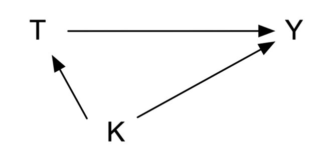
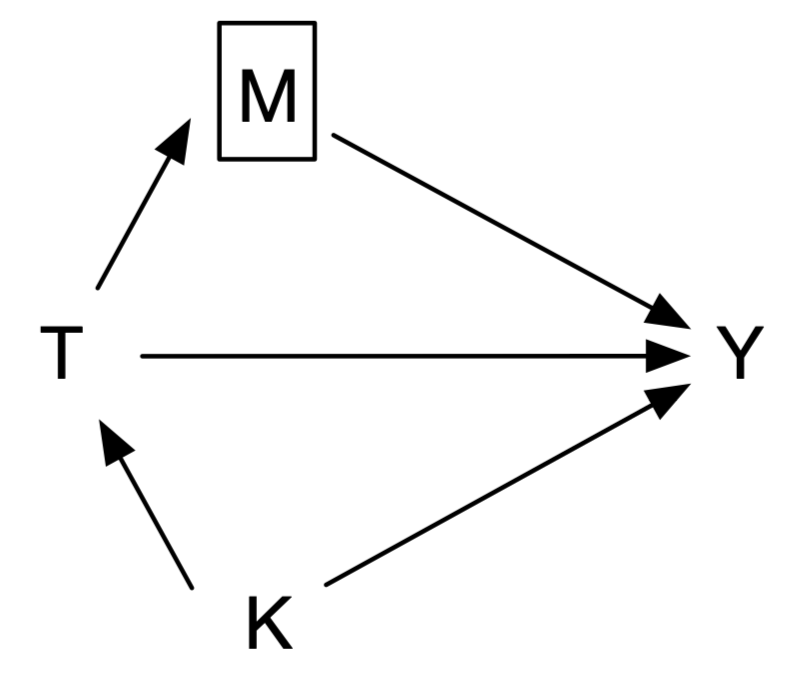
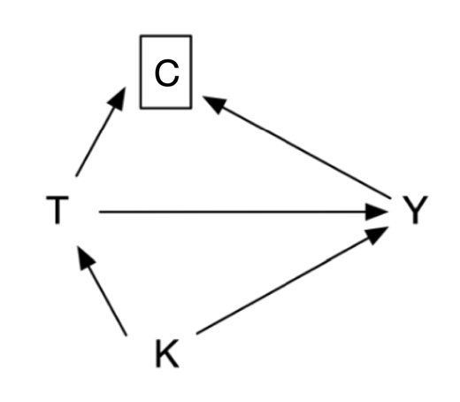

# Regression

## Outcome regression

Outcome regression estimates a causal effect by modeling the outcome conditional on treatment and sufficient confounders. If $U$ controls confounding (and selection bias) and the structural model is correctly specified, no further adjustment is required.

For a continuous outcome and a linear structural function,

**Equation 9.1 Outcome regression for a continuous outcome**

$$\begin{aligned}Y&=f(X,U)\\Y&=\beta_0+\beta_1X+\beta_2U\\E(Y^{X=1}\mid U)-E(Y^{X=0}\mid U)&=\beta_1.\end{aligned}$$

Ordinary least squares estimates the parameters. For binary outcomes, linear regression can predict values outside 0 and 1, so logistic regression uses the inverse-logit function:

**Equation 9.2 Logistic regression for a binary outcome**

$$\Pr(Y=1\mid X,U)=\frac{\exp(\beta_0+\beta_1X+\beta_2U)}{1+\exp(\beta_0+\beta_1X+\beta_2U)},\qquad OR=\exp(\beta_1).$$

Another effect measure is the risk ratio:

**Equation 9.3 Risk ratio**

$$RR=\frac{\Pr(Y^{X=1}=1)}{\Pr(Y^{X=0}=1)}.$$ 

When outcome incidence is below 10%, OR and RR are close; as incidence rises, OR increasingly overstates RR (Zhang and Yu 1998). A probit model uses the standard normal distribution rather than the logistic distribution:

**Equation 9.4 Probit model**

$$\Pr(Y=1\mid X,U)=\Phi(\beta_0+\beta_1X+\beta_2U).$$

**Case 9.1.** In 899 patients with growth-hormone-secreting pituitary adenoma, compare endoscopic with microscopic surgery. `K` is tumor invasiveness, `Y` is postoperative hormonal control, and `LOS` is length of stay. Assume that adjusting for K is sufficient for confounding in this simplified example.

::: {.text-center}
{width="2.93in"}

Figure 9.1 Causal graph for surgical approach and hormonal control.
:::

::: {.callout-note appearance="simple" icon="false" title="Code 9.1"}
```stata
gen Treatment = (t == "Endoscopy")
gen Outcome = 1 if y == "Yes"
replace Outcome = 0 if y == "No"
logit Outcome Treatment k, or
```
:::

::: {.callout-note appearance="simple" icon="false" title="Code 9.1 output"}
| Logistic regression | Value |
|:--|--:|
| Observations | 743 |
| OR for endoscopic treatment | 2.318 (95% CI 1.64–3.28; *p*<0.001) |
| OR for invasiveness K | 0.401 |
:::

After adjustment, endoscopic surgery has 2.32 times the odds of reaching the hormonal target. A probit model reaches the same substantive conclusion, though its coefficients are on the probit scale and are less directly interpreted.

::: {.callout-note appearance="simple" icon="false" title="Code 9.2"}
```stata
probit Outcome Treatment k
```
:::

The estimated intercept is 0.756, K coefficient −0.550, and treatment coefficient 0.497 (*p*<0.001). At K=1, the control probit is 0.206 and the treated probit 0.703; their normal cumulative probabilities are 0.582 and 0.759, yielding an OR about 2.26.

For the continuous outcome LOS, linear regression estimates that endoscopic patients stay 0.62 days less on average (95% CI −0.92 to −0.32; *p*<0.001).

::: {.callout-note appearance="simple" icon="false" title="Code 9.3"}
```stata
reg los Treatment k
```
:::

::: {.callout-note appearance="simple" icon="false" title="Code 9.3 output"}
| Linear regression | Value |
|:--|--:|
| Observations / R-squared | 899 / 0.032 |
| Treatment coefficient | −0.621 (95% CI −0.919 to −0.323; *p*<0.001) |
| K coefficient | 0.279 (95% CI 0.155–0.403; *p*<0.001) |
:::

## Incorrect regression equations

Do not block descendants of treatment. This can block causal flow from treatment to outcome or induce a noncausal association. In Figure 9.2, gross total resection M mediates the effect of surgical method T on hormonal control Y. Conditioning on M estimates neither the total effect nor, without stronger assumptions, a simple direct effect; it attenuates the treatment OR from 2.32 to 1.17 (95% CI 0.79–1.74; *p*=0.441). This inappropriate adjustment for a mediator or collider is overadjustment bias (Schisterman et al. 2009).

::: {.text-center}
{width="2.36in"}

Figure 9.2 Incorrectly blocking a treatment descendant: mediator.
:::

::: {.callout-note appearance="simple" icon="false" title="Code 9.4"}
```stata
gen M = (extend == "GTR")
logit Outcome Treatment k M, or
```
:::

If treatment and outcome both affect a later variable, conditioning on that collider also creates a noncausal association. Loss to follow-up is a common example: treatment can affect follow-up and outcome can affect follow-up, so restricting analysis to observed follow-up can introduce selection bias.

::: {.text-center}
{width="2.36in"}

Figure 9.3 Incorrectly blocking a treatment descendant: collider.
:::

::: {.callout-note appearance="simple" icon="false" title="Code 9.5"}
```stata
replace Outcome = 1 if y == "Censored"
logit Outcome Treatment k, or
```
:::

In the original data, loss to follow-up is 16.7% in endoscopic and 17.8% in microscopic patients. If all censored patients had achieved control, the causal OR is 2.09—13.0% smaller than the complete-case estimate.

## Effect modification

Clinical populations are heterogeneous: the average causal effect in a subgroup need not equal that in the whole population. V is an effect modifier when the effect of T on Y differs by V:

**Equation 9.5 Effect modification**

$$E(Y^{T=1}-Y^{T=0}\mid V=1)\ne E(Y^{T=1}-Y^{T=0}\mid V=0).$$

On a relative scale:

$$\frac{\Pr(Y^{T=1}=1\mid V=1)}{\Pr(Y^{T=0}=1\mid V=1)}\ne\frac{\Pr(Y^{T=1}=1\mid V=0)}{\Pr(Y^{T=0}=1\mid V=0)}.$$

Stratification is a common approach: define levels of V and estimate the treatment effect within each after controlling confounders L. “Heterogeneity of effects across strata” is another term for effect modification.

## Marginal effects

Conditional regression coefficients, particularly odds ratios, are not generally population-average causal effects. Standardization predicts each participant’s outcome under treatment and under control using a fitted outcome model, then averages those predictions. This produces marginal risks, risk difference, risk ratio, and standardized survival or mean outcomes for the target population. It makes the target estimand explicit and allows clinically interpretable absolute effects.

## Interaction

Statistical interaction represents effect modification in a model, often with a product term such as $T\times V$. It should be prespecified where possible, assessed with an interaction contrast rather than separate within-subgroup p values, and interpreted on a stated scale: interaction on the odds-ratio scale is different from interaction on the risk-difference scale. A statistically significant interaction may be clinically trivial; a clinically important interaction can be imprecise. Present stratum-specific absolute and relative effects with confidence intervals and avoid post hoc subgroup searching.

## References {.unnumbered}

1. Zhang J, Yu KF. What’s the relative risk? *JAMA*. 1998;280:1690-1691.
2. Schisterman EF, Cole SR, Platt RW. Overadjustment bias and unnecessary adjustment in epidemiologic studies. *Epidemiology*. 2009;20:488-495.
3. Hernán MA, Robins JM. *Causal Inference: What If*. Chapman & Hall/CRC; 2020.
4. Greenland S, Pearl J, Robins JM. Causal diagrams for epidemiologic research. *Epidemiology*. 1999;10:37-48.
