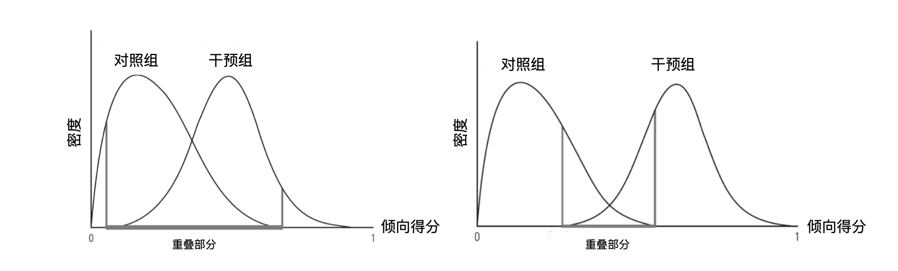
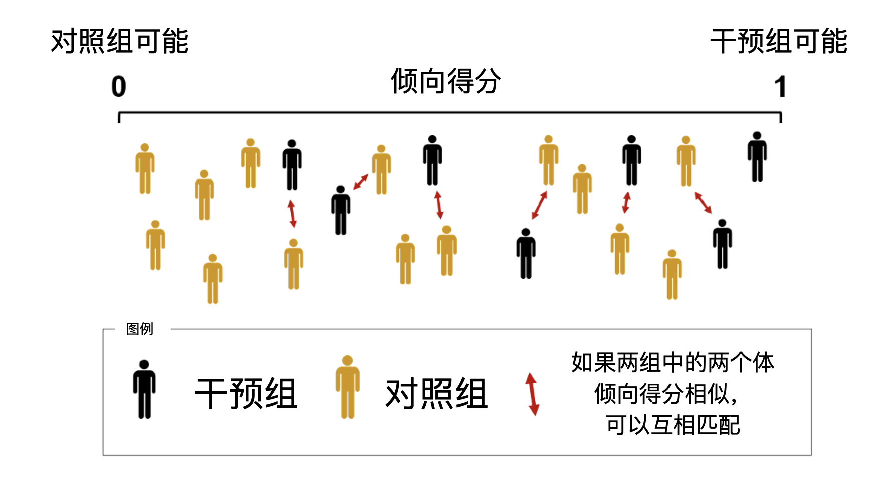
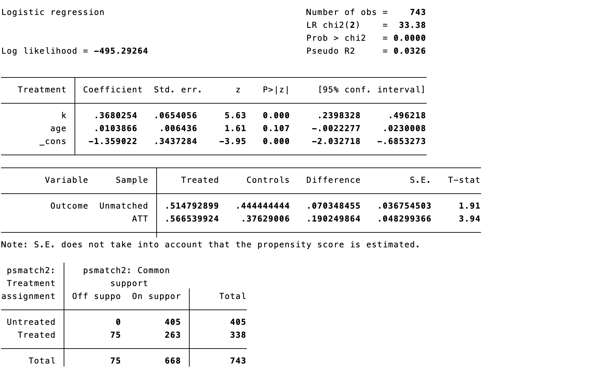
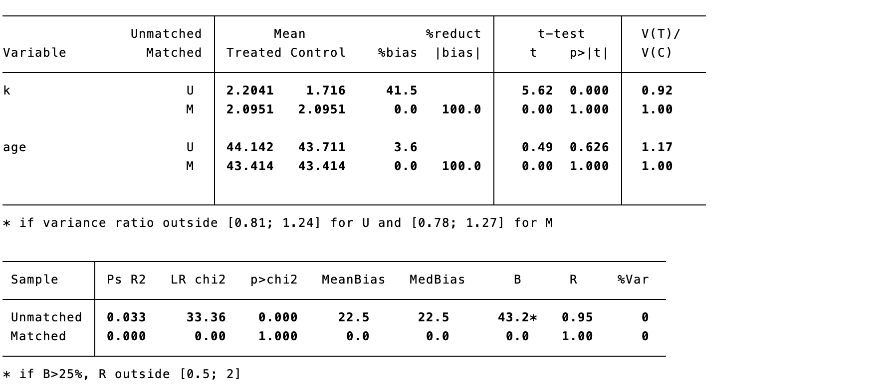
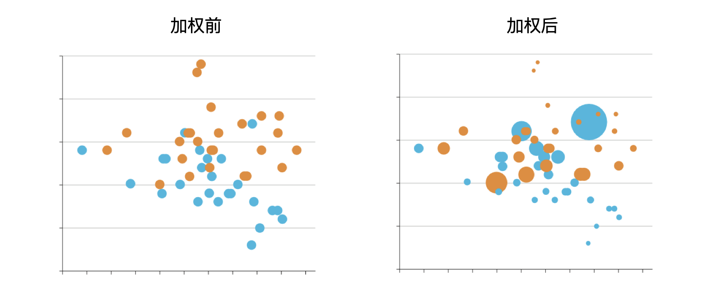
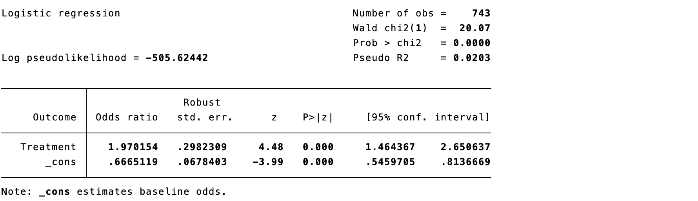
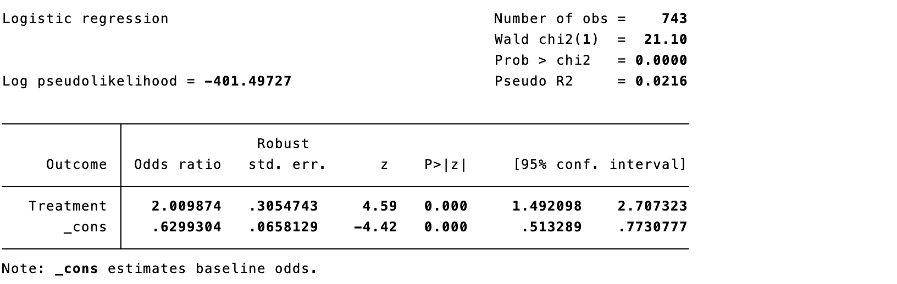
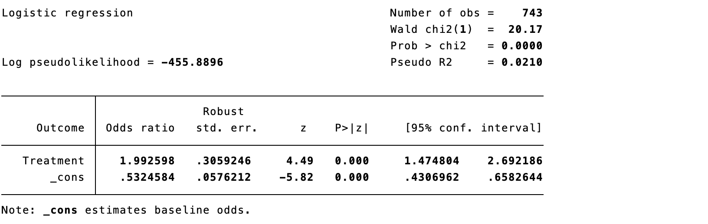

# Causal Inference Methods Based on Propensity Scores

In causal inference, matching pairs an individual who received an intervention with a control individual having similar characteristics. Repeating this for treated individuals permits estimation of causal effects in matched individuals, provided the paired groups are sufficiently similar. The broad steps are to define similarity, perform matching, assess its result, and estimate the effect. Matching uses no outcome information until design is complete, reducing the temptation to repeatedly alter covariates to obtain a desirable *p* value. This design-before-analysis principle is valuable, but matching is not intrinsically superior to regression: it still requires adequate covariate measurement, sensible model specification, and acceptable post-match balance.

With covariates $(x_1,x_2,\ldots,x_K)$, standardized Euclidean distance can measure similarity:

$$d(x_i,x_j)=\sqrt{\sum_{k=1}^{K}\frac{(x_{ki}-x_{kj})^2}{\sigma_k^2}}.$$

Clinical characteristics are multidimensional—age, sex, disease severity, treatment history, and more. A single summary variable that captures similarity greatly simplifies matching.

## Propensity scores

A propensity score is the probability of receiving an intervention. In a 1:1 RCT, every individual has probability 0.5; in non-randomized research it must be estimated. More precisely, given pretreatment covariates $X$, the propensity score is $e(X)=\Pr(A=1\mid X)$. It constructs samples or weighted pseudo-populations with comparable covariate distributions; it does not itself estimate a causal effect.

$$PS(x_i)=\Pr[A=1\mid x_i].$$

Estimate it by regressing treatment on measured confounders and using predicted treatment probability; machine-learning methods can also be used. The goal is not prediction accuracy for treatment assignment but balance after matching or weighting. Covariates must precede treatment and should be selected using clinical knowledge and causal graphs—not univariable *p* values. Do not include post-treatment variables or colliders.

Using the data of Case 9.1, estimate the probability of endoscopic surgery. The red intervention and blue control distributions both lie mainly between 0.3 and 0.6, showing good overlap. Higher tumor invasiveness (`k`) predicts a higher probability of endoscopic treatment.

::: {.callout-note appearance="simple" icon="false" title="Code 10.1"}
```stata
psmatch2 Treatment k age, logit
psgraph, bin(40)
```
:::

::: {.text-center}
{width="100%"}

{width="85%"}

Code 10.1 output: propensity-score estimation and distribution.
:::

As with all causal methods, propensity-score analysis requires exchangeability, positivity/overlap, and consistency. If blocking measured confounders blocks back-door paths, conditioning on a properly specified propensity score can also do so. Exchangeability within covariate strata implies exchangeability within propensity-score strata. Good score overlap is essential: in the left panel of Figure 10.1, the two curves overlap substantially; in the right panel they are well separated, making causal inference difficult. Propensity scores balance only measured covariates and cannot prevent residual confounding by unmeasured factors. Randomization balances both measured and unmeasured covariates and remains preferable. Check propensity-score distributions and the balance of every baseline covariate both before and after matching or weighting; score overlap does not replace balance diagnostics.

::: {.text-center}
{width="100%"}

Figure 10.1 Propensity-score distributions with good and poor overlap.
:::

Three main approaches use propensity scores for causal inference.

## Adding the propensity score directly to a regression model

The score can be the only adjustment covariate in an outcome model.

::: {.callout-note appearance="simple" icon="false" title="Code 10.2"}
```stata
reg Outcome Treatment _pscore, or
```
:::

::: {.text-center}
{width="100%"}

Code 10.2 output.
:::

The model indicates significantly higher endocrine-remission odds with endoscopic surgery (OR 2.29, 95% CI 1.62–3.22; *p*<0.001). This OR is a conditional effect and need not equal a marginal risk ratio or risk difference. For clinical interpretation, also report standardized absolute risks, risk difference, or risk ratio with 95% confidence intervals.

## Propensity-score matching

Match intervention and control individuals with the same or similar scores, then estimate effects in the matched sample. In Figure 10.2, black figures are treated individuals and yellow figures are controls; a treated individual is selected, the closest control score is found, and the pair is formed. The process is repeated; some controls, especially near score 0, may remain unmatched.

::: {.text-center}
{width="100%"}

Figure 10.2 Principle of propensity-score matching.
:::

Four practical questions arise. First, one-to-one matching provides closer similarity but may yield too few participants; one-to-many matching retains more observations when controls greatly outnumber treated participants. Second, a caliper sets the maximum permitted distance. Too small a caliper leaves many unmatched; too large a caliper harms exchangeability. A common starting point for 1:1 nearest-neighbor matching is 0.2 standard deviations of the logit of the score, followed by adjustment based on balance, sample loss, and clinical comparability. Third, controls can be reused when their number is much smaller than the treated group. Fourth, ties can be randomly resolved or all tied controls can be included with appropriate weights.

::: {.callout-note appearance="simple" icon="false" title="Code 10.3"}
```stata
psmatch2 Treatment k age, logit outcome(Outcome) n(1) cal(0.01) ties
```
:::

::: {.text-center}
{width="100%"}

Code 10.3 output.
:::

::: {.callout-note appearance="simple" icon="false" title="Code 10.4"}
```stata
psmatch2 Treatment k age, logit outcome(Outcome) n(1) cal(0.001) ties
```
:::

::: {.text-center}
{width="100%"}

Code 10.4 output.
:::

With a 0.01 caliper, only 3 patients are unmatched; with 0.001, 75 are unmatched. The matched sample differs from the original sample, so the effect targets the matched population—usually the average treatment effect in the treated (ATT) among matchable treated individuals. Remission is 56.7% in the intervention group and 37.6% in controls, giving OR 2.17. Report the number and baseline characteristics of unmatched people and explicitly state the target population.

As in an RCT, show distributions of all covariates after matching. `U` denotes unmatched and `M` matched observations. Before matching, invasiveness is 2.2 versus 1.7 with *p*<0.001; after matching, both are 2.1 with *p*=1.000. More importantly, use absolute standardized mean difference (SMD), often <0.10 as an empirical benchmark, rather than *p* values, to judge balance.

::: {.callout-note appearance="simple" icon="false" title="Code 10.5"}
```stata
pstest k age, both graph
```
:::

::: {.text-center}
{width="100%"}

Code 10.5 output: covariate-balance assessment.
:::

## Inverse probability weighting with propensity scores

Inverse probability weighting (IPW) assigns each participant a weight and constructs a pseudo-population in which measured confounding is absent (Figure 10.3). A treated participant with a 25% predicted probability of treatment receives weight 4: they represent themselves and four similar people. A control participant with a 90% probability of treatment has only a 10% probability of control and receives weight 10.

::: {.text-center}
{width="100%"}

Figure 10.3 Principle of inverse probability weighting.
:::

For binary treatment, weights are

$$w_{ki}^{T=1}=\frac{1}{\Pr(T=1\mid k_i)},\qquad w_{ki}^{T=0}=\frac{1}{1-\Pr(T=1\mid k_i)}.$$

Use the inverse-probability weight in the outcome regression.

::: {.callout-note appearance="simple" icon="false" title="Code 10.6"}
```stata
gen ipweight = 1/_pscore if Treatment == 1
replace ipweight = 1/(1-_pscore) if Treatment == 0
logistic Outcome Treatment [iweight = ipweight], vce(robust)
```
:::

::: {.text-center}
{width="100%"}

Code 10.6 output.
:::

Very small scores produce large weights and unstable, high-variance estimates. Stabilized weights multiply by the marginal probability of the received treatment; they mitigate, but do not eliminate, instability from extreme weights. Report weight distributions and effective sample size, and prespecify trimming, truncation, or sensitivity analysis.

$$SW_{ki}^{T=1}=\frac{\Pr(T=1)}{\Pr(T=1\mid k_i)},\qquad SW_{ki}^{T=0}=\frac{1-\Pr(T=1)}{1-\Pr(T=1\mid k_i)}.$$

::: {.callout-note appearance="simple" icon="false" title="Code 10.7"}
```stata
gen s_ipweight = (1/_pscore)*0.4516 if Treatment == 1
replace s_ipweight = 1/(1-_pscore)*0.5484 if Treatment == 0
logistic Outcome Treatment [iweight = s_ipweight], vce(robust) or
```
:::

::: {.text-center}
{width="100%"}

Code 10.7 output.
:::

Use SMDs to assess covariate differences before and after weighting. Here group sizes are 338 and 405 before weighting and 371.4 and 371.6 in the weighted pseudo-population; for tumor invasiveness, SMD changes from 0.415 to -0.002. Aim for SMD below 0.10. Weighted counts are pseudo-sample sizes, not effective sample sizes; also inspect weight distributions, effective sample size, and covariate plots.

::: {.callout-note appearance="simple" icon="false" title="Code 10.8"}
```stata
teffects ipw (Outcome) (Treatment k age, logit)
tebalance summarize
```
:::

::: {.text-center}
{width="100%"}

Code 10.8 output.
:::

## Other weighting methods

Conventional IPW gives treated patients $1/PS$ and untreated patients $1/(1-PS)$; extreme scores therefore create extreme weights. Trimming can remove weighted extremes, for example beyond the 95th or 99th percentile, but does not guarantee an appropriate threshold and reduces sample size.

### Overlap weighting

Overlap weighting gives each participant the probability of the opposite treatment: treated participants receive $1-PS$ and untreated participants receive $PS$. Thus, scores close to 0 or 1 do not dominate as they do under IPW, while people compatible with either treatment contribute more. The target is the overlap or clinical-equipoise population, not the entire enrolled population, and the estimand should be reported accordingly. It can generate exact covariate balance between groups, but estimates the average treatment effect in the overlap population (ATO), which may differ from ATT or ATE. A changed effect estimate usually reflects a changed target population, not simply a “smaller” effect.

::: {.callout-note appearance="simple" icon="false" title="Code 10.9"}
```stata
gen o_weight = 1 - _pscore if Treatment == 1
replace o_weight = _pscore if Treatment == 0
logistic Outcome Treatment [iweight = o_weight], vce(robust) or
```
:::

::: {.text-center}
{width="100%"}

Code 10.9 output.
:::

### Matching weighting

Matching weights are $\min(PS,1-PS)/PS$ for treated participants and $\min(PS,1-PS)/(1-PS)$ for controls. They avoid extreme weights and the need for truncation. With similarly sized groups and good overlap, the target approximates population ATE; with unequal sizes and good overlap, it approximates ATT in the smaller group. With limited overlap, it targets the overlapping subgroup. The estimand depends on sample composition and the shape of score overlap and should be described rather than labeled only “close to ATE” or “close to ATT.”

::: {.callout-note appearance="simple" icon="false" title="Code 10.10"}
```stata
gen m_weighting = min(_pscore, 1-_pscore)/_pscore
replace m_weighting = min(_pscore, 1-_pscore)/(1-_pscore) if Treatment == 0
logit Outcome Treatment [iweight = m_weighting], vce(robust) or
```
:::

::: {.text-center}
{width="100%"}

Code 10.10 output.
:::

### Fine-stratification weighting

Fine stratification for ATE does not directly turn scores into weights. Instead it creates narrow score strata of fixed probability width, such as 0–0.02, 0.02–0.04, and so on. Strata with no treated or no controls are excluded; weights are calculated from treated and control counts in remaining strata. For ATT, treated weights are set to 1 and controls are reweighted according to the number of treated patients in their stratum.

### Standardized mortality ratio weighting

Standardized mortality ratio weighting assigns weight 1 to treated participants and $PS/(1-PS)$ to controls. Like IPW, it can be affected by extreme weights and may require truncation.

::: {.callout-note appearance="simple" icon="false" title="Code 10.11"}
```stata
gen smr_weighting = 1
replace smr_weighting = _pscore/(1-_pscore) if Treatment == 0
logit Outcome Treatment [iweight = smr_weighting], vce(robust) or
```
:::

::: {.text-center}
{width="100%"}

Code 10.11 output.
:::

## Choosing among propensity-score methods

Matching treated participants to a fixed number of controls within a prespecified caliper is often a useful choice, but discards unmatched observations and can increase imbalance. It is not universally preferred: when the question is an ATE in the comparable study population or retaining observations is important, weighting can be considered when overlap and stability are good. Choose according to the estimand, degree of overlap, acceptable sample loss, and resulting balance.

Weighting retains most observations, can provide greater precision, and makes balance reporting transparent. It is flexible and can target different populations. Fine-stratification, matching, and overlap weights can address important limitations of conventional IPW.

The estimand specifies the population to which a treatment effect applies. If treating all eligible participants is feasible, target the average treatment effect (ATE). If treatment is appropriate only for patients with certain characteristics who actually receive it, target the average treatment effect in the treated (ATT). Table 10.1 summarizes common weights.

| Method | Treated weight | Control weight | Estimand | Key feature |
|:--|:--|:--|:--|:--|
| IPW | $1/PS$ | $1/(1-PS)$ | ATE | Mimics an RCT but can have extreme weights; trimming may help. |
| Standardized mortality ratio | 1 | $PS/(1-PS)$ | ATT | Extends naturally to >2 groups; trimming may be needed. |
| Overlap | $1-PS$ | $PS$ | ATO | Avoids extreme weights; targets the overlap/equipoise population. |
| Matching | $\min(PS,1-PS)/PS$ | $\min(PS,1-PS)/(1-PS)$ | Often ATT in smaller group | Avoids extreme weights; target depends on group size and overlap. |

### Correct specification of the propensity-score model

The first task is avoiding model misspecification. The true structural relation between treatment and all covariates is unknown, so a simple logistic model can be misspecified; machine learning can be an alternative. Regardless of method, include strong outcome predictors and avoid variables that predict treatment strongly but are unrelated to outcome when they force scores close to 0 or 1. Fine-stratification weighting may be more robust because it creates strata from scores and then uses observation counts. Judge a score model by post-design balance, not its c statistic or predictive accuracy. For continuous or nonlinear covariates, consider splines, interactions, or flexible learning models, while keeping score-model selection independent of outcome analysis.

### Assessing overlap of exposure and reference groups

Substantial score overlap indicates reasonable clinical equipoise. When weighting, trim nonoverlap regions so both treatments have nonzero probability. Scores near 0 or 1 generate large weights and allow atypical participants to dominate. If trimming removes many observations, overlap may be inadequate; trimming also changes the study population and estimand. Report the trimming rule, number excluded, and covariate distributions before and after trimming, and conduct sensitivity analyses using alternative plausible thresholds.

### Selecting an estimand

Different weights estimate effects for different populations. ATE makes covariate distributions of treated and reference groups similar to each other and to the full sample. ATT makes the reference-group covariate distribution resemble that observed in the treated group. The effect in the clinical-equipoise subset is driven by score overlap and excludes people who would almost certainly receive one treatment. IPW, matching weights, and standardized mortality ratio weights extend readily to more than two treatments using multinomial propensity scores. For multiple treatments, IPW uses the reciprocal of the probability of treatment actually received; matching weights use the smallest available score in the numerator and the received-treatment score in the denominator; SMR weighting sets the target-treatment group to 1 and weights other groups by the ratio of target-treatment to received-treatment probability.

## Limitations of propensity-score causal inference

Errors in estimating the propensity score propagate to causal estimates. More importantly, unmeasured confounding is not repaired by a propensity score, and matching estimates effects only in the matched sample, limiting generalizability. Use subject-matter knowledge and quantitative bias analysis or sensitivity analyses such as the E-value to discuss unmeasured confounding; be cautious when extrapolating to unmatched populations or populations without overlap.

## References {.unnumbered}

1. Rosenbaum PR, Rubin DB. The central role of the propensity score in observational studies for causal effects. *Biometrika*. 1983;70(1):41-55.
2. Brookhart MA, Schneeweiss S, Rothman KJ, et al. Variable selection for propensity score models. *Am J Epidemiol*. 2006;163(12):1149-1156.
3. Austin PC. Balance diagnostics for propensity-score matched samples. *Stat Med*. 2009;28(25):3083-3107.
4. Austin PC. Optimal caliper widths for propensity-score matching. *Pharm Stat*. 2011;10(2):150-161.
5. Austin PC, Stuart EA. Best practice for IPTW using propensity scores. *Stat Med*. 2015;34(28):3661-3679.
6. Deb S, Austin PC, Tu JV, et al. Propensity-score methods in cardiovascular research. *Can J Cardiol*. 2016;32(2):259-265.
7. Li F, Thomas LE, Li F. Addressing extreme propensity scores via overlap weights. *Am J Epidemiol*. 2019;188(1):250-257.
8. Elze MC, Gregson J, Baber U, et al. Comparison of propensity-score methods and covariate adjustment. *J Am Coll Cardiol*. 2017;69(3):345-357.
9. Garrido MM, Kelley AS, Paris J, et al. Methods for constructing and assessing propensity scores. *Health Serv Res*. 2014;49(5):1701-1720.
10. VanderWeele TJ, Ding P. Sensitivity analysis in observational research: introducing the E-value. *Ann Intern Med*. 2017;167(4):268-274.
