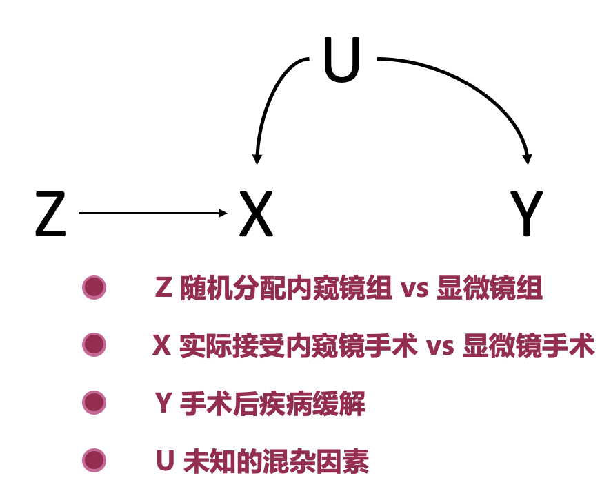
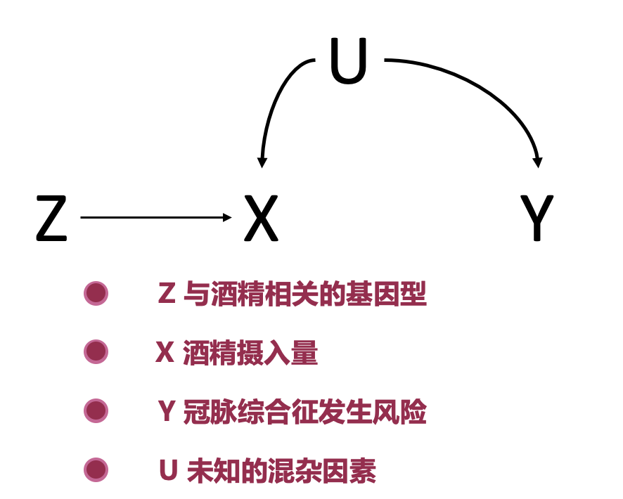
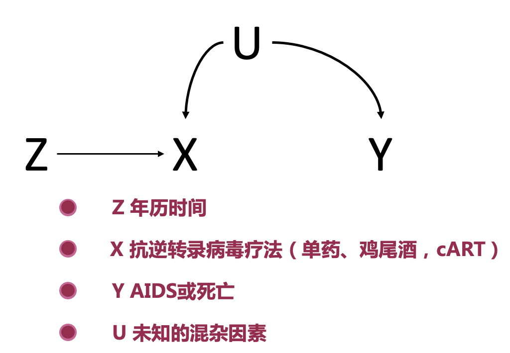
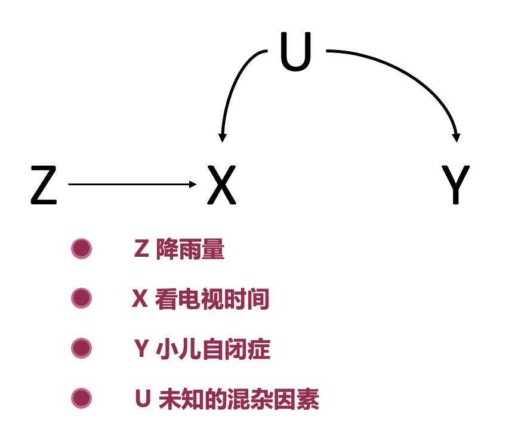
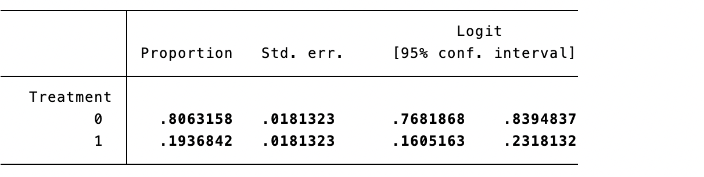
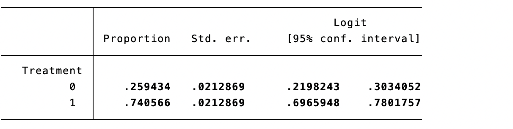
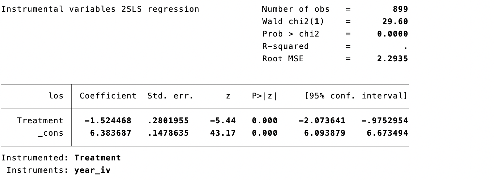
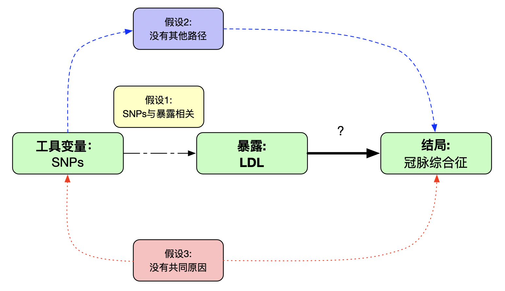
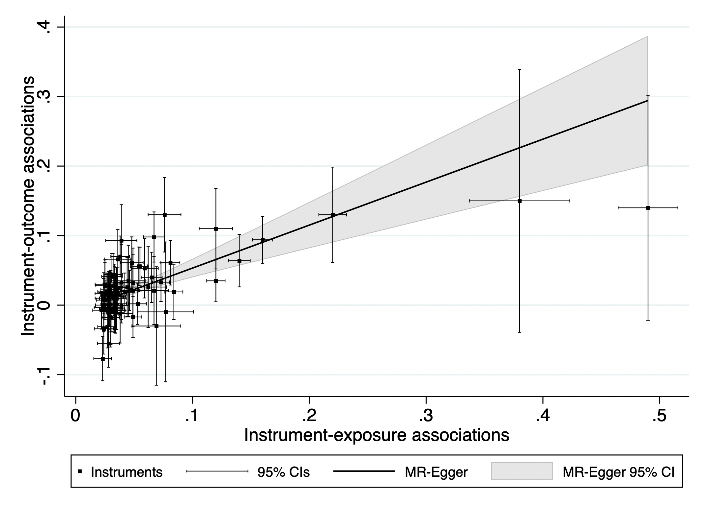
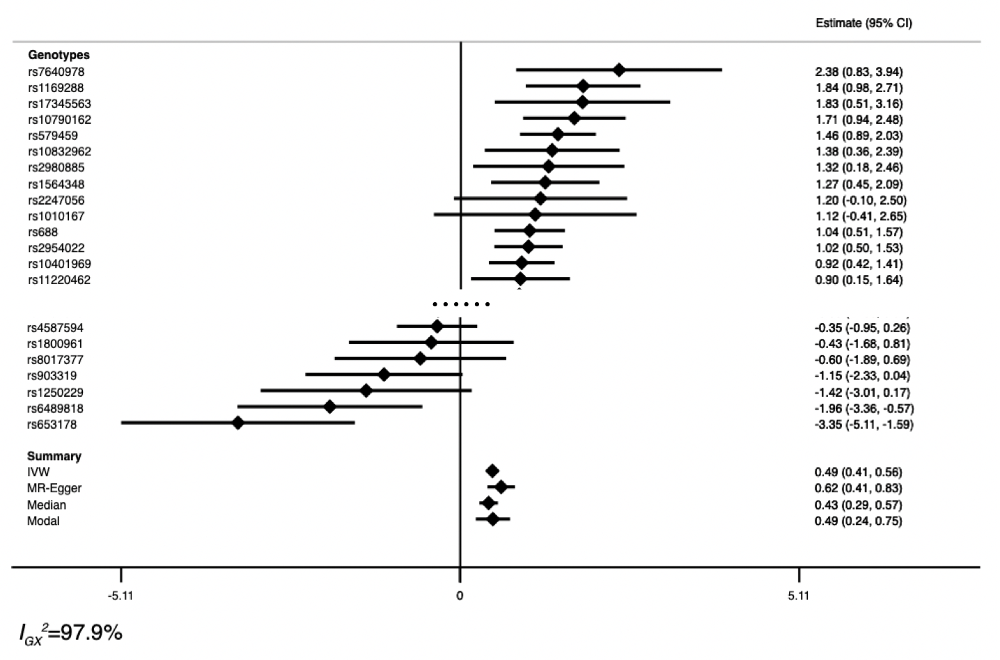

# Instrumental-Variable Methods

Regression and propensity-score methods cannot directly remove unmeasured confounding. An instrumental variable (IV) does not automatically solve that problem: it replaces it with strong assumptions about instrument validity. If those assumptions are implausible, IV estimates can also be biased.

## Instrumental variables

Let $Z$ be an instrument for exposure $X$ and outcome $Y$. $Z$ changes $X$, and if $X$ truly causes $Y$, the change in $X$ induced by $Z$ is transmitted to $Y$. In a linear model with one valid instrument, the Wald estimand is the effect of $Z$ on $Y$ divided by the effect of $Z$ on $X$. Association between $Z$ and $X$ establishes only relevance, not validity: causal interpretation also requires independence and the exclusion restriction.

::: {.text-center}
{width="42%"}

Figure 11.1 Instrumental-variable method.
:::

The three core assumptions are:

1. **Relevance:** $Z$ is associated with $X$.
2. **Exclusion restriction:** $Z$ affects $Y$ only through $X$.
3. **Independence:** $Z$ and $Y$ have no common causes.

For a binary instrument and treatment, interpreting the result as a local average treatment effect (LATE) among compliers also requires monotonicity: no one consistently changes treatment in the direction opposite to the instrument. These assumptions cannot generally be proven from observed data (Hernán and Robins 2006; Baiocchi et al. 2014).

In an RCT, randomized assignment may be the instrument: $Z$ is assignment to endoscopic or microscopic surgery, $X$ is treatment actually received, and $Y$ is endocrine remission. ITT estimates the effect of $Z$ on $Y$; a per-protocol effect concerns $X$ on $Y$. If adherence is perfect, they coincide. In observational research, the causal effect depends on the instrument, identifying assumptions, and estimand and is not automatically equivalent to an RCT per-protocol effect.

::: {.text-center}
{width="42%"}

Figure 11.2 Random assignment as an instrument.
:::

## Practical applications

To study whether alcohol causes coronary syndrome, drinking is $X$, coronary syndrome is $Y$, and unmeasured characteristics such as smoking are $U$. An alcohol-metabolism genotype may be a candidate $Z$: people with inefficient metabolism may drink less. Genetic instruments require scrutiny of horizontal pleiotropy, population stratification, parental effects, and selection bias, each of which can open a path from $Z$ to $Y$ outside alcohol use.

::: {.text-center}
{width="42%"}

Figure 11.3 Genetic variation as a candidate instrument.
:::

Calendar time has been used as a candidate instrument for antiretroviral therapy in HIV: treatment practice changes over time. It can easily violate exclusion because diagnostic technology, care, case mix, and follow-up also change.

::: {.text-center}
{width="48%"}

Figure 11.4 Calendar time as a candidate instrument.
:::

Rainfall has been proposed as an instrument for television viewing when studying childhood autism: more rain may increase time indoors and television viewing. It is not automatically valid, since rainfall can also affect outdoor activity, infection exposure, access to care, and regional socioeconomic conditions.

::: {.text-center}
{width="42%"}

Figure 11.5 Rainfall as a candidate instrument.
:::

## Analysis steps

Two-stage least squares first regresses exposure on the instrument, then relates outcome to the predicted exposure. The stages must be estimated jointly with IV/2SLS standard errors; predicted exposure must not simply be treated as an observed covariate. State the estimand—population effect, complier effect, or another local effect—in advance.

**Equation 11.1 IV estimator for binary $Z$**

$$IV=\frac{E(Y\mid Z=1)-E(Y\mid Z=0)}{E(X\mid Z=1)-E(X\mid Z=0)}.$$

**Equation 11.2 IV estimator for continuous $Z$**

$$IV=\frac{\operatorname{Cov}(Y,Z)}{\operatorname{Cov}(X,Z)}.$$

In Case 9.1, surgery before 2016 was mostly microscopic and later surgery mostly endoscopic, making calendar time a candidate instrument. Before 2016, 80.6% received microscopic surgery; after 2016, 74.1% received endoscopic surgery.

::: {.callout-note appearance="simple" icon="false" title="Code 11.1"}
```stata
prop Treatment if year <= 2016
prop Treatment if year > 2016
```
:::

::: {.text-center}
{width="100%"}
{width="100%"}

Code 11.1 output: treatment proportions before and after 2016.
:::

For a binary outcome, `ivprobit` is one possible model; binary-outcome IV models rely on different functional-form assumptions and none is automatically standard or valid.

::: {.callout-note appearance="simple" icon="false" title="Code 11.2"}
```stata
gen year_iv = (year <= 2016)
ivprobit Outcome (Treatment = year_iv)
```
:::

::: {.text-center}
{width="100%"}

Code 11.2 output.
:::

The model has intercept −0.330 and treatment coefficient 0.597; converting probit values gives an OR about 2.60. This is conditional on calendar time satisfying its exclusion restriction and is not unconditional proof of an overall surgical effect. For continuous length of stay, 2SLS estimates that endoscopic surgery shortens stay by 1.52 days.

::: {.callout-note appearance="simple" icon="false" title="Code 11.3"}
```stata
ivregress 2sls los (Treatment = year_iv)
```
:::

::: {.text-center}
{width="100%"}

Code 11.3 output.
:::

## Statistical diagnostics and assumptions

Relevance is assessed in the first stage. Weak instruments produce estimates biased toward ordinary regression and distorted confidence intervals. Report first-stage effect, partial $R^2$, number of instruments, and weak-instrument diagnostics—not merely a second-stage p value. F>10 is a familiar rule of thumb for one endogenous variable under homoskedasticity, not a universal threshold; with heteroskedasticity, clustering, or multiple instruments, report Kleibergen–Paap statistics and relevant critical values, and consider Anderson–Rubin robust inference.

::: {.callout-note appearance="simple" icon="false" title="Code 11.4"}
```stata
ivreg2 los (Treatment = year_iv)
```
:::

::: {.text-center}
{width="100%"}

Code 11.4 output.
:::

Exclusion and independence cannot be confirmed statistically. Draw a causal graph, identify every alternative path, and discuss why it is absent. Associations of the instrument with baseline covariates, negative controls, and quantitative sensitivity analyses can make an assumption more or less plausible but cannot prove it. Overidentification testing is possible only with more instruments than endogenous exposures; a non-significant result does not validate every instrument. Homogeneity is not required for every IV analysis: with monotonicity, a binary IV identifies a LATE among compliers; only further homogeneity or transportability assumptions support extrapolation to the population ATE.

## Finding instruments

Valid instruments are difficult to find precisely because they must remain outside the outcome model. Candidate sources include group-level characteristics (for example regional unemployment or poverty), natural phenomena (rivers, earthquakes, rainfall), physiological phenomena (birth date, season, sex, genotype), and social space. Relative distance to hospitals offering different emergency treatments can be a candidate if it changes treatment choice but has no direct effect on outcome; tobacco price has been used as a candidate instrument for quitting smoking and weight gain. Every example still requires the three assumptions in its specific setting.

## Limitations

Good instruments are rare; their validity relies on untestable assumptions; and estimates differ by instrument because an IV often identifies a weighted local effect. In the calendar-time example, some patients would always receive one surgical method, while compliers could receive different methods in different periods. The effect applies to the latter group. This local target can be an advantage, but its clinical meaning and differences from the overall sample must be reported. An instrument successful in one center or era may not generalize elsewhere.

## Mendelian randomization

Mendelian randomization (MR) uses genetic variation as instruments to estimate the effect of an exposure—biomarker, anthropometric measure, or other risk factor—on disease. Genotypes are fixed at conception and thus avoid reverse causation from outcome to genotype. MR remains IV analysis and needs the same relevance, exclusion, and independence assumptions. It also requires attention to ancestry, linkage disequilibrium, family effects, and horizontal pleiotropy. Vertical pleiotropy wholly downstream of the exposure is usually compatible with IV assumptions; horizontal pleiotropy is not.

**Case 11.1.** To study LDL cholesterol and coronary syndrome, $X$ is LDL, $Y$ coronary syndrome, and SNPs associated with LDL are $Z$. Relevance can be examined, but the other assumptions require argument. SNPs may affect other lipids or be in linkage disequilibrium with variants associated with outcome; population structure can link allele frequency and coronary risk.

::: {.text-center}
{width="100%"}

Figure 11.6 Assumptions for Mendelian randomization.
:::

One-sample MR uses 2SLS in one dataset. Two-sample MR obtains SNP–exposure and SNP–outcome associations from two independent, comparable samples, often GWAS consortia. Report sample overlap, ancestry comparability, phenotype definitions, and selection mechanisms: overlap with weak instruments can pull estimates toward observational associations. Typical workflow: select genome-wide significant SNPs (often $p<5\times10^{-8}$), clump for linkage disequilibrium, harmonize alleles, obtain SNP–outcome associations, prespecify inverse-variance weighting as primary analysis, and use weighted median, MR-Egger, mode methods, heterogeneity, leave-one-out, and MR-PRESSO as sensitivity analyses.

::: {.callout-note appearance="simple" icon="false" title="Code 11.5"}
```stata
mregger acsbeta ldlcbeta [aw=1/(acsse^2)], ivw fe
lincom ldlcbeta, or
```
:::

::: {.text-center}
{width="100%"}

Code 11.5 output: inverse-variance weighted MR.
:::

The IVW result suggests that a one-unit LDL increase raises coronary-syndrome risk 1.63-fold. Weighted-median and MR-Egger analyses provide estimates under different invalid-instrument assumptions.

::: {.callout-note appearance="simple" icon="false" title="Code 11.6–11.8"}
```stata
mrmedian acsbeta acsse ldlcbeta ldlcse, weighted
mregger acsbeta ldlcbeta [aw=1/(acsse^2)]
mreggerplot acsbeta acsse ldlcbeta ldlcse, gpci
mrforest acsbeta acsse ldlcbeta ldlcse, ivid(rsid) models(4)
```
:::

::: {.text-center}
{width="100%"}
{width="100%"}
{width="100%"}
{width="100%"}

Code 11.6–11.8 output: sensitivity analyses, fitted effect, and forest plot.
:::

MR findings should follow STROBE-MR: state the causal question and estimand, data sources, SNP selection and harmonization, evidence for all IV assumptions, primary and sensitivity analyses, data/code availability, and limits to generalization. MR estimates genetic prediction of usually lifelong exposure differences; they are not proof that a short-term, age-specific clinical intervention has the same effect.

## Appendix: Checklist for evaluating Mendelian-randomization studies

### Core assumptions

- Is there strong evidence that variants predict the exposure?
- Are variants associated with potential confounders, and is this assessed?
- Could variants affect outcome through other pathways, and are pleiotropy-robust methods or negative controls reported?

### Methods and data

- Are exposure and outcome alleles coded in the same direction?
- Are two samples comparable and independent, and are instruments linkage-independent or modeled as correlated?
- Are associations, IV estimates, conventional estimates, SNP selection, sensitivity analyses, and reproducible data shown?

### Interpretation and clinical meaning

- Could similarity/difference from observational estimates reflect weak instruments or pleiotropy?
- Are confidence intervals precise enough for clinically meaningful effects?
- Is a lifelong genetic effect being distinguished from an intervention at a particular age and duration?
- Are results triangulated with trials, mechanisms, observational designs, and MR in other populations before informing care?

## References {.unnumbered}

1. Hernán MA, Robins JM. Instruments for causal inference: an epidemiologist’s dream? *Epidemiology*. 2006;17:360-372.
2. Baiocchi M, Cheng J, Small DS. Instrumental variable methods for causal inference. *Statistics in Medicine*. 2014;33:2297-2340.
3. Lousdal ML. Instrumental variable assumptions, validation and estimation. *Emerging Themes in Epidemiology*. 2018;15:1.
4. Bowden J, Davey Smith G, Burgess S. MR-Egger regression. *International Journal of Epidemiology*. 2015;44:512-525.
5. Bowden J, Davey Smith G, Haycock PC, Burgess S. Weighted median MR. *Genetic Epidemiology*. 2016;40:304-314.
6. Burgess S, Davey Smith G, Davies NM, et al. Guidelines for MR investigations. *Wellcome Open Research*. 2020;4:186.
7. Skrivankova VW, Richmond RC, Woolf BAR, et al. STROBE-MR statement. *JAMA*. 2021;326:1614-1621.
