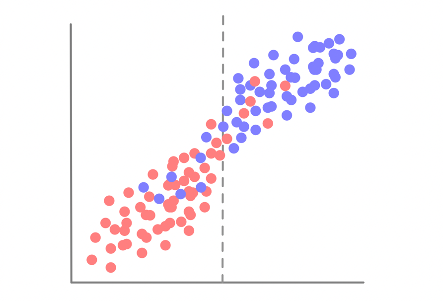
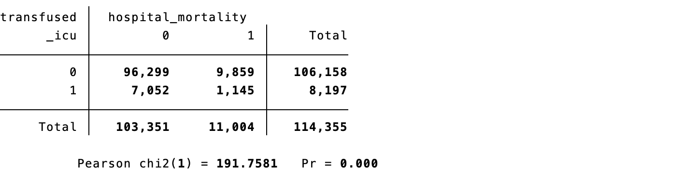
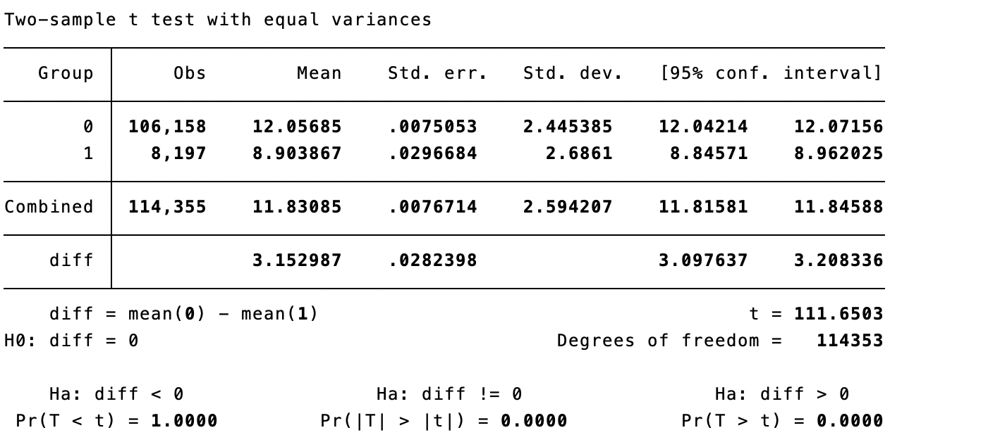
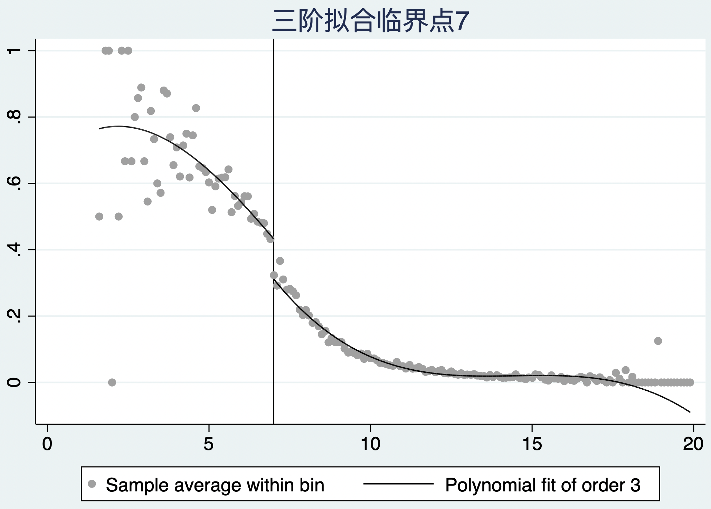
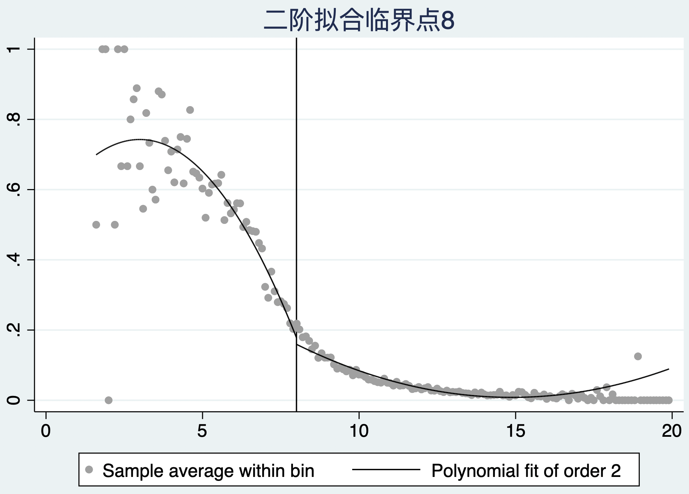
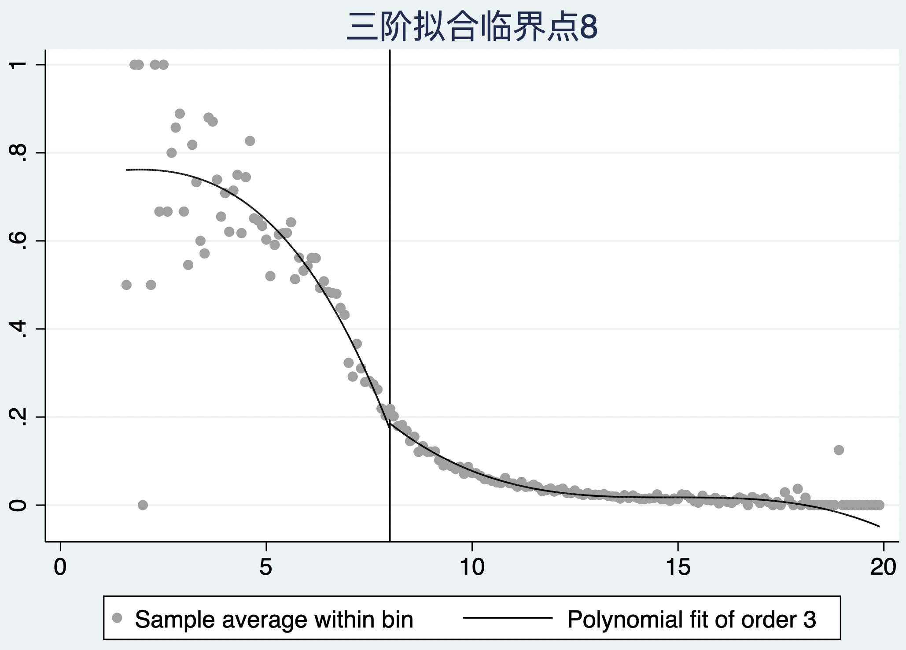
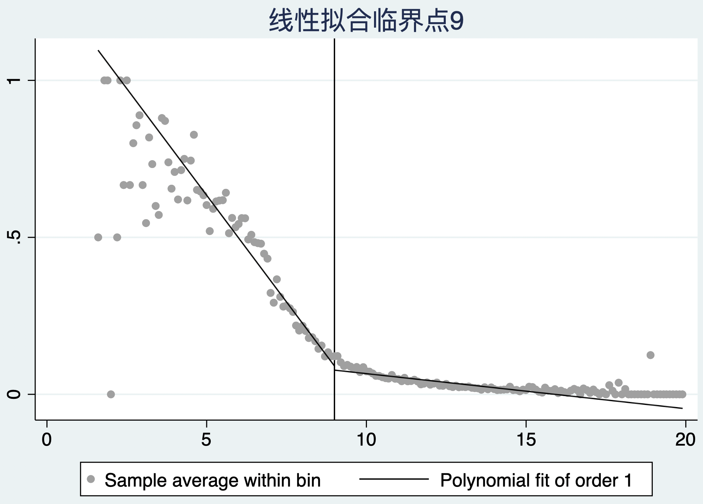
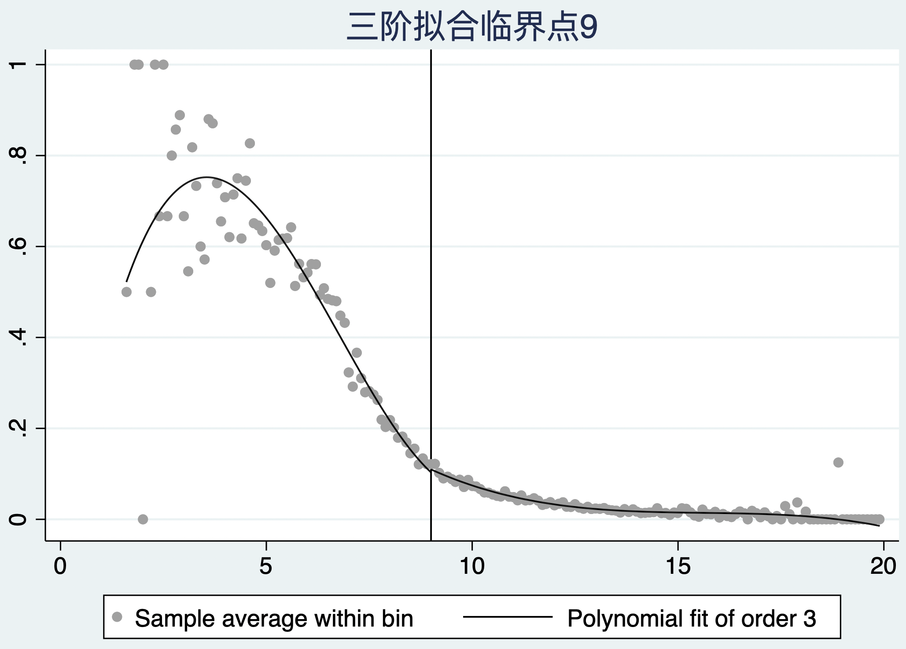
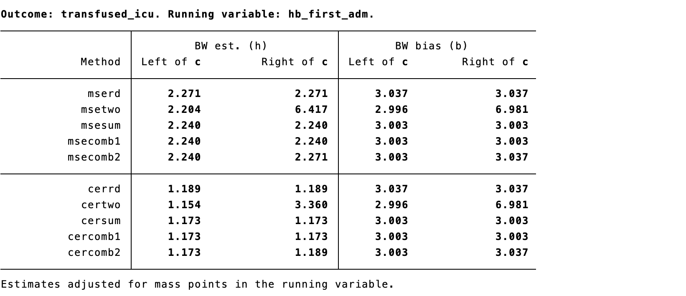
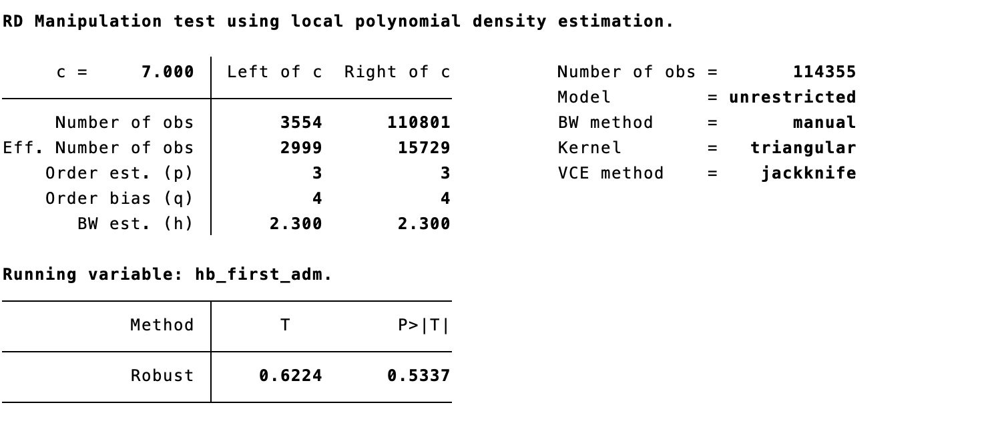

# Regression Discontinuity

Regression discontinuity (RD) estimates causal effects when treatment assignment changes discontinuously at a known threshold of a continuous running variable. People immediately to either side of the cutoff are expected to be comparable except for their probability of treatment, so a discontinuity in outcome at the threshold can be attributed to treatment under local continuity assumptions.

## Sharp and fuzzy discontinuities

In a **sharp** RD, the running variable deterministically assigns treatment: everyone above a cutoff receives treatment and everyone below does not. In a **fuzzy** RD, crossing the threshold changes only the probability of treatment. Fuzzy RD is an IV design in which eligibility/threshold crossing instruments treatment receipt; it identifies a local effect for compliers at the cutoff, subject to relevance, exclusion, continuity, and monotonicity assumptions.

::: {.text-center}
{width="100%"}

Figure 12.1 Sharp and fuzzy regression discontinuity.
:::

## Identification using the running variable

Let $R$ be the running variable and $c$ the cutoff. RD compares the limiting expected outcomes from the two sides:

$$\tau_{RD}=\lim_{r\downarrow c}E(Y\mid R=r)-\lim_{r\uparrow c}E(Y\mid R=r).$$

Identification requires that potential outcomes and baseline covariates would evolve smoothly through $c$ in the absence of treatment, and that people cannot precisely manipulate $R$ around the threshold. The causal effect is local: it applies to individuals near $c$, not automatically to people far from it.

**Case 12.1.** Suppose a clinical policy gives a preventive intervention only when a risk score reaches a prespecified cutoff. Plot outcome against score, inspect the treatment-probability jump at the cutoff, and compare observations within a clinically defensible local neighborhood.

::: {.text-center}
{width="100%"}
{width="100%"}

Figures 12.2–12.3 Running-variable distributions and outcome discontinuity.
:::

## Estimation methods

### Bandwidth selection

Only observations near the cutoff contribute to a local RD estimate. A narrow bandwidth reduces bias but increases variance; a wide bandwidth improves precision but can introduce model bias. Use data-driven bandwidth selectors as a starting point, report the selected bandwidth and number of observations on each side, and present sensitivity analyses with plausible alternatives.

::: {.text-center}
{width="100%"}

Figure 12.4 Bandwidth selection.
:::

### Local linear regression

Local linear regression fits separate weighted lines on each side of the cutoff, usually giving closer observations greater weight. It is often preferred to a single global polynomial because it reduces sensitivity to distant observations and high-order functional-form choices.

::: {.callout-note appearance="simple" icon="false" title="Code 12.1"}
```stata
rdrobust outcome running, c(cutoff)
rdplot outcome running, c(cutoff)
```
:::

::: {.text-center}
{width="100%"}
{width="100%"}

Code 12.1 output: local-linear estimate and RD plot.
:::

### Local polynomial regression

Local polynomial approaches allow curvature within a bandwidth, but high-order global polynomials can create implausible behavior and misleading inference. Prefer low-order local polynomials, robust bias-corrected confidence intervals, and transparent plots rather than choosing a polynomial after inspecting significance.

::: {.text-center}
{width="100%"}

Figure 12.5 Local-polynomial fit.
:::

## Validity checks

### Local smoothness

Baseline covariates that cannot be affected by treatment should not jump at the cutoff. Plot and estimate discontinuities for age, sex, disease severity, and other pretreatment factors. A discontinuity suggests that the design may not approximate local randomization.

::: {.text-center}
{width="100%"}
{width="100%"}

Figures 12.6–12.7 Covariate-continuity checks.
:::

### No precise manipulation

If patients, clinicians, or administrators can sort precisely around the threshold, comparability fails. Inspect a histogram/density plot of the running variable and use density tests such as McCrary’s test; visible bunching or a density discontinuity weakens the design.

::: {.text-center}
{width="100%"}

Figure 12.8 Density test around the cutoff.
:::

### Cutoff robustness

Repeat analysis with placebo cutoffs where no treatment change occurs. A discontinuity only at the genuine threshold supports the design; jumps at arbitrary cutoffs suggest misspecification or unrelated changes.

::: {.text-center}
{width="100%"}
{width="100%"}

Figures 12.9–12.10 Placebo-cutoff analyses.
:::

### Bandwidth robustness

Show estimates across a reasonable range of bandwidths and specifications. Robust inference should not depend on one chosen window, one polynomial degree, or a handful of influential observations.

::: {.text-center}
{width="100%"}
{width="100%"}
{width="100%"}
{width="100%"}
{width="100%"}

Figures 12.11–12.15 Robustness analyses.
:::

## Applications and limitations

RD is useful when a transparent rule determines eligibility: clinical risk scores, age limits, laboratory thresholds, reimbursement criteria, or policy cutoffs. It can offer highly credible local causal evidence, but does not answer the effect away from the cutoff, requires enough observations close to it, and is vulnerable to manipulation, concurrent policy changes, and incorrect functional-form or bandwidth choices. Report the assignment rule, cutoff, treatment-probability discontinuity, covariate/density/placebo checks, bandwidth and polynomial choices, and the local target population.

## References {.unnumbered}

1. Thistlethwaite DL, Campbell DT. Regression-discontinuity analysis. *Journal of Educational Psychology*. 1960;51:309-317.
2. Imbens GW, Lemieux T. Regression discontinuity designs: a guide to practice. *Journal of Econometrics*. 2008;142:615-635.
3. Lee DS, Lemieux T. Regression discontinuity designs in economics. *Journal of Economic Literature*. 2010;48:281-355.
4. Calonico S, Cattaneo MD, Titiunik R. Robust nonparametric confidence intervals for RD designs. *Econometrica*. 2014;82:2295-2326.
