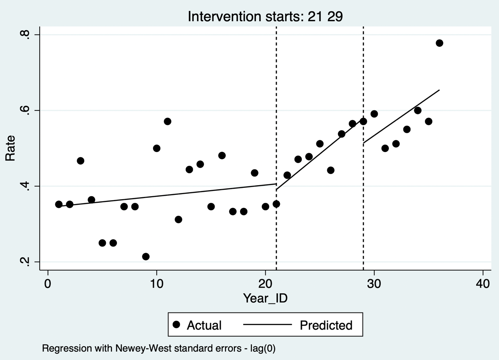

# Interrupted Time-Series Analysis

Interrupted time-series (ITS) analysis evaluates whether an intervention, policy, or external event changes an outcome measured repeatedly over time. It is particularly useful when randomization is infeasible but there are many observations before and after a clearly dated interruption.

## Simple interrupted time series

For one series, segmented regression estimates baseline level, pre-interruption trend, immediate level change, and post-interruption trend change:

$$Y_t=\beta_0+\beta_1t+\beta_2I_t+\beta_3(t\times I_t)+\epsilon_t,$$

where $t$ is time and $I_t$ indicates the post-intervention period. $\beta_2$ is the immediate level change and $\beta_3$ is the change in slope. A causal interpretation requires that no other change at the interruption plausibly explains the discontinuity or trend change.

::: {.callout-note appearance="simple" icon="false" title="Code 13.1"}
```stata
gen time_after = time - intervention_time
gen post = time >= intervention_time
reg outcome c.time i.post c.time_after#i.post
```
:::

::: {.text-center}
{width="100%"}

Code 13.1 output: segmented-regression time-series plot.
:::

## Interrupted time series with multiple time points

ITS needs sufficient observations before and after interruption to distinguish a background trend from a policy effect. Inspect seasonality, autocorrelation, changing variance, delayed or gradual intervention effects, and data-collection changes. Use autocorrelation-consistent standard errors, generalized least squares, or ARIMA-type models when residual correlation is present. Model seasonal terms or seasonal differencing where clinically and operationally justified.

::: {.callout-note appearance="simple" icon="false" title="Code 13.2"}
```stata
newey outcome c.time i.post c.time_after#i.post, lag(1)
```
:::

::: {.text-center}
{width="100%"}

Code 13.2 output: autocorrelation-aware interrupted time series.
:::

## Controlled interrupted time series with multiple groups

Adding a comparison series strengthens inference when it shares the intervention group’s underlying trend and measurement system but is not affected by the intervention. The key estimand is the difference between changes in the intervention and comparison series—an ITS analogue of difference-in-differences. Model group, time, post-intervention period, and their interactions; inspect whether pre-interruption trends are sufficiently parallel and whether the comparison could have been indirectly affected.

::: {.callout-note appearance="simple" icon="false" title="Code 13.3"}
```stata
reg outcome i.group##(c.time i.post c.time_after), vce(robust)
```
:::

::: {.text-center}
{width="100%"}

Code 13.3 output: controlled interrupted time series.
:::

## Considerations for interrupted time-series analysis

- Predefine the interruption date, expected mechanism, lag, and effect shape.
- Use enough evenly spaced observations on both sides; a few monthly points rarely support a reliable trend estimate.
- Check data definitions, coding systems, case ascertainment, denominators, seasonality, autocorrelation, and outliers.
- Investigate concurrent policies, epidemics, staffing changes, and other events that could create a coincident discontinuity.
- Present raw data, fitted segments, uncertainty intervals, residual diagnostics, and sensitivity analyses for time windows, autocorrelation structure, seasonal terms, and placebo interruptions.
- State that ITS estimates an association with the interruption unless its causal assumptions are justified.

## References {.unnumbered}

1. Bernal JL, Cummins S, Gasparrini A. Interrupted time series regression for evaluation of public health interventions. *International Journal of Epidemiology*. 2017;46:348-355.
2. Wagner AK, Soumerai SB, Zhang F, Ross-Degnan D. Segmented regression analysis of interrupted time series studies. *Journal of Clinical Pharmacy and Therapeutics*. 2002;27:299-309.
3. Penfold RB, Zhang F. Use of interrupted time series analysis in evaluating health care quality improvements. *Academic Pediatrics*. 2013;13:S38-S44.
