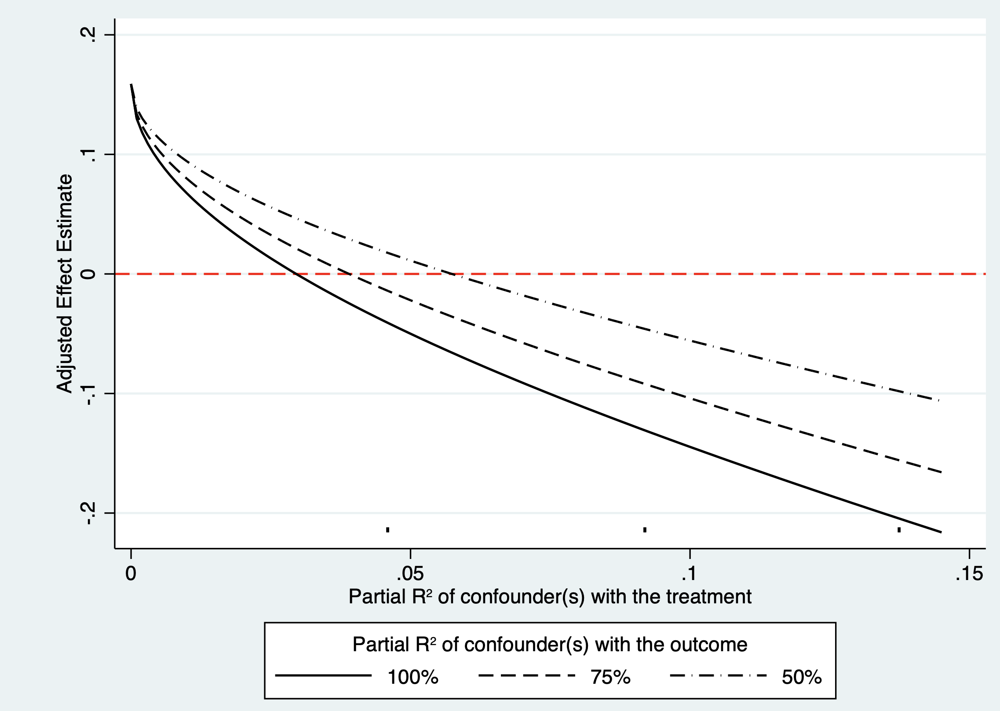

# Sensitivity Analysis for Observational Research

Sensitivity analysis asks whether a causal conclusion changes under reasonable alternative definitions, data sources, models, and assumptions. It does not rescue a fundamentally flawed design, but makes dependence on analytic choices and unmeasured confounding transparent.

## Sensitivity analysis in observational research

### Defining intervention

Repeat analysis using clinically defensible alternative definitions of exposure: dose, duration, initiation date, grace period, treatment strategy, or adherence. Avoid definitions that use information after treatment assignment, create immortal time, or selectively exclude early events.

### Defining outcome

Use validated outcome algorithms where possible; compare narrow and broad definitions, alternative ascertainment sources, and clinically meaningful follow-up windows. Report how misclassification could differ between exposure groups.

### Data source

Replicate analyses in data sources with different capture mechanisms, populations, and coding systems when feasible. Agreement across independent sources strengthens robustness but does not establish absence of shared bias.

### Defining covariates

Vary plausible measurement windows, coding choices, transformations, and adjustment sets based on a causal graph. Do not select specifications solely because they produce a desired p value. Separate true confounders from mediators and colliders.

### Analysis method

Compare appropriate methods—outcome regression, standardization, matching, inverse-probability weighting, and doubly robust estimators—and report diagnostics for positivity, covariate balance, weights, model fit, missing data, and censoring. Different methods share many assumptions; agreement is supportive, not proof.

## Unmeasured confounding

### Bounding factor: the E-value

The E-value summarizes the minimum strength of association, on the risk-ratio scale, that an unmeasured confounder would need with both exposure and outcome to explain a measured association away. For a risk ratio $RR\ge1$:

$$E\text{-value}=RR+\sqrt{RR(RR-1)}.$$

Apply the analogous reciprocal transformation for protective associations and calculate an E-value for the confidence-limit closest to the null. The E-value is not evidence that no confounder exists and is not valid without careful consideration of effect scale, outcome frequency, and measured confounding.

::: {.text-center}
{width="100%"}

Figure 14.1 Interpreting an E-value.
:::

### Confounding-function approach

Specify a function describing how unmeasured confounding differs between treatment groups and changes outcome risk, then re-estimate effects over a plausible range. This makes assumptions explicit and is often more clinically interpretable than a single summary value.

### Percentage of confounding

Express how much of the observed association would need to be removed by an unmeasured confounder for the conclusion to reach the null or a clinically unimportant threshold. State the target threshold and justify the assumed confounder strength.

::: {.text-center}
{width="100%"}

Figure 14.2 Quantitative bias-analysis framework.
:::

## Negative-control methods

Negative controls are exposures, periods, or outcomes for which no causal effect is expected. An observed association can reveal residual confounding, selection bias, or measurement bias, although a null result does not prove their absence.

### Negative exposure

Choose an exposure that shares confounding structure with the study exposure but cannot plausibly cause the outcome.

### Negative period

Analyze a period before treatment could have affected outcome. An apparent effect in that period suggests bias, reverse causation, or a design problem.

### Negative outcome

Choose an outcome that should not be affected by treatment but may share confounding and measurement processes. Report the causal rationale for every negative control and avoid post hoc selection.

## References {.unnumbered}

1. Lash TL, Fox MP, Fink AK. *Applying Quantitative Bias Analysis to Epidemiologic Data*. Springer; 2009.
2. VanderWeele TJ, Ding P. Sensitivity analysis in observational research: introducing the E-value. *Annals of Internal Medicine*. 2017;167:268-274.
3. Lipsitch M, Tchetgen Tchetgen E, Cohen T. Negative controls. *Epidemiology*. 2010;21:383-388.
4. Hernán MA, Robins JM. *Causal Inference: What If*. Chapman & Hall/CRC; 2020.
