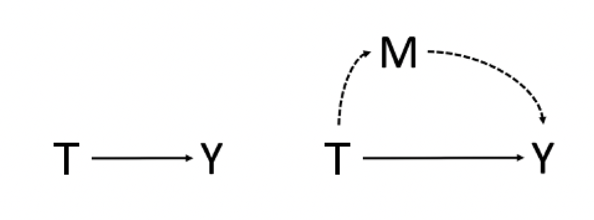
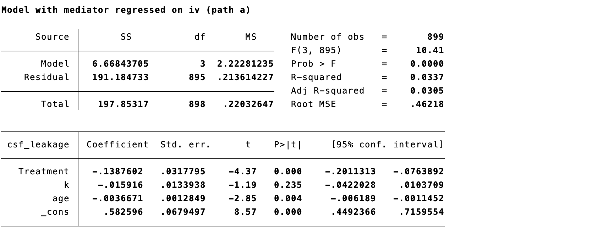
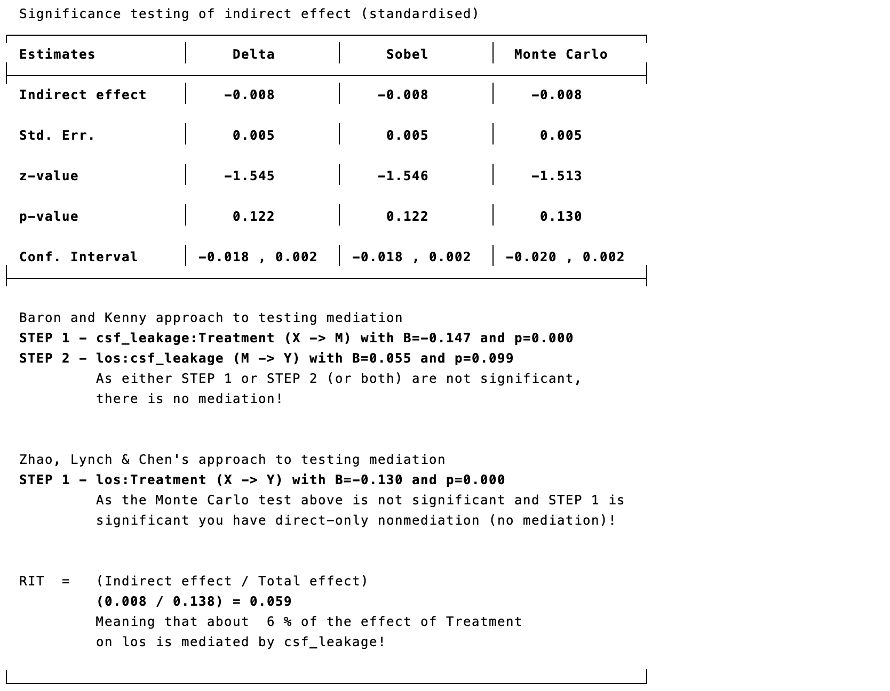
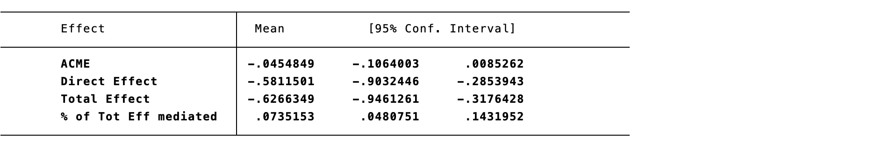

# Causal Mediation Analysis

Mediation analysis examines how an exposure $T$ affects outcome $Y$ through mediator $M$. It differs from simply adjusting for a post-treatment variable: causal mediation defines direct and indirect effects using counterfactual outcomes and requires assumptions that are typically stronger than those for the total treatment effect.

## Traditional mediation analysis

The traditional approach fits a model for $M$ given $T$ and covariates, then a model for $Y$ given $T$, $M$, and covariates. In linear models without interaction, the product of the treatment-to-mediator and mediator-to-outcome coefficients is often called the indirect effect. This decomposition is generally not valid without further causal assumptions, especially for nonlinear models, exposure–mediator interaction, or mediator–outcome confounding affected by exposure.

::: {.text-center}
{width="100%"}

Figure 15.1 Exposure, mediator, outcome, and confounding.
:::

## Causal definitions of mediation effects

Let $Y(t,m)$ be the outcome if exposure were set to $t$ and mediator to $m$, and $M(t)$ the mediator under exposure $t$. The total effect is $E[Y(1,M(1))-Y(0,M(0))]$. Natural direct and indirect effects compare cross-world potential outcomes:

$$NDE=E[Y(1,M(0))-Y(0,M(0)],\qquad NIE=E[Y(1,M(1))-Y(1,M(0)].$$

Their sum equals the total effect on an additive scale. Interventional direct and indirect effects offer alternatives that avoid some cross-world interpretation by drawing mediators from intervention-specific distributions.

## Statistical assumptions

Identification generally requires: no unmeasured exposure–outcome confounding; no unmeasured exposure–mediator confounding; no unmeasured mediator–outcome confounding after adjusting for exposure and baseline covariates; correct model specification/positivity; and no mediator–outcome confounder affected by exposure, unless a method designed for such confounding is used. These assumptions are not guaranteed by randomizing exposure alone. Draw a DAG, prespecify covariates, and conduct sensitivity analysis for mediator–outcome confounding.

## Estimating mediation effects

### Stepwise regression

Fit mediator and outcome regressions, then calculate direct and indirect components. This is simple but should be interpreted causally only when identification assumptions and relevant scale conditions hold.

::: {.callout-note appearance="simple" icon="false" title="Code 15.1: stepwise regression"}
```stata
reg mediator treatment covariates
reg outcome treatment mediator covariates
```
:::

::: {.text-center}
{width="100%"}

Code 15.1 output.
:::

### Structural equation modeling

SEM estimates mediator and outcome pathways jointly and can accommodate multiple mediators and latent variables, but does not remove causal assumptions.

::: {.callout-note appearance="simple" icon="false" title="Code 15.2: structural equation model"}
```stata
sem (mediator <- treatment covariates) (outcome <- treatment mediator covariates)
```
:::

::: {.text-center}
{width="100%"}
{width="100%"}

Code 15.2 output.
:::

### `ldecomp`, KHB, `paramed`, and `medeff`

These commands implement decompositions for particular outcome models and estimands. `ldecomp` uses logistic decomposition; KHB compares nested nonlinear models while addressing rescaling; `paramed` estimates natural direct and indirect effects for binary or continuous outcomes; and `medeff` uses simulation-based mediation estimates. Each requires clear statement of effect scale, exposure contrast, mediator intervention, covariate set, interaction terms, and bootstrap or robust uncertainty method.

::: {.callout-note appearance="simple" icon="false" title="Code 15.3–15.7"}
```stata
ldecomp outcome treatment, med(mediator) cov(covariates)
khb logit outcome treatment || mediator, concomitant(covariates)
paramed outcome, avar(treatment) mvar(mediator) cvar(covariates)
medeff (regress mediator treatment covariates) (logit outcome treatment mediator covariates)
```
:::

::: {.text-center}
{width="100%"}
{width="100%"}
{width="100%"}
{width="100%"}
{width="100%"}
{width="100%"}
{width="100%"}

Code 15.3–15.7 output: mediation decompositions.
:::

## Recommendations for reporting mediation analyses

- State the causal question, exposure contrast, mediator, outcome, population, follow-up, and estimand (total, direct, indirect, or interventional effect).
- Provide a DAG and justify confounder adjustment; distinguish baseline confounders from exposure-induced mediator–outcome confounders.
- Report model forms, interactions, missing-data/censoring handling, positivity diagnostics, estimation method, uncertainty intervals, and sensitivity analyses.
- Give total, direct, and indirect effects on clinically interpretable absolute and relative scales; do not report “percentage mediated” alone when the total effect is near zero or signs/scales differ.
- State the limits of causal interpretation and external generalizability.

## Limitations

Mediation results are highly sensitive to unmeasured mediator–outcome confounding, measurement error in mediators, temporal ambiguity, interference, post-treatment confounding, and model misspecification. Natural effects involve cross-world counterfactuals and may not correspond to a feasible intervention on the mediator. A mediating pathway can be biologically plausible without being identified by observational data. Use mediation analysis to complement, not replace, trials and mechanistic research.

## References {.unnumbered}

1. Pearl J. Direct and indirect effects. *Proceedings of the Seventeenth Conference on Uncertainty in Artificial Intelligence*. 2001.
2. Robins JM, Greenland S. Identifiability and exchangeability for direct and indirect effects. *Epidemiology*. 1992;3:143-155.
3. VanderWeele TJ. *Explanation in Causal Inference*. Oxford University Press; 2015.
4. Imai K, Keele L, Tingley D. A general approach to causal mediation analysis. *Psychological Methods*. 2010;15:309-334.
5. Valeri L, VanderWeele TJ. Mediation analysis allowing exposure–mediator interactions. *Psychological Methods*. 2013;18:137-150.
