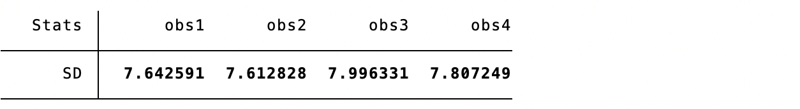
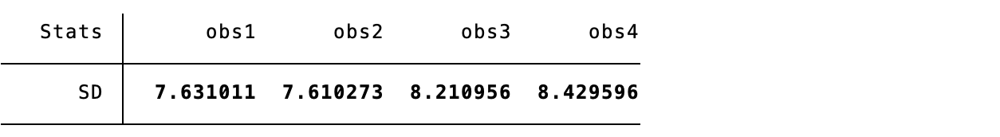
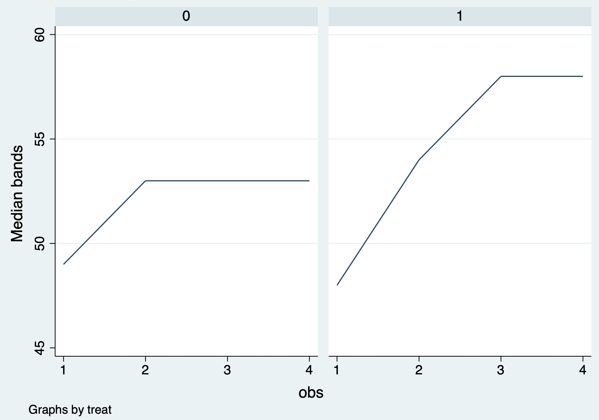
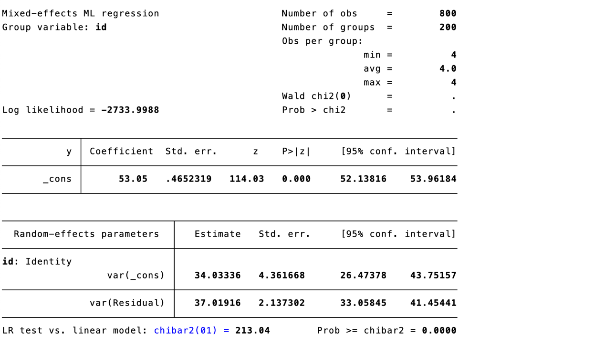
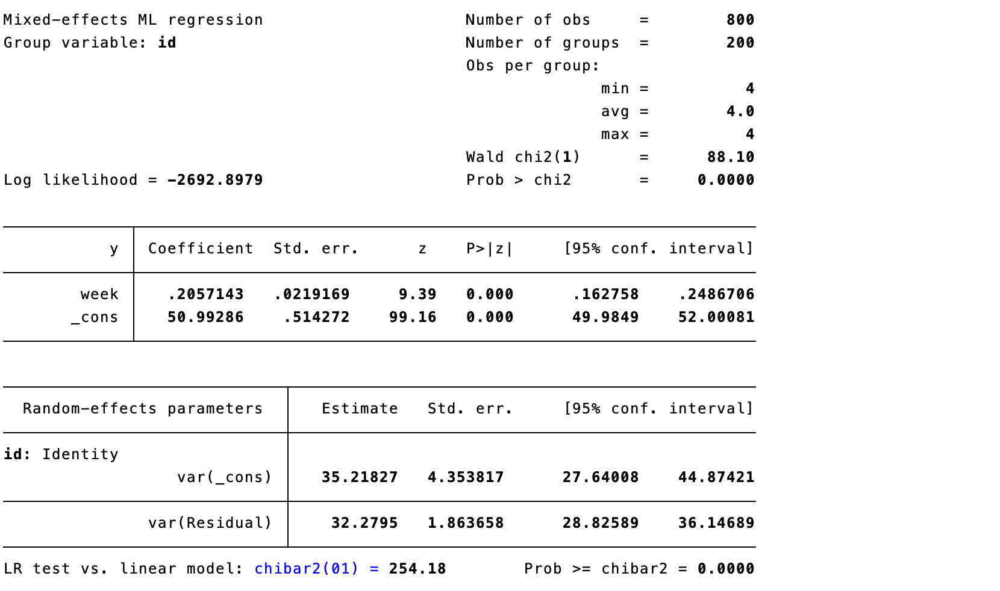
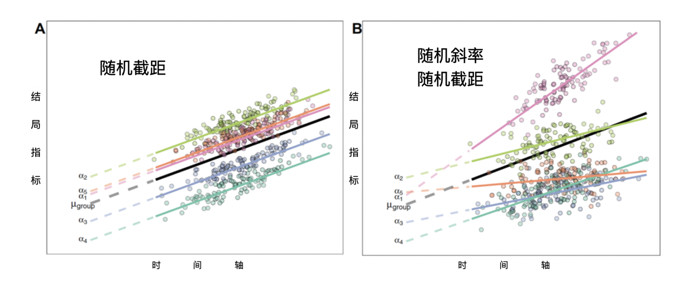
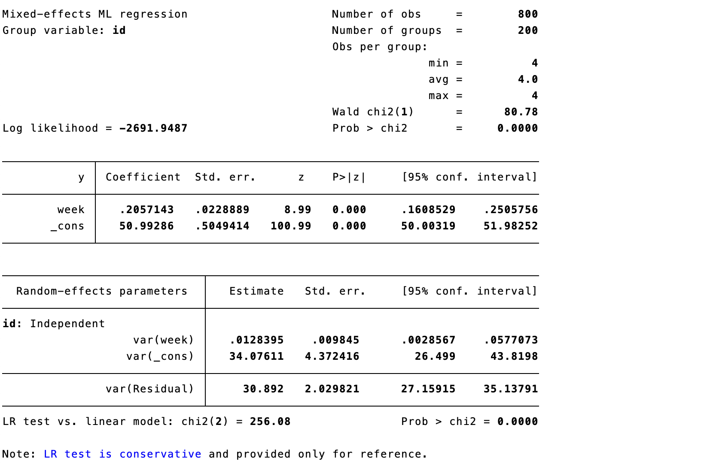
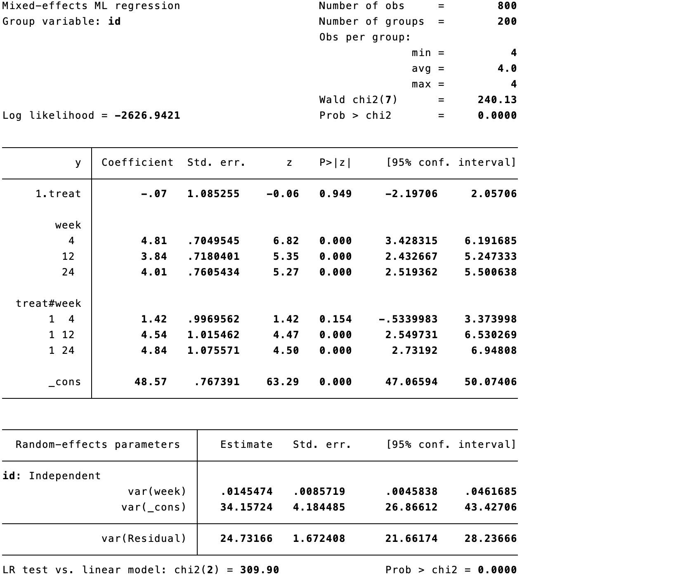
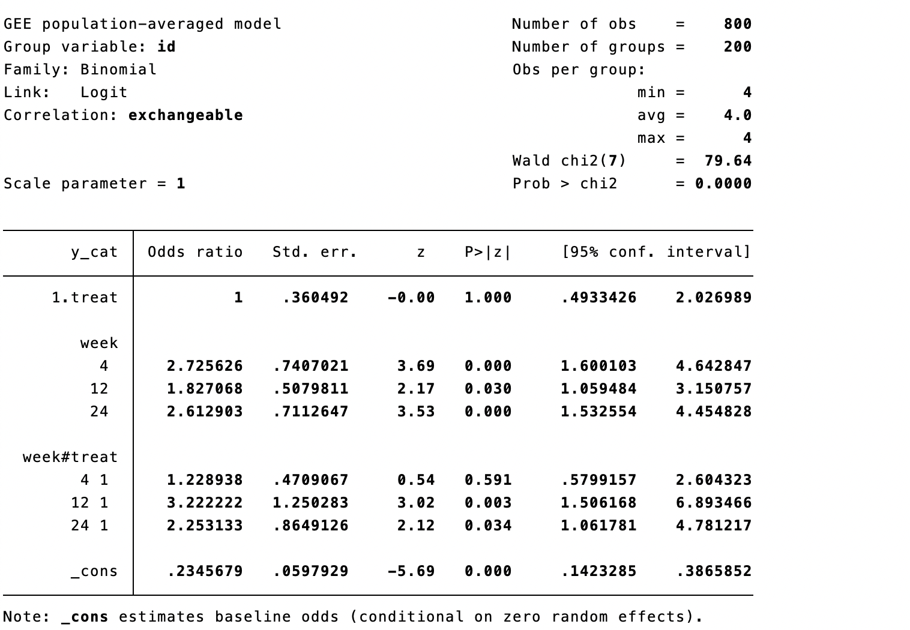

# Statistical Analysis of Repeated-Measures Data

Repeated-measures studies record outcomes from the same participant at several times. Measurements within a person are correlated, so treating them as independent discards information or gives incorrect uncertainty. The analysis should define the treatment strategy, outcome, time scale, estimand, missing-data assumptions, and correlation structure before modeling.

## Traditional methods

### Simple regression

Analyzing each visit separately with ordinary regression is simple but ignores within-person correlation and creates multiple-testing problems. It can be useful for descriptive displays, not as the principal longitudinal analysis without appropriate adjustment.

### Analysis of covariance

ANCOVA compares follow-up outcome between groups after adjusting for baseline outcome and baseline covariates. For a single primary follow-up it is often efficient, but it does not use all repeated measurements and needs a separate plan for missing follow-up.

### Change-from-baseline analysis

Comparing changes from baseline is intuitive but is often less efficient than ANCOVA and can be biased when baseline measurement error or missingness is important. Report baseline and follow-up values alongside changes.

## Mixed-effects models

Mixed models combine fixed effects (population-average mean patterns) and random effects (participant-specific departures). They naturally accommodate unequal numbers and timings of measurements under an appropriate missing-at-random model. A random intercept allows baseline level to vary; a random slope also allows individual trajectories to vary.

**Case 16.1.** Repeated outcomes are measured in control and intervention groups. Begin with group-specific descriptive statistics and mean trajectories.

::: {.callout-note appearance="simple" icon="false" title="Code 16.1–16.3"}
```stata
tabstat outcome if treatment==0, by(visit) stat(mean sd n)
tabstat outcome if treatment==1, by(visit) stat(mean sd n)
twoway (connected mean visit if treatment==0) (connected mean visit if treatment==1)
```
:::

::: {.text-center}
{width="100%"}
{width="100%"}
{width="100%"}

Code 16.1–16.3 output: group summaries and mean-change curve.
:::

### Null model

The null random-intercept model partitions variance into between- and within-participant components and estimates the intraclass correlation (ICC).

::: {.callout-note appearance="simple" icon="false" title="Code 16.4"}
```stata
mixed outcome || id:
est store null
```
:::

::: {.text-center}
{width="100%"}

Code 16.4 output: null model.
:::

### Time-only mixed models

Fit time as a categorical or continuous fixed effect, first with a random intercept and then with random intercept and slope. Compare fit, convergence, plausibility, and residual diagnostics; a more complex random-effects structure is not automatically better.

::: {.callout-note appearance="simple" icon="false" title="Code 16.5–16.6"}
```stata
mixed outcome i.visit || id:
est store ri
mixed outcome c.time || id: c.time, covariance(unstructured)
est store ris
```
:::

::: {.text-center}
{width="100%"}
{width="100%"}
{width="100%"}

Code 16.5–16.6 output: random-intercept and random-slope models.
:::

### Treatment-by-time model

The usual longitudinal treatment question is whether trajectories differ by treatment. Include treatment, time, and their interaction. With categorical time, each interaction is a visit-specific adjusted difference; with continuous time, it is a difference in rate of change. Derive marginal means and clinically interpretable contrasts with confidence intervals.

::: {.callout-note appearance="simple" icon="false" title="Code 16.7–16.9"}
```stata
mixed outcome i.treatment##i.visit baseline || id:
est store txvisit
mixed outcome i.treatment##c.time baseline || id: c.time
lrtest ri ris
```
:::

::: {.text-center}
{width="100%"}
{width="100%"}
{width="100%"}

Code 16.7–16.9 output: treatment-by-time model and model comparison.
:::

### Residual covariance structure

Residual correlation can be independent, exchangeable/compound symmetric, autoregressive, unstructured, or other plausible structures. Choose according to visit spacing, design, fit, diagnostics, and interpretability—not by significance alone. Report the structure and sensitivity to alternatives.

::: {.callout-note appearance="simple" icon="false" title="Code 16.10"}
```stata
mixed outcome i.treatment##i.visit baseline || id:, residuals(ar 1, t(visit))
```
:::

::: {.text-center}
{width="100%"}

Code 16.10 output: residual covariance structure.
:::

## Generalized estimating equations

GEE estimates population-average associations with robust standard errors, accounting for correlation through a working correlation structure. It is useful when population-average effects are desired, but missingness assumptions and small-cluster inference require care. For binary outcomes use a logit or log link as appropriate.

::: {.callout-note appearance="simple" icon="false" title="Code 16.11–16.12"}
```stata
xtgee outcome i.treatment##i.visit baseline, family(gaussian) link(identity) corr(exchangeable) vce(robust)
xtgee binary_outcome i.treatment##i.visit baseline, family(binomial) link(logit) corr(exchangeable) vce(robust)
```
:::

::: {.text-center}
{width="100%"}
{width="100%"}

Code 16.11–16.12 output: GEE for continuous and binary outcomes.
:::

## Latent-class models

Latent-class or growth-mixture models identify unobserved trajectory groups. They can be useful descriptively and for hypothesis generation, but class number, class labels, and membership are model dependent; post hoc class-specific treatment claims can be biased. Validate classes, report uncertainty, and avoid treating estimated class as an error-free baseline characteristic.

::: {.text-center}
{width="100%"}

Figure 16.1 Latent trajectory classes.
:::

## References {.unnumbered}

1. Verbeke G, Molenberghs G. *Linear Mixed Models for Longitudinal Data*. Springer; 2000.
2. Fitzmaurice GM, Laird NM, Ware JH. *Applied Longitudinal Analysis*. 2nd ed. Wiley; 2011.
3. Liang KY, Zeger SL. Longitudinal data analysis using generalized linear models. *Biometrika*. 1986;73:13-22.
4. Mallinckrodt CH, Lane PW, Schnell D, et al. Recommendations for mixed-model repeated measures in RCTs. *Pharmaceutical Statistics*. 2008;7:109-124.
