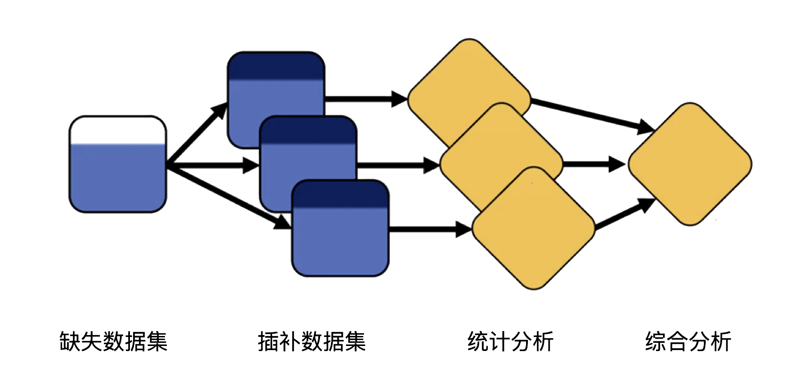
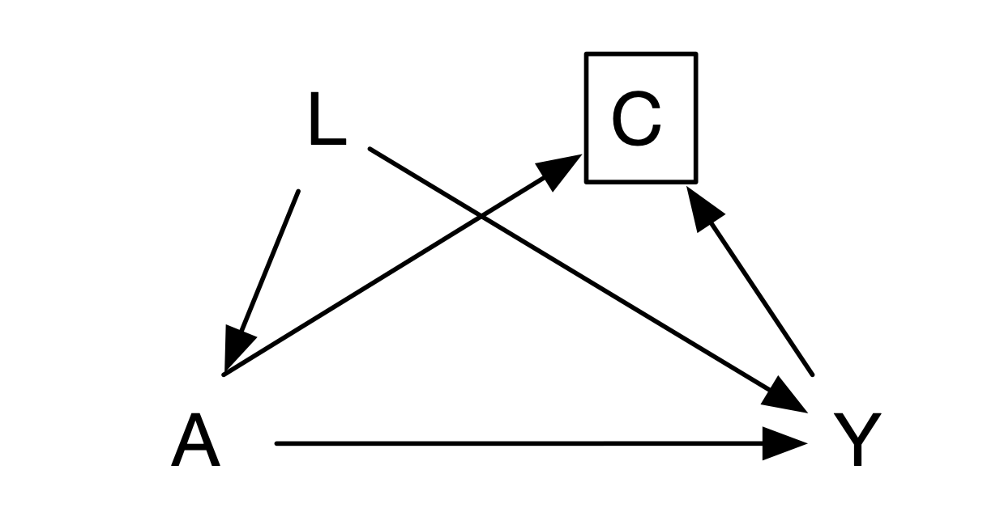

# Missing Data

Missing data are common in clinical research and can bias estimates, reduce precision, and change the target population. The right response begins by describing why, when, and for whom data are missing—not by applying a mechanical imputation command.

## Mechanisms of missingness

### Missing completely at random

Data are MCAR when missingness is independent of observed and unobserved values. Complete-case analysis is unbiased under MCAR but usually inefficient; MCAR is often implausible.

### Missing at random

Data are MAR when, conditional on observed variables included in the analysis/imputation model, missingness no longer depends on the unobserved value. Mixed models, inverse-probability weighting, and multiple imputation often rely on MAR. MAR is an assumption, not a result of a test.

### Missing not at random

Data are MNAR when missingness depends on the unobserved value even after conditioning on observed data—for example, people with worsening symptoms are more likely to miss follow-up. MNAR cannot be resolved from observed data alone; use clinically informed sensitivity analyses such as delta adjustment, pattern-mixture, or selection models.

## Traditional methods

### Deleting incomplete cases

Complete-case analysis is simple but can be biased and inefficient. It is reasonable only when its assumptions are made explicit and sensitivity analyses are presented.

### Single imputation

Replacing missing values with a mean, last observation carried forward, or a fixed value understates uncertainty and can distort associations. Such methods should not generally be a primary analysis.

### Multiple imputation

Multiple imputation creates several plausible completed datasets, analyzes each, and combines estimates using Rubin’s rules. Include outcome, exposure, important confounders, predictors of missingness, and compatible auxiliary variables; impute within design/analysis groups where appropriate. Use enough imputations for the fraction of missing information and diagnose convergence and plausibility. MI supports MAR, not MNAR.

## Adherence and intercurrent events

### Intercurrent events and rescue medication

Treatment discontinuation, switching, rescue medication, death, and other events after assignment require an estimand strategy: treatment policy, hypothetical, composite, while-on-treatment, or principal stratum. The protocol must specify how data after each event contribute to the primary analysis.

### Bias from loss to follow-up

Loss to follow-up is selection bias when both treatment and potential outcome affect observation. Compare observed baseline predictors, outcome history, and follow-up by treatment; identify the causal structure and define the population to which the estimate applies.

### Inverse-probability-of-censoring weighting

Model each participant’s probability of remaining observed conditional on treatment and past covariates, then weight observed records by its inverse. Correct specification, positivity, and measurement of predictors of censoring are essential; stabilized weights and diagnostics for extreme weights should be reported.

::: {.callout-note appearance="simple" icon="false" title="Code 17.1"}
```stata
logit observed treatment baseline_covariates time_varying_covariates
predict p_observed
gen ipcw = 1/p_observed if observed
svyset _n [pweight=ipcw]
svy: regress outcome treatment baseline_covariates
```
:::

::: {.text-center}
{width="100%"}

Code 17.1 output: inverse-probability-of-censoring weighting.
:::

::: {.callout-note appearance="simple" icon="false" title="Code 17.2"}
```stata
tebalance summarize
```
:::

::: {.text-center}
{width="100%"}

Code 17.2 output: weighted covariate summary.
:::

## Survivor bias and time zero

Define a common time zero at which eligibility, treatment strategies, and follow-up begin. Assigning exposure using future information or including only people who survive long enough to receive treatment creates immortal-time or survivor bias. Emulate the target trial: make eligibility and treatment assignment measurable at time zero, align follow-up, and use appropriate methods for adherence and censoring.

## References {.unnumbered}

1. Little RJA, Rubin DB. *Statistical Analysis with Missing Data*. 3rd ed. Wiley; 2019.
2. Sterne JAC, White IR, Carlin JB, et al. Multiple imputation for missing data. *BMJ*. 2009;338:b2393.
3. National Research Council. *The Prevention and Treatment of Missing Data in Clinical Trials*. National Academies Press; 2010.
4. Hernán MA, Robins JM. *Causal Inference: What If*. Chapman & Hall/CRC; 2020.
