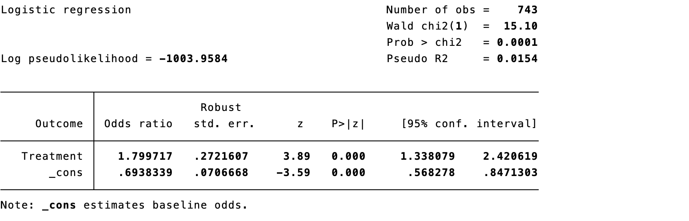
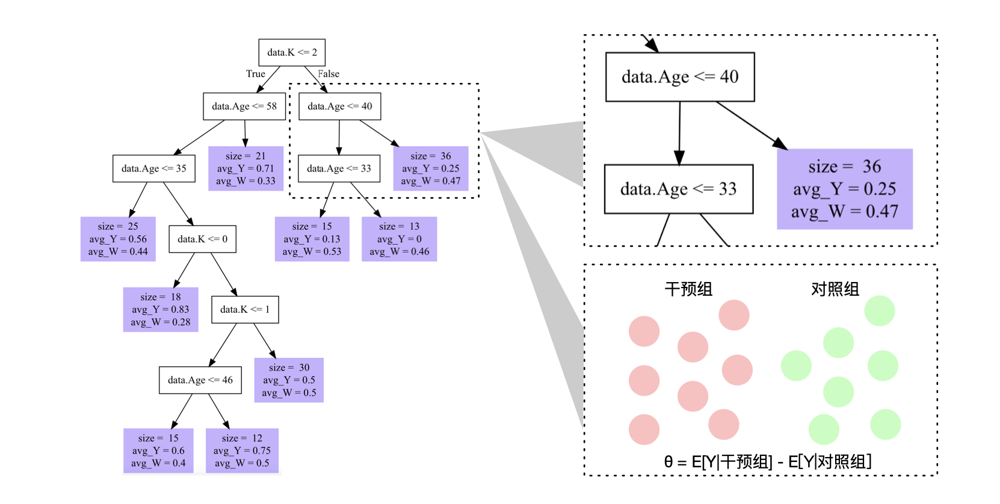

# Integrating Causal Inference and Machine Learning

Machine learning can flexibly estimate nuisance functions—propensity scores, outcome regressions, censoring models, and treatment-effect heterogeneity. It does not itself turn association into causation. The causal question, target trial, estimand, temporal ordering, confounding assumptions, positivity, and measurement quality must be specified before fitting a flexible model.

## Machine learning for propensity-score estimation

LASSO, trees, boosting, random forests, and ensembles can model complex treatment assignment. Select models using post-estimation balance and overlap, not treatment-prediction accuracy alone. Include pretreatment covariates and avoid mediators/colliders.

::: {.callout-note appearance="simple" icon="false" title="Code 18.1–18.2"}
```stata
lasso logit treatment covariates
predict ps, pr
gen ipw = treatment/ps + (1-treatment)/(1-ps)
logit outcome treatment [pweight=ipw], vce(robust)
```
:::

::: {.text-center}
{width="100%"}
{width="100%"}

Code 18.1–18.2 output: LASSO propensity score and inverse-probability weighting.
:::

## Doubly robust estimators

Augmented inverse-probability weighting (AIPW) combines an outcome model with a propensity model. Under regularity conditions it is consistent when either, but not necessarily both, nuisance model is correctly specified. “Doubly robust” does not mean robust to unmeasured confounding, lack of overlap, wrong time ordering, or poor measurement.

For treatment $A$, outcome $Y$, propensity $e(X)$, and outcome regression $m_a(X)=E(Y\mid A=a,X)$, an AIPW mean is

$$\widehat\mu_a=\frac1n\sum_i\left[\widehat m_a(X_i)+\frac{I(A_i=a)}{\widehat P(A_i=a\mid X_i)}\{Y_i-\widehat m_a(X_i)\}\right].$$

::: {.callout-note appearance="simple" icon="false" title="Code 18.3–18.5"}
```stata
* estimate treatment and control risks with augmented IPW
teffects aipw (outcome covariates) (treatment covariates, logit), ate
```
:::

::: {.text-center}
{width="100%"}
{width="100%"}
{width="100%"}

Code 18.3–18.5 output: doubly robust risks and AIPW estimate.
:::

## Cross-fitting in causal inference

Complex algorithms can overfit the same data used to estimate a treatment effect. Sample splitting fits nuisance functions in one fold and evaluates the causal score in another; cross-fitting repeats this across folds and pools estimates. It reduces overfitting bias while retaining most data. Folds must respect participant clustering and time order when relevant.

::: {.callout-note appearance="simple" icon="false" title="Code 18.6–18.9"}
```stata
gen fold = mod(_n,2)
* fit nuisance models in fold 0 and predict fold 1; reverse folds
* combine cross-fitted AIPW scores
```
:::

::: {.text-center}
{width="100%"}
{width="100%"}
{width="100%"}
{width="100%"}

Code 18.6–18.9 output: sample splitting and cross-fitting.
:::

## Causal forests

Causal forests adapt tree ensembles to estimate conditional average treatment effects (CATEs). Honest splitting separates data used to choose partitions from data used to estimate effects, reducing adaptive bias. A CATE is still conditional on untestable causal assumptions; uncertainty is often large, and using estimated individual effects directly for treatment decisions requires external validation.

::: {.callout-note appearance="simple" icon="false" title="Code 18.10–18.12"}
```r
cf <- causal_forest(X, Y, W)
tau_hat <- predict(cf)$predictions
best_tree <- best_linear_projection(cf, X)
```
:::

::: {.text-center}
{width="100%"}
{width="100%"}
{width="100%"}

Code 18.10–18.12 output: causal forest, policy predictions, and causal tree.
:::

## Limitations of machine learning in causal inference

Machine learning can increase variance, produce unstable weights, obscure extrapolation, and make models difficult to audit. Flexible prediction does not compensate for unmeasured confounding, positivity violations, selection bias, interference, outcome misclassification, or a poorly defined intervention. Evaluate balance, effective sample size, calibration, overlap, residual confounding, and sensitivity to algorithms and tuning.

## Thinking causally in machine learning

### Prediction and causation are different

Prediction asks what will happen given available features; causation asks what would change under a specified intervention. A feature can be highly predictive yet inappropriate to adjust for because it is downstream of treatment or a collider.

### Estimands and actionability

Define whether the goal is ATE, ATT, CATE, a dynamic regime, or policy value—and whether the intervention is feasible. A model that predicts risk well may not identify an actionable treatment target.

### Variable roles and time ordering

Use causal diagrams and timestamps to distinguish baseline confounders, treatment, mediators, colliders, outcomes, and post-treatment covariates. Prevent label leakage and use only information available at the decision time.

### Appropriate roles for ML

Use ML for nuisance estimation, missing-data/censoring models, dimension reduction, outcome prediction, and carefully validated heterogeneity exploration. Pair it with semiparametric estimators, cross-fitting, diagnostics, and clear causal assumptions.

### Heterogeneity, drift, fairness, and clinical evaluation

Evaluate treatment-effect heterogeneity and decision policies prospectively or with rigorous off-policy evaluation. Assess data drift, selection bias, subgroup performance, fairness, calibration, transparency, reproducibility, and clinical utility. No algorithm should be adopted solely because a retrospective performance metric is high.

## References {.unnumbered}

1. van der Laan MJ, Rose S. *Targeted Learning*. Springer; 2011.
2. Chernozhukov V, Chetverikov D, Demirer M, et al. Double/debiased machine learning. *Econometrics Journal*. 2018;21:C1-C68.
3. Wager S, Athey S. Estimation and inference of heterogeneous treatment effects using random forests. *JASA*. 2018;113:1228-1242.
4. Kennedy EH. Optimal doubly robust estimation of heterogeneous causal effects. *arXiv*. 2020.
