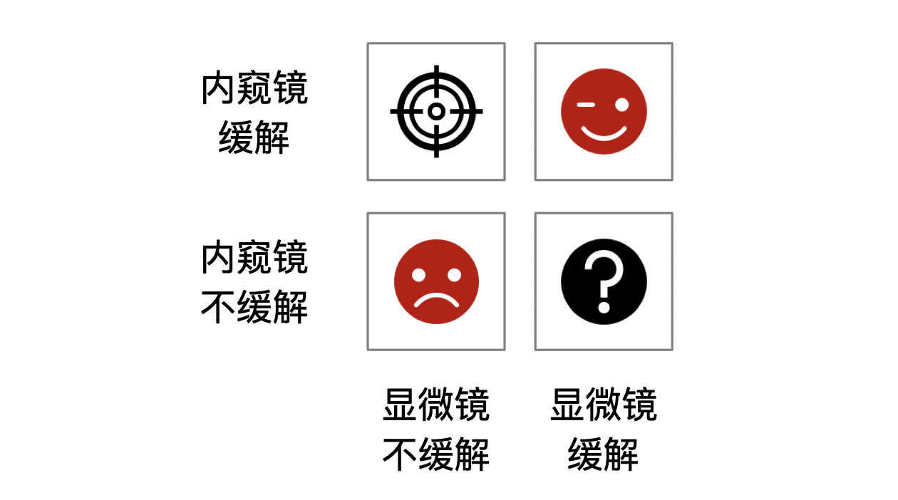
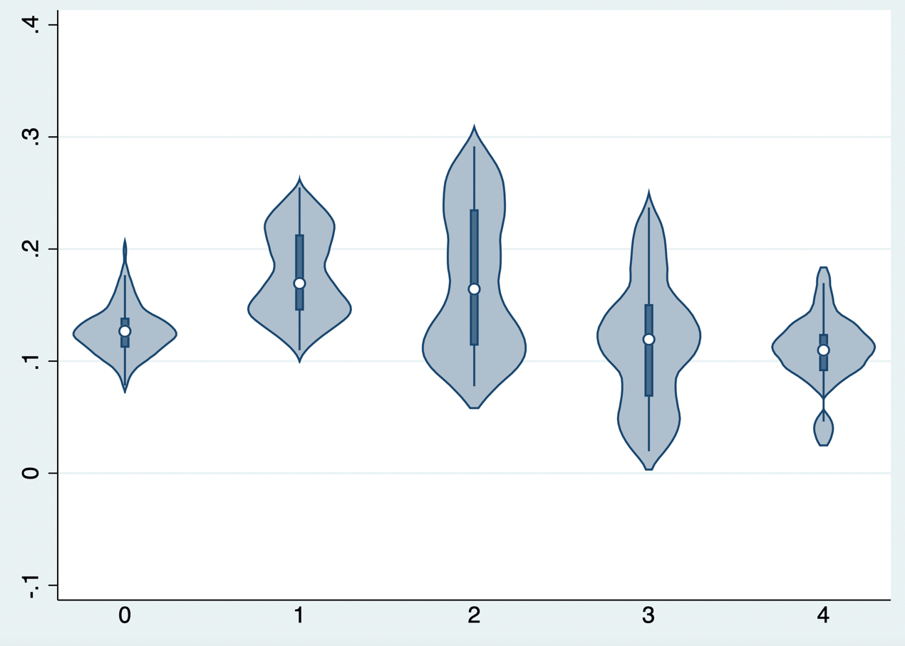

# Heterogeneity and Individual Causal Effects

Average treatment effects can conceal clinically important heterogeneity. The goal is not to claim that every patient has a reliably estimated individual effect, but to identify reproducible variation in conditional average treatment effects and determine whether it improves decisions.

## Subgroup analysis

Subgroups should be prespecified, biologically/clinically plausible, and assessed with interaction tests rather than separate within-subgroup p values. Multiple testing, limited power, and post hoc search make apparent subgroup effects fragile. Present absolute and relative effects, uncertainty, and external validation.

## Risk modeling

Prognostic models estimate baseline risk under a reference strategy. Risk stratification may be clinically valuable even when relative treatment effect is constant, because the same relative effect produces larger absolute benefit at higher baseline risk. Evaluate calibration, discrimination, transportability, and clinical consequences.

## Treatment-effect and uplift modeling

Treatment-effect or uplift models estimate the contrast between predicted outcomes under treatment and control. Their target is a CATE, not response probability under treatment alone. Causal assumptions, overlap, and valid outcome measurement remain necessary.

### Regression-based learners

**S-learner** fits one model containing treatment and covariates, then predicts each person twice, once with treatment and once with control. It is efficient but may shrink treatment heterogeneity toward zero when treatment is weakly predictive.

::: {.callout-note appearance="simple" icon="false" title="Code 19.1–19.2: S-learner"}
```r
fit_s <- grf::regression_forest(cbind(X, treatment), outcome)
mu1 <- predict(fit_s, cbind(X, 1))$predictions
mu0 <- predict(fit_s, cbind(X, 0))$predictions
uplift_s <- mu1 - mu0
```
:::

::: {.text-center}
{width="100%"}
{width="100%"}

Code 19.1–19.2 output: S-learner predictions.
:::

**T-learner** fits separate outcome models in treated and control groups and subtracts predictions. It is flexible but can be unstable when one group is small.

::: {.callout-note appearance="simple" icon="false" title="Code 19.3: T-learner"}
```r
fit1 <- regression_forest(X[treatment==1,], outcome[treatment==1])
fit0 <- regression_forest(X[treatment==0,], outcome[treatment==0])
uplift_t <- predict(fit1, X)$predictions - predict(fit0, X)$predictions
```
:::

**X-learner** first estimates outcome models, constructs imputed treatment effects in each group, models those effects, and combines them using propensity-based weights. It can perform well with imbalance but increases modeling choices and must be cross-validated.

::: {.callout-note appearance="simple" icon="false" title="Code 19.5: X-learner"}
```r
# fit outcome models, impute pseudo-effects, model each pseudo-effect,
# and combine using the estimated propensity score
```
:::

::: {.text-center}
{width="100%"}
{width="100%"}

Code 19.3–19.5 output: T- and X-learner estimates.
:::

### Decision-tree-based uplift modeling

Uplift trees and causal forests search for splits that maximize differences in treatment effects rather than outcomes. Honest estimation and out-of-sample assessment are essential; trees can otherwise manufacture persuasive but non-replicable subgroups.

::: {.callout-note appearance="simple" icon="false" title="Code 19.7–19.8"}
```r
cf <- causal_forest(X, outcome, treatment)
tau <- predict(cf)$predictions
```
:::

::: {.text-center}
{width="100%"}
{width="100%"}

Code 19.7–19.8 output: tree-based uplift model.
:::

## Evaluating uplift models and clinical value

Evaluate calibration for treatment effects, overlap, subgroup balance, uncertainty, external validation, and policy value. Qini/uplift curves and policy-value curves may describe ranking performance, but should be estimated out of sample and accompanied by confidence intervals. Compare a model-guided treatment rule with treat-all, treat-none, and current practice; include treatment harms, costs, capacity, and equity. A high apparent CATE does not justify individualized care unless it improves validated decision outcomes.

::: {.callout-note appearance="simple" icon="false" title="Code 19.10"}
```r
# evaluate out-of-sample policy value for model-guided treatment,
# treat-all, and treat-none rules
```
:::

## References {.unnumbered}

1. Kent DM, Steyerberg E, van Klaveren D. Personalized evidence based medicine. *BMJ*. 2018;363:k4245.
2. Künzel SR, Sekhon JS, Bickel PJ, Yu B. Metalearners for estimating heterogeneous treatment effects. *PNAS*. 2019;116:4156-4165.
3. Wager S, Athey S. Heterogeneous treatment effects using random forests. *JASA*. 2018;113:1228-1242.
4. Powers S, Qian J, Jung K, et al. Some methods for heterogeneous treatment effect estimation. *Statistics in Medicine*. 2018;37:1767-1787.
