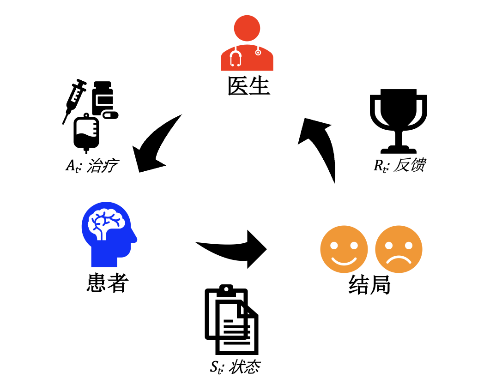
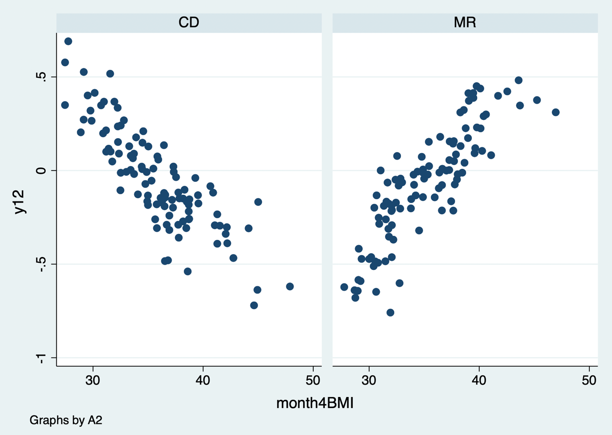
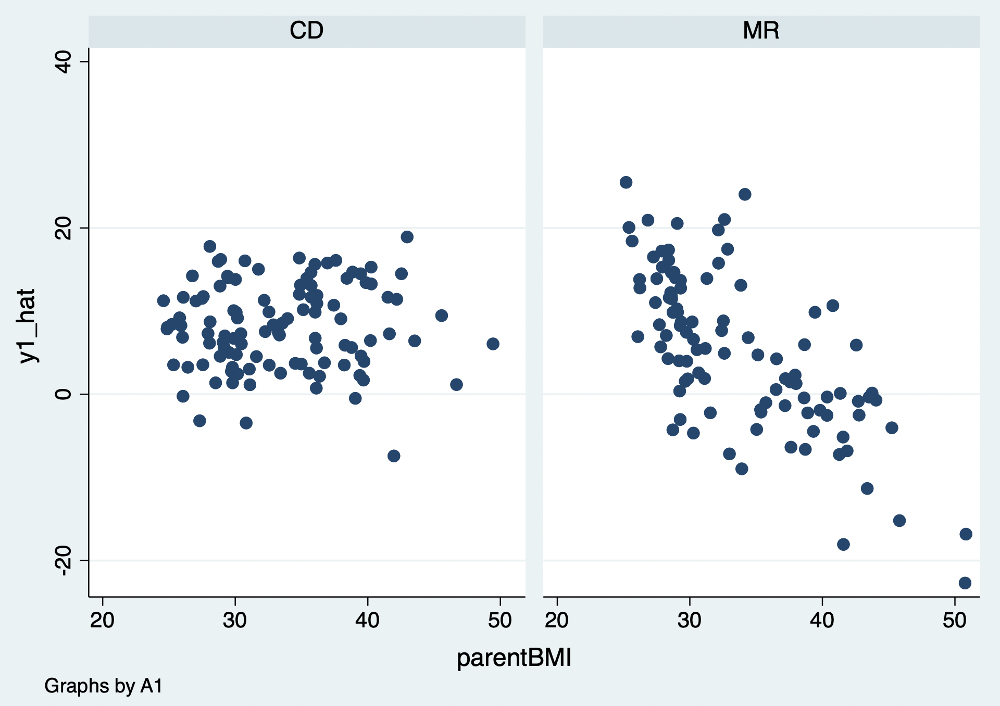

# Sequential Decision Strategies

Many clinical decisions are made repeatedly: treatment is started, monitored, intensified, switched, or stopped in response to evolving patient history. A dynamic treatment regime maps each possible history to a treatment decision. Estimating the value of such a regime requires causal methods for time-varying treatment and confounding, not a single baseline regression.

## Basic concepts of reinforcement learning

Reinforcement learning (RL) describes an agent interacting with an environment. A **state** summarizes information available at a decision time; an **action** is a treatment choice; a **reward** is a clinical utility; a **policy** maps state to action; and a **value** is expected cumulative reward under a policy. In health care, the reward and policy must be clinically meaningful and patient-centered, not merely easy to calculate.

::: {.text-center}
{width="3.45in"}

Figure 20.1 Basic reinforcement-learning framework.
:::

## Statistical reinforcement learning

Statistical RL estimates optimal or near-optimal dynamic regimes from trial or observational data using approaches such as Q-learning, A-learning, g-computation, marginal structural models, and dynamic weighted least squares.

**Case 20.1.** A patient’s treatment decisions occur at several visits. At each visit, past covariates and outcomes define state, treatment is selected, and later outcome contributes to the value. The data are arranged in long format: one row per person per decision time, with history, action, outcome/reward, and censoring information.

| ID | Decision time | State/history | Action | Subsequent outcome |
|:--|--:|:--|:--|:--|
| 1 | 1 | Baseline severity | Initial therapy | Early response |
| 1 | 2 | Severity + response | Continue/intensify | Final outcome |
| 2 | 1 | Baseline severity | Initial therapy | Early response |
| … | … | … | … | … |

Q-learning models expected future reward under each current action and works backward from the final decision. The estimated regime chooses the action with greater predicted value. All modeling choices, including feature set, reward, future treatment options, and handling of censoring, must be prespecified or evaluated out of sample.

::: {.callout-note appearance="simple" icon="false" title="Code 20.1–20.5"}
```r
# arrange person-period data and define reward
# fit final-stage Q function, derive optimal final action
# regress earlier reward plus optimal future value on earlier history/action
# derive the dynamic treatment rule and estimate its value
```
:::

::: {.text-center}
{width="100%"}
{width="100%"}
{width="100%"}
{width="100%"}
{width="100%"}

Code 20.1–20.5 output: sequential-decision modeling.
:::

## Time-varying treatment and confounding

A time-varying covariate can both predict future treatment and be affected by prior treatment. Conventional regression adjustment for such a variable can block part of the prior treatment effect or induce bias. Marginal structural models with inverse-probability treatment and censoring weights, longitudinal g-formula, and structural nested models are designed for this setting. Their causal interpretation requires sequential exchangeability, positivity at every decision time, consistency, correct or robust nuisance estimation, and appropriately measured histories.

## Computational reinforcement learning

Computational RL includes value iteration, policy iteration, temporal-difference learning, and deep RL. These algorithms can handle rich state spaces but need careful off-policy evaluation, uncertainty quantification, constraints, and safeguards before clinical use. Retrospective reward optimization can exploit documentation patterns or treatment-selection bias instead of discovering a beneficial clinical policy.

## Causal reinforcement learning

Causal RL combines causal identification with sequential decision algorithms. The target is the counterfactual value of a policy: what would occur if the whole population followed that policy over time. Define intervention versions, prevent use of future information, account for competing events and loss to follow-up, and distinguish a learned association from a policy that can be implemented.

## Policy evaluation

Evaluate a candidate policy using data not used to learn it when possible. Methods include g-computation, inverse-probability weighted estimators, doubly robust estimators, and trial emulation. Compare against clinically relevant policies such as standard care, treat-all, treat-none, or simpler rules. Report value with uncertainty, effective sample size/weight diagnostics, positivity, subgroup performance, adverse outcomes, and calibration of predicted risks.

## Limitations

Sequential RL relies on demanding assumptions and is vulnerable to unmeasured time-varying confounding, poor overlap, changing practice, sparse decision paths, delayed outcomes, missingness, measurement error, and reward misspecification. An “optimal” policy can be unethical, infeasible, inequitable, or unsafe if it ignores harms, resources, patient preferences, and clinical workflow. Before deployment, validate externally and prospectively, define monitoring and stopping rules, and keep clinicians and patients in the decision loop.

## References {.unnumbered}

1. Robins JM. A new approach to causal inference in mortality studies with sustained exposure periods. *Mathematical Modelling*. 1986;7:1393-1512.
2. Murphy SA. An experimental design for the development of adaptive treatment strategies. *Statistics in Medicine*. 2005;24:1455-1481.
3. Chakraborty B, Moodie EEM. *Statistical Methods for Dynamic Treatment Regimes*. Springer; 2013.
4. Sutton RS, Barto AG. *Reinforcement Learning: An Introduction*. 2nd ed. MIT Press; 2018.
5. Hernán MA, Robins JM. *Causal Inference: What If*. Chapman & Hall/CRC; 2020.
