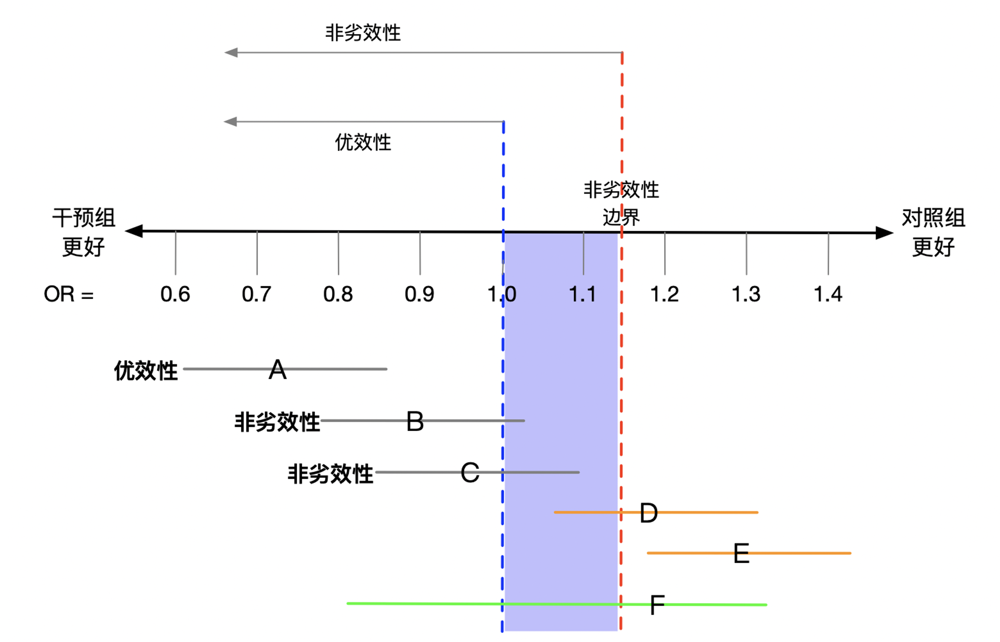

# 随机对照研究

## 神奇的随机化

直观的理解随机化就是掷硬币的过程，脑出血患者硬币正面朝上就接受手术治疗，反面朝上就接受保守治疗。随机化时，患者本身的因素所造成的死亡风险在任何一个治疗组中都相同，即接受手术治疗的概率与患者本身的因素无关。同理，除了治疗以外所有任何因素所造成的死亡风险在任何一个治疗组中都相同，即接受手术治疗的概率与所有其他任何因素无关。形式上，我们说组与组之间是可交换的。可交换性意味着正面朝上组接受手术治疗与反面朝上组接受手术治疗的死亡风险相同，正面朝上组接受保守治疗与反面朝上组接受保守治疗的死亡风险也相同。等效地，可交换性意味着反事实结果和干预是互相独立的。（用第1章的语言来说，随机化在期望意义上保证了组间的可交换性，从而使识别因果效应所需的可交换性、重叠性等条件得以成立；这正是随机对照试验被视为因果推断金标准的根本原因。）

## 常用的随机对照研究设计

随机对照研究中常用的几种设计方法：

### 平行对照（parallel）

随机对照研究最常采用的设计方法，将符合入排标准的研究对象随机分配到试验组与对照组，然后接受相应的干预。两组患者处于相同的条件环境，研究者采用客观的效应指标观察研究效应。这种设计中干预组与对照组的比例最常设为1：1，但也可根据实际情况增加干预组的占比，如前期非随机对照研究中提示干预组可明显增加患者获益。

### 群组随机对照（cluster）

群组设计的主要应用场景是个体不适宜进行随机分配。如多个试验对象处于同一病房、同一医院或同一社区内，若进行随机分配，这些处于同一空间内的试验对象很容易出现干预与非干预的混淆。因此，群组随机对照试验将整个病房、整个医院或者整个社区作为个体，进行随机分配，分别接受干预或对照。除了研究的单位不同，其试验设计和要求与一般的平行随机对照试验相同，需要注意的是群组随机对照试验一般需要的样本含量比普通随机对照试验要大得多。试验前需要预先设定群组数量、群组间的相关性。

### 交叉设计随机对照试验（crossover）

与普通随机对照试验不同，交叉设计的随机对照试验包含两个阶段，第一阶段中A组为试验组，B组为对照组，第二阶段中交换干预措施，A组为对照组，B组为试验组，并且两个阶段之间还设计洗脱期用以消除第一阶段中治疗的影响。这个研究设计可以避免对照组得不到有效治疗的伦理问题，并在一定意义上增大了样本量。

### 阶梯设计随机对照试验（stepped-wedge）

阶梯设计大多数情况下用于群组随机对照试验，其基本原理是将研究对象分为若干小组，并对其进行编号（如，A、B、C、D、E、F）。研究开始前预先设定每次开始干预的小组数量（如，两个小组）以及时间间隔（如，三个月）。研究开始按照事先确定的编号顺序给予两个小组干预（A、B组），其余小组将在研究过程中保持等待状态作为空白对照（C、D、E、F组）。三个月后给予按编号顺序顺延的其他两个小组干预（C、D组），再等待三个月，给予按编号顺序顺延的最后两个小组干预（E、F组）。随着时间的推移，所有小组均接受完干预措施，宣告研究结束。这种设计研究很大程度上减轻了试验的伦理学负担，使受试者的受益最大化，并保证了研究中的随机和对照两个重要因素。需要注意的是阶梯设计无法做到双盲，只能对评价者设盲；如果干预措施存在延迟效应时需谨慎考虑并设计合适的步长。

## 随机化方法

### 简单随机

简单随机是最基本的随机化形式。最简单的方法就是投掷一枚硬币，正面朝上则受试者被分配到A组；如果反面朝上则分配至B组。在临床研究实践中，亦可以通过随机数字表实现（在该表上数字0到9按行和列随机排列），随机选择某一行（列）数字序列，奇数分配到A组，偶数分配至B组。这种简单的随机化过程的优点是很容易实施。主要缺点是，样本量很小时两组间可能存在很大的不平衡，降低检验出真实差异的能力。例如，如果20名受试者参与随机化，两组比例为12:8 到8:12之间的机会约为 50%。

此外，一种错误的分配方法，将受试者交替分配到干预组和对照组（如 ABABAB ...）。这种分配方法并非随机，除了第一个受试者外，研究者以及其余受试者均知道分配至哪个组，从而会导致偏倚。研究者或受试者均不知道会分配至哪组称为分配隐蔽。需要强调的是，分配隐蔽（allocation concealment）与盲法（blinding）是两个不同的概念：前者指在分组完成之前使分配序列不被预知，以防止选择性入组；后者指在分组完成之后使受试者、研究者或评价者不知晓具体分组。二者都是降低偏倚的关键手段（Schulz 与 Grimes，2002）。随机对照试验的设计与报告可参照 CONSORT 声明（Schulz 等，2010）。

### 区块随机

区块随机化避免了简单随机化过程中产生的不平衡。其实施过程如下，首先选择区块大小（例如，4），分配首先入组的4名受试者，其中一半随机分配给A组，另一半随机分配给B组，然后顺序入组的另4名受试者中重复此过程，直到所有受试者都完成随机化。区块随机化的一个潜在的弊端是，如果区块大小为研究者所知，并且该研究非双盲，则区块中最后一人或两人的分配是已知的。例如，如果区块大小是4，前三个分配是BAA，那么最后一个分配必然是B，如果前两个分配是BB，那么最后两个分配必然是AA。为了避免这个问题，区块大小设置为可变，即每次区块随机完成后从2、4、6、8中随机选择一种区块大小。

### 分层随机

受试者的某些基线指标可能与研究结局相关，如年龄因素在许多研究中与预后相关，简单随机化会造成预后因素在干预组和对照组之间分布不均。分层随机化有助于实现这些因素的组间可比性。每个因素可分为两个或多个亚组（例如，男性/女性）。总层数是所有因素亚组数的乘积，受试者处于哪个层就在该层内执行随机化。在多中心随机对照研究中，中心可能是与受试者预后相关的重要因素，因此应将中心作为分层因素。

## 盲法

### 非盲

非盲的研究通常比其他研究更容易执行，成本更低。然而，非盲试验的主要缺点是存在偏倚的可能性。尤其是当研究终点事件依靠受试者主诉和症状判断时，疗效和安全性的报告都容易产生偏倚。用药组的受试者相信药物有效果，可能会夸大药物的疗效，担心药物的不良作用又会夸大药物的副作用。此外，受试者如在参加试验时对有益效果怀有期望，但被分配至对照组，可能会对试验产生不满意并退出试验。医生的倾向也有可能在非盲研究中产生偏倚，在一项冠状动脉搭桥手术与药物治疗的试验中，两个研究组的基线吸烟人数相等，然而在随访的早期阶段，手术组吸烟者明显减少。一个可能的解释是非盲的外科医生给那些接受手术的受试者提供了更多的不要吸烟的建议。

### 单盲

单盲研究的定义是只有受试者不知道他们正在接受哪种干预。单盲设计的缺点与非盲设计的缺点相似。研究者通常更喜欢阳性结果的研究，可能发表在高影响因子的期刊上，可能会收到更多会议邀请或经费资助。因此，研究者在收集数据，评估和解释结果时可能会下意识地偏向干预组。此外，合并治疗是指在试验期间对受试者进行的任何非研究治疗，如果在两组中不均等地应用合并治疗，则可能引入偏倚。

### 双盲

在双盲研究中，受试者和研究者在收集数据和评估结果时都不知道干预的分配。这种设计通常仅限于药物或生物制品的试验。实际上手术相关随机对照研究很少采用这种设计。真正双盲的研究主要优点是偏倚风险减少。某些药物试验需要通过监测药物副作用调整药物剂量，此时可由研究者以外的非盲药剂师或医师进行。

## 非劣效性试验（Noninferiority trial）

非劣效性试验是检验一种干预方法是否不劣于另一种方法的试验。在常规的优效性试验中，我们需要检验的是两种干预方法的疗效是否有差别。而非劣效性试验中干预方法A的平均疗效可比干预方法B的平均疗效好，亦可与干预方法B的疗效相同，甚至可以比干预方法B的平均疗效差，但其差值不超过非劣效性边际。

**案例2.1**

华法林是一种房颤患者常用的药物，几项随机临床试验已证明华法林可有效降低缺血性中风的风险，但是，华法林的副作用是出血。现在有一种更加理想的新药，可能比华法林更有效副作用更少，那么排除价格因素后这种新药必然是我们的首选。但退一步讲，即使新药与华法林的效果一样，但由于其副作用更少，它仍然是我们的首选。换句话说，即使我们未能证明这种新药比华法林更有效，如果我们能证明它不比华法林差，由于其能减少副作用，使用这种新药也是合理的。因此，我们可以设计一个非劣效性试验来比较这种新药与华法林的疗效。

考虑非劣效性设计时的关键概念是非劣效性边界。假设我们采用比值比来衡量新药与华法林的有效性。若开展优效性试验，要求比值比的 95% 置信区间低于 1。然而，当我们使用非劣效性试验时，认为比值比为 1 是可以接受的，因为比值比为 1 表明新药不劣。我们必须预先设定一个界值，称为非劣效性边界，比值比的 95% 置信区间必须低于该值，才能被视为新药不劣。需要注意的是，非劣效边界应在试验设计阶段、依据既往安慰剂对照试验所确立的疗效预先设定，并通常保留所观察到疗效的一定比例（即保留效应法），切忌为提高把握度而人为放宽。非劣效与等效性试验的设计与报告，可参照 CONSORT 的相应扩展声明（Piaggio 等，2012）。

图2.1中的横轴表示比值比，值为 1 处有一条蓝色虚线，这是优效性试验中的原假设。估计的比值比小于 1 表明新药更好，因为风险更小。1 的稍右侧有一条红色虚线，标记为非劣效边界。该值表示新药比华法林稍差，但差距在临床上没有意义，仍被视为非劣效的情况。A、B、C、D、E、F为假想的六个试验的点估计（字母位置）和95%置信区间（线段长度）。

试验 A 比值比的点估计和 95% 置信区间完全小于 1，这表明新治疗方法优于对照组。

试验 B 比值比的点估计小于 1，但 95% 置信区间包含 1。因此，我们不能说新药比华法林更好。但由于整个 95% 的置信区间都低于非劣效边界，我们可以说新药与华法林相比是非劣效的。

试验 C 与试验 B相同，亦满足非劣效性，因为置信区间的上限低于非劣效性边界。

试验 D 表明试验药物未达到非劣效性，因为置信区间的上限高于非劣效性边界。此外，由于整个 95% 的置信区间显示华法林更好，实际上显示了华法林的优效性。

试验 E 表明新药比华法林差很多。

试验 F 有非常宽的置信区间，无法得出优越性或非劣效性的结论。

## 实用性随机对照试验（Pragmatic Clinical Trial）

常规的临床试验往往是经过最优化配置的，由经验丰富的研究人员参与，高度选择参与者，可能高估干预的益处而低估了其危害。这些研究成果亦难以转化为临床实践。实用性随机对照研究，常用于研究一项医疗卫生政策或者一项医疗决策能否改善受试者的预后。实用性研究尽量模拟常规医疗环境，其目标和真实世界相近，因此，开展实用性随机对照试验成为当前临床研究的热门，其主要特点有：实用性（pragmatic）与解释性（explanatory）试验的区分最早由 Schwartz 与 Lellouch（1967）提出：前者关注干预在常规医疗环境中的实际效果（effectiveness），后者关注理想条件下的生物学效力（efficacy）。研究者可借助 PRECIS-2 工具，在纳排标准、随访、依从性等多个维度上评估试验设计的实用性程度（Loudon 等，2015）。

### 复杂度低

实用性随机对照试验尽量减少纳入和排除标准、减少研究的随访次数和复杂性从而增加试验的参与度。

### 特殊情况下可豁免知情同意

在某些情况下，获得伦理批准的前提下，可以在未经知情同意的情况下进行试验。例如，在 CRASH 试验中，超过 10,000 名头部外伤和意识受损的患者接受了随机分组，以确定与安慰剂相比，糖皮质激素是否会影响死亡率和神经功能障碍。在此研究中，由于激素的使用是在受伤后的很短时间内，且其风险被认为是最小，不干扰正常的临床治疗也不增加随访次数，该研究申请伦理委员会豁免知情同意。在涉及无法知情同意的背景下，赫尔辛基宣言指出，如果无法获得知情同意并且研究不能延迟，则可以在没有知情同意的情况下进行。

### 通常不采用盲法

采用盲法的试验并不完全实用，可以想象在临床实践中给予患者的治疗都是确切的。在实用性设计中，随机分组通常不被遮蔽。因此，为尽量减少试验中产生的偏差，其主要终点事件往往都设定为可以客观评价的重大事件，例如死亡、急诊入院等等。

### 无需额外的随访

实用性研究中，随访通常不增加受试者和研究人员的负担，且无需额外的随访。这种策略在具有可靠且可访问的电子健康记录的医疗保健系统中是最可行的，这些记录可以捕获感兴趣的事件。

### 依从性评价

实用性研究并不强调所有受试者按照随机分配的方案完成研究，而将受试者的依从性评价也做为一个结局进行分析，依从性差提示该治疗在真实世界的临床实践中不可行。

6.  终点事件的确定和分析。

实用性研究的终点通常很简单，可以最大限度地减少数据收集的要求。 CRASH 试验通过两页的病例报告表实现了高度简化，另一项导尿管试验的主要终点事件是出院后 6 周内出现的有症状的导尿管相关尿路感染，而不是实验室确认的院内感染。实用性试验通常使用邮寄问卷或基于网络的表格来避免来院随访，这种方法大大降低了研究成本。

## 适应性随机对照试验（Adaptive Clinical Trial）

适应性随机对照研究是指在临床试验中，根据预先设计的规则，利用试验内部及外部积累的信息，动态地修改试验设计中的某些方面，而不破坏试验的有效性、科学性和完整性的一种设计。修改的内容包括干预的分配比例、总样本量和入组标准，试验可以从II期延长到III期，可以增加或取消治疗组。适应性设计有可能缩短试验完成时间，减少资源需求和无效治疗的病人数量，并从整体上提高试验成功的可能性。

常见的适应性临床试验类型包括：样本量重新评估、反应性适应性随机化、放弃无效治疗组、适应性富集、和无缝II-III期设计。基于试验期间实际的终点事件发生率来确定实际统计功效以重新评估样本量大小。反应性适应性随机化允许在试验期间改变随机化比例，因此，如果中期结果对干预组有利，新入组的受试者更有可能被分配到干预组。适应性富集是指对试验入组标准或结果评估的修改；如果中期分析显示某个亚组的反应更有利，可以通过修改入组标准来富集试验，使其只招募或主要招募该亚组的受试者。无缝适应性试验设计允许从一个阶段延续到下一个阶段，一般是从II期延续至III期试验。II期试验的结果可用于确定初始分配比例、计划的总样本量，随后的III期试验扩展至更大的人群。

适应性设计随机对照试验依旧拥有随机对照试验的随机化原则，也需要提前进行样本含量的估算，但不同的是在研究进行中可以根据预先设定的规则来确定下一阶段的样本量。在适应性设计中，常规的频率学派统计方法可能无法对个体治疗方案的调整进行预测，因此需引入贝叶斯统计利用先验信息对个体治疗方案进行预测。适应性设计在很大程度上依赖于计算机模拟，直到研究者和试验统计学家确信适应性设计的可能收益（预期减少所需的样本量、完成时间、避免的无效治疗次数）大大超过了潜在的风险（中期效果估计的风险、试验终止时计划统计分析的稳健性）。实施适应性试验通常涉及一个中期分析和决策的周期。决策规则是在试验开始前预先指定的，包括终止干预组或试验的数学表达、干预间分配比例的修改、预先指定的规则以重新估计样本量或缩小受试者入组标准、以及挑选新的干预组等等。

对于适应性设计，统计分析计划包括模拟、中期分析，以及对已完成试验的最终分析。适应性试验需要一个所谓的预处理阶段，在这个阶段可以按照固定的分配比例（通常是1:1）招募预定数量的病人，以确保收集到足够的数据，从而达到合理的预期精度。过早进行适应性调整可能会因为数据量小而更容易出现随机错误。反应性适应性随机化的一般经验法则是在每组至少收集20-30名受试者的数据后进行第一次中期分析。其他适应性，包括样本量的重新评估和富集，通常需要更长的预处理期和更大的样本量。在多臂适应性试验中，对照组的分配通常是固定的（如，占总样本量的20%），而实验性治疗之间的分配比例是调整的。需要强调的是，适应性设计必须在研究方案中预先设定全部调整规则，并通过计算机模拟控制总体I类错误率，以免因多次中期分析而抬高假阳性风险；其方法学与报告规范可参考 Bhatt 与 Mehta（2016）以及 Pallmann 等（2018）。

I-SPY 2 是一项针对乳腺癌的适应性随机对照研究，其目标是根据患者的肿瘤分子生物标志物确定治疗方案。I-SPY 2 的总体试验设计，所有患者采用标准新辅助化疗方案，并同时测试五种新药，每一种新药都被添加到标准疗法中。患者在进行初步的活检、影像和血液检查后被随机分配到各个药物组，并在一定时间后评估治疗的反应。为了尽早获得有关治疗效果的信息，研究者对治疗反应与生物标志物之间的关系进行建模，并在试验期间不断评估结果，并将其作为依据确定随机化概率。试验过程中，研究者采用自适应随机化的贝叶斯方法，若研究过程中发现某种药物对携带特定生物标志物的受试者表现良好，则后续将此药优先分配给携带此特定生物标志物的其他受试者。当某种药物的疗效概率在所有患者中都下降到足够低时，该药物从试验中退出。研究结束时，比标准疗法更有效的药物与其相应的生物标志物特征，将在进一步的 III 期试验中进行测试。自适应设计方法可快速评估新药，识别有效的药物和药物组合，并确定哪些乳腺癌亚型将受益。随着试验的进行，研究可识别并使用来自每个患者的信息，并可为随后的治疗分配提供信息。

神经外科领域中的 GBM-AGILE 是一个类似于 I-SPY 2 的无缝 II/III 期胶质瘤临床研究平台，分两个阶段执行。该研究的第一阶段，多个研究组与共同的对照组进行比较，基于不同的生物标志物采用适应性随机化设计，评估研究药物对胶质瘤生存状态的影响。第一阶段中有显著效果的研究药物进入第二阶段，使用固定随机化设计来确认其治疗的有效性。这种研究设计方式能加速向受试者提供治疗机会，加快药物注册和监管审查。

### 篮式研究（Basket Trial）

具体的说，某种靶点明确的药物就是一个篮子，将带有相同靶基因的不同癌症放进一个篮子里进行研究就是篮式研究，其本质是一种药物应对不同的肿瘤。克唑替尼 A8081013 临床试验（NCT01121588）就是一项包括各种恶性肿瘤的篮式研究。此外，针对 BRAF 的篮式研究正在国内外如火如荼地开展着，BRAF 突变在多发性骨髓瘤、黑色素瘤、卵巢癌、结肠癌、甲状腺癌、绒毛膜癌、胃肠肿瘤、肺癌以及颅咽管瘤等多个癌种中被检出。

### 伞式研究（Umbrella Trial）

同一种疾病，可能由不同基因驱动，如肺癌可由KRAS、EGFR、ALK 等驱动。这些同一疾病的不同亚型拢聚在同一把雨伞之下，根据不同的靶基因分配不同的精准靶药物。上一节提到的I-SPY 2和GBM-AGILE研究就属于伞式研究。

## 随机对照研究结果阴性的解读

设计精良的随机对照研究有助于提升临床实践中的证据级别。虽然简单地根据 p 值是否小于 0.05 把一项研究归类为阳性结果和阴性结果非常不合理，但却是很普遍的做法。实际上 p 值应理解为连续的数字，p 值越小代表治疗效果的证据强度越大。此外，根据置信区间可以估计治疗效果的不确定性范围。对任何一项研究的解释还应参考证据的整体性（即主要、次要和安全性结果），而不仅仅是主要终点结局。

既往研究提示药物制造企业发起的新药临床研究中，只有 13.8%（Wong 等，2019） 的研究最终获得批准得以上市。对于患者以及药物制造企业来说失败的随机对照研究（阴性结果）确实让人失望。对于神经外科疾病的临床研究来说，部分研究失败的原因中固然包括研究药物的生物学特性或神经外科疾病的特点，如药代动力学问题，疾病缺乏可靠的动物模型，中枢神经系统存在血脑屏障等。但部分研究出现阴性结果却还要归因于缺乏良好的研究设计。少部分研究者发起的临床研究因为资源受限而存在研究设计的瑕疵导致研究结论出现阴性结果，因而如何避免这些缺陷是未来继续开展随机对照临床研究需要进一步解决的问题。

根据研究假说，随机对照研究可分为优效性，非劣性以及等效性研究；根据随机方法来看，随机对照研究又可分为一般随机对照，群组随机对照以及交叉随机对照。在一项评估垂体肿瘤术前不使用糖皮质激素的安全性的研究中，由于该研究的主要假设是不使用糖皮质激素并不比使用糖皮质激素带来额外的并发症，因此，使用非劣性设计更适合此研究，但该研究中并没有采取这种方案。非劣性设计的另一大优势在于能明显减少样本量，增加研究效力。假设使用糖皮质激素组术后发生肾上腺功能不全的风险是5%，不使用糖皮质激素组为10%，通过统计计算可以得出：如果采取优效性研究设计总共需要864名患者，而采取非劣性设计只需要118名患者。此外，这项研究的另一个瑕疵在于其采取的随机方法。设想在同一个病房中同一天有两名受试者需要入组研究，如果没有很好的流程及人力保证的话，则很可能出现给不使用糖皮质激素组的受试者使用了糖皮质激素而导致受试者“被”换组。因此，采取群组随机方案会有效地避免这种情况，这个“群”往往是某个医疗机构，某个病房或某个时间段中就诊的病人群体，也就是在制定随机分组方案的时候，以医疗机构，病房或时间段为单位进行随机。群组随机可以提高受试者的依从性，因为经过群组随机以后受试者周边的其它“病友”基本上接受的是同样的治疗方案，研究者对受试者干预的管理非常统一，因此，不同组之间出现“污染”的情况会大大减少。

随机对照研究也需要考虑被研究的人群，因为不同人群可能对治疗的敏感性不同。一项评估氨甲环酸在脑外伤患者中有效性（CRASH-3）的研究中纳入了所有类型的脑外伤患者，终点事件是死亡。研究结果发现氨甲环酸组死亡率是18.5%，安慰剂组死亡率是19.8%，两者的比值比是0.94（95%置信区间0.86-1.02，p大于0.05)。此研究可以被划分为阴性结果。然而，在分层分析中可以明显看出氨甲环酸在不同脑外伤人群中的治疗效果是不同的，在轻中度脑外伤患者中，氨甲环酸对比安慰剂的风险比值比是0.78（95%置信区间0.64-0.95），但在重度患者中的风险比值比是0.99（95%置信区间0.91-1.07），因此该研究得出结论氨甲环酸可能可以降低轻中度脑外伤患者的死亡率。一项在自发性脑出血患者中评估外科治疗对比保守治疗（STICH-I）的研究中，两组主要终点结局没有差别，但在亚组分析时该研究发现皮层出现亚组中早期手术能改善预后。因此，STICH-II针对浅表皮层血肿患者研究手术治疗对比保守治疗的效果，但遗憾的是该研究也没有确认手术治疗的优效性。此研究的亚组分析中也发现了人群存在异质性，预后好的患者可能手术治疗效果比保守治疗更好。另外一项替莫唑胺对比放疗治疗高风险低级别胶质瘤的随机对照研究（EORTC 22033-26033）中虽然在总人群中并没有获得阳性结果，但是亚组分析显示IDHmt/non-codel亚组中接受放疗组的无进展生存期更长。对于亚组分析的更深入讨论请参考第3章。

次要终点事件有时也可以为临床医师提供一些决策支持。上文中介绍的MISTIE-III研究次要终点事件为死亡率，统计分析提示微创治疗组死亡率明显比保守治疗组低，因此得出结论微创治疗可能降低自发性脑出血患者的死亡率。但需要注意的是无论是亚组分析还是次要终点在最终解释并指导临床决策时都需慎重，因为这些分析都涉及多重比较，犯I类错误的概率会大大提高，从而导致假阳性结果的出现。

随机对照研究受限于I类错误，往往只能纳入一个主要终点结局。神经外科领域中，有一些疾病有明确的终点事件，因此选择主要终点事件比较容易，如胶质瘤患者的生存状态，功能性垂体瘤的内分泌控制状态等。但对于脑外伤，脑出血性疾病来说，有不同的量表评估患者的功能状况，包括改良RANKIN量表（mRS），格拉斯哥预后量表（GOS）等等，选取终点事件时往往需要考虑不同的切点。一项在外伤性颅高压患者中比较去骨瓣减压手术与保守治疗的研究选取GOS作为主要终点事件。探索性结局的统计检验中，定义上肢重度瘫痪或更好作为切点将GOS评分作二分类处理，统计分析提示两组患者没有达到统计学差异，因而严格意义上来讲此研究也是阴性的。但如果从GOS结局的数据分布来看，去骨瓣减压手术能显著降低外伤性颅高压患者的死亡率（去骨瓣减压组26.9%，对比保守治疗组48.9%，p小于0.05）。此外，如果结局事件为多次测量的重复性事件（如功能性垂体瘤临床研究中的内分泌缓解）,传统的研究设计往往指定主要终点事件是治疗后第一次发生该事件，忽略随后发生的任何重复事件。近年来的一些研究表明，纳入多次测量结局作为终点事件有助于提高统计效力。

随机对照研究中还需要充分考虑受试者的依从性，治疗施与者的依从性，以及研究过程中有无违背研究方案的情况发生。一项国际多中心评估微创神经外科手术对比保守治疗干预脑出血（MISTIE-III）的研究，招募了506名自发性脑内出血的成年人，终点事件是治疗后365天受试者的神经功能状态（mRS量表0-3分为优良结局，4-6分为较差结局）。研究结果没有提供证据表明微创手术组对比保守治疗组能提高受试者的神经功能状态。但需要注意的是此研究中只有59%的受试者在微创手术后达到了目标的血肿清除量（减小至少15mL），而既往研究表明血肿的清除量与结局之间是正相关的。此外，需要注意的是在药物/安慰剂对照研究中，由于盲法的存在，治疗交换很少发生，但在涉及手术/非手术对照的研究中，治疗交换是个大问题。另一项在自发性脑出血患者中评估外科治疗对比保守治疗（STICH-II）的研究中，虽然有294例受试者随机分配至保守治疗组，但其中有62例受试者在随机分配后改为手术治疗，治疗交换比例高达21%。

由于阴性结果的判断是从统计学上出发的，因此统计学上阴性不等于临床上没有意义，有时还需要从临床上判断有无潜在的益处。一项评估氢化可的松或氟氢可的松对比安慰剂预防脑外伤后肺炎的研究（Corti-TC）中，统计学上未能显示激素使用后能降低医院获得性肺炎的风险，其风险比为0.75（95%置信区间0.55-1.03，p大于0.05）。虽然在统计学上没有差异，但根据风险比为0.75可以看出潜在的风险减低达25%，是否在临床上有意义值得商榷。另一项洛莫司汀联合替莫唑胺对比替莫唑胺单药治疗MGMT阳性胶质瘤的随机对照研究（CeTeG/NOA-09）中，主要终点指标为中位生存期，风险比为0.60（95%置信区间0.35-1.03，p大于0.05），统计学上归为阴性结果。但是洛莫司汀联合替莫唑胺治疗组的中位生存期为48.1个月，而替莫唑胺单药组仅为31.4个月，平均增加的17个月临床上是有意义的。

临床研究得出阴性结果后还需要反思样本量是否充足。上文中的Corti-TC研究安慰剂组发生医院获得性肺炎远低于研究前的预期，因此导致实际上需要更多的样本才能检验出两组的差别。另一项研究评估了脑出血患者中微创神经外科手术对比保守治疗的预后（MISTIE）。微创治疗组30天的死亡率是9.5%，而保守治疗组的死亡率是14.8%，虽然两者统计学上没有显著差别，但两组总样本只有96例，远低于预期的样本量。

最后，意向性分析是几乎所有的随机对照研究中主要的分析方法。无论试验后续情况如何，当初所有参与随机分组的受试者均统统纳入分析。但有时意向性分析的阴性结果，可能是由于部分受试者违背研究方案引起的。近年来，符合方案分析作为后续探索性分析也经常在一些高质量的随机对照中研究中出现。如上述CeTeG/NOA-09研究中，有些中心出现了选择偏倚，探索性分析中剔除了这些中心后使用逆概率加权来矫正混杂因素后提示洛莫司汀替莫唑胺可能效果更好。但需要注意的是存在未测量混杂因素的情况下，符合方案分析仍然会引起偏倚。

## 参考文献

1.  Thorlund K, Haggstrom J, Park JJ, Mills EJ. Key design considerations for adaptive clinical trials: a primer for clinicians. BMJ. 2018 Mar 8;360:k698.

2.  Lawrence F, Curt F, David D, David R, Christopher G. Fundamentals of Clinical Trials. Springer. 2015.

3.  Schulz KF, Grimes DA. Generation of allocation sequences in randomised trials: chance, not choice. Lancet, 2002, 359(9305):515-519.

4.  Schulz KF, Grimes DA. Allocation concealment in randomised trials: defending against deciphering. Lancet, 2002, 359(9306):614-618.

5.  Schulz KF, Grimes DA. Blinding in randomised trials: hiding who got what. Lancet, 2002, 359(9307):696-700.

6.  Schulz KF, Altman DG, Moher D, et al. CONSORT 2010 statement: updated guidelines for reporting parallel group randomised trials. BMJ, 2010, 340:c332.

7.  Piaggio G, Elbourne DR, Pocock SJ, et al. Reporting of noninferiority and equivalence randomized trials: extension of the CONSORT 2010 statement. JAMA, 2012, 308(24):2594-2604.

8.  Schwartz D, Lellouch J. Explanatory and pragmatic attitudes in therapeutical trials. Journal of Chronic Diseases, 1967, 20(8):637-648.

9.  Loudon K, Treweek S, Sullivan F, et al. The PRECIS-2 tool: designing trials that are fit for purpose. BMJ, 2015, 350:h2147.

10. Bhatt DL, Mehta C. Adaptive designs for clinical trials. New England Journal of Medicine, 2016, 375(1):65-74.

11. Pallmann P, Bedding AW, Choodari-Oskooei B, et al. Adaptive designs in clinical trials: why use them, and how to run and report them. BMC Medicine, 2018, 16(1):29.

12. Wong CH, Siah KW, Lo AW. Estimation of clinical trial success rates and related parameters. Biostatistics, 2019, 20(2):273-286.
