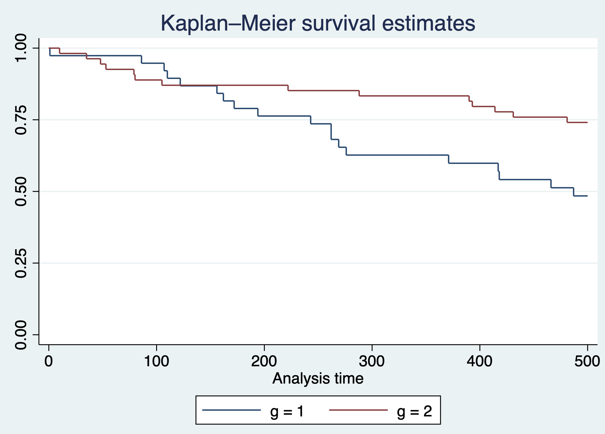
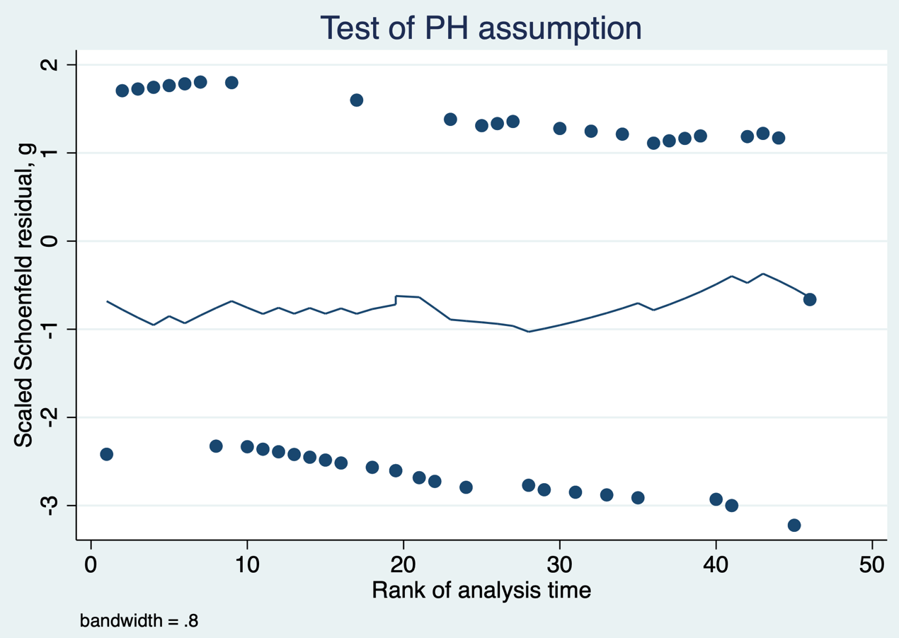
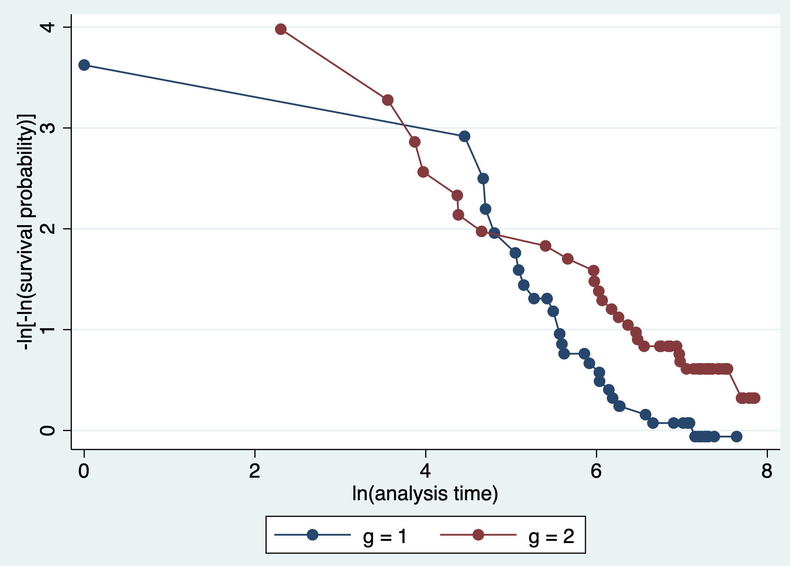
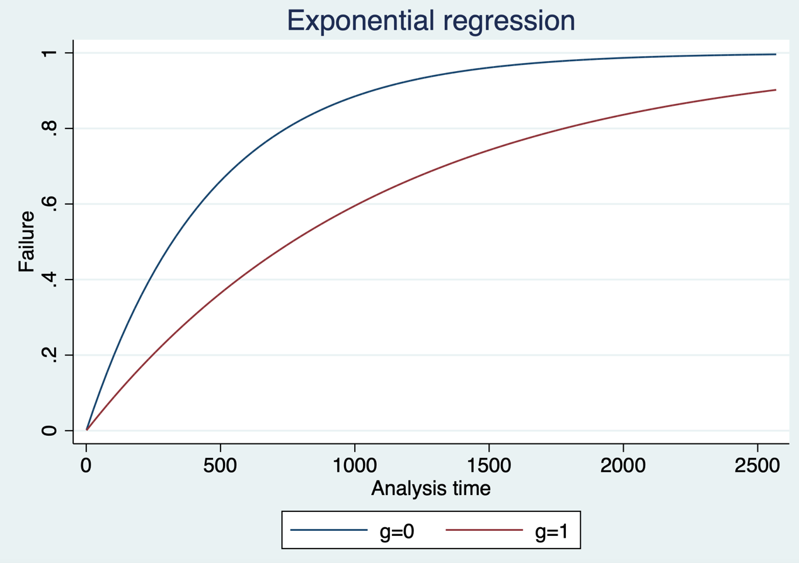
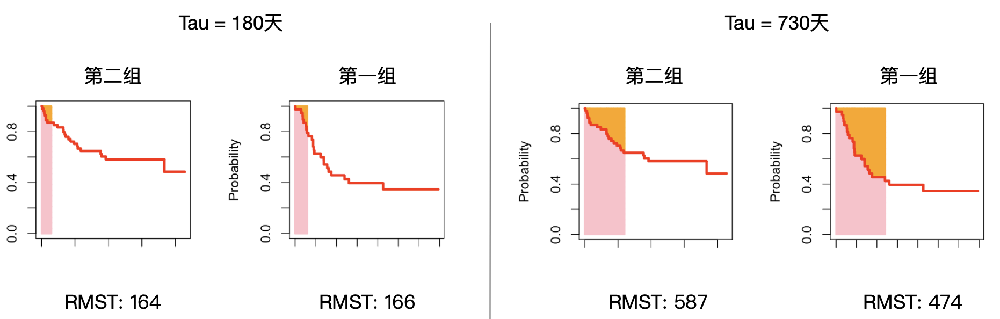
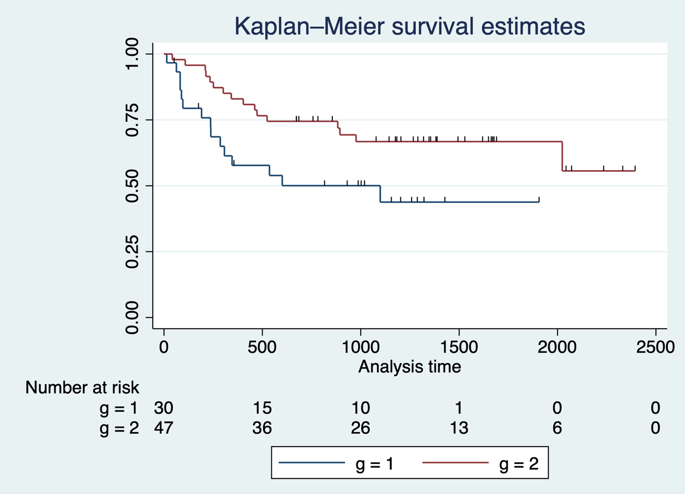
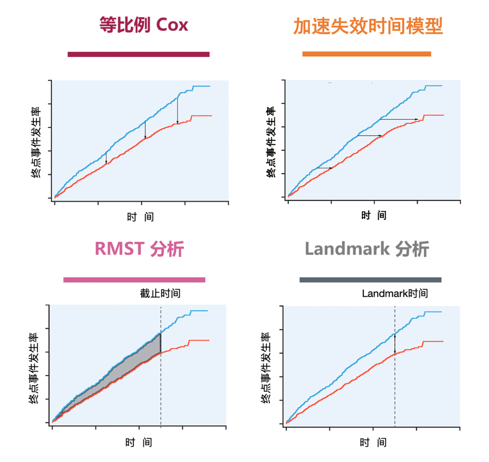
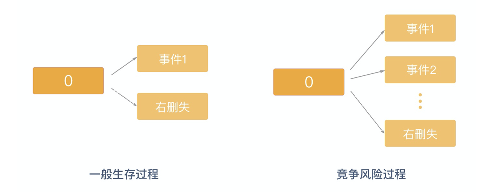
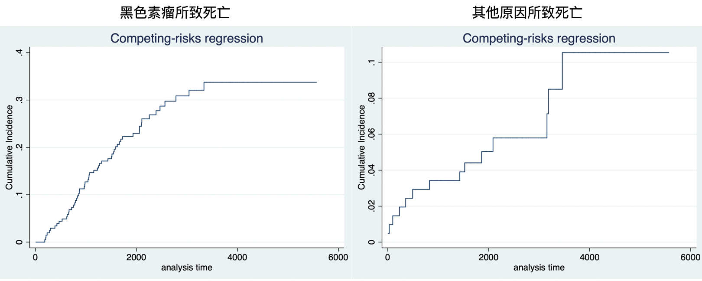
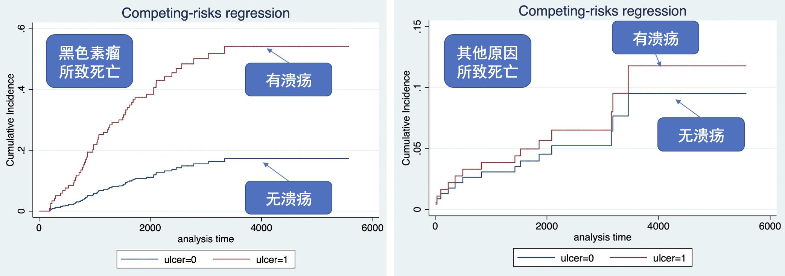

# 生存结局的临床研究

生存分析是指对某给定事件发生的时间进行分析和推断，研究生存时间和结局与预后因子间的关系及其程度大小的方法，是一种处理删失数据的数据分析方法，也称生存率分析或存活率分析。

根据不同研究的目的和资料类型，可以采用不同的生存分析方法，如：估计某一生存时间的生存率，如五年生存率，可用寿命表法；估计中位生存时间，可用寿命表法和Kaplan-Meier法；研究某因素不同水平的生存时间，可用Kaplan-Meier法；研究多种因素对生存时间的影响，可用Cox回归模型。寿命表法和Kaplan-Meier法较为简单，在此不再赘述。

Cox 比例风险模型（Cox proportional-hazards model）简称Cox 模型，是英国统计学家Cox在1972年提出的一种半参数回归模型，可以用来预测一个或多个不同变量在某一时间对死亡率的影响。它同时适用于数值变量和类别变量，可以同时评估几种风险因素对生存时间的影响，检验特定因素如何影响特定时间点特定事件（例如，感染，死亡）的发生率，因此广泛应用于生物医学的统计和分析。Cox 比例风险模型由 Cox 于1972年提出，是一种半参数模型（Cox，1972）；而前述寿命表法与 Kaplan–Meier 法属于非参数方法，后者由 Kaplan 与 Meier 于1958年提出（Kaplan 与 Meier，1958）。

## Cox回归的等比例条件

利用Cox回归模型进行生存分析时需要考虑的最重要的因素是等比例条件。等比例是指两组风险比例不随时间变化，即某因素对生存的影响在任何时间是相同的，不随时间的推进而变化。

**案例5.1**

这是一个骨髓移植案例，纳入了不同类型的白血病患者（表5.1），g是分组，1代表急性淋巴细胞性白血病，2代表低风险性的急性髓系白血病。对这些患者开展骨髓移植手术，T1是指骨髓移植手术以后的生存时间，单位是天。delta1是指患者的结局（1为死亡；0为存活）。所关注的临床问题是急性淋巴细胞性白血病和低风险的急性髓系白血病手术后死亡风险有无差别？（为简化案例，假设不存在混杂因素）

**案例5.1数据表**

| g   | T1   | delta1 |
|:----|:-----|:-------|
| …   | …    | …      |
| 1   | 107  | 1      |
| 1   | 269  | 1      |
| 1   | 350  | 0      |
| 2   | 2569 | 0      |
| 2   | 2506 | 0      |
| 2   | 2409 | 0      |
| …   | …    | …      |

因为结局事件为生存事件，因此该临床问题可以用Cox模型建模。Stata中首先需要设置数据格式为生存数据，采用stset命令，后接生存时间t1，并指定发生临床事件为delta1=1。绘制Kaplan-Meier曲线可采用sts graph命令，分组绘制指定组别g。

+--------------------------------+
|                                |
+================================+
| 代码5.1                        |
|                                |
| . stset t1, failure(delta1==1) |
|                                |
| . sts graph, by(g)             |
+--------------------------------+

判断等比例条件有三种方法：一是观察两组间的Kaplan-Meier曲线是否相交叉，如果不交叉，那说明两组满足等比例条件。然而本例中红色曲线在手术后的短期内下降幅度较蓝色曲线大，说明手术后短期内低风险性的急性髓系白血病死亡风险大于急性淋巴细胞性白血病组。然而蓝色曲线在长期随访中出现显著下降。两组的Kaplan-Meier曲线相交叉，因此这两组不满足等比例条件。

{width="“5.768055555555556in”" height="“4.136805555555555in”"}

**代码5.1输出：两组Kaplan-Meier曲线**

第二种方法绘制 Schoenfeld残差与时间的关系图，如果Schoenfeld残差与时间无明显的变化趋势，即残差与时间无关，则提示符合等比例风险假设。如下图中残差似乎有随着时间上升的趋势，提示可能不满足等比例风险假定。

+------------------------------+
|                              |
+==============================+
| 代码5.2                      |
|                              |
| . stcox g                    |
|                              |
| . estat phtest, rank plot(g) |
+------------------------------+

{width="“5.768055555555556in”" height="“4.097916666666666in”"}

**代码5.2 输出：Schoenfeld残差与时间关系图**

等比例条件的第三个检验方法是绘制某因素在不同状态下的二次对数生存曲线图 （即横坐标是时间的对数，纵坐标是生存函数的对数的对数），如果生存曲线大致平行，表明等比例风险成立，否则提示等比例不成立。如下图中两条曲线交叉，提示可能不满足等比例风险假定。

+-------------------+
|                   |
+===================+
| 代码5.3           |
|                   |
| . stphplot, by(g) |
+-------------------+

{width="“5.768055555555556in”" height="“4.136805555555555in”"}

**代码5.3输出：二次对数生存曲线图**

### 非等比例情况下的Cox回归

Cox回归模型中，如果数据中存在非等比例的情况，可采用以下三种策略开展生存分析。

### 加速失效时间模型（accelerated failure-time model，AFT）

主要研究干预对事件发生平均经历的时间的影响。直观上可以理解为比较两种干预结局事件发生的速度。其回归系数表示发生结局事件所需时间的比值，如果结局事件为死亡，回归系数即表示两组平均寿命的比值。

指定生存数据模式后，采用streg命令进行回归分析，随机变量的分布可以选择指数分布、Weibull分布、伽马分布等等。

+-------------------------------------------+
|                                           |
+===========================================+
| 代码5.4                                   |
|                                           |
| . stset t1, failure(delta1==1)            |
|                                           |
| . streg g, distribution(exponential) time |
+-------------------------------------------+

**代码5.4输出**

| Exponential AFT regression |   |   |   |   |   |   |
|:---|----|----|----|----|----|----|
| No. of subjects = 92 | Number of obs | = | **92** |  |  |  |
| No. of failures = 46 | LR chi2(1) | = | **8.47** |  |  |  |
| Time at risk = 86,200 | Prob \> chi2 | = | **0.0036** |  |  |  |
| Log likelihood = -135.20674 |  |  |  |  |  |  |
|  | Coefficient | Std. Err. | z | P\>\|z\| | \[95% Conf. Interval\] |  |
| g | **.8714456** | **.2948839** | **2.96** | **0.003** | **.2934837** | **1.449407** |
| \_cons | **6.136548** | **.4662524** | **13.16** | **0.000** | **5.222711** | **7.050386** |

g的系数为0.871，表示g=1组发生结局事件所需时间延长(1-0.871)%=12.9%。两组的失效曲线（横轴为时间，纵轴为终点事件发生的比例）也可以观察到g=0组发生结局事件的速度更快。

+---------------------------------+
|                                 |
+=================================+
| 代码5.5                         |
|                                 |
| . stcurve, failure at( g=(0 1)) |
+---------------------------------+

{width="“5.768055555555556in”" height="“4.066666666666666in”"}

**代码5.5输出：加速失效曲线图**

2.  限制性平均生存时间（Restricted mean survival times, RMST）

限制性平均生存时间为生存曲线在某个时间段内的曲线下面积（图5.1粉红色部分），即限制在某个时间段内的平均生存时间。平均生存时间越长，说明治疗的效果越好。限制性平均生存时间是不依赖于等比例风险假设的，其结果也比较直观，容易理解。但计算限制性平均生存时间需确定随访截止时间，但目前对于截止时间没有统一规定，由临床信息给定。

{width="“5.768055555555556in”" height="“1.8402777777777777in”"}

**图5.1 分别将截止时间定为180天和730天时，两组的限制性平均生存时间**

案例5.1中手术后短期内低风险性的急性髓系白血病死亡风险大于急性淋巴细胞性白血病组可能是由于手术后的急性反应。临床上，这个时间一般持续3个月到半年左右。因此可以将截止时间（tau）定义为180天，分别计算截止至180天时两组的平均生存时间。strmst2命令用于限制性平均生存时间分析，指定分组变量g和截止时间。

+-----------------------+
|                       |
+=======================+
| 代码5.6               |
|                       |
| . strmst2 g, tau(180) |
+-----------------------+

**代码5.6输出**

| Restricted Mean Survival Time (RMST) by arm |   |   |   |   |
|:---|----|----|----|----|
|  | Estimate | Std. Err. | \[95% Conf. Interval\] |  |
| arm2 | **164.259** | **5.735** | **153.018** | **175.501** |
| arm1 | **166.211** | **5.778** | **154.886** | **177.535** |
| Between-group contrast (arm 2 versus arm 1) |  |  |  |  |
|  | Estimate | \[95% Conf. Interval\] | P\>\|z\| |  |
| RMST (arm2 - arm1) | **-1.951** | **-17.908** | **14.005** | **0.811** |
| RMST (arm2 / arm1) | **0.988** | **0.897** | **1.088** | **0.811** |

180天时第一组的限制性平均生存时间是166天，第二组的限制性平均生存时间是164天，两组之间没有明显的差别（无论是差值还是比值），p值为0.811。如果我们想要比较两组的长期治疗效果，只需将截止时间定为更长的随访（如730天），可看到第一组的限制性平均生存时间是473，第二组的限制性平均生存时间为587，两组相比差值的p值为0.035，比值的p值为0.042。可以得出结论截止730天时，第一组患者的限制性平均生存时间比第二组短。

+-----------------------+
|                       |
+=======================+
| 代码5.7               |
|                       |
| . strmst2 g, tau(730) |
+-----------------------+

**代码5.7输出**

| Restricted Mean Survival Time (RMST) by arm |   |   |   |   |
|:---|----|----|----|----|
|  | Estimate | Std. Err. | \[95% Conf. Interval\] |  |
| arm2 | **586.704** | **32.427** | **523.148** | **650.260** |
| arm1 | **473.868** | **42.191** | **391.176** | **556.561** |
| Between-group contrast (arm 2 versus arm 1) |  |  |  |  |
|  | Estimate | \[95% Conf. Interval\] | P\>\|z\| |  |
| RMST (arm2 - arm1) | **112.835** | **8.540** | **217.130** | **0.034** |
| RMST (arm2 / arm1) | **1.238** | **1.008** | **1.520** | **0.042** |

然而，限制性平均生存时间分析的一个重要弊端在于截止时间点后收集的数据无法用于统计分析，造成了数据的浪费和统计效能下降。作为危险比的替代效应指标，限制性平均生存时间在存在非比例风险时尤为适用，其在随机试验设计与分析中的应用可参见 Royston 与 Parmar（2013）。

### Landmark分析

除了限制性平均生存时间，存在非等比例情况下亦可以使用Landmark分析，其原理是把 Kaplan-Meier 曲线分成两段，前面一段和后面一段分别做Cox模型分析。Landmark分析考虑到两个干预组发生终点事件的时间分布不同。如果要比较某种疾病手术组和非手术组的生存率，因为手术组短期有相对较高的并发症率，导致短期生存率低于对照组，但一旦过了这个时期，手术组的生存率可能大于非手术组。Landmark 分析通过设定一个地标时间点、仅纳入在该时点仍存活的受试者，避免了用尚未发生的信息进行不当比较，其方法学可参见 Dafni（2011）。

同样采用案例5.1，Kaplan-Meier 曲线可以看到第二组的长期预后较好，但在术后短期存在生存率的快速下降。因此，我们想要知道术后短期内两组的生存情况有何差别，术后长期的情况又是如何？

Landmark 分析的步骤为基于临床经验选择Landmark时间，分别在Landmark时间前后进行Cox回归分析。在案例5.1中，急性反应一般发生于手术后180天，首先计算180天内两组的生存函数差别，需手工截断尚未发生生存事件的患者的生存时间至180天。结果提示两组生存函数无明显差别（p=0.373）。

+-------------------------------------+
|                                     |
+=====================================+
| 代码5.8                             |
|                                     |
| . gen L1 = t1 if t1 \< 180          |
|                                     |
| . replace L1 = 180 if t1 \>= 180    |
|                                     |
| . gen deltaL1 = delta1 if t1 \< 180 |
|                                     |
| . replace deltaL1 = 0 if t1 \>= 180 |
|                                     |
| . stset L1, failure(deltaL1==1)     |
|                                     |
| . stcox g                           |
+-------------------------------------+

**代码5.8输出**

| Cox regression with no ties |   |   |   |   |   |   |
|:---|----|----|----|----|----|----|
| No. of subjects = 92 | Number of obs | = | **92** |  |  |  |
| No. of failures = 15 | LR chi2(1) | = | **0.80** |  |  |  |
| Time at risk = 15,186 | Prob \> chi2 | = | **0.3723** |  |  |  |
| Log likelihood = -66.222312 |  |  |  |  |  |  |
|  | Haz.ratio | Std. Err. | z | P\>\|z\| | \[95% Conf. Interval\] |  |
| g | **.630299** | **.3263916** | **-0.89** | **0.373** | **.2285066** | **1.738579** |

然后计算手术180天后两组的生存函数差别，删除生存时间小于180天的受试者，从180天开始重新计算随访时间。结果提示手术180天后，急性淋巴细胞性白血病的生存率（蓝色曲线）较低风险性的急性髓系白血病生存率（红色曲线）低。

+----------------------------------------------------------+
|                                                          |
+==========================================================+
| 代码5.9                                                  |
|                                                          |
| . gen L2 = t1 - 180                                      |
|                                                          |
| . stset L2, failure(delta1==1)                           |
|                                                          |
| . stcox g if L2 \> 0                                     |
|                                                          |
| . sts graph if L2 \> 0, by(g) risktable censored(single) |
+----------------------------------------------------------+

**代码5.9输出**

| Cox regression with Breslow method for ties |   |   |   |   |   |   |
|:---|----|----|----|----|----|----|
| No. of subjects = 77 | Number of obs | = | **77** |  |  |  |
| No. of failures = 31 | LR chi2(1) | = | **4.24** |  |  |  |
| Time at risk = 84,874 | Prob \> chi2 | = | **0.0395** |  |  |  |
| Log likelihood = -121.57006 |  |  |  |  |  |  |
|  | Haz.ratio | Std. Err. | z | P\>\|z\| | \[95% Conf. Interval\] |  |
| g | **.466382** | **.1708153** | **-2.08** | **0.037** | **.2275014** | **0.9560918** |

{width="“5.768055555555556in”" height="“4.170833333333333in”"}

**代码5.9输出：180天后两组Kaplan-Meier曲线**

总结一下等比例条件满足与不满足情况下的Cox回归分析方法。等比例Cox分析是最常用的Cox分析方法，统计学假设是在不同时间点上，各个组之间的风险比例是相等的。而限制性生存时间分析和Landmark分析都不需要等比例假设，限制性生存时间分析方法指定截止时间，计算截止时间之前的两条生存曲线下的面积，通过比较面积来评估生存曲线差异。Landmark分析则是指定Landmark时间，比较Landmark时间前后的生存曲线差异（图5.2）。

{width="“4.37123687664042in”" height="“4.131783683289589in”"}

**图5.2** **生存分析除Cox模型外的几种选择**

临床试验中对等比例进行事后分析，有时可以提供有用的见解。第一步是评估等比例假设是否合理。对等比例的正式统计测试有时是有用的，然而多数情况下，在样本量较小的研究中可能会错过临床上重要的偏离等比例的情况，而在样本量较大的研究中却可能会发现临床上不重要的偏离等比例的情况。因此，图形显示，包括Kaplan-Meier曲线和Schoenfeld 残差图可能更有用。

当等比例假设不成立时，使用分段风险模型（类似landmark分析，将随访时间分为若干小段，分别计算小段中的危险比）可能是有用的。这种方法的一个局限性是事后选择不同的时间段，可能会夸大危险比随时间变化的实际差异。随访后期计算出的危险比只包括幸存者（删失了死亡的患者），所以不是真正的随机比较。

另一个事后分析是探讨非等比例是否是由临床上不同的亚组造成的，这些病人的治疗效果是不同的。在这种情况下，亚组分析或分层的Cox模型可能是有用的。此外，在研究进行过程中，受试者脱离原本的分配治疗或交叉至另一组也可能导致非等比例，因为治疗组间随着时间的推移变得更加相似。这对非劣效性试验来说是一个特别的问题，因为治疗效果的稀释可能会导致非劣效性的错误声明。在这种情况下，使用符合方案分析方法，对不依从和交叉的受试者进行统计调整（即计算依从者中的平均因果效应）可能有助于恢复真实治疗效果。非劣效试验的另一个问题是，当非劣效边际是基于危险比的，但比例风险（PH）假设显然不成立。在这种情况下，非劣效边际可能变得不合适或难以解释，因此探索其他分析策略很重要。

## 含时间依赖变量的Cox回归

常规的Cox回归只能研究基线指标与生存结局之间的关系。然而，很多情况下，基线变量可以随着时间变动而发生变动。如，研究吸烟与癌症的发生风险，吸烟状况可以是持续的也可以是不断变化的。基线吸烟后也可以戒烟，戒烟之后又可以再次复吸。同样在脓毒症患者中研究C反应蛋白与死亡率之间的关系，C反应蛋白这个指标也是会随着病情改变而改变的。

这些研究不适用限制性生存时间分析分析或是Landmark分析，因为变量是随着时间变动的；亦或者没有明显的截止时间或者Landmark时间可以采用；又或者如果采用Landmark分析的话可能会导致很多受试者被剔除。

**案例5.2**

这是一个脓毒症患者中研究C反应蛋白与死亡率之间关系的案例。左表是100例脓毒症患者的临床指标，id表示受试者的唯一识别号；status表示结局事件是死亡或者严重并发症的复合结局事件；start和stop表示基线和结局事件发生的时间（单位为小时）；age表示年龄。右表是这些受试者入院后不同时间点的C反应蛋白值，以id标识唯一识别号；time表示C反应蛋白测定的时间；crp是C反应蛋白测定的值。

**案例5.2数据表**

| id  | status | start | stop  | age  |     | id  | time | crp   |
|:----|:-------|:------|:------|:-----|-----|:----|:-----|:------|
| 1   | 1      | 0     | 48.1  | 80.4 |     | 1   | 0    | 110.1 |
| 2   | 0      | 0     | 121.4 | 86.1 |     | 1   | 189  | 98.9  |
| 3   | 1      | 0     | 30.7  | 72.4 |     | 1   | 218  | 98.3  |
| 4   | 0      | 0     | 500   | 92.0 |     | 1   | 230  | 154.7 |
| 5   | 1      | 0     | 69.5  | 77.1 |     | 2   | 0    | 91    |
| 6   | 1      | 0     | 233.1 | 86.8 |     | 2   | 27   | 160.7 |
| 7   | 1      | 0     | 156.3 | 59.8 |     | 2   | 31   | 38    |
| 8   | 1      | 0     | 257.6 | 65.6 |     | 2   | 114  | 123.4 |
| …   | …      | …     | …     | …    |     | …   | …    | …     |

在进行数据分析前首先要通过数据格式转化，新建一个数据表，每一行代表每一个感兴趣变量的变化。第一个患者（ID=1）由于在终点事件时间窗内只有一次C反应蛋白的记录，因此在新数据表中只需记录这个患者的一条信息。然而第二个患者（ID=2），由于在终点事件的时间范围内存在很多C反应蛋白的测量值，因此要复制多份记录以存储不同时间的C反应蛋白变化。该患者第一次C反应蛋白的测量时间点为0，终点事件时间点为27（因为下一次C反应蛋白的测量时间点为27），此时尚未发生终点事件。该患者第二次C反应蛋白的测量时间点为27，终点事件时间点为31（因为下一次C反应蛋白的测量时间点为31），此时亦尚未发生终点事件。以此类推，该患者发生终点事件的时间点为121.4，因此新数据表中最后一次C反应蛋白的测量时间点为118（121.4之前的最后一次C反应蛋白测量）。

**案例5.2数据表转化**

| id  | status | start | stop  | age  | tstart | tstop | endpt | crp   |
|:----|:-------|:------|:------|:-----|:-------|:------|:------|:------|
| 1   | 1      | 0     | 48.1  | 80.4 | 0      | 48.1  | 1     | 110.1 |
| 2   | 0      | 0     | 121.4 | 86.1 | 0      | 27    | 0     | 91    |
| 2   | 0      | 0     | 121.4 | 86.1 | 27     | 31    | 0     | 160.7 |
| 2   | 0      | 0     | 121.4 | 86.1 | 31     | 114   | 0     | 38    |
| 2   | 0      | 0     | 121.4 | 86.1 | 114    | 116   | 0     | 123.4 |
| 2   | 0      | 0     | 121.4 | 86.1 | 116    | 118   | 0     | 105   |
| 2   | 0      | 0     | 121.4 | 86.1 | 118    | 121.4 | 0     | 108.6 |
| …   | …      | …     | …     | …    | …      | …     | …     | …     |

在重构的新数据中即可进行Cox回归分析，由于数据中有很多受试者被重复计算了多次，因此需要指定哪些受试者是重复的（采用cluster命令）。Cox回归模型p值是0.040，提示C反应蛋白与死亡或者严重并发症的复合结局事件相关。

+-----------------------------------+
|                                   |
+===================================+
| 代码5.10                          |
|                                   |
| . gen time = tstop - tstart       |
|                                   |
| . stset time, failure(endpt == 1) |
|                                   |
| . stcox crp, cluster(id)          |
+-----------------------------------+

**代码5.10输出**

| Cox regression with no ties |   |   |   |   |   |   |
|:---|----|----|----|----|----|----|
| No. of subjects = 365 | Number of obs | = | **365** |  |  |  |
| No. of failures = 67 | LR chi2(1) | = | **4.23** |  |  |  |
| Time at risk = 24,688.6661 | Prob \> chi2 | = | **0.0398** |  |  |  |
| Log pseudolikelihood = -328.58628 |  |  |  |  |  |  |
|  | Haz.ratio | Std. Err. | z | P\>\|z\| | \[95% Conf. Interval\] |  |
| crp | **.9942597** | **.0027837** | **-2.06** | **0.040** | **.9888187** | **0.9997306** |

## 竞争风险模型（Competing Risk Model）

常规的生存结局事件只有两个，死亡或非死亡；复发或非复发。在真实世界中往往存在多个终点事件，称为竞争风险事件：研究中结局事件有多个，某些结局将阻止感兴趣事件的出现或影响其发生的概率，各结局事件形成竞争关系，互为竞争风险事件（图5.3）。如研究糖尿病患者的卒中风险，如果该患者死亡，则无法观察到卒中事件，故死亡是卒中事件的竞争风险。因此在进行Cox回归时需要考虑多种潜在结局的事件存在。

处理竞争风险比较简单的方法即将多个竞争风险综合考虑。如研究糖尿病患者的卒中风险，死亡是卒中事件的竞争风险，可将结局事件定为卒中或死亡，计算糖尿病患者的无卒中生存概率。然而，实际临床过程需要区分不同事件的风险时可采取下面几种方法。竞争风险数据的系统处理——累积发生函数、Fine–Gray 部分分布模型与原因别风险模型之间的区别与选择——可参见 Fine 与 Gray（1999）、Putter 等（2007）以及 Austin 等（2016）。

{width="“5.768055555555556in”" height="“2.2694444444444444in”"}

**图5.3竞争风险事件**

**案例5.3**

这是一个黑色素瘤案例，纳入了205例受试者，time指手术以后终点事件的生存时间；status 代表多个感兴趣的结局，1代表黑色素瘤所致的死亡，2代表删失，3代表其他原因所导致的死亡。此结局中黑色素瘤所致的死亡与其他原因所导致的死亡是相互竞争的，因为发生黑色素瘤所产生的死亡就不可能产生其他因素导致的死亡，产生其他因素导致的死亡就不会发生黑色素瘤所产生的死亡。

**案例5.3数据表**

| time | status | sex | ulcer |
|:-----|:-------|:----|:------|
| 10   | 3      | 1   | 1     |
| 30   | 3      | 1   | 0     |
| 35   | 2      | 1   | 0     |
| 99   | 3      | 0   | 0     |
| 185  | 1      | 1   | 1     |
| 204  | 1      | 1   | 1     |
| 210  | 1      | 1   | 1     |
| …    | …      | …   | …     |

### 累积风险函数（cumulative incidence function, CIF）

累积风险函数模型描绘感兴趣的结局事件随时间变化率，且考虑了竞争事件的影响。这是一个非参数的模型，用于替代非竞争结局的生存曲线。累积风险模型假设事件每次发生有且仅有一种，具有期望属性，即各类别累积风险之和等于复合事件的累积风险。

指定生存数据时分别指定结局事件为1和3，构建生存曲线时指定采用累积风险模型cif。下图表示黑色素瘤所致死亡以及其他原因所致死亡的累积发生曲线。

+-------------------------------+
|                               |
+===============================+
| 代码5.11                      |
|                               |
| . stset time, fail(status==1) |
|                               |
| . stcurve, cif                |
|                               |
| . stset time, fail(status==3) |
|                               |
| . stcurve, cif                |
+-------------------------------+

{width="“5.768055555555556in”" height="“2.3069444444444445in”"}

**代码5.11输出：竞争风险事件的累积风险生存曲线**

### Fine-Gray模型

Fine-Gray模型是一个半参数的比例风险模型，其定义是指在未发生感兴趣的结局事件的受试者中，感兴趣的结局事件随时间的变化率。可检验感兴趣的结局事件与干预变量的相关性。如我们想要检验有溃疡和没有溃疡的患者因黑色素瘤所致死亡的风险是否一致，即可调用stcrreg命令，结果提示p值\<0.001，故两组间存在明显差异。作为对照，有溃疡和没有溃疡的患者因其他因素所致死亡的风险一致。Fine-Gray模型采用部分分布比例风险回归，回归系数“SHR”代表部分分布比例风险比。

+---------------------------------------+
|                                       |
+=======================================+
| 代码5.12                              |
|                                       |
| . stset time, fail(status == 1)       |
|                                       |
| . stcrreg ulcer, compete(status == 3) |
+---------------------------------------+

**代码5.12输出**

+-----------------------------------+-----------------+-------------+------------+-----------+------------------------+--------------+
| Competing-risks regression        | No. of obs      | =           | **205**    |           |                        |              |
+===================================+=================+=============+============+===========+========================+==============+
|                                   | No. of subjects | =           | **205**    |           |                        |              |
+-----------------------------------+-----------------+-------------+------------+-----------+------------------------+--------------+
| Failure event: status == 1        | No. failed      | =           | **57**     |           |                        |              |
+-----------------------------------+-----------------+-------------+------------+-----------+------------------------+--------------+
| Competing event: status == 3      | No. competing   | =           | **14**     |           |                        |              |
+-----------------------------------+-----------------+-------------+------------+-----------+------------------------+--------------+
|                                   | No. censored    | =           | **134**    |           |                        |              |
+-----------------------------------+-----------------+-------------+------------+-----------+------------------------+--------------+
|                                   | Wald chi2(1)    | =           | **23.91**  |           |                        |              |
+-----------------------------------+-----------------+-------------+------------+-----------+------------------------+--------------+
| Log pseudolikelihood = -272.77498 | Prob \> chi2    | =           | **0.0000** |           |                        |              |
+-----------------------------------+-----------------+-------------+------------+-----------+------------------------+--------------+
|                                   | SHR             | Robust      | z          | P\>\|z\|  | \[95% Conf. Interval\] |              |
|                                   |                 |             |            |           |                        |              |
|                                   |                 | std. Err.   |            |           |                        |              |
+-----------------------------------+-----------------+-------------+------------+-----------+------------------------+--------------+
| ulcer                             | **4.111191**    | **1.18869** | **4.89**   | **0.000** | **2.332681**           | **7.245693** |
+-----------------------------------+-----------------+-------------+------------+-----------+------------------------+--------------+

+---------------------------------------+
|                                       |
+=======================================+
| 代码5.13                              |
|                                       |
| . stset time, fail(status == 3)       |
|                                       |
| . stcrreg ulcer, compete(status == 1) |
+---------------------------------------+

**代码5.13输出**

+-----------------------------------+-----------------+---------------+------------+-----------+------------------------+--------------+
| Competing-risks regression        | No. of obs      | =             | **205**    |           |                        |              |
+===================================+=================+===============+============+===========+========================+==============+
|                                   | No. of subjects | =             | **205**    |           |                        |              |
+-----------------------------------+-----------------+---------------+------------+-----------+------------------------+--------------+
| Failure event: status == 3        | No. failed      | =             | **14**     |           |                        |              |
+-----------------------------------+-----------------+---------------+------------+-----------+------------------------+--------------+
| Competing event: status == 1      | No. competing   | =             | **57**     |           |                        |              |
+-----------------------------------+-----------------+---------------+------------+-----------+------------------------+--------------+
|                                   | No. censored    | =             | **134**    |           |                        |              |
+-----------------------------------+-----------------+---------------+------------+-----------+------------------------+--------------+
|                                   | Wald chi2(1)    | =             | **0.10**   |           |                        |              |
+-----------------------------------+-----------------+---------------+------------+-----------+------------------------+--------------+
| Log pseudolikelihood = -69.678895 | Prob \> chi2    | =             | **0.6729** |           |                        |              |
+-----------------------------------+-----------------+---------------+------------+-----------+------------------------+--------------+
|                                   | SHR             | Robust        | z          | P\>\|z\|  | \[95% Conf. Interval\] |              |
|                                   |                 |               |            |           |                        |              |
|                                   |                 | std. Err.     |            |           |                        |              |
+-----------------------------------+-----------------+---------------+------------+-----------+------------------------+--------------+
| ulcer                             | **1.254812**    | **0.6745782** | **0.42**   | **0.673** | **0.4375008**          | **3.598974** |
+-----------------------------------+-----------------+---------------+------------+-----------+------------------------+--------------+

直观的将上述结果反映在累积风险模型上。有溃疡的患者因黑色素瘤所致死亡的累积风险较高，无溃疡患者的黑色素瘤所致死亡累积风险较低。然而当观察其他原因所致死亡时，有溃疡和无溃疡者结局事件无明显差别。

+------------------------------------------+
|                                          |
+==========================================+
| 代码5.14                                 |
|                                          |
| . stset time, fail(status==1)            |
|                                          |
| . stcrreg ulcer, compete(status==3)      |
|                                          |
| . stcurve, cif at1(ulcer=0) at2(ulcer=1) |
|                                          |
| . stset time, fail(status==3)            |
|                                          |
| . stcrreg ulcer, compete(status==1)      |
|                                          |
| . stcurve, cif at1(ulcer=0) at2(ulcer=1) |
+------------------------------------------+

{width="“5.768055555555556in”" height="“2.035416666666667in”"}

**代码5.14输出：竞争风险事件的分组累积风险生存曲线**

### 原因别Hazard模型

竞争结局另外一种比较简单的分析方法，称为原因别Hazard模型。此方法非常易于理解，把不感兴趣的结局事件做人工删失，删失后的新数据中进行Cox回归。

结果与Fine-Gray模型结果一致，有溃疡和没有溃疡的患者因黑色素瘤所致死亡的风险不一致， p值\<0.001。

+-------------------------------------------+
|                                           |
+===========================================+
| 代码5.15                                  |
|                                           |
| . generate status_cause = 2               |
|                                           |
| . replace status_cause = 1 if status == 1 |
|                                           |
| . stset time, fail(status_cause==1)       |
|                                           |
| . stcox ulcer                             |
+-------------------------------------------+

**代码5.15输出**

| Cox regression with no ties |   |   |   |   |   |   |
|:---|----|----|----|----|----|----|
| No. of subjects = 205 | Number of obs | = | **205** |  |  |  |
| No. of failures = 57 | LR chi2(1) | = | **28.44** |  |  |  |
| Time at risk = 441,324 | Prob \> chi2 | = | **0.0000** |  |  |  |
| Log pseudolikelihood = -268.98076 |  |  |  |  |  |  |
|  | Haz.ratio | Std. Err. | z | P\>\|z\| | \[95% Conf. Interval\] |  |
| ulcer | **4.35668** | **1.286962** | **4.98** | **0.000** | **2.441805** | **7.77321** |

## 危险比的局限性

估计生存结局的三种主要方法包括危险比（Hazard Ratio，HR），报告每个治疗组的中位生存期和时间点分析（如1年无进展生存率或总生存率）。HR与其他两种指标在以下方面存在差异。

HR囊括了整个生存曲线中的所有信息，因此总结了整个随访时间内的治疗效果。相比之下，中位生存期仅关注不同干预组生存曲线上的一个点，而作为个体患者疾病控制的生存率指标过于简单。此外，HR提供了不同治疗组之间相对疗效的估计值。最后，可以计算校正和未校正的HR。未校正的HR根据单变量Cox比例风险模型计算，而校正的HR通常使用多变量Cox模型进行，即还包含需要校正的混杂因素，例如年龄、性别、疾病分期和体能状态。与之相对的是，根据生存曲线推导的中位生存期和特定时间点的生存概率往往未进行校正。

然而，HR作为效应指标的局限性。

首先，如果生存曲线严重违背等比例假设，则不适合诠释总体HR，因为HR随时间的变化非常显著。而等比例检验的效能比较低，有时明显违背等比例假设却无法通过等比例检验得出结论。

第二、HR存在内在的选择偏倚，随访中如出现失访，而失访作为删失结局，且如删失与干预措施以及结局事件都相关，那就会出现选择偏倚。

第三、HR是随着时间的变化而产生变化的，随访时间不同产生的HR是不一样的（案例5.1中180天和730天的HR不同），因此计算出的HR只是一个平均值。

第四、HR是相对指标。HR具有统计学意义时，其是否具有临床意义有待评价。为此，临床医生需要结合绝对指标寻找具有一致临床意义的改善，例如特定时间点的生存概率和中位生存期。如对于不同类型的肿瘤，HR = 0.75可对应于中位生存期50天的改善（有临床意义），亦可对应约10天的改善（可能不具有临床意义）。

最后，将HR推广至研究随访时间后发生的情况应非常谨慎。在缺乏后续信息的情况下，无法确定比例风险假设是否继续成立。不仅如此，后续治疗或姑息治疗也将严重影响患者的生存概率。上述局限性提示，危险比并不总能作为因果效应的恰当度量：由于风险集随时间因死亡而改变，即使在随机试验中，后期的危险比也可能因内在的选择效应而带有偏倚，这一问题被 Hernán（2010）形象地称为“危险比的危害”。因此在解读时应结合生存曲线、限制性平均生存时间与特定时点的绝对风险等指标综合判断。

## 参考文献

1.  Zhang Z, Reinikainen J, Adeleke KA, Pieterse ME, Groothuis-Oudshoorn CGM. Time-varying covariates and coefficients in Cox regression models. Ann Transl Med. 2018 Apr;6(7):121.

2.  Gregson J, Sharples L, Stone GW, Burman CF, Öhrn F, Pocock S. Nonproportional Hazards for Time-to-Event Outcomes in Clinical Trials: JACC Review Topic of the Week. J Am Coll Cardiol. 2019 Oct 22;74(16):2102-2112.

3.  Cox DR. Regression models and life-tables. Journal of the Royal Statistical Society: Series B, 1972, 34(2):187-220.

4.  Kaplan EL, Meier P. Nonparametric estimation from incomplete observations. Journal of the American Statistical Association, 1958, 53(282):457-481.

5.  Fine JP, Gray RJ. A proportional hazards model for the subdistribution of a competing risk. Journal of the American Statistical Association, 1999, 94(446):496-509.

6.  Putter H, Fiocco M, Geskus RB. Tutorial in biostatistics: competing risks and multi-state models. Statistics in Medicine, 2007, 26(11):2389-2430.

7.  Austin PC, Lee DS, Fine JP. Introduction to the analysis of survival data in the presence of competing risks. Circulation, 2016, 133(6):601-609.

8.  Royston P, Parmar MK. Restricted mean survival time: an alternative to the hazard ratio for the design and analysis of randomized trials with a time-to-event outcome. BMC Medical Research Methodology, 2013, 13:152.

9.  Dafni U. Landmark analysis at the 25-year landmark point. Circulation: Cardiovascular Quality and Outcomes, 2011, 4(3):363-371.

10. Hernán MA. The hazards of hazard ratios. Epidemiology, 2010, 21(1):13-15.
