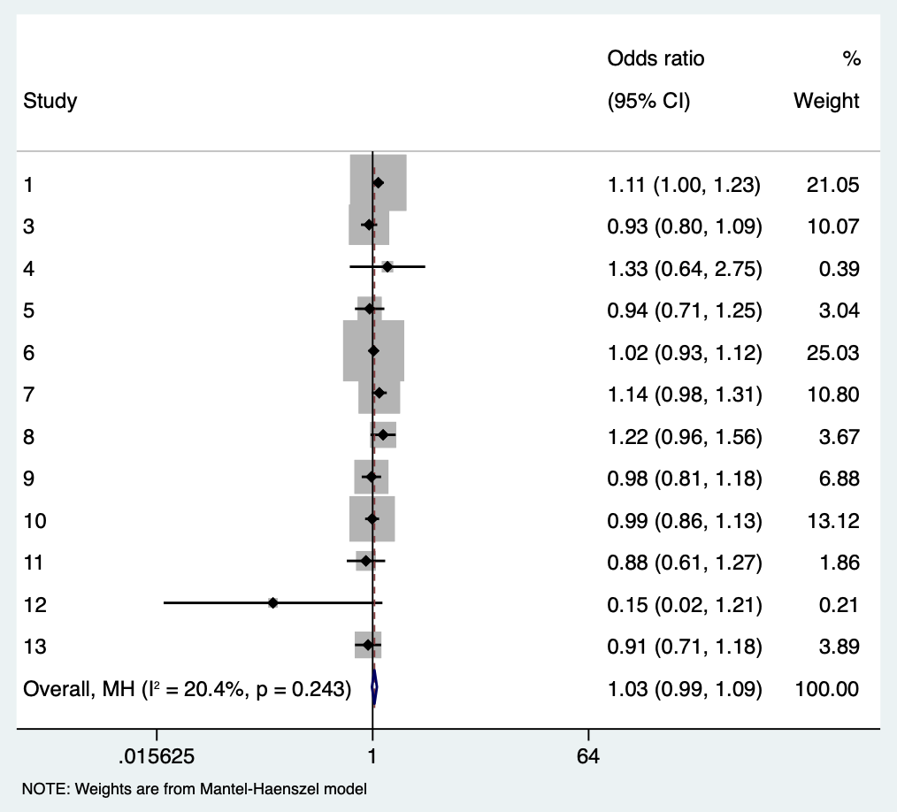
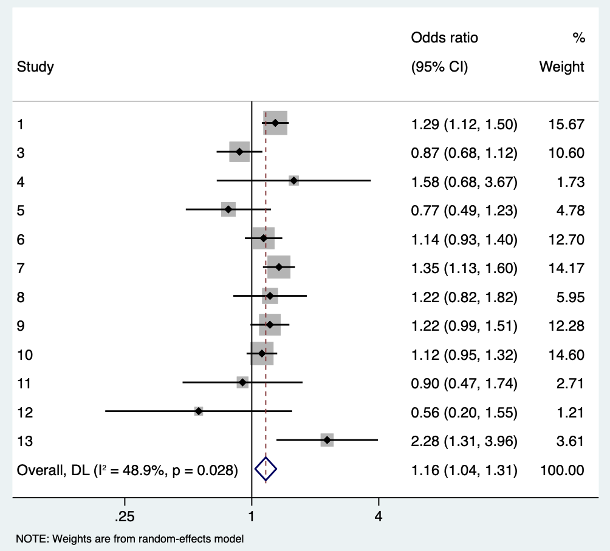
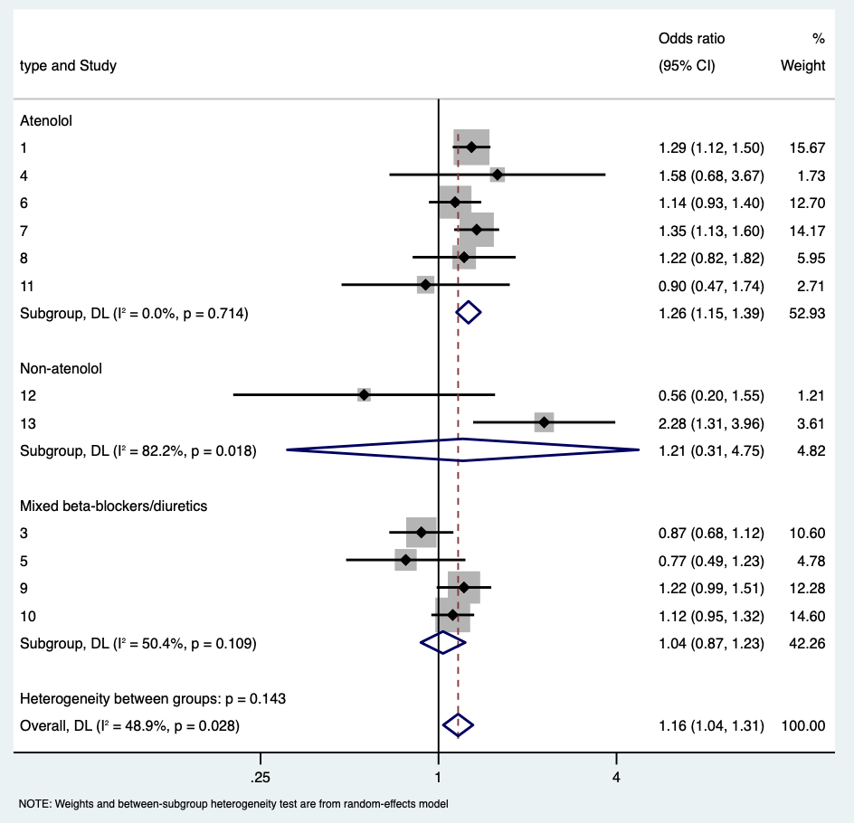
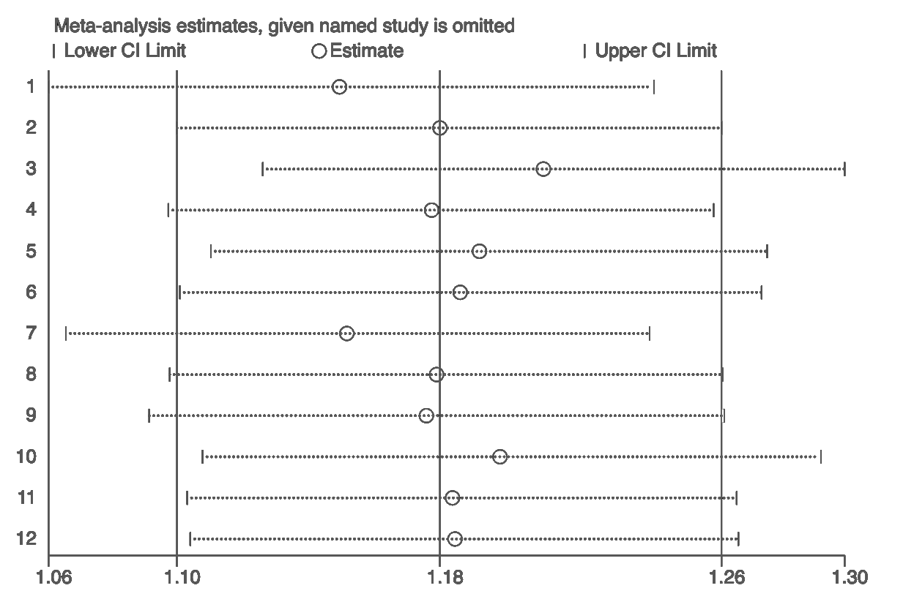
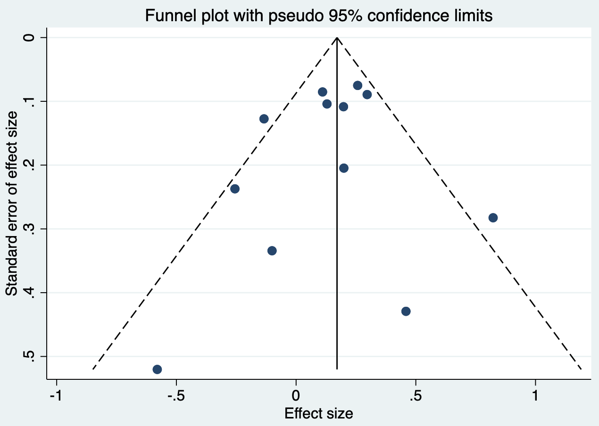
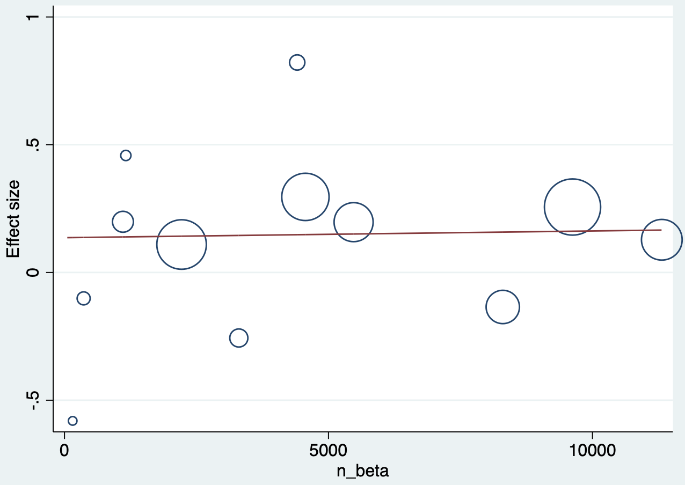
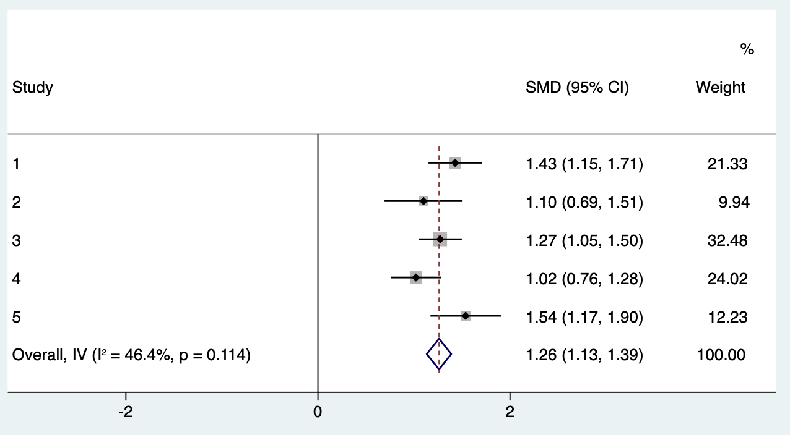

# 荟萃分析基本原理与方法

Meta分析（Meta-analysis），又称为荟萃分析，是用于比较和综合针对同一科学问题研究结果的统计学方法，常用于系统综述中的定量合并分析。与单个研究相比，通过整合所有相关研究，可更精准地估计医疗干预或卫生政策的效果，并有利于探索各研究证据的一致性及研究间的差异性。而当多个研究结果不一致或都无统计学意义时，采用Meta分析可得到接近真实情况的统计分析结果。但荟萃分析的结论是否有意义取决于纳入研究的质量。系统综述与荟萃分析是循证医学证据的重要基础，其规范的实施流程可参考《Cochrane 干预措施系统评价手册》（Cochrane Handbook）。

荟萃分析的开展可分为八个步骤，每个步骤详述如下。

## 研究问题的提出

所关注的研究问题是否需要开展荟萃分析来解决？当同一个临床问题有多个已经开展的随机对照研究，但这些研究的结果相互矛盾时，可以开展荟萃分析相互印证，合成一个确定的答案；或者同一个临床问题的随机对照研究样本数量都比较小，未能得出确定性的结论。

如果多个已经开展的随机对照研究已经解答了这个临床问题，再将这些研究的结果汇集在一起是没有意义的，如关于贝伐单抗作为结肠直肠癌辅助治疗的随机对照研究没有显示其能带来益处，三个类似的随机对照研究结果已明确地指出将贝伐单抗添加到结肠直肠癌的辅助化疗中是徒劳的，这时再开展荟萃分析就是多余的了。其次，荟萃分析的一个重要目的是综合来自现有随机对照研究的证据并汇总数据，当荟萃分析的数量超过同一主题的随机对照研究数量时，我们可能得扪心自问初心是否还在。Lancet杂志早在2014年曾提出提高医疗研究的价值并减少浪费，其首要原则就是设定正确的研究重点，以最大化研究潜力，避免多余的研究正是这一原则的体现。重要的是，我们要认识到多余的研究不仅仅是由于错误的方法学，方法正确而与临床无关的研究同样是浪费。荟萃分析作为医学研究中一个重要且强大的工具，可以被正确使用或误用。

## 撰写荟萃分析方案

采用PICOS原则来设计方案，从五个方面考虑：P代表Participants，研究者需考虑研究对象的疾病特征（组织学类型、病情等）和社会人口学特征（种族、年龄、性别等）；I代表Intervention，干预手段，临床研究中主要指治疗方法；C代表Comparison，对照组特征；O代表Outcome，结局指标，应注意定义明确，同时考虑结局指标是二分类、生存变量还是连续型变量，对后期数据提取和统计分析非常重要；S代表Study，研究类型，考虑纳入RCT、队列研究、病例对照研究或者是横断面研究？

研究方案可以在PROSPERO系统（www.crd.york.ac.uk/PROSPERO/）上注册，此系统是由英国国家健康研究所资助创立的国际性前瞻性系统评价注册系统。研究方案的提前注册，一是有助于避免不必要的重复，因为一项荟萃分析的完成通常是耗时耗力的，注册使得研究者能在计划进行系统评价的阶段得以检查是否已经存在类似主题且“正在进行中”的研究，以决定是否有必要继续开展一个新的项目。二是增加研究的透明性，众所周知，系统评价和荟萃分析在循证医学中具有重要的地位，其质量直接关联着许多医疗决策的制定。一个高质量的荟萃分析应该具有透明性、可靠性，并避免偏倚，而实现这些标准的其中一个关键步骤即在研究开始前提前制定方案，对主要研究目的，关键设计和计划分析方法进行界定，这样才能有助于避免偏倚，保证方法的透明性和结果可重复性。

## 检索研究

检索策略的制定主要从三个方面进行考虑。检索词：常常选择医学主题词（MeSH）结合自由词进行检索，另外检索式的编写，可以参考PICOS的原则。一般检索式中包含所研究的疾病和干预措施。数据库选择：中文通常为万方、维普和CNKI，英文有PubMed、Web of Science、Embase、Cochrane Library等；一般至少要检索PubMed，Embase以及COCHRANE三个数据库。研究的发表语言、发表年限有无限制。

文献的检索讲究查全率以及查准率，所以检索还应包括纳入文献的参考文献，相关综述的参考文献，一些会议文献等等。检索到的文献关乎下一步分析，如果检索漏了一两篇关键文献会影响最终结果，如果检索到太多的文献，会增加筛选的工作量。

## 研究的筛选

一般利用文献管理软件如Endnote，Mendeley等进行研究的筛选；根据纳入排除标准进行，并注意记录排除原因，以及排除的数量。需两名研究人员独立进行，对不一致结果通过讨论解决或找第三人裁决。筛选文献是一个很复杂，很费时的过程，可大致分为粗筛和细筛。粗筛阶段研究者可通过阅读文献标题或摘要决定是否筛除此文献，而细筛阶段则需通读文献的方法与结果部分来决定文献的取舍。

## 研究质量评估

通过评估研究质量来判断研究中是否存在偏倚，研究的设计是否符合要求。质量评估依靠量表，随机对照研究可采用Cochrane偏倚风险评价工具，从选择偏倚、实施偏倚、测量偏倚、随访偏倚、报告偏倚和其他偏倚6个方面进行偏倚风险评价（表6.1）。

**表6.1** **Cochrane偏倚风险评价工具**

+----------+----------------------------+--------------------------------------------------------+------------------------------------------------------------------------------------------------------------------------------------------------------------------------------------------------------------------------------------------------------+----------------------------------------------------------------------------------------------------------------------------------------------------------------------------------------------------------------------------------+------------------------------------------------------------------------------------------------------------------------------------+
|          |                            | 定义                                                   | 低偏倚风险                                                                                                                                                                                                                                           | 高偏倚风险                                                                                                                                                                                                                       | 不清楚                                                                                                                             |
+==========+============================+========================================================+======================================================================================================================================================================================================================================================+==================================================================================================================================================================================================================================+====================================================================================================================================+
| 选择偏倚 | 随机序列生成               | 随机序列的方法不恰当导致的选择性偏倚                   | 研究者在序列产生过程中描述了随机方法，如：随机数字表、计算机产牛陏机数字、抛硬币法、洗牌或信封、掷骰子抽签法、最小化法等                                                                                                                             | 研究者在序列产生过程中描述了非随机的方法，如：根据生日的奇数或偶数产生，由入院日期产生；由住院或就诊号码产生；根据临床医师的判断分配或根据病人意愿分配；基于实验室结果或一系列检查结果分配；根据干预措施的有效性分配             | 序列产生的信息不详，难以判断是“低风险”还是“高风险                                                                                  |
+----------+----------------------------+--------------------------------------------------------+------------------------------------------------------------------------------------------------------------------------------------------------------------------------------------------------------------------------------------------------------+----------------------------------------------------------------------------------------------------------------------------------------------------------------------------------------------------------------------------------+------------------------------------------------------------------------------------------------------------------------------------+
|          | 分配隐蔽                   | 由于分配方案隐蔽不完善导致的选择性偏倚                 | 受试者或招募受试者的研究人员不能预知分配情況，因为采用以下原因或者等效的方法来隐藏随机分配方案：中心分配（包括电话、网站和药房控制随机）；外形相同且有序的药物容器；不透光的有序的密封信封                                                           | 受试者或招募受试者的研究人员可能会预知分配情況而导致选择性偏倚，如：开放性随机分配表（如随机数字表）；信封缺乏恰当的保护（即信封不是密封的，不是有序的，或不是透明的）；交替或轮流分配；出生日期；病历号；其他明确不能隐藏的方法 | 无充分信息判断“低风险”或“高风险”。通常是隐藏的方法没描述或者没充分的描述而不能给出明确的判断                                       |
+----------+----------------------------+--------------------------------------------------------+------------------------------------------------------------------------------------------------------------------------------------------------------------------------------------------------------------------------------------------------------+----------------------------------------------------------------------------------------------------------------------------------------------------------------------------------------------------------------------------------+------------------------------------------------------------------------------------------------------------------------------------+
| 实施偏倚 | 对受试者、研究人员实施盲法 | 研究中干预措施的分配情況被受试者及研究者知晓导致的偏倚 | 对受试者和研究人员实施盲法，且盲法未被破坏；无盲法或盲法不完善，但结局评价不受到盲法的影响                                                                                                                                                           | 未采用盲法或盲法不完善，结果判断或测量会受到影响；对受试者实施盲法，但盲法可能被破坏                                                                                                                                             | 无充分信息判断，研究中没有报告                                                                                                     |
+----------+----------------------------+--------------------------------------------------------+------------------------------------------------------------------------------------------------------------------------------------------------------------------------------------------------------------------------------------------------------+----------------------------------------------------------------------------------------------------------------------------------------------------------------------------------------------------------------------------------+------------------------------------------------------------------------------------------------------------------------------------+
| 测量偏倚 | 对结局评估者实施盲         | 因结局评价者知道干预措施分组情況导致的偏倚             | 对结局评估者实施盲法，且盲法未被破坏；无盲法或盲法不完善，但结局评价不受到盲法的影响                                                                                                                                                                 | 未采用盲法或盲法不完善，结果判断或测量会受到影响；对结局评估者实施盲法，但盲法被破坏                                                                                                                                             | 无充分信息判断，研究中没有报告                                                                                                     |
|          |                            |                                                        |                                                                                                                                                                                                                                                      |                                                                                                                                                                                                                                  |                                                                                                                                    |
|          | 法                         |                                                        |                                                                                                                                                                                                                                                      |                                                                                                                                                                                                                                  |                                                                                                                                    |
+----------+----------------------------+--------------------------------------------------------+------------------------------------------------------------------------------------------------------------------------------------------------------------------------------------------------------------------------------------------------------+----------------------------------------------------------------------------------------------------------------------------------------------------------------------------------------------------------------------------------+------------------------------------------------------------------------------------------------------------------------------------+
| 随访偏倚 | 结果数据不完整             | 由于不完整的结果数据导致的偏倚                         | 无缺失数据；各组间缺失比例和原因相似；缺失数据不影响结果分析（如生存分析中的缺失值）；二分类结局中，缺失数据的比例与观察到的事件相比，不足以严重影响干预效应值；对于连续性变量结局，缺失数据不足以严重影响观察到的效应值；采用恰当的方法处理缺失数据 | 各组间缺失比例不平衡；二分类结局中，缺失数据的比例与观察到的事件相比，足以严重影响干预效应值；对于连续性变量结局，缺失数据足以严重影响观察到的效应值；采用符合方案分析，但违背方案的病例数较多；采用不恰当的方法处理缺失数据     | 信息不全，难以判断数据是否完整；研究末提及数据完整性的问題                                                                         |
+----------+----------------------------+--------------------------------------------------------+------------------------------------------------------------------------------------------------------------------------------------------------------------------------------------------------------------------------------------------------------+----------------------------------------------------------------------------------------------------------------------------------------------------------------------------------------------------------------------------------+------------------------------------------------------------------------------------------------------------------------------------+
| 报告偏倚 | 选择性报告                 | 由于选择性报告结果导致的偏倚                           | 有研究方案，且报告了所有预定的结局指标（主要和次要结局）；无研究计划但发表的研究报告中所有期望的结局均已报告                                                                                                                                         | 未报告所有预先指定的主要结局指标；报告的一个或多个结局指标未采用预先指定的测量或数据分析方法                                                                                                                                     | 一个或多个结局指标末预先设定（不包括没有预料到的不良反应）；荟萃分析关心的结局指标报告不完善；难以判断是否存在选择性报告结果的风险 |
+----------+----------------------------+--------------------------------------------------------+------------------------------------------------------------------------------------------------------------------------------------------------------------------------------------------------------------------------------------------------------+----------------------------------------------------------------------------------------------------------------------------------------------------------------------------------------------------------------------------------+------------------------------------------------------------------------------------------------------------------------------------+
| 其他偏倚 | 其他惼倚                   | 此表上述未包含的偏倚                                   | 无其他偏倚来源                                                                                                                                                                                                                                       | 如：研究设计有关的潜在偏倚；有造假行为；其他问題                                                                                                                                                                                 | 没有充分的信息判断是否存在重要偏倚风险                                                                                             |
+----------+----------------------------+--------------------------------------------------------+------------------------------------------------------------------------------------------------------------------------------------------------------------------------------------------------------------------------------------------------------+----------------------------------------------------------------------------------------------------------------------------------------------------------------------------------------------------------------------------------+------------------------------------------------------------------------------------------------------------------------------------+

观察性研究，可以用Newcastle-Ottawa评估量表，从选择、可比性、结果3个方面进行偏倚风险评价（表6.2）。

**表6.2** **Newcastle-Ottawa队列研究偏倚风险评价工具**

+------------------------------------------------------------------+
| **选择**（此类别下每个编号最多可获得一星）                       |
+==================================================================+
| 1\) 病例队列的代表性                                             |
|                                                                  |
| a\) 真正代表社区中的平均\_\_\_\_\_\_\_\_\_\_\_\_\_\_\_（描述）\* |
|                                                                  |
| b\) 在某种程度上代表社区中的平均\_\_\_\_\_\_\_\_\_\_\_\_\_\_ \*  |
|                                                                  |
| c\) 选定的队里，例如护士、志愿者                                 |
|                                                                  |
| d\) 没有描述群组的来源                                           |
+------------------------------------------------------------------+
| 2\) 非病例队列的选择                                             |
|                                                                  |
| a\) 来自与病例人群相同的社区 \*                                  |
|                                                                  |
| b\) 来自不同来源                                                 |
|                                                                  |
| c\) 没有描述非病例组的来源                                       |
+------------------------------------------------------------------+
| 3\) 病例的确定                                                   |
|                                                                  |
| a\) 病例记录（例如手术记录）\*                                   |
|                                                                  |
| b\) 与研究者的结构化面谈 \*                                      |
|                                                                  |
| c\) 书面自我报告                                                 |
|                                                                  |
| d\) 没有描述                                                     |
+------------------------------------------------------------------+
| 4\) 证明在研究开始时不存在感兴趣的结果                           |
|                                                                  |
| a\) 是 \*                                                        |
|                                                                  |
| b\) 没有                                                         |
+------------------------------------------------------------------+
| **可比性**（此类别下最多可获得两星）                             |
+------------------------------------------------------------------+
| 1\) 基于设计或分析的队列可比性                                   |
|                                                                  |
| a\) 对 \_\_\_\_\_\_\_\_\_\_\_\_\_ 的控制（选择最重要的因素）\*   |
|                                                                  |
| b\) 对任何其他因素的控制 \*                                      |
+------------------------------------------------------------------+
| **结果**（此类别下每个编号最多可获得一星）                       |
+------------------------------------------------------------------+
| 1\) 结果评估                                                     |
|                                                                  |
| a\) 独立盲法评价 \*                                              |
|                                                                  |
| b\) 基于病例记录 \*                                              |
|                                                                  |
| c\) 自我报告                                                     |
|                                                                  |
| d\) 没有描述                                                     |
+------------------------------------------------------------------+
| 2\) 随访时间是否足够长以产生结局事件                             |
|                                                                  |
| a\) 是（为感兴趣的结果选择适当的随访期）\*                       |
|                                                                  |
| b\) 否                                                           |
+------------------------------------------------------------------+
| 3\) 队列随访的充分性                                             |
|                                                                  |
| a\) 完整的随访 \*                                                |
|                                                                  |
| b\) 失访的受试者不太可能引入偏倚 - 少数受试者失访 \*             |
|                                                                  |
| c\) 较多失访，没有描述失访的人                                   |
|                                                                  |
| d\) 没有声明                                                     |
+------------------------------------------------------------------+

诊断性研究，是比较某种新的诊断方法与金标准的诊断正确率，评估其是否可以用于临床的研究，可以用QUADAS-2量表来进行偏倚评估（表6.3）。

**表6.3 QUADAS-2诊断性研究偏倚风险评价工具**

| 领域 | 患者选择 | 新诊断方法 | 金标准 | 流程和时间 |
|:---|:---|:---|:---|:---|
| 描述 | 描述患者选择的方法；描述纳入的患者（已有的诊断方法、临床表现、新诊断方法的预期用途和设置） | 描述新诊断方法及其开展与解释方法 | 描述金标准及其开展与解释方法 | 描述研究排除的受试者；描述新诊断方法和金标准之间的时间间隔和受试者接受的任何干预措施 |
| 偏倚问题（是、否或不清楚） | 入组受试者是连续的或随机的吗？是否避免了病例对照设计？是否避免了不适当的排除？ | 是否在不了解金标准结果的情况下解释新诊断方法的结果？如果使用了阈值，是否是预先指定的？ | 金标准是否可正确分类受试者？是否在不了解新诊断方法结果的情况下解释了金标准结果？ | 新诊断方法和金标准之间是否有适当的时间间隔？是否所有患者都有金标准？是否所有患者都有相同的金标准？是否所有患者都纳入数据分析？ |
|  | 根据上述问题判断是否存在偏倚风险（高、低或不清楚） |  |  |  |
| 适用性（高、低或不清楚） | 纳入的患者与荟萃分研究问题不匹配？ | 新诊断方法的开展与解释与荟萃分研究问题不匹配？ | 金标准的开展与解释与荟萃分研究问题不匹配？ |  |

## 数据提取

主要包括文献基本信息（作者、发表时间、刊物等）、研究类型和方法学特征、研究对象特征（社会人口学特征、疾病诊断标准、对照的选择标准等）、干预措施和结局指标测量、效应指标、样本量等。数据同样需要由两名研究人员独立进行，对不一致结果通过讨论解决或找第三人裁决。具体包含以下几个方面：

受试者：年龄、性别、种族、基础疾病、各组多少例受试者、研究所在地区

干预/对照：随机/非随机、剂量、方法、干预期限、合并干预措施

结局：定义、单位、测量方法、随访时间、失访率

- 连续变量：平均值，标准差

- 分类变量：发生例数，总数

- 意向性分析/按方案分析

- 次要结局事件

## 数据分析

统计分析包括判断异质性、异质性分析、探索结果的稳定性以及发表偏倚。常用的荟萃分析软件有Review Manager（RevMan），Stata和R。Review Manager（RevMan）是Cochrane协作网系统评价的标准化专用软件，具备荟萃分析的绝大部分功能、操作简单、结果直观。Stata和R分析功能更为全面和强大，可进行meta回归分析、定量检测发表偏倚、诊断性meta分析等，但需写命令行。

**案例6.1**

研究问题：比较Beta受体阻滞剂与其他药物，能否降低原发性高血压患者的卒中率与死亡率。文献检索并筛选后共纳入13项随机对照研究，下表即所需要提取的数据，每一行代表一个研究，stroke_beta代表Beta受体阻断剂组中发生卒中的病例数，stroke_other代表其它药物组发生卒中的病例数，mort_beta代表Beta受体阻断剂组中死亡的病例数，mort_other代表其它药物组死亡的病例数最后两列是Beta受体阻断剂的总纳入病例数和其他药物组总的病例数。

**案例6.1数据表**

| Study | type | stroke_beta | stroke_other | mort_beta | mort_other | n_beta | n_other |
|:---|:---|:---|:---|:---|:---|:---|:---|
| 1 | Atenolol | 422 | 327 | 820 | 738 | 9618 | 9639 |
| 2 | Non-atenolol | / | / | 5 | 4 | 53 | 53 |
| 3 | Mixed beta-blockers/diuretics | 118 | 133 | 319 | 337 | 8297 | 8179 |
| 4 | Atenolol | 14 | 9 | 17 | 13 | 1157 | 1177 |
| 5 | Mixed beta-blockers/diuretics | 32 | 41 | 96 | 101 | 3297 | 3272 |
| 6 | Atenolol | 201 | 176 | 893 | 873 | 11309 | 11267 |
| 7 | Atenolol | 309 | 232 | 431 | 383 | 4558 | 4605 |
| 8 | Atenolol | 56 | 45 | 167 | 134 | 1102 | 1081 |
| 9 | Mixed beta-blockers/diuretics | 196 | 159 | 228 | 231 | 5471 | 5410 |
| 10 | Mixed beta-blockers/diuretics | 237 | 422 | 369 | 742 | 2213 | 4401 |
| 11 | Atenolol | 17 | 21 | 59 | 75 | 358 | 400 |
| 12 | Non-atenolol | 6 | 11 | 1 | 7 | 150 | 154 |
| 13 | Non-atenolol | 42 | 18 | 120 | 128 | 4403 | 4297 |

### 荟萃与森林图

首先计算Beta受体阻滞剂能否降低死亡率。在Stata中，可以利用metan命令来计算合并后的效应，metan后的四个参数，分别是Beta受体阻断剂组的死亡例数，Beta受体阻断剂的总例数，其它药物组的死亡例数和其它药物组的总例数。效应的表示方法可以是风险比（RR），或是比值比（OR）。Stata输出的荟萃分析结果，汇总的比值比为1.034，其95%置信区间为0.985-1.085，p值为0.174，因此可以得出结论，Beta受体阻断剂与其他药物组相比，并无法显著减低患者的死亡率。

+-------------------------------------------------+
|                                                 |
+=================================================+
| 代码6.1                                         |
|                                                 |
| . metan mort_beta n_beta mort_other n_other, or |
+-------------------------------------------------+

**代码6.1 输出**

| Study | Odds ratio | \[95% Conf. Interval\] | \% Weight |   |
|:---|:---|:---|:---|----|
| 1 | **1.114** | **1.004** | **1.235** | **21.02** |
| 2 | **1.250** | **0.318** | **4.913** | **0.11** |
| 3 | **0.933** | **0.798** | **1.091** | **10.06** |
| 4 | **1.330** | **0.643** | **2.751** | **0.39** |
| 5 | **0.943** | **0.710** | **1.253** | **3.03** |
| 6 | **1.019** | **0.925** | **1.123** | **25.00** |
| 7 | **1.137** | **0.985** | **1.312** | **10.79** |
| 8 | **1.223** | **0.959** | **1.558** | **3.66** |
| 9 | **0.976** | **0.810** | **1.176** | **6.87** |
| 10 | **0.989** | **0.864** | **1.132** | **13.10** |
| 11 | **0.879** | **0.607** | **1.272** | **1.86** |
| 12 | **0.147** | **0.018** | **1.207** | **0.21** |
| 13 | **0.915** | **0.711** | **1.178** | **3.88** |
| Overall, MH | **1.034** | **0.986** | **1.085** | **100.00** |
| Test of overall effect = 1: z = 1.370 p = 0.171 |  |  |  |  |

命令执行过程中，系统会自动的做出森林图，其中每一行代表一个研究，最后一行是汇总的比值比。灰色方框的大小代表样本量的多少，此图可以看出研究的样本量越大，其所占权重越大。

{width="100%"}

**代码6.1 输出森林图**

### 异质性分析

荟萃分析中一个非常重要的检验为异质性检验，检验不同的研究间的相似性如何。正式的异质性检验是用卡方分析来进行，但一般而言，利用卡方分析的异质性检验其效能相对较低。I方是另外一种异质性检验的方法。如果I方在25%以下的话，可以认为异质性较低，如果I方超过50%，一般认为异质性较高。异质性检验的一个重要作用在于，如果异质性低可以用固定效应模型来进行荟萃分析，但如果异质性较高，则需要采用随机效应模型。本案例中异质性检验的I方是20.4%，可以认为此研究的异质性较低，采用固定效应模型比较合适。I² 统计量度量的是研究间变异占总变异的比例，其定义与解读可参见 Higgins 与 Thompson（2002）以及 Higgins 等（2003）；需要注意 I² 的取值还受纳入研究数目与样本量的影响，应结合卡方检验与临床判断综合考量。

**代码6.1输出**

+-------------------------------------------------------------------------------------------------------+--------------------------+-----------+-----------+
| Heterogeneity measures, calculated from the data                                                      |                          |           |           |
|                                                                                                       |                          |           |           |
| with Conf. Intervals based on non-central chi² (common-effect) distribution for Q                     |                          |           |           |
+=======================================================================================================+==========================+===========+===========+
| Measure                                                                                               | Value                    | df        | p-value   |
+-------------------------------------------------------------------------------------------------------+--------------------------+-----------+-----------+
| Mantel-Haenszel Q                                                                                     | **13.90**                | **12**    | **0.307** |
+-------------------------------------------------------------------------------------------------------+--------------------------+-----------+-----------+
|                                                                                                       | -\[95% Conf. Interval\]- |           |           |
+-------------------------------------------------------------------------------------------------------+--------------------------+-----------+-----------+
| H                                                                                                     | **1.076**                | **1.000** | **1.496** |
+-------------------------------------------------------------------------------------------------------+--------------------------+-----------+-----------+
| I² (%)                                                                                                | **13.7%**                | **0.0%**  | **55.3%** |
+-------------------------------------------------------------------------------------------------------+--------------------------+-----------+-----------+
| H = relative excess in Mantel-Haenszel Q over its degrees-of-freedom                                  |                          |           |           |
|                                                                                                       |                          |           |           |
| I² = proportion of total variation in effect estimate due to between-study heterogeneity (based on Q) |                          |           |           |
+-------------------------------------------------------------------------------------------------------+--------------------------+-----------+-----------+

使用固定效应模型的前提是每个研究设计比较相似，异质性比较小，因此对于样本量大的那些研究给出的权重就较大。使用随机效应模型是假设不同研究设计是有差别的，研究间的异质性较高。因此荟萃分析给出的每个研究的权重比较均衡，得出的结果也会更加保守，通常认为除非纳入的研究非常相似，更倾向于使用随机效应模型。固定效应模型假设各研究估计的是同一个真实效应，而随机效应模型允许各研究的真实效应服从某一分布，二者的区别与随机效应模型的经典估计方法可参见 DerSimonian 与 Laird（1986）。

然后计算次要结局事件，即Beta受体阻滞剂能否降低患者的卒中发生率。异质性分析 I方达到48.9%，虽未及50%，但可认为此研究存在异质性。此时，应该使用随机效应模型计算，metan后指定模型采用随机效应模型（random）。结果提示Beta受体阻滞剂能降低患者的卒中概率，比值比为1.17，95%置信区间为1.04-1.31，p值为0.010。

+-----------------------------------------------------+
|                                                     |
+=====================================================+
| 代码6.2                                             |
|                                                     |
| . metan stroke_beta n_beta stroke_other n_other, or |
+-----------------------------------------------------+

**代码6.2输出**

+-------------------------------------------------------------------------------------------------------+--------------------------+-----------+-----------+
| Heterogeneity measures, calculated from the data                                                      |                          |           |           |
|                                                                                                       |                          |           |           |
| with Conf. Intervals based on non-central chi² (common-effect) distribution for Q                     |                          |           |           |
+=======================================================================================================+==========================+===========+===========+
| Measure                                                                                               | Value                    | df        | p-value   |
+-------------------------------------------------------------------------------------------------------+--------------------------+-----------+-----------+
| Mantel-Haenszel Q                                                                                     | **21.53**                | **11**    | **0.028** |
+-------------------------------------------------------------------------------------------------------+--------------------------+-----------+-----------+
|                                                                                                       | -\[95% Conf. Interval\]- |           |           |
+-------------------------------------------------------------------------------------------------------+--------------------------+-----------+-----------+
| H                                                                                                     | **1.399**                | **1.000** | **1.897** |
+-------------------------------------------------------------------------------------------------------+--------------------------+-----------+-----------+
| I² (%)                                                                                                | **48.9%**                | **0.0%**  | **72.2%** |
+-------------------------------------------------------------------------------------------------------+--------------------------+-----------+-----------+
| H = relative excess in Mantel-Haenszel Q over its degrees-of-freedom                                  |                          |           |           |
|                                                                                                       |                          |           |           |
| I² = proportion of total variation in effect estimate due to between-study heterogeneity (based on Q) |                          |           |           |
+-------------------------------------------------------------------------------------------------------+--------------------------+-----------+-----------+

+------------------------------------------------------------+
|                                                            |
+============================================================+
| 代码6.3                                                    |
|                                                            |
| . metan stroke_beta n_beta stroke_other n_other, or random |
+------------------------------------------------------------+

**代码6.3输出**

| Study | Odds ratio | \[95% Conf. Interval\] | \% Weight |   |
|:---|:---|:---|:---|----|
| 1 | **1.293** | **1.116** | **1.498** | **15.67** |
| 3 | **0.875** | **0.681** | **1.123** | **10.60** |
| 4 | **1.582** | **0.682** | **3.670** | **1.73** |
| 5 | **0.775** | **0.487** | **1.233** | **4.78** |
| 6 | **1.138** | **0.928** | **1.395** | **12.70** |
| 7 | **1.346** | **1.129** | **1.603** | **14.17** |
| 8 | **1.221** | **0.817** | **1.823** | **5.95** |
| 9 | **1.219** | **0.986** | **1.508** | **12.28** |
| 10 | **1.117** | **0.945** | **1.320** | **14.60** |
| 11 | **0.904** | **0.470** | **1.742** | **2.71** |
| 12 | **0.560** | **0.202** | **1.553** | **1.21** |
| 13 | **2.277** | **1.309** | **3.962** | **3.61** |
| Overall, DL | **1.165** | **1.038** | **1.308** | **100.00** |
| Test of overall effect = 1: z = 2.587 p = 0.010 |  |  |  |  |

{width="100%"}

**代码6.3输出森林图：随机效应模型**

虽然荟萃分析提示Beta受体阻滞剂能降低患者的卒中概率，但不同研究中存在异质性，因此需要探索异质性的来源。异质性探索的方法一般是采用分层分析，在各个亚组之间分别进行荟萃分析，metan后指定亚组type。在这个荟萃研究中，纳入研究的Beta受体阻断剂有很多类别，有Atenolol，非Atenolol和混用这三种类别。荟萃分析中可以采用分层分析分别探讨不用药物类别的荟萃效应。森林图分别显示了三种类别的荟萃分析结果，第一个亚组是Atenolol，I方是零，说明这个亚组中的均匀性较好。非Atenolol亚组中只有两个研究，异质性高。第三个亚组是混合组，I方和异质性检验均较高。因此可以得出结论，在Atenolol亚组中，beta受体阻滞剂能够明显降低患者卒中的概率，但在其他两个亚组中的效应可能还需要进一步的研究。

+---------------------------------------------------------------------+
|                                                                     |
+=====================================================================+
| 代码6.4                                                             |
|                                                                     |
| . metan stroke_beta n_beta stroke_other n_other, or random by(type) |
+---------------------------------------------------------------------+

**代码6.4输出**

+-------------------------------------------------+------------+------------------------+-----------+------------+
| Study                                           | Odds ratio | \[95% Conf. Interval\] | \% Weight |            |
+=================================================+============+========================+===========+============+
| Atenolol                                        |            |                        |           |            |
+-------------------------------------------------+------------+------------------------+-----------+------------+
| 1                                               | **1.293**  | **1.116**              | **1.498** | **15.67**  |
+-------------------------------------------------+------------+------------------------+-----------+------------+
| 4                                               | **1.582**  | **0.682**              | **3.670** | **1.73**   |
+-------------------------------------------------+------------+------------------------+-----------+------------+
| 6                                               | **1.138**  | **0.928**              | **1.395** | **12.70**  |
+-------------------------------------------------+------------+------------------------+-----------+------------+
| 7                                               | **1.346**  | **1.129**              | **1.603** | **14.17**  |
+-------------------------------------------------+------------+------------------------+-----------+------------+
| 8                                               | **1.221**  | **0.817**              | **1.823** | **5.95**   |
+-------------------------------------------------+------------+------------------------+-----------+------------+
| 11                                              | **0.904**  | **0.470**              | **1.742** | **2.71**   |
+-------------------------------------------------+------------+------------------------+-----------+------------+
| Subgroup, DL                                    | **1.263**  | **1.149**              | **1.388** | **52.93**  |
+-------------------------------------------------+------------+------------------------+-----------+------------+
| Non-atenolol                                    |            |                        |           |            |
+-------------------------------------------------+------------+------------------------+-----------+------------+
| 12                                              | **0.560**  | **0.202**              | **1.553** | **1.21**   |
+-------------------------------------------------+------------+------------------------+-----------+------------+
| 13                                              | **2.277**  | **1.309**              | **3.962** | **3.61**   |
+-------------------------------------------------+------------+------------------------+-----------+------------+
| Subgroup, DL                                    | **1.209**  | **0.308**              | **4.748** | **4.82**   |
+-------------------------------------------------+------------+------------------------+-----------+------------+
| Mixed beta-blockers/diuretics                   |            |                        |           |            |
+-------------------------------------------------+------------+------------------------+-----------+------------+
| 3                                               | **0.875**  | **0.681**              | **1.123** | **10.60**  |
+-------------------------------------------------+------------+------------------------+-----------+------------+
| 5                                               | **0.775**  | **0.487**              | **1.233** | **4.78**   |
+-------------------------------------------------+------------+------------------------+-----------+------------+
| 9                                               | **1.219**  | **0.986**              | **1.508** | **12.28**  |
+-------------------------------------------------+------------+------------------------+-----------+------------+
| 10                                              | **1.117**  | **0.945**              | **1.320** | **14.60**  |
+-------------------------------------------------+------------+------------------------+-----------+------------+
| Subgroup, DL                                    | **1.035**  | **0.871**              | **1.232** | **42.26**  |
+-------------------------------------------------+------------+------------------------+-----------+------------+
| Overall, DL                                     | **1.165**  | **1.038**              | **1.308** | **100.00** |
+-------------------------------------------------+------------+------------------------+-----------+------------+
| Tests of subgroup effect size = 1:              |            |                        |           |            |
|                                                 |            |                        |           |            |
| Atenolol z = 4.857 p = 0.000                    |            |                        |           |            |
|                                                 |            |                        |           |            |
| Non-atenolol z = 0.272 p = 0.786                |            |                        |           |            |
|                                                 |            |                        |           |            |
| Mixed beta-blockers/diureti z = 0.394 p = 0.694 |            |                        |           |            |
|                                                 |            |                        |           |            |
| Overall z = 2.587 p = 0.010                     |            |                        |           |            |
+-------------------------------------------------+------------+------------------------+-----------+------------+

{width="100%"}

**代码6.4输出：亚组分析森林图**

### 敏感性分析

荟萃分析中的敏感性分析含义是探究单个研究对整体的影响。该分析的步骤是删除纳入的某一项研究，在剩下的研究中进行分析。然后不断重复进行此步骤来观察删除某项研究之后剩下研究中的荟萃分析和全部纳入比较是不是有明显的差别。敏感性分析的结果每一行代表删除该研究后剩余样本中的荟萃结果，可以看到基本上任一单个研究对于整体结果的影响不大。

+----------------------------------------------------+
|                                                    |
+====================================================+
| 代码6.5                                            |
|                                                    |
| . metaninf stroke_beta n_beta stroke_other n_other |
+----------------------------------------------------+

{width="100%"}

**代码6.4输出：敏感性分析**

### 发表偏倚

荟萃分析中有一个非常重要的偏倚，称之为发表偏倚。其含义是阳性结果的研究更容易被发表，而阴性结果的研究难以发表。通常使用漏斗图可以明显地检测出这种发表偏倚的存在，漏斗图的X轴表示研究的效应大小，Y轴是效应的标准误，一般而言，样本量大的研究集中在漏斗的顶部，因为这些研究的标准误比较小，而样本量小的研究则分散在漏斗的口部。如果存在发表偏倚，漏斗口部的研究，即样本量较小的研究，会集中在实线的一边。因为样本量小的且具有阳性结果的研究，更容易被发表。本案漏斗图上没有发现明显的发表偏倚。除目测漏斗图是否对称外，还可采用 Egger 等（1997）提出的线性回归法对漏斗图不对称进行正式的统计检验；但当纳入研究数目较少（如少于10项）时，此类检验的效能较低，结果需谨慎解读。

+--------------------------+
|                          |
+==========================+
| 代码6.6                  |
|                          |
| . metafunnel \_ES \_seES |
+--------------------------+

{width="100%"}

**代码6.6发表偏倚漏斗图**

### 荟萃回归

荟萃回归方法可以探索某一指标与结局效应之间的关系，如研究者想知道是否纳入的病例数越多Beta受体阻滞剂的效应越大。荟萃回归的结果以泡泡图表示，其中每个泡泡代表一个研究，泡泡的大小代表这个研究的样本量，横坐标为纳入例数，纵坐标是效应大小。以效应大小对纳入病例数做回归，可以看到拟合曲线为一条基本水平的直线，因此可以得出结论Beta受体阻滞剂的效应与纳入的病例数无关。荟萃回归用于探索研究层面的协变量对效应大小的影响，其实施与解读（包括生态学谬误与多重检验的风险）可参见 Thompson 与 Higgins（2002）。

+-------------------------------------------+
|                                           |
+===========================================+
| 代码6.7                                   |
|                                           |
| . metareg \_ES n_beta, wsse(\_seES) graph |
+-------------------------------------------+

{width="100%"}

**代码6.7荟萃回归泡泡图**

**案例6.2**

案例6.1中结局事件为二变量，即死亡与非死亡，发生卒中与不发生卒中，临床研究中的结局事件亦可为连续变量。帕金森患者采用手术治疗刺激丘脑核团以降低患者的震颤评分，比较刺激手术与空白对照之后的震颤程度的改变。此研究结局事件为干预前后的震颤评分的改变，为连续变量。共纳入五项随机对照研究，每一行一个研究，Stinumber 是刺激手术的纳入例数，Stimean是刺激手术前后震颤评分改变的平均值，Stisd是刺激手术前后评分改变的标准差，Controlnumber Controlmean和Controlsd分别是空白对照组的纳入例数，震颤评分改变的平均值，震颤评分改变的标准差。

**案例6.2数据表**

| Study | Sample size | Stinumber | Stimean | Stisd | Controlnumber | Controlmean | Controlsd |
|:------|:------------|:----------|:--------|:------|:--------------|:------------|:----------|
| 1     | 251         | 124       | 17.5    | 11.1  | 127           | 1.5         | 11.3      |
| 2     | 136         | 101       | 16      | 10.5  | 35            | 3.7         | 13        |
| 3     | 366         | 183       | 17.2    | 13.1  | 183           | 0.4         | 13.3      |
| 4     | 255         | 134       | 12.3    | 11.2  | 121           | 1.7         | 9.4       |
| 5     | 149         | 71        | 19.6    | 15.1  | 78            | 0.4         | 9.5       |

结局变量为连续变量时，效应的表示一般选择标准化的平均差（standardized mean difference, SMD）。采用标准化平均差的优势是如果纳入的不同的研究结局指标单位不统一或是评分量表不一致，研究与研究之间的结局数值可能差距比较大，采用标准化平均差就可以消除这种问题所带来的影响。

+---------------------------------------------------------------------+
|                                                                     |
+=====================================================================+
| 代码6.8                                                             |
|                                                                     |
| . metan stinumber stimean stisd controlnumber controlmean controlsd |
+---------------------------------------------------------------------+

**代码6.8 输出**

| Study | SMD | \[95% Conf. Interval\] | \% Weight |   |
|:---|:---|:---|:---|----|
| 1 | **1.428** | **1.151** | **1.706** | **21.33** |
| 2 | **1.099** | **0.693** | **1.506** | **9.94** |
| 3 | **1.273** | **1.048** | **1.497** | **32.48** |
| 4 | **1.021** | **0.759** | **1.282** | **24.02** |
| 5 | **1.538** | **1.172** | **1.904** | **12.23** |
| Overall, IV | **1.261** | **1.132** | **1.389** | **100.00** |
| Test of overall effect = 0: z = 19.284 p = 0.000 |  |  |  |  |

{width="100%"}

**代码6.8 输出森林图**

## 荟萃分析的报告

荟萃分析的报告需要按照一定的规范，PRISMA网站上有荟萃分析的报告清单，具体规范了撰写荟萃分析文章时需要报告哪些内容？其基本内容包括：标题，摘要、背景，方法学，结局讨论等，可具体参考：

http://prisma-statement.org/PRISMAStatement/Checklist.aspx

**表6.4 PRISMA荟萃分析报告清单**

| 段落 |   | 条目 |
|:---|----|:---|
| **标题部分** |  |  |
| 标题 | 1 | 确定该报告为系统综述 |
| **摘要部分** |  |  |
| 摘要 | 2 | 参见PRISMA 2020摘要检查表 |
| 背景部分 |  |  |
| 理由 | 3 | 描述在现有知识背景下进行回顾的理由。 |
| 目的 | 4 | 明确说明该综述的目标或问题。 |
| **方法部分** |  |  |
| 入组标准 | 5 | 具体说明综述的纳入和排除标准，以及如何对研究进行综合分组。 |
| 信息来源 | 6 | 具体说明为确定研究而搜索或查阅的所有数据库、注册、网站、组织、参考文献列表和其他来源。具体说明每个来源最后被搜索的日期。 |
| 检索策略 | 7 | 介绍所有数据库、注册和网站的完整检索策略，包括使用的任何过滤器和限制。 |
| 筛选过程 | 8 | 具体说明筛选研究是否符合纳入标准的方法，包括有多少名研究者筛选每条记录和检索报告，是否独立工作，以及如果适用的话，该过程中使用的自动化工具的细节。 |
| 数据收集过程 | 9 | 具体说明从报告中收集数据的方法，包括有多少名研究者从报告中收集数据，是否独立工作，确认数据的过程，以及如果适用，过程中使用的自动化工具的细节。 |
| 数据项目 | 10a | 列出并定义所有结局。具体说明是否寻求每个研究中的所有结局（如测量、时间点、分析方法），是否具有可比性，如果不是，确定收集特殊结果所用的方法。 |
|  | 10b | 列出并定义所有其他变量（如受试者和干预特征、资金来源）。说明对任何缺失或不清楚的信息所做的假设。 |
| 偏倚评估 | 11 | 具体说明用于评估所纳入研究偏倚风险的方法，包括所使用工具的细节，有多少名研究中评估研究，是否独立工作，如果适用，在此过程中使用的自动化工具的细节。 |
| 结局指标 | 12 | 具体说明结局的测量方法（如风险比、平均差异）。 |
| 荟萃方法 | 13a | 描述每个研究符合纳入条件的原因（如将研究的干预进行列表并与对照组进行比较） |
|  | 13b | 描述准备数据所需的任何方法，如处理缺失或数据转换。 |
|  | 13c | 描述是否采用列表或直观显示单个研究结果和综合结果的任何方法。 |
|  | 13d | 描述用于荟萃结果的方法，并提供选择这种方法的理由。描述模型、识别统计异质性存在和程度的方法，以及所使用的软件包。 |
|  | 13e | 描述任何用于探索研究结果中异质性可能原因的方法（如亚组分析、荟萃回归）。 |
|  | 13f | 描述为评估结果稳健性所进行的任何敏感性分析。 |
| 报告偏倚 | 14 | 描述任何用于评估研究中因结果缺失而产生偏倚风险的方法（由发表偏倚引起）。 |
| 置信评估 | 15 | 描述用于评估结果证据体系置信的任何方法。 |
| **结果部分** |  |  |
| 研究选择 | 16a | 描述检索和筛选过程的结果，从检索中发现的记录数量到纳入综述的研究数量，最好用流程图来说明。 |
|  | 16b | 列举可能符合纳入标准但被排除在外的研究，并解释其被排除的原因。 |
| 研究特点 | 17 | 列举每项纳入的研究并介绍其特点。 |
| 偏倚评估 | 18 | 对每项纳入的研究进行偏倚风险评估。 |
| 每项研究描述 | 19 | 对每项研究提出：每组的汇总统计量（如适用）和效果估计及其精确度（如置信/可信区间），最好使用结构化表格或图表。 |
| 荟萃结果 | 20a | 简要总结每项纳入研究的特点和偏倚风险。 |
|  | 20b | 介绍所有统计综合的结果。如果进行了荟萃分析，介绍点估计及其精确度（如置信/可信区间）以及统计异质性的测量。如果进行组间比较，说明效果的方向。 |
|  | 20c | 对研究结果之间异质性的可能原因以及所有调查结果。 |
|  | 20d | 为评估结果的稳健性而进行的所有敏感性分析的结果。 |
| 报告偏倚 | 21 | 评估研究中因结果缺失而产生偏倚风险（由发表偏倚引起）。 |
| 置信评估 | 22 | 评估结果证据体系的置信。 |
| **讨论部分** |  |  |
| 讨论 | 23a | 在其他证据的背景下，对结果进行一般性解释。 |
|  | 23b | 讨论证据的任何局限性。 |
|  | 23c | 讨论所使用综述程序的任何局限性。 |
|  | 23d | 讨论结果对实践、政策和未来研究的影响。 |
| **其他信息** |  |  |
| 注册与方案 | 24a | 提供综述的注册信息，包括注册名称和注册号码，或说明综述没有注册。 |
|  | 24b | 说明在哪里可以获得综述方案，或说明没有预先准备方案 |
|  | 24c | 描述并解释对预先准备方案中提供信息的任何修正。 |
| 资助 | 25 | 说明综述财务或非财务支持的来源，以及资助者或赞助者在审查中的作用。 |
| 利益冲突 | 26 | 申报研究者的任何竞争性利益冲突。 |
| 数据、代码和其他材料的可得性 | 27 | 报告以下哪些内容是公开的，在哪里可以找到：模板数据收集表；从纳入的研究中提取的数据；用于所有分析的数据；分析代码；任何其他材料。 |

## 参考文献

1.  Page MJ, McKenzie JE, Bossuyt PM, Boutron I, Hoffmann TC, Mulrow CD, et al. The PRISMA 2020 statement: an updated guideline for reporting systematic reviews. BMJ 2021;372:n71.

2.  Yang ZR, Sun F, Zhan SY. \[Risk on bias assessment: (2) Revised Cochrane risk of bias tool for individually randomized, parallel group trials (RoB2.0)\]. Zhonghua Liu Xing Bing Xue Za Zhi. 2017 Sep 10;38(9):1285-1291. Chinese.

3.  Wells G, Shea B, O’Connell D, Peterson J, Welch V, Losos M, Tugwell P. The Newcastle-Ottawa Scale (NOS) for assessing the quality of nonrandomised studies in meta-analyses. 2013. <http://www.ohri.ca/programs/clinical_epidemiology/oxford.asp>.

4.  Whiting PF, Rutjes AW, Westwood ME, Mallett S, Deeks JJ, Reitsma JB, Leeflang MM, Sterne JA, Bossuyt PM; QUADAS-2 Group. QUADAS-2: a revised tool for the quality assessment of diagnostic accuracy studies. Ann Intern Med. 2011 Oct 18;155(8):529-36.

5.  DerSimonian R, Laird N. Meta-analysis in clinical trials. Controlled Clinical Trials, 1986, 7(3):177-188.

6.  Higgins JPT, Thompson SG. Quantifying heterogeneity in a meta-analysis. Statistics in Medicine, 2002, 21(11):1539-1558.

7.  Higgins JPT, Thompson SG, Deeks JJ, Altman DG. Measuring inconsistency in meta-analyses. BMJ, 2003, 327(7414):557-560.

8.  Egger M, Davey Smith G, Schneider M, Minder C. Bias in meta-analysis detected by a simple, graphical test. BMJ, 1997, 315(7109):629-634.

9.  Thompson SG, Higgins JPT. How should meta-regression analyses be undertaken and interpreted? Statistics in Medicine, 2002, 21(11):1559-1573.

10. Higgins JPT, Thomas J, Chandler J, et al. Cochrane Handbook for Systematic Reviews of Interventions. Version 6. Cochrane, 2019.
