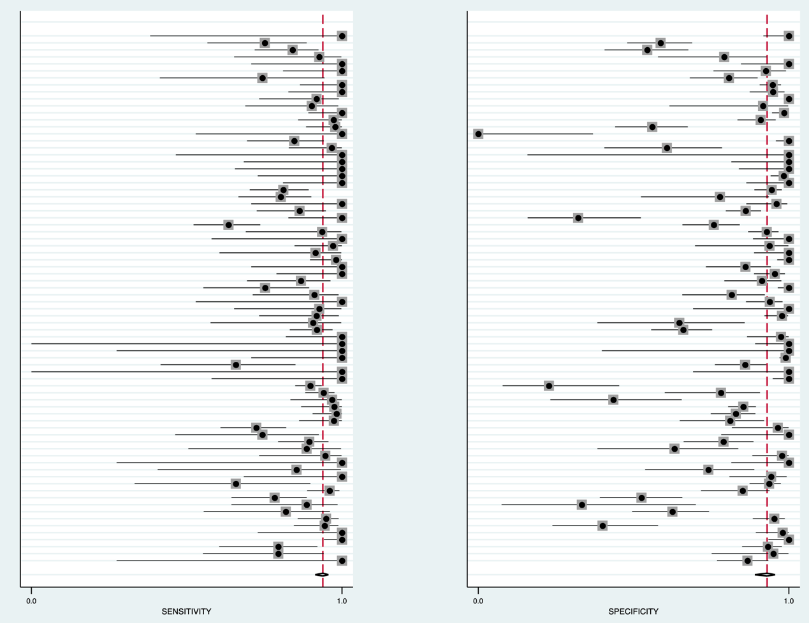
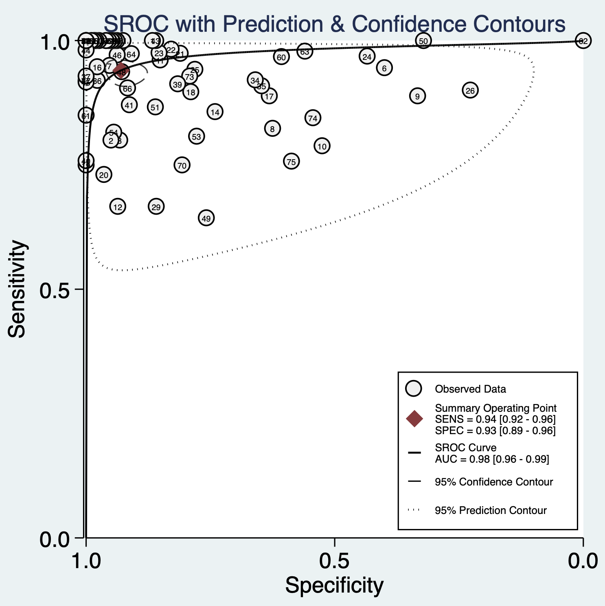
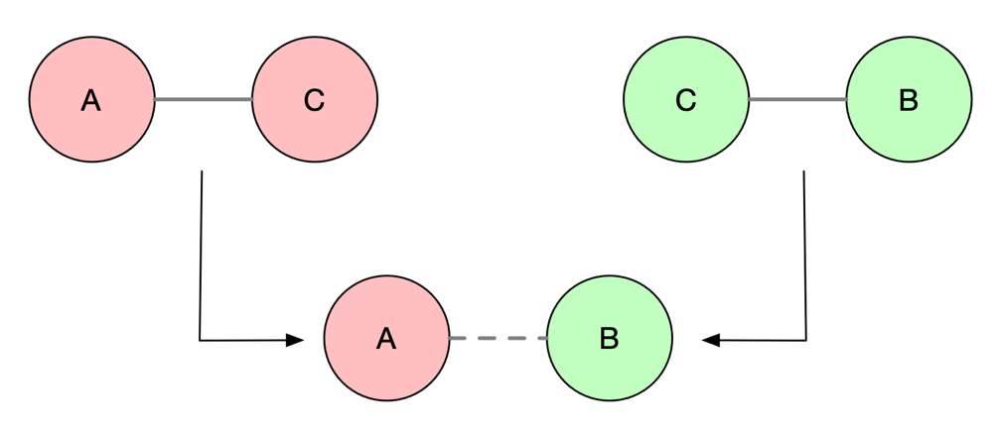
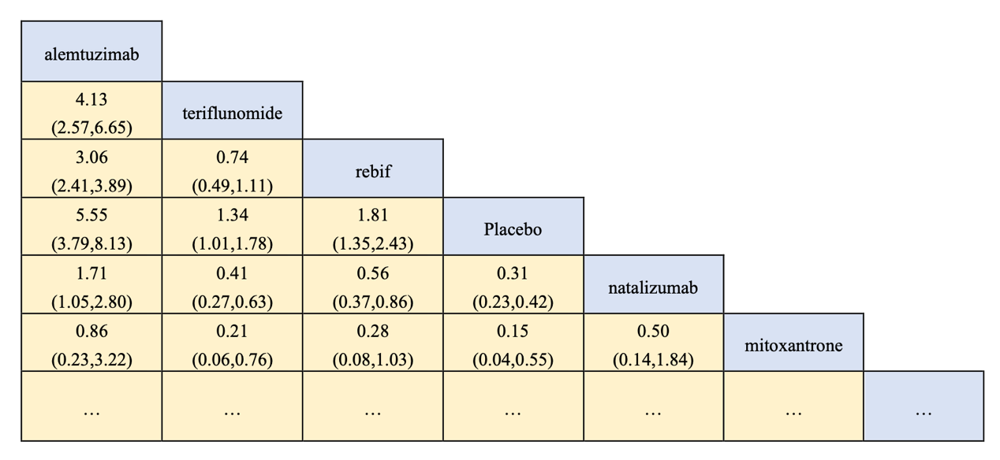
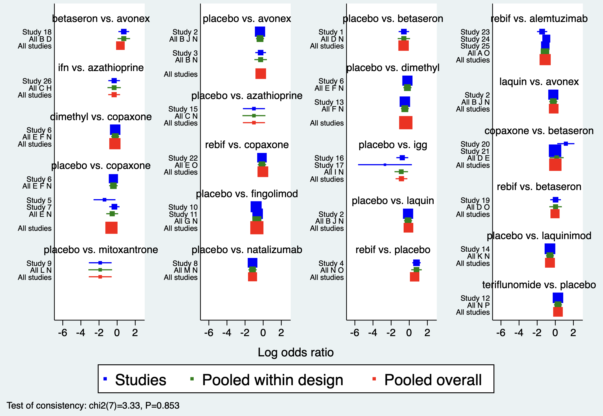
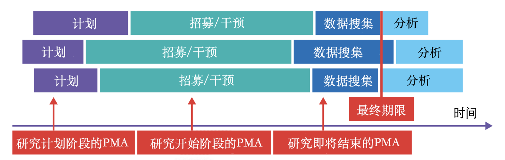

# 进阶荟萃分析

上一章介绍了常规荟萃分析的文献检索、质量评估、数据分析等问题，本章将在此基础上进一步介绍诊断性荟萃分析、网络荟萃分析以及前瞻性荟萃分析的应用。

## 诊断性研究的荟萃分析

因地区、个体、诊断方法及条件的差异，使得发表的关于同一诊断方法的研究结果存在着不同甚至是矛盾的; 且随着新技术的不断走向临床，选择也愈来愈多。因此，临床上需要综合评价这些研究的结果。在单一诊断试验中，采用某种诊断方法判断为阳性或阴性，然后与金标准阳性和阴性比较，列成四格表的形式，计算相关指标评价该诊断方法的价值。

因而，诊断性研究的荟萃分析主要是为综合评价某种诊断措施对目标疾病的准确率，敏感性、特异性进行评价，报道似然比、诊断优势比等。其中

$$\text{诊断优势比} = \frac{\text{真阳性}\times\text{真阴性}}{\text{假阳性}\times\text{假阴性}}$$

可作为荟萃分析合并时每个诊断试验权重的依据。

**案例7.1**

24小时尿游离皮质醇升高是库欣综合征的诊断实验之一，但不同研究报道其准确度不一。从发表文献中搜集研究，提取的数据包括：真阳性，诊断阳性且金标准亦为阳性的例数；假阳性，也就是诊断阳性但金标准为阴性的例数；真阴性，即诊断阴性且金标准为阴性的例数；假阴性，即诊断阴性但金标准为阳性的例数。整理成下表，每一行代表一篇文献，最右边四行分别是TP、TN、FP和FN，分别代表以上这四个数据。

**案例7.1数据表**

| Author          | TP  | TN  | FP  | FN  |
|:----------------|:----|:----|:----|:----|
| Zukowski 2013   | 3   | 65  | 10  | 0   |
| Yanovski 1998   | 16  | 19  | 1   | 4   |
| Yaneva 2009     | 24  | 69  | 5   | 6   |
| Yaneva 2004     | 63  | 54  | 0   | 0   |
| Viardot 2005    | 12  | 49  | 1   | 0   |
| Valassi 2009    | 52  | 14  | 21  | 3   |
| Tsagarakis 1998 | 57  | 81  | 4   | 3   |
| Tous 2012       | 14  | 40  | 24  | 3   |
| …               | …   | …   | …   | …   |

Stata中midas命令用于荟萃诊断性研究。

+----------------------------------------------------+
|                                                    |
+====================================================+
| 代码7.1                                            |
|                                                    |
| . midas tp fp fn tn, id(author) ms(0.75) bfor(dss) |
+----------------------------------------------------+

{width="“5.768055555555556in”" height="“4.4430555555555555in”"}

**代码7.1输出森林图，左为敏感性森林图，右为特异性森林图**

敏感性和特异性的森林图，和常规荟萃分析中的森林图是类似的。

+-------------------------------------+
|                                     |
+=====================================+
| 代码7.2                             |
|                                     |
| . midas tp fp fn tn, es(x) res(all) |
+-------------------------------------+

荟萃所有研究，得出敏感性为94%、特异性为93%，诊断优势比为207。有一定的异质性。诊断优势比反映诊断试验的结果与疾病的联系程度。取值 \>1 时，其值越大说明该诊断试验的判别效果较好；取值 \<1 时，正常人比患者更有可能被诊断试验判为阳性；取值 =1 时，表示该诊断试验无法判别正常人与患者。

**代码7.2输出**

| ROC Area, AUROC = 0.98 \[0.96 - 0.99\] |   |   |
|:---|----|----|
| Heterogeneity (Chi-square): LRT_Q = 195.006, df =2.00, LRT_p =0.000 |  |  |
| Inconsistency (I-square): LRT_I2 = 99, 95% CI = \[ 98- 99\] |  |  |
| Parameter | Estimate | 95% CI |
| Sensitivity | 0.94 | \[0.92, 0.96\] |
| Specificity | 0.93 | \[0.89, 0.96\] |
| Positive Likelihood Ratio | 13.4 | \[8.5, 21.2\] |
| Negative Likelihood Ratio | 0.06 | \[0.05, 0.09\] |
| Diagnostic Odds Ratio | 207 | \[108, 399\] |

诊断性研究的荟萃分析中特有的曲线图，即综合ROC曲线（SROC），根据单个诊断试验中的诊断优势比的权重，绘制的集成ROC曲线。SROC曲线上显示每一个研究的灵敏度和特异度。虚线部分是该曲线的95%置信区间，图上的红点（SROC曲线上最靠近左上角的坐标，灵敏度=特异度）表示对诊断效能的点估计。综合荟萃分析提示24小时尿游离皮质醇对库欣综合征的诊断的敏感性达到了0.94，特异性达到了0.93。诊断准确性荟萃分析推荐采用双变量随机效应模型同时合并敏感性与特异性，并以综合 ROC（SROC）曲线呈现（Reitsma 等，2005）。

+--------------------------------------+
|                                      |
+======================================+
| 代码7.3                              |
|                                      |
| . midas tp fp fn tn, plot sroc(both) |
+--------------------------------------+

{width="“5.768055555555556in”" height="“5.7756944444444445in”"}

**代码7.3输出综合ROC曲线**

## 网络荟萃分析

本书上一章节介绍的荟萃研究关注两种干预措施之间的比较。临床实践中，往往对某一疾病有多种干预，如何比较多种干预措施的疗效？然而，绝大多数临床实验关注的都是两个干预措施之间的比较，如干预A和安慰剂，干预A和干预B。

网络荟萃分析（network meta analysis, NMA），也被称为多重治疗荟萃分析或混合治疗比较，是一种将多项随机对照研究的证据结合在一起比较治疗方案的方法。在网状荟萃分析当中，需要引入两个概念，直接比较与间接比较（图7.1）。直接比较是指可以直接比较干预A和干预B（即，存在干预A和干预B比较的随机对照研究）。间接比较是存在干预C，有研究探索干预A和干预C的疗效差别，也有研究探索干预B和干预C的疗效差别，但没有研究直接比较干预A和干预B。此时，干预C可以作为纽带，将干预A和干预B连接起来，从而可以去间接的比较干预A和干预B。

{width="“4.5193799212598424in”" height="“1.9626060804899388in”"}

**图7.1 直接比较和间接比较**

对比传统荟萃分析，网络荟萃分析可以回答更多临床相关问题，可对所有相关的治疗方案进行更全局，更高效地分析。网络荟萃分析可利用所有可获得的证据，获得更精确的结论，对不同治疗方案进行排序，其证据等级相较传统荟萃分析更高。网络荟萃分析的报告应遵循 PRISMA 的网络荟萃分析扩展声明（PRISMA-NMA；Hutton 等，2015）。

网络荟萃分析中一个最重要的统计假设是可传递性（transitivity）。其主要假设研究的人群和干预措施在网络荟萃分析纳入的所有研究中是同质的，或是有理论依据支持干预措施的形式虽然不一样，但实质相同。这种情况下可以认为这些研究中存在可传递性。可传递性是网络荟萃分析有效性的核心前提，应在分析前从临床与方法学上加以论证（Salanti，2012）。

**案例7.2**

这是一个网络荟萃分析的案例。FDA批准的多发性硬化的干预药物有大概14种之多，在三期临床研究中，60%是药物直接和安慰剂对比，40%是药物A和药物B对比。这些研究的结局事件，比较统一，都是治疗后24个月内的复发率。因此选定效应指标为风险比，即两两相比的复发风险比例。网络荟萃分析的数据要求如下表所示。一个研究中的两个组分成两行分别填写入这张表中，并指定研究的名称（studyname）和干预的名称（treatment），填入有效病例数（responders）以及总病例数（sample size）。

**案例7.2数据**

| studyname     | study | responders | sampleSize | treatment |
|:--------------|:------|:-----------|:-----------|:----------|
| IFNB MS Group | 1     | 18         | 123        | placebo   |
| IFNB MS Group | 1     | 59         | 249        | betaseron |
| BRAVO         | 2     | 227        | 450        | placebo   |
| BRAVO         | 2     | 264        | 447        | avonex    |
| BRAVO         | 2     | 233        | 434        | laquin    |
| MSCRG         | 3     | 23         | 143        | placebo   |
| MSCRG         | 3     | 32         | 158        | avonex    |
| PRISMS        | 4     | 28         | 187        | placebo   |
| PRISMS        | 4     | 105        | 373        | rebif     |
| …             |       | …          | …          | …         |

### 网络设置

利用这张表可以进行网络荟萃分析的数据分析，Stata中首先需要利用network setup进行网络设置，指定有效病例数与总样本量。然后绘制网络图，以显示哪些治疗与其他哪些治疗直接比较，以及每个治疗和每个治疗比较大约有多少信息可用（通过权重和着色显示证据数量和质量）。图中蓝色圆圈代表干预的方法，其大小代表该干预措施的病例数。黑色连线代表两两干预之间的直接比较，其粗细代表两两对比研究的数量。毋庸置疑，安慰剂组的受试者数量最多，Copaxone和安慰剂组头对头比较的研究数量最多。若圆圈之间无连线，代表没有直接对比这两者的研究。

+--------------------------------------------------------------------------+
|                                                                          |
+==========================================================================+
| 代码7.4                                                                  |
|                                                                          |
| . network setup responders samplesize, studyvar(study) trtvar(treatment) |
|                                                                          |
| . network map                                                            |
+--------------------------------------------------------------------------+

{width="“5.6052285651793525in”" height="“4.676033464566929in”"}

**代码7.4输出网络图**

### 干预排序

网络荟萃分析中的累积排序曲线（surface under the cumulative ranking curve, SUCRA），其曲线下的面积被用来对每种治疗方法的有效性进行排序，并确定最佳治疗。每一种干预措施都会得出一个累积排序曲线，横坐标表示排序，纵坐标代表这个排序的概率。通常，某条曲线的最高点，代表该治疗方式概率最大的排名名次。图中，mitoxantrone这个干预在排序第一的概率为0.6左右，而placebo在排序第16的概率为0.6左右。

+-------------------------------------------------------------------------------------------------------------------------------------------------------------------------------------------+
|                                                                                                                                                                                           |
+===========================================================================================================================================================================================+
| 代码7.5                                                                                                                                                                                   |
|                                                                                                                                                                                           |
| . network meta consistency                                                                                                                                                                |
|                                                                                                                                                                                           |
| . network rank max, all zero gen(prob)                                                                                                                                                    |
|                                                                                                                                                                                           |
| . sucra prob\*, rankograms labels (alemtuzimab avonex azathioprine betaseron copaxone dimethyl fingolimod ifn igg laquin laquinimod mitoxantrone natalizumab placebo rebif teriflunomide) |
+-------------------------------------------------------------------------------------------------------------------------------------------------------------------------------------------+

{width="“5.768055555555556in”" height="“4.194444444444445in”"}

**代码7.5输出累积排序曲线**

此外，累积排序曲线下面积也可以通过数值的方式显示。下表展示了各种干预措施的曲线下面积，排序为第一的概率以及平均排序，其中mitoxantrone排序为第一的概率是57.2%，alemtuzimab排序为第一的概率是33.6%。因此我们可以得出结论，mitoxantrone在所有干预措施中排序是最高的，即为最佳的干预药物。需要强调的是，SUCRA 仅反映排序概率，并不直接说明治疗之间的差异是否具有临床意义，其计算与解读可参见 Salanti 等（2011）。

**代码7.5输出**

| Treatment     | SUCRA    | PrBest   | MeanRank |
|:--------------|:---------|:---------|:---------|
| alemtuzimab   | **94.3** | **33.6** | **1.9**  |
| avonex        | **20.8** | **0.0**  | **12.9** |
| azathioprine  | **69.0** | **6.5**  | **5.6**  |
| betaseron     | **51.7** | **0.0**  | **8.2**  |
| copaxone      | **52.9** | **0.0**  | **8.1**  |
| dimethyl      | **27.7** | **0.0**  | **11.8** |
| fingolimod    | **60.3** | **0.0**  | **6.9**  |
| ifn           | **50.5** | **2.0**  | **8.4**  |
| igg           | **65.2** | **0.6**  | **6.2**  |
| laquin        | **9.0**  | **0.0**  | **14.7** |
| laquinimod    | **48.8** | **0.0**  | **8.7**  |
| mitoxantrone  | **92.4** | **57.2** | **2.1**  |
| natalizumab   | **81.6** | **0.1**  | **3.8**  |
| placebo       | **3.5**  | **0.0**  | **15.5** |
| rebif         | **49.0** | **0.0**  | **8.7**  |
| teriflunomide | **23.3** | **0.0**  | **12.5** |

网络荟萃分析中的联赛表，就像足球联赛中，显示两两对决的比分。这张联赛表显示了两种药物之间的两两比较，以风险比展示。中间蓝色方格，代表不同的治疗方案，具体数字，代表比值比以及95%置信区间，是横排与竖排之间的比较结果。但由于不存在足球联赛中的主客场制，右上部分因与左下部分是重叠的，故予删除。

+--------------------+
|                    |
+====================+
| 代码7.6            |
|                    |
| . netleague, eform |
+--------------------+

{width="“5.768055555555556in”" height="“2.65625in”"}

**代码7.6输出联赛图**

### 网络一致性

网络荟萃分析的一个关键问题是网络的一致性。对于某两种干预措施，可能既存在直接证据又可通过间接比较计算间接证据。我们需要检验直接证据和间接证据是否一致，或者如果有多个间接证据来源，则它们是否彼此一致。一致性检验的森林图中p值为0.852，因此可以认为，研究纳入的随机对照研究的一致性较好。森林图中也可以看到间接的两两对比（绿色方块）和直接的两两对比（蓝色方块）基本上得出的结论是一致的。如果检验结果为不一致，可以使用不一致性的统计模型来进行荟萃。

+------------------------------+
|                              |
+==============================+
| 代码7.7                      |
|                              |
| . network meta inconsistency |
|                              |
| . network forest             |
+------------------------------+

{width="“5.768055555555556in”" height="“3.9895833333333335in”"}

**代码7.7输出直接证据与间接证据**

节点分裂模型亦可以用于分析网络荟萃分析的一致性，计算两个干预直接比较得出的参数和间接比较得出的参数。对这两个参数进行联合估计，比较它们的差值，检验其真实差值是否为0。直接证据与间接证据的一致性检验（含节点分裂法）可参见 Dias 等（2010）。

+------------------------------+
|                              |
+==============================+
| 代码7.8                      |
|                              |
| . network sidesplit all, tau |
+------------------------------+

**代码7.8输出**

| Side | Direct | Indirect | Difference |   |   |   |   |
|:---|:---|:---|:---|----|----|----|----|
|  | Coef. | Std. Err. | Coef. | Std. Err. | Coef. | Std. Err. | P\>\|z\| |
| A O \* | -1.11891 | .1216481 | .1276285 | 130.4523 | -1.246538 | 130.4525 | 0.992 |
| B D | .7341662 | .3086112 | .2096995 | .195126 | .5244667 | .3651234 | 0.151 |
| B J \* | -.2187294 | .1507652 | .3397627 | .5260816 | -.5584921 | .5472319 | 0.307 |
| B N \* | -.3362652 | .1320421 | .1882035 | .341041 | -.5244687 | .3651335 | 0.151 |
| C H \* | -.3296579 | .3343849 | 1.388427 | 1377.032 | -1.718085 | 1377.032 | 0.999 |
| C N \* | -1.022072 | .6236976 | -2.108384 | 580.1129 | 1.086312 | 580.1133 | 0.999 |
| D E | .0736742 | .1684551 | -.1243108 | .2201667 | .197985 | .27642 | 0.474 |
| D N | -.594102 | .3058434 | -.629308 | .1518121 | .035206 | .3414485 | 0.918 |
| D O | .0312525 | .3104082 | -.0411736 | .18497 | .0724261 | .3613408 | 0.841 |
| E F | -.234583 | .1698999 | -.2847732 | .2478862 | .0501902 | .3039638 | 0.869 |
| E N | -.4351315 | .1326467 | -.8994905 | .1608528 | .464359 | .2093104 | 0.027 |
| E O | -.1361234 | .15271 | .152702 | .2075406 | -.2888254 | .2576693 | 0.262 |
| F N \* | -.3441188 | .1070699 | -.8503738 | .4252508 | .506255 | .445895 | 0.256 |
| G N \* | -.6985315 | .0999447 | -3.166373 | 930.055 | 2.467841 | 930.0551 | 0.998 |
| I N \* | -.8591878 | .3328428 | -3.482589 | 1012.36 | 2.623401 | 1012.36 | 0.998 |
| J N \* | -.1299553 | .1495573 | .4285362 | .527115 | -.5584915 | .547232 | 0.307 |
| K N \* | -.5896181 | .1413525 | -3.396555 | 1028.739 | 2.806937 | 1028.739 | 0.998 |
| L N \* | -1.865629 | .6443962 | -3.172957 | 1297.701 | 1.307328 | 1297.701 | 0.999 |
| M N \* | -1.175059 | .1567734 | -3.090808 | 1407.469 | 1.915749 | 1407.469 | 0.999 |
| N O | .799673 | .2392806 | .4787151 | .1776051 | .320958 | .2979912 | 0.281 |
| N P \* | .2954041 | .1444729 | 3.554453 | 1465.048 | -3.259049 | 1465.048 | 0.998 |
| \* Warning: all the evidence about these contrasts comes from the trials which directly compare them. |  |  |  |  |  |  |  |

治疗效果修饰因素包括试验方法、临床特征，也可能包括随访时间、结果定义、研究质量（偏倚风险）、分析和报告标准（包括选择性报告的风险），这些都会影响网络荟萃分析的一致性。因此，在进行网络荟萃分析之前，重要的是只选择那些与临床关注人群相关的试验，然后确定这些试验中提供不同比较的任何系统性差异。

如果在节点分裂模型中发现不一致的证据，应寻求解释。例如，不一致是否来自于不同设计的特定研究或偏倚风险较高的研究。如果不一致仍然无法解释，那么可以将不一致项建模为均值为零的随机效应，这样就可以在考虑到无法解释的不一致的情况下进行总体的荟萃估计。

然而，网络荟萃分析亦存在不足之处。首先，SUCRA没有显示治疗之间的差异是否具有临床意义。虽然一种治疗可能被认为是最好的，但最好的治疗与其他治疗之间的绝对差异可能微不足道。其次，SUCRA的结果可能非常不准确，其95%的可信区间极宽，在大多数的网络荟萃分析中，最佳治疗和次佳治疗之间没有真正的差异。第三，纳入非常多的研究，可能会分散人们对个别研究背后的事件和问题的注意力，如偏倚风险、方法的有效性和证据的质量。最后，网络荟萃分析要求强有力的假设，可传递性的假设难以论证，其得出的推论打破了临床试验的随机化，应该受到类似于观察性研究的限制。

## 多结局的网络荟萃分析

某一疾病的不同随机对照研究所感兴趣的结局变量可能不同。例如，在一项总结子宫内膜癌中孕酮受体状态预后效果的荟萃分析中，有四项研究提供了癌症特定生存期和无进展生存期的结果，但其他研究只提供了癌症特定生存期（两项研究）或无进展生存期（11项研究）的结果。如果只研究癌症特定生存期或只研究无进展生存期，则可能导致样本的浪费。多变量的网络元分析的统计模型通过同时分析多个结果和多个治疗来解决这个问题。这使得更多的研究能够为治疗的比较作出贡献。

Copas等提出，与试验间异质性程度相同的多变量网络荟萃分析相比，仅进行标准单变量荟萃分析，类似于丢掉了B%的可用研究。

$$B = 100\times(1 - E)$$

$$E = \frac{\text{基于直接和间接证据汇总结果的方差}}{\text{仅基于直接证据汇总结果的方差}}$$

例如，如果E=0.9，那么标准的荟萃分析就类似于扔掉了10%的可用研究。

B统计量提供了由间接证据产生荟萃结果的方差减少百分比。例如，在网络荟萃分析中，B为0%表示结果只基于直接证据，而B为100%表示完全基于间接证据。Riley等展示了如何为多结局荟萃分析模型推导出各项研究的权重。

当B统计量较大时，多结局荟萃分析有潜在重要性，特别是：报告感兴趣的结局的直接证据的研究占比不大；一些研究中感兴趣的结局没有报告，但报告了其他相关的结果；研究内或研究间，不同结局之间的相关程度很大（例如，\>0.5或\<-0.5）。

## 前瞻性荟萃分析

前瞻性荟萃分析（Prospective meta-analysis, PMA），其最重要的特点是，纳入研究的结果发表之前就确定要把这些研究纳入到需要开展的荟萃分析中来，并先验的叙述需要做哪些统计分析。

有些临床问题可能需要大样本以确保足够的统计效率，但是单一中心的研究无法达到样本量。固然可以开展多中心研究，但由于经费、互相协调等因素，多中心随机对照研究并不可行，因此解决的方法就是在不同的机构开展多个类似的研究，在研究完成以后，再将其结果进行整合。第二种情况，研究人员在开展某项临床研究时，并不知道其他类似的实验正在进行，当研究过程中才得知这一情况，因此可以与其他正在进行类似研究的单位协作，并提前将计划整合到前瞻性荟萃分析中。

**案例7.3**

前瞻性荟萃分析可分为四个步骤。

第一步，确定需要使用前瞻性荟萃分析方法。研究问题是不是高度优先的，研究的问题有没有被解决，有没有新的研究涌现？如果没有新的正在开展的研究，也无法进行前瞻性的荟萃分析。如果开展常规的回顾性荟萃分析，能否达到同样的统计效能，如果能达到，也不需要用前瞻性荟萃分析来解决问题。

NeoProm是一个探索早产儿吸氧浓度和临床结局之间关系的研究，研究问题是高吸氧浓度是否增加早产儿死亡率。既往的研究多是观察性的，且根据这些研究的结局发生率计算出的样本量提示需要5000例早产儿才能检验出4%的死亡率差别。单个机构无法达到这一样本量，而多中心研究受限于各中心的协调，经费问题，无法很好的开展。

PMA的第二步需要定义研究问题和纳入标准，并撰写研究方案。研究问题的定义按照PICO原则，需要再次强调的是，纳入标准的制定必须在研究结果发表之前。NeoProm研究中制定的受试者是出生后24小时之内的早产儿，干预组为是靶氧浓度为85-89%，对照组靶氧浓度较高（91-95%），结局事件是18到24个月龄的死亡和重大残疾的复合终点。

第三步是研究的检索，来源为临床研究注册的网站，Pubmed上发表的研究方案等。通过联系这些正在开展的随机对照研究的负责人组成了项目协作组。NeoProm研究中，协作组检索到了5个正在开展的RCT，各个单位独自开展了这个问题的随机对照研究，分别在澳大利亚、新西兰、加拿大、英国和美国进行，预计纳入将近5000例早产儿。前瞻性荟萃分析开始的时候，这五个研究的结果均还未发表。其他数据库的检索，也没有发现额外的其他研究。

{width="“5.768055555555556in”" height="“1.8305555555555555in”"}

**图7.2前瞻性荟萃分析图解**

第四步在PMA的开展过程中，还可以去协调各个子研究的计划，结局事件等。全部子研究的结果发表后，数据分析过程和常规的荟萃分析无区别。

**案例7.4**

世界卫生组织新冠肺炎疗法快速证据评估工作组发表了包括7项随机对照临床试验的前瞻性荟萃分析。

研究问题高度优先：皮质类固醇在治疗严重感染中的作用一直存在争议，这也导致新冠疫情的早期，关于皮质类固醇疗效的数据一直非常有限。

研究检索：据统计，截至2020年7月24日，全球范围内有55项皮质类固醇治疗新冠肺炎的研究在ClinicalTrials.gov上注册。世卫组织临床特征和管理工作组认识到获得可靠的皮质激素疗效数据以指导临床用药的紧迫性，因此制定了一项对正在进行的随机临床试验进行前瞻性荟萃分析的方案。几乎在世卫组织制定荟萃分析方案的同一时间，牛津大学团队领衔的大型临床研究RECOVERY的试验数据发布。这项试验中出现的明显获益信号，促使大多数正在开展的皮质类固醇研究停止招募。这也导致世卫组织最终只能纳入7项皮质类固醇治疗危重新冠肺炎患者的临床研究。

这7个临床研究招募的患者来自于澳大利亚、巴西、加拿大、中国、丹麦、法国、爱尔兰、荷兰、新西兰、西班牙、英国和美国。招募时间为2020年2月26日至2020年6月9日，最终随访日期为2020年7月6日。一共纳入1703名患者，其中678名患者接受皮质类固醇治疗（低剂量和高剂量的地塞米松、低剂量氢化可的松和高剂量甲泼尼龙），1025名患者接受常规治疗或安慰剂治疗。患者的中位年龄为60岁，488名（29%）为女性。主要结局事件是随机化后28天的全因死亡率，次要结果是研究者定义的严重不良事件发生情况。

从总体上看，在678名使用皮质类固醇治疗的患者中，有222例死亡；在1025名使用常规治疗或安慰剂的患者中，有425例死亡。通过固定效应荟萃分析，比较皮质类固醇治疗的28天全因死亡率与常规治疗或安慰剂的28天全因死亡率，比值比为0.66。即使是排除RECOVERY研究的患者（因其结果发表早于前瞻性荟萃分析方案制定之前），研究结果也保持一致。

正是基于该项研究结果，世界卫生组织发布了使用皮质类固醇治疗新冠肺炎患者的指南。在这份指南中，世界卫生组织专家组强烈推荐危重新冠肺炎患者接受系统性皮质类固醇治疗，而不推荐在非重症新冠肺炎患者中使用皮质类固醇疗法。

## 参考文献

1.  Riley RD, Jackson D, Salanti G, Burke DL, Price M, Kirkham J, White IR. Multivariate and network meta-analysis of multiple outcomes and multiple treatments: rationale, concepts, and examples. BMJ. 2017 Sep 13;358:j3932.

2.  Seidler AL, Hunter KE, Cheyne S, Ghersi D, Berlin JA, Askie L. A guide to prospective meta-analysis. BMJ. 2019 Oct 9;367:l5342.

3.  Sterne JAC, Diaz J, Villar J, Murthy S, Slutsky AS, Perner A, Jüni P, Angus DC, Annane D, Azevedo LCP, Du B, Dequin PF, Gordon AC, Green C, Higgins JPT, Horby P, Landray MJ, Lapadula G, Le Gouge A, Leclerc M, Savović J, Tomazini B, Venkatesh B, Webb S, Marshall JC; WHO COVID-19 Clinical Management and Characterization Working Group. Corticosteroid therapy for critically ill patients with COVID-19: A structured summary of a study protocol for a prospective meta-analysis of randomized trials. Trials. 2020 Aug 24;21(1):734.

4.  Reitsma JB, Glas AS, Rutjes AW, et al. Bivariate analysis of sensitivity and specificity produces informative summary measures in diagnostic reviews. Journal of Clinical Epidemiology, 2005, 58(10):982-990.

5.  Salanti G, Ades AE, Ioannidis JP. Graphical methods and numerical summaries for presenting results from multiple-treatment meta-analysis: an overview and tutorial. Journal of Clinical Epidemiology, 2011, 64(2):163-171.

6.  Dias S, Welton NJ, Caldwell DM, Ades AE. Checking consistency in mixed treatment comparison meta-analysis. Statistics in Medicine, 2010, 29(7-8):932-944.

7.  Hutton B, Salanti G, Caldwell DM, et al. The PRISMA extension statement for reporting of systematic reviews incorporating network meta-analyses of health care interventions: checklist and explanations. Annals of Internal Medicine, 2015, 162(11):777-784.

8.  Salanti G. Indirect and mixed-treatment comparison, network, or multiple-treatments meta-analysis: many names, many benefits, many concerns for the next generation evidence synthesis tool. Research Synthesis Methods, 2012, 3(2):80-97.
