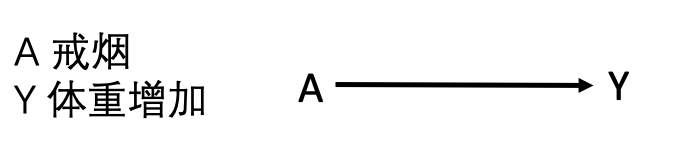
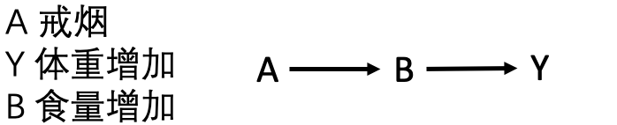
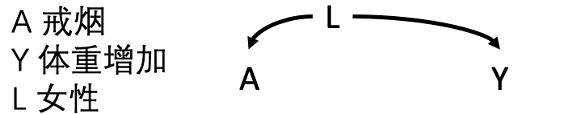
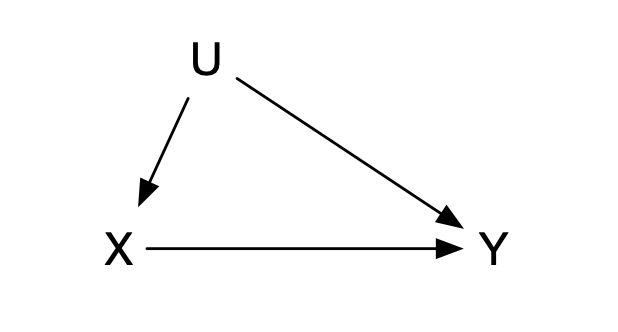
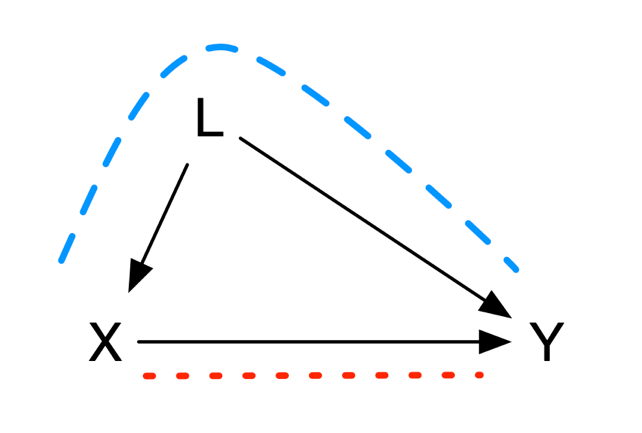
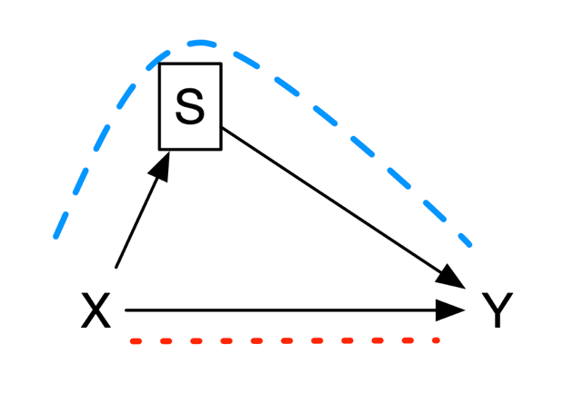

# 因果图与结构因果模型

本章开始介绍观察性研究中开展因果推断的理论知识与实践方法。

## 因果有向无环图

数学概念中，图是节点和连接节点的边的集合。如果有一条从节点 𝑋 开始到节点 𝑌 结束的有向路径（箭头），那么可称 𝑋 是 𝑌 的祖先，𝑌 是 𝑋 的后代，即有向图的边从父节点到子节点。这条有向路径也代表了时间的流动，从某个节点 𝑋 出发回到自身的有向路径称为循环，这种发生时间旅行的情况不予考虑。通常考虑没有循环的情况，即有向图中没有环，称为有向无环图（Directed Acyclic Graph，DAG）。

在因果有向无环图中，每个父节点都是其子节点的直接原因。如果改变 𝑋，𝑌 也能做出相应改变，称 𝑋 是 𝑌 的原因。因此，因果有向无环图中的边可视为因果关系。

因果有向无环图的一个重要假设是，因果有向无环图上的任何节点都是条件独立的，只依赖于其父节点。这个假设称为因果马尔可夫假设，意味着任何节点的共同父节点也必须包含在图中。这个假设其实是描述了两节点的相关性除了因果图中的显示，无其他隐藏的相关，与第一章中所描述的条件可交换性一致。

分叉与对撞是因果有向无环图中两个重要的结构。如果节点 *S* 同时指向两个节点 *X* 和 *Y*，称为分叉结构；如果有两个节点 *X* 和 *Y* 同时指向节点 *C*，称为对撞结构。在分叉结构中，*X* 和 *Y* 是非独立的，而对撞结构中 *X* 和 *Y* 是独立的。

因果图模型的局限性在于：

第一、因果图模型是一种非参数方法，既不指定因果关系的形式，也不描述关联程度的大小，是定性的分析工具。在因果图模型分析中，混杂因素可能会使结果产生偏差，但并没有对此偏差进行定量测度。

第二、因果图模型只有在背景信息完备时才是有效的，必须包含所有混杂因素，不存在未观察的混杂因素，才是准确的因果解释。因果有向无环图作为流行病学因果推断的工具，由 Greenland、Pearl 与 Robins（1999）系统引入；实践中可借助 DAGitty 等软件绘制因果图，并自动判定为识别因果效应所需控制的最小变量集（Textor 等，2016）。

## 因果有向无环图的应用

这是因果有向无环图的五个临床应用案例（图8.1）。

{width="2.90285in"}

图8.1A

1.  戒烟导致体重增加，*A* 是 *Y* 的父节点，此图不存在任何其他节点。

{width="2.90284in"}

图8.1B

2.  戒烟导致食量增加，继而食量增加再导致体重增加。食量增加是戒烟的子节点，又是体重增加的父节点。

{width="2.90286in"}

图8.1C

3.  此为分叉结构，节点 *L* 同时指向节点 *A* 和 *Y。*女性可能戒烟比例高于男性，而女性在绝经期后体重增加比例较男性高。女性为戒烟和体重增加的共同原因，戒烟和体重增加非独立，两者通过性别产生关联。

{width="2.9368in"}

图8.1D

4.  此为分叉结构，吸烟者大多出现手指变黄，而吸烟也有可引起肺癌。整个人群中，手指变黄与肺癌有关联。然而，当我们只考虑吸烟人群时，即吸烟节点上加框，黄手指和肺癌之间就相互独立。

{width="2.93679in"}

图8.1E

5.  此为对撞结构，节点 *A* 和 *Y* 同时指向节点 *L。*携带心脏病的基因导致患者发生心脏病风险增高，住院比例增高；肺癌的发生也导致患者的住院风险增加。然而，携带心脏病的基因与肺癌相互独立。

## 后门准则与d-分离准则

两个节点 𝑋 和 𝑌 之间的直接连接称为定向路径。除此之外，节点 𝑋 和节点 𝑌 之间还可能存在后门路径，即通过分叉结构，两个变量的共同父节点之间相互连接。两个变量如果通过对撞连接，在这种情况下，路径是封闭的。

研究者可以通过条件作用或控制一个变量，将路径的状态从开放状态变为封闭状态，或从封闭状态变为开放状态。条件作用或控制可以通过研究设计或统计方法（如限制、分层、匹配、标准化或多元回归）来实现。控制分叉结构的父节点可以关闭此后门路径，控制对撞结构的子节点会打开这条路径并导致非因果关联。

综上，因果有向无环图的使用有三大原则：

1.  节点 𝑋 和节点 𝑌 的因果关系只有在没有后门路径的情况下才成立；

2.  阻断后门路径中的任一节点可以阻断该路径；

3.  阻断对撞的子节点，可开放该路径。

## 前门准则

后门路径的存在导致无法直接对节点 𝑋 和节点 𝑌 的因果关系进行推断，虽然可以通过以上后门准则进行调整，但有时无法观察到后门路径上的节点。

此时，如果存在一个节点 *M*，为节点 𝑋 的子节点和节点 𝑌 的父节点，这时可以通过前门调整的方法进行因果推断：

首先，估计节点 𝑋 对节点 *M* 的因果效应，由于节点 𝑋 到节点 *M* 不存在后门路径（对撞路径是封闭的）。

其次，估计节点 *M* 对节点 *Y* 的因果效应, 由于节点 *M* 到节点 *Y* 存在后门路径，但此路径可以通过调整 *X* 进而阻断。

结合节点 𝑋 对节点 *M* 和节点 M 对节点 *Y* 的因果效应即为节点 𝑋 和节点 𝑌 的因果关系（图8.2）。

{width="4.1678in"}

**图8.2 前门准则**

因此，节点 *M* 关于节点 𝑋 和节点 𝑌 满足前门准则，若：

1.  *M* 完全中介了 *X* 和 *Y*，即所有从 *X* 到 *Y* 的因果路径都经过 *M*；

2.  从 *X* 到 *M* 没有未被阻断的后门路径；

3.  所有从 *M* 到 *Y* 没有未被阻断的后门路径。

节点 *M*符合中介因素的相关假设（详细参考第15章因果中介分析）。然而，不幸的是，前门准则鲜为应用，其原因为前门准则有着极其复杂的统计学假设，无法进行验证。后门准则、前门准则与 do 演算最早由 Pearl（1995）提出，构成了从因果图识别干预效应的完整理论框架。

## 结构因果模型

结构因果模型（Structural Causal Model，以下简称SCM）结合了上述介绍的图模型和虚拟事实模型，构建结构方程，并将其应用于因果分析。各类常用因果模型，都可以看作SCM的子类。结构因果模型中，用函数式的方程表示两个变量之间的因果关系：

**公式8.1**

``` math
Y = \ f(X,\ U)
```

其中，*X* 和 *Y* 是因果关系中的变量，即感兴趣的因与果，与计量经济学中的内生变量（endogenous variable）对应。*U* 表示其原因在感兴趣的因果模型外部，不对其建模，与计量经济学中的外生变量（exogenous variable）对应。因而，结构因果模型是以下集合的数组：

1.  一组内生变量 $`V`$（包括$`\ X`$ 和 $`Y`$）；

2.  一组外生变量 $`U`$；

3.  一组函数 $`f`$，输入其他变量可生成内生变量

$`f`$ 通常是一个线性函数，但是，当今大数据时代，此函数完全可以采用非线性函数、非参数模型。

结合本书第一章，结构方程模型提供了分类反事实关系的形式工具和符号机制。它刻画的是如下反事实“假设使 X = x，那么对于单个个体而言，在情形U时，Y 将会取的值”。

结构因果模型完全可以用因果图来表示，分别对应于结构方程中的内生变量与外生变量。请注意，外生变量 *U* 只有由其出发的箭头，没有指向它的箭头。结构因果模型要求箭头表示箭头左侧项直接导致箭头右侧项（图8.3）。所以，在因果推断的过程中，必须按照因果箭头的方向进行推理，不能颠倒顺序。

{width="2.93141in"}

**图8.3结构因果模型中的外生变量与内生变量**

与因果有向无环图类似，结构因果模型的一个重要假设是马尔可夫假设，即某一变量只和直接影响它的变量有关，与其他变量都是独立的。结构因果模型不包含循环并且不存在未观察到的外生变量，则此因果模型符合马尔可夫假设；如果因果图不包含循环但存在未观察到的外生变量，则模型是半马尔可夫模型；非马尔可夫模型的因果图包含循环。

以上变量 $`X`$ 是观察性研究中观察到的。随机对照研究中，研究某个干预对结局的影响，等同于在结构因果模型中，迫使一组变量 $`X`$ 拥有值 $`T`$，只需将 $`X\ `$替换为 $`T`$。此时的因果图，由于干预是随机的，因此去除影响 𝑇 的所有因素。

结构因果模型也可进行反事实推理，即假如变量 $`X`$ 拥有值 $`T`$ ，*Y* 会怎么样呢？我们对该模型进行干预，使得变量 *X* 赋值为 *T*；同时，我们观察到所有外生变量 *U* 的值为 *u*；在此情况下，我们向模型查询感兴趣变量 *Y* 的条件概率。这种“干预（do 算子）—观测—反事实”的三层结构，正对应 Pearl 提出的因果之梯：结构因果模型为在三个层级之间进行形式化推理提供了统一的语言，也是机器学习走向因果推理的基础。

案例8.1

此例研究手术方法对某种肿瘤患者住院时长的影响，绘制其结构方程（图8.4）。根据临床知识，既能影响手术方法，又对住院时长有影响的因素包括技术、手术医生的经验、患者的偏好以及肿瘤的性质。这些因素皆为潜变量，以黄色标识。

很多医学研究中，经常会涉及到一些无法直接准确测量的变量，或不能以单一指标反映的变量，如工作满意度、医疗服务可及性、医疗服务满意性、健康状况、治疗偏好等。这类变量称为潜变量。一般可用一些可以观察到的指标，去间接替代这些潜变量。

此案例中，手术的年代可以反映技术的发展，手术医生的经验可以用年手术量来衡量、患者的偏好可能比较复杂（年龄、性别可能是一个潜在的影像因素），而肿瘤的性质包括肿瘤大小、侵袭性以及既往治疗史。

{width="5.76806in"}

**图8.4结构方程**

## 偏倚的分类

研究者多使用偏倚来描述因果推断中的误差。但偏倚是一个比较笼统的概念，因果推断中的偏倚通常包括以下几个方面：

1.  混杂

当治疗和结果有共同原因时，此共同原因会干扰治疗和结果之间的因果推断，许多流行病学家使用混淆/混杂一词来指代这种偏倚。这种类型的偏倚在因果有向无环图中表现为分叉结构，其中 *L* 表示所有混杂因素的集合，如年龄，性别，疾病严重程度等。此图沿着 *X* 到 *Y* 有两条路径：一是直接从 *X* 到 *Y* 的有向路径（红色虚线）；二是从 *X* 到 *L* 再到 *Y* 的后门路径（蓝色虚线）。如果要研究 *X* 和 *Y* 之间的因果关系，就必须阻断后门这条路径，即消除 L 的影响。因果图为混杂因素的选择提供了原则性依据：应调整能够阻断后门路径的变量，而切忌调整对撞因子或中介变量，否则反而会引入偏倚；混杂因素选择的形式化准则可参见 VanderWeele 与 Shpitser（2011）。

{width="2.92233in"}

**图8.5混杂与后门路径**

健康工人偏倚：指从事某种职业（如消防员）的工人中观察到工人的总死亡率较一般人群低的现象。这是由于有严重疾病或缺陷的人不能从事某些职业所致，如不考虑这一效应，而将工人死亡率与一般人群死亡率相比是不合适的。

适应症混杂：某种药物（如阿司匹林）有很大可能开具给那些患有某些疾病的人（如心脏病），研究阿司匹林与心源性死亡率的关系时，患有心脏病既是治疗的原因，也是心源性死亡的危险因素。

生活方式：研究喝酒对死亡率的影响，喝酒这种生活方式往往与吸烟相关连，而吸烟与死亡率相关。其次、某种未发现的亚临床疾病可同时导致缺乏运动以及临床疾病风险增加。

遗传连锁不平衡：某两个基因位点存在遗传连锁不平衡性，这两个位点分别影响两种表型或者疾病的发展，因此会造成这两种表型或疾病的错误关联。

环境暴露：空气中的颗粒物对冠心病的影响可能会因为空气中存在其他污染物而产生混淆，空气中的颗粒物与其他污染物相关，而其他污染物可导致冠心病。

2.  选择偏倚

控制了因和果的共同效果，许多流行病学家将其称为选择偏倚。选择偏倚是指被选择到研究样本中的患者同未进入样本中的患者之间存在着差异。这种类型的偏倚在因果有向无环图中表现为对撞结构，且阻断了其中的子节点，造成了原本关闭的路径重新开放。此图从 *X* 到 *Y* 的路径中又增加了一条从 *X* 到 *S* 再到 *Y* 的后门路径。

{width="2.92232in"}

**图8.6选择偏倚与后门路径**

健康工人偏倚：在估计职业暴露与死亡率的影响时，只选择了在岗的工人，而忽略了因病请假的非在岗工人。

现患病偏倚：当研究的暴露因素与疾病预后相关，或暴露本身就是预后的决定因素，如果只研究现患病例的暴露状况。例如，以门诊和住院病例作为研究对象，欲探索某暴露与急性心肌梗塞的关系，如果该暴露因素可能引发病例的死亡，那么只选择住院和门诊病例会低估该因素的疾病风险。

同样，入院率偏倚是指选择医院病例为研究对象时，由于入院率的不同或就诊机会不同而导致入院率偏倚。例如，抢救不及时的死亡病例、距离较远的病例或病情轻的病例等。

病程长度偏倚：由于慢性疾病的病程长度不同，研究更容易纳入病程长的患者，恶性程度较高的患者可能因病程较短而死亡，并未被及时纳入研究，从而低估了结局风险。

研究开始前治疗的效果影响被选入研究的概率，如幸存者偏倚。这种偏倚可能存在于任何试图估计之前发生的治疗的因果效应的研究中。

失访偏倚是一种特殊的选择偏倚，指患者由于各种原因无法继续参加研究而退出，或研究人员无法获得患者的结局测量指标。治疗措施和研究的结局时间均能够影响失访与否。只计算随访病人中的因果效应会产生此偏倚。

尽管可以通过适当的研究设计来避免选择偏倚，但这通常不可避免。 例如，失访偏倚无法通过研究设计来避免。在这些情况下，选择偏差需要在统计分析中（逆概率加权或标准化）矫正。用因果图刻画选择偏倚的结构化方法可参见 Hernán、Hernández-Díaz 与 Robins（2004）；对撞偏倚的直观示例见 Cole 等（2010），其在大数据与人工智能研究中同样不容忽视（Griffith 等，2020）。

3.  测量误差

另一个偏倚来源为测量误差。本书讨论的因果推断均假设所有变量——治疗、结果和协变量是完美测量的。然而，在实践中，测量会出现某种程度的错误。由测量误差引起的偏差称为测量偏差或信息偏差。

干预措施错分类：观察性研究中干预措施的信息一般通过医院电子病例系统、医保数据库、保险数据库等电子数据库识别提取，诸多因素可能导致错分类，导致实际接受干预者并非记录中的干预者。这些错分类往往只能作为潜在的研究缺陷，分析其对研究结论的影响。实际上，随机对照研究中的意向性分析也是一种干预措施错分类，随机化指定的干预措施不一定是受试者实际接受的干预。

结局错分类：识别结局指标通常依靠疾病诊断编码、程序算法以及一些数据提取系统，可能存在错分类。不同疾病ICD编码准确性也存在较大差异，例如，采用ICD-9诊断编码识别糖尿病的敏感性高达62.6%；而识别急性心肌梗塞的敏感性仅为25.4%。在生存结局研究中，采用总生存期为终点事件比较明确，发生结局错分的可能性较小；而采用无进展生存期则容易发生结局错分。

参考文献：

1.  Greenland S, Pearl J, Robins JM. Causal diagrams for epidemiologic research. Epidemiology, 1999, 10(1):37-48.

2.  Pearl J. Causal diagrams for empirical research. Biometrika, 1995, 82(4):669-688.

3.  Hernán MA, Hernández-Díaz S, Robins JM. A structural approach to selection bias. Epidemiology, 2004, 15(5):615-625.

4.  Cole SR, Platt RW, Schisterman EF, et al. Illustrating bias due to conditioning on a collider. International Journal of Epidemiology, 2010, 39(2):417-420.

5.  VanderWeele TJ, Shpitser I. A new criterion for confounder selection. Biometrics, 2011, 67(4):1406-1413.

6.  Textor J, van der Zander B, Gilthorpe MS, et al. Robust causal inference using directed acyclic graphs: the R package 'dagitty'. International Journal of Epidemiology, 2016, 45(6):1887-1894.

7.  Griffith GJ, Morris TT, Tudball MJ, et al. Collider bias undermines our understanding of COVID-19 disease risk and severity. Nature Communications, 2020, 11:5749.

8.  Hernán MA, Robins JM (2020). Causal Inference: What If. Boca Raton: Chapman & Hall/CRC.
