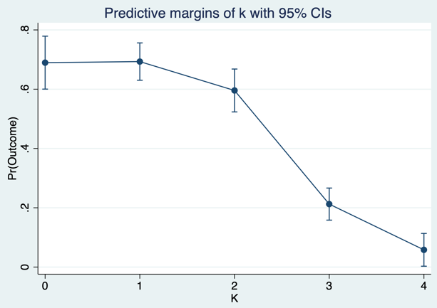
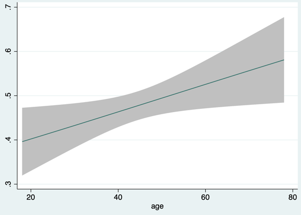
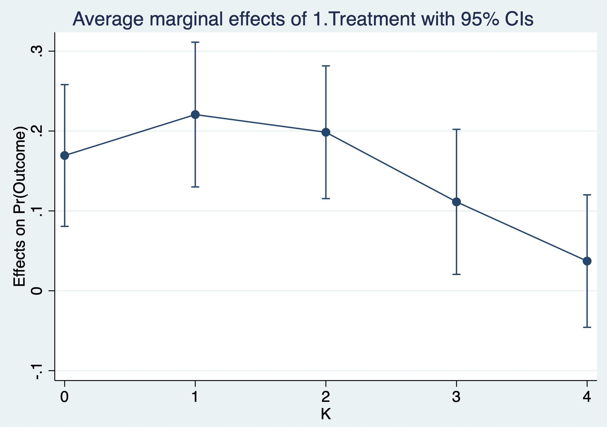
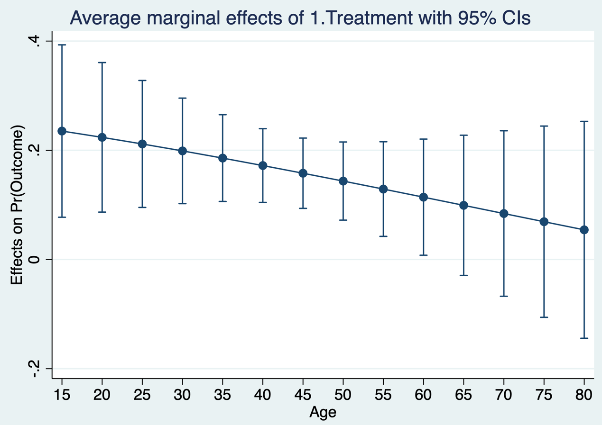
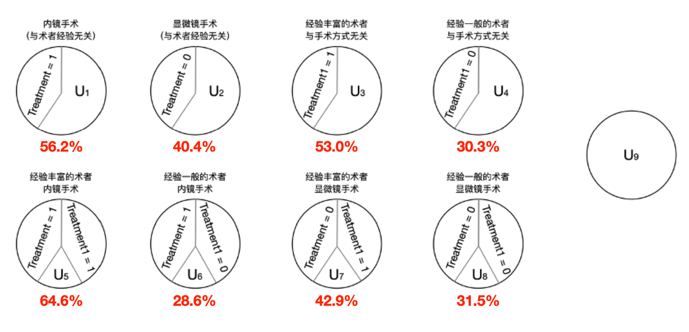

# 回归

## 结果回归

1.  连续型结局变量

将上一章所述因果结构模型进一步细化，考虑 $`f`$ 为线性函数，结局变量为连续变量，计算平均因果效应：

**公式 9.1　连续型结局的结果回归**

$$\begin{aligned}
Y &= f(X, U) \\
Y &= \beta_0 + \beta_1 X + \beta_2 U \\
E\!\left(Y^{X=1}\mid U\right)-E\!\left(Y^{X=0}\mid U\right) &= \beta_1
\end{aligned}$$

通过拟合结果回归模型，可以通过普通最小二乘法估计模型的参数。结果回归通过估计治疗的因果效应来调整混杂因素的每一层。如果变量 $`\ U`$ 足以调整混杂（和选择偏倚）并且正确指定了该结构模型，则无需进一步需要调整。

2.  二分类结局变量

当结局变量为分类变量（0或1）时，如果继续使用线性回归会导致$`\ Y\ `$的取值并不为0或1。逻辑回归（Logistic regression）使用一个函数来归一化$`\ Y\ `$值，使$`\ Y\ `$的取值在区间（0,1）内，这个函数称为Logistic函数。逻辑回归本质上是线性回归，为了计算方便，引入比值这个概念（Odds），函数公式如下

**公式 9.2　二分类结局的逻辑回归**

$$\begin{aligned}
\Pr(Y=1\mid X,U) &= \operatorname{logit}^{-1}(\beta_0+\beta_1X+\beta_2U) \\
&= \frac{\exp(\beta_0+\beta_1X+\beta_2U)}{1+\exp(\beta_0+\beta_1X+\beta_2U)} \\
\operatorname{Odds}(Y^{X=1}) &= \exp(\beta_0+\beta_1+\beta_2U) \\
\operatorname{Odds}(Y^{X=0}) &= \exp(\beta_0+\beta_2U) \\
\operatorname{OR} &= \frac{\operatorname{Odds}(Y^{X=1})}{\operatorname{Odds}(Y^{X=0})}=\exp(\beta_1)
\end{aligned}$$

二分类变量的另一种因果效应描述方式是相对风险度（Risk ratio，RR），定义为干预组发生结局事件的比例与非干预组发生结局事件的比例之比。当疾病的发病率\<10%时，RR与OR很接近。当发病率增大时，两者的差别增大，OR会高估 RR（详见 Zhang 与 Yu，1998）。

**公式 9.3　相对风险**

$$\operatorname{RR} = \frac{\Pr(Y^{X=1}=1)}{\Pr(Y^{X=0}=1)}$$

3.  二分类结局变量Probit模型

又称为概率单元回归，最简单的Probit模型就是指结局变量 Y 为二分类变量，事件发生的概率是依赖于干预变量，*f* 服从标准正态分布。当结局变量是分类变量时，逻辑回归和Probit回归没有本质的区别，一般情况下可以换用。区别在于采用的分布函数不同，前者假设随机变量服从逻辑概率分布，而后者假设随机变量服从正态分布。

**公式 9.4　二分类结局的 Probit 模型**

$$\Pr(Y=1\mid X,U) = \Phi(\beta_0+\beta_1X+\beta_2U)$$

回归系数一般情况下指的是干预变量每增加一个单位会导致结局事件发生的概率变化多少个单位，即概率密度函数的改变量，解释较逻辑回归麻烦。如果只有一个自变量 X，取值为 0 和 1 分别代表对照组和试验组，β<sub>0</sub> 代表就是对照组的概率单元值，β<sub>1</sub> 代表试验组与对照组的概率单元的差值。如果回归系数 β 为正，可解释为扣除其他因素的影响，该因素会使概率单元增加；如果为负值，则表示该因素会使概率单元减少。

案例9.1

生长激素型垂体腺瘤是一种过度分泌生长激素的垂体腺瘤，手术治疗是其主要治疗方法，目的是手术后的生长激素水平降至极低的水平。手术治疗包括使用内窥镜手术和显微镜手术两种方案。在回顾性数据中，纳入899例患者，观察到了如下表格中的数据。ID为患者标识；T代表手术方案，分别为内窥镜手术（Endoscopy）和显微镜手术（Microscopy）；K代表肿瘤侵袭性分级，指数越高，侵袭性越高；Y是感兴趣的结局事件；LOS是手术后的住院时长。

**案例9.1数据表**

| ID  |     T      |  K  |  Y  | LOS |
|:---:|:----------:|:---:|:---:|:---:|
|  …  |     …      |  …  |  …  |     |
| 572 | Endoscopy  |  3  | No  |  5  |
| 573 | Endoscopy  |  0  | No  |  8  |
| 574 | Endoscopy  |  3  | Yes |  6  |
| 575 | Endoscopy  |  3  | Yes |  6  |
| 577 | Microscopy |  2  | Yes |  5  |
| 578 | Microscopy |  0  | Yes |  6  |
| 579 | Microscopy |  3  | No  |  9  |
|  …  |     …      |  …  |  …  |     |

首先，根据临床先验知识，画出因果图（图9.1），研究不同的手术方法 T 是否影响手术后生长激素水平能否降至目标水平 Y。协变量为肿瘤的侵袭程度 K，在这个极其简化的模型中，假设调整 K 足以调整混杂（实际操作中可能存在其他因素，参见第8章），因此无需进一步调整其他因素，通过逻辑回归估计治疗 T 和结果 Y 之间的因果关系。回归结果比值比为2.32，95%置信区间为1.64-3.28，p值0.000，即内窥镜组手术后生长激素降至目标水平的风险是显微镜组的2.32倍。其中，风险是指结局事件发生的可能性与不发生的可能性之比。

::: {.text-center}
{width="2.93488in"}

**图9.1因果图**
:::


::: {.callout-note appearance="simple" icon="false" title="代码9.1"}
``` stata
gen Treatment = (t == "Endoscopy")
gen Outcome = 1 if y == "Yes"
replace Outcome = 0 if y == "No"
logit Outcome Treatment k, or
```
:::

::: {.callout-note appearance="simple" icon="false" title="代码9.1输出"}
|          Logistic regression          | Number of obs |      =       |  **743**   |
|:-------------------------------------:|---------------|:------------:|:----------:|
|                                       | LR chi2(2)    |      =       | **167.81** |
| **Log pseudolikelihood = -430.27684** | Prob \> chi2  |      =       | **0.0000** |
|                                       | Psudo R2      |      =       | **0.1632** |
|                Outcome                | Odds ratio    |  Std. err.   |     z      |
|               Treatment               | **2.318421**  | **.4086361** |  **4.77**  |
|                   k                   | **.4007459**  | **.0324411** | **-11.30** |
|                \_cons                 | **3.552514**  | **.5975031** |  **7.54**  |
:::

当然上述问题也可以采用Probit模型回归，其回归系数的解释就比较麻烦。模型截距=0.756，侵袭性的系数为-0.550，因此，侵袭性为1度时显微镜组（对照组，基线状态）的概率单元为0.756-0.550=0.206，干预变量的系数表示内窥镜组与显微镜组的概率单元值差值，概率单元值增加（0.497），即内窥镜组可增加疾病缓解的概率，结果具有统计学意义（p=0.000）。侵袭性为1度时内窥镜组的概率单元为0.206+0.497=0.703。

::: {.callout-note appearance="simple" icon="false" title="代码9.2"}
``` stata
probit Outcome Treatment k
```
:::

::: {.callout-note appearance="simple" icon="false" title="代码9.2输出"}
|           Probit regression           | Number of obs |      =       |  **743**   |
|:-------------------------------------:|---------------|:------------:|:----------:|
|                                       | LR chi2(2)    |      =       | **167.48** |
| **Log pseudolikelihood = -430.44519** | Prob \> chi2  |      =       | **0.0000** |
|                                       | Psudo R2      |      =       | **0.1629** |
|                Outcome                | Odds ratio    |  Std. err.   |     z      |
|               Treatment               | **.4974691**  | **.1038808** |  **4.79**  |
|                   k                   | **-.55001**   | **.0457608** | **-12.02** |
|                \_cons                 | **.7564864**  | **.0978602** |  **7.73**  |
:::

在Excel中可分别通过计算NORM.S.DIST (0.206, TRUE) 和 NORM.S.DIST (0.703, TRUE) ，得出两者的累积分布函数值，分别为0.582和0.759。计算比值比为2.26，与逻辑回归接近。

$$\operatorname{OR}=\frac{0.759/(1-0.759)}{0.582/(1-0.582)}=2.26$$

其次，如果比较两种方案（内窥镜手术和显微镜手术）的住院时长，因其为连续变量，可采用线性回归计算。同样，为了简化，假设调整 K 足以调整混杂。回归系数为-0.62，95%置信区间为-0.92至-0.32，p值0.000，表示内窥镜手术患者比显微镜手术患者平均住院时间少0.62天。

::: {.callout-note appearance="simple" icon="false" title="代码9.3"}
``` stata
reg los Treatment k
```
:::

::: {.callout-note appearance="simple" icon="false" title="代码9.3输出"}
| Source | SS | df | MS | Number of obs | = | **899** |
|---:|:--:|:--:|:--:|----|:--:|:--:|
| Model | **145.527971** | **2** | **72.763985** | F(3, 32) | = | **14.86** |
| Residual | **4386.96146** | **896** | **4.8961623** | Prob \> F | = | **0.0000** |
| Total | **4532.48943** | **898** | **5.0473156** | R-squared | = | **0.0321** |
|  |  |  |  | Adj R-squared | = | **0.0299** |
|  |  |  |  | Root MSE | = | **2.2127** |
| rate | Coefficient | Std. err. | t | P\>\|t\| | \[95% conf. interval\] |  |
| Treatment | **-.6208906** | **.1520286** | **-4.08** | **0.000** | **-.91926** | **-.322517** |
| k | **.2791882** | **.0631276** | **4.42** | **0.000** | **.155293** | **.4030834** |
| \_cons | **5.451714** | **.1435598** | **37.98** | **0.000** | **5.16996** | **5.733467** |
:::

## 错误的回归方程

结构因果模型中不应该阻断干预措施的子节点，即因果图上治疗 T 箭头所指向的变量（图9.2）。如果阻断了T的自变量，那可能会出现两种情况：或者阻断从 T 到 Y 的因果流动；或者在 T 和 Y 之间引入非因果关联。下图中，假设由治疗 T 到结局 Y 的因果流动是由变量 M 介导的，即内窥镜手术（T）增加生长激素达标率（Y）是因为增加了全切率（M）。此时，假设如果将分析限制在未全切的个体中（M = 0）或全切的个体中（M = 1），用图中节点周围的方框表示。通过医学常识，未全切的患者生长激素水平肯定不能达标，这些患者中不管是否接受内窥镜治疗或显微镜治疗，手术都无法达标。因此，在M = 0的个体中，治疗和结果无因果关系。这意味着如果阻断M，将削弱因果估计甚至将原本有统计意义的因果估计降为0。

确实，在将全切率纳入回归方程后，比值比降为1.17，比原先减少了49.6%，95%置信区间为0.79-1.74，p值0.441，没有统计学意义。需要注意的是，全切率 M 是 T 与 Y 之间的中介变量，将其纳入回归会阻断部分因果通路，从而低估总效应；这种对中介变量或对撞因子的不当调整称为过度调整偏倚（Schisterman 等，2009）。

::: {.text-center}
{width="2.3622in"}

**图9.2 错误的阻断干预的子节点：中介变量**
:::


::: {.callout-note appearance="simple" icon="false" title="代码9.4"}
``` stata
gen M = (extend == "GTR")
logit Outcome Treatment k M, or
```
:::

::: {.callout-note appearance="simple" icon="false" title="代码9.4输出"}
|          Logistic regression          | Number of obs |      =       |  **743**   |
|:-------------------------------------:|---------------|:------------:|:----------:|
|                                       | LR chi2(2)    |      =       | **308.30** |
| **Log pseudolikelihood = -360.03323** | Prob \> chi2  |      =       | **0.0000** |
|                                       | Psudo R2      |      =       | **0.2998** |
|                Outcome                | Odds ratio    |  Std. err.   |     z      |
|               Treatment               | **1.169176**  | **.2374247** |  **0.77**  |
|                   k                   | **.6796318**  | **.0652252** | **-4.02**  |
|                   M                   | **18.40479**  | **5.419085** |  **9.89**  |
|                \_cons                 | **.197124**   | **.0670321** | **-4.78**  |
:::

其次，如果 T 的后代变量又是 Y 的后代变量，即 T 和 Y 共同导致了 Z，此时如果以 Z 为条件，将导致 T 和 𝑌 之间出现非因果关联。这种情况通常发生在许多患者失访的情况下，研究者剔除了失访的患者，只关注有随访的患者，图9.3中C周围的方块表示以C=0为条件。如果治疗措施与失访相关（例如内窥镜是全新的治疗方式，因此研究者对内窥镜治疗的患者更加愿意随访，而显微镜治疗的患者失访率可能较高），而结局事件也可以影响失访率（如手术未全切，术后未达标的患者可能失访率较低）。此时，在失访的情况下，内窥镜治疗和显微镜治疗组可能差别不大，而单单分析未随访的患者可能夸大因果效应。

::: {.text-center}
{width="2.3622in"}

**图9.3 错误的阻断干预的子节点：对撞变量**
:::


::: {.callout-note appearance="simple" icon="false" title="代码9.5"}
``` stata
replace Outcome = 1 if y == "Censored"
logit Outcome Treatment k, or
```
:::

::: {.callout-note appearance="simple" icon="false" title="代码9.5输出"}
|         Logistic regression          | Number of obs |      =       |  **899**   |
|:------------------------------------:|---------------|:------------:|:----------:|
|                                      | LR chi2(2)    |      =       | **175.80** |
| **Log pseudolikelihood = -527.0722** | Prob \> chi2  |      =       | **0.0000** |
|                                      | Psudo R2      |      =       | **0.1429** |
|               Outcome                | Odds ratio    |  Std. err.   |     z      |
|              Treatment               | **2.086615**  | **.3299483** |  **4.65**  |
|                  k                   | **.427447**   | **.0307782** | **-11.80** |
|                \_cons                | **4.908286**  | **.7718278** | **10.12**  |
:::

在原始数据中内窥镜患者的失访率是16.7%，显微镜患者的失访率是17.8%，案例9.1的分析中将失访者排除在外进行因果推断。然而如果假设所有失访的患者都达标了，此时真正的因果效应是2.09，比案例9.1的结果减少了13.0%。

## 修饰效应

临床研究中的人群存在异质性，特定人群子集中的平均因果效应不一定与总体人群中的平均因果效应一致。不同生理情况的个体对治疗的敏感性不一。修饰效应的定义：当 T 与 Y 的平均因果效应在 V 的不同水平上存在差异时，即因子 V 改变了 T 与 Y 的关联强度， V 即为效应修饰因子。

**公式 9.5　效应修饰**

$$E\!\left(Y^{T=1}-Y^{T=0}\mid V=1\right) \ne E\!\left(Y^{T=1}-Y^{T=0}\mid V=0\right)$$

或在相对效应尺度上：

$$\frac{\Pr(Y^{T=1}=1\mid V=1)}{\Pr(Y^{T=0}=1\mid V=1)} \ne \frac{\Pr(Y^{T=1}=1\mid V=0)}{\Pr(Y^{T=0}=1\mid V=0)}$$

分层分析是识别修饰效应的常用方法。在变量 V 的每个级别（层）中计算 T 对 Y 的因果效应。计算过程分两步：① 根据不同的 V 分层；② 每个层中矫正混杂因素 L。文献中为了避免潜在的混淆，一些作者更喜欢使用术语“效应的跨层异质性”，实际上和修饰效应是同一概念。

案例9.1修饰效应

在上述数据中增加年龄变量Age。

案例9.1修饰效应数据表

| ID  | Age |     T      |  K  |  Y  | LOS |
|:---:|:---:|:----------:|:---:|:---:|:---:|
|  …  |  …  |     …      |  …  |  …  |     |
| 572 | 38  | Endoscopy  |  3  | No  |  5  |
| 573 | 25  | Endoscopy  |  0  | No  |  8  |
| 574 | 42  | Endoscopy  |  3  | Yes |  6  |
| 575 | 33  | Endoscopy  |  3  | Yes |  6  |
| 577 | 63  | Microscopy |  2  | Yes |  5  |
| 578 | 52  | Microscopy |  0  | Yes |  6  |
| 579 | 31  | Microscopy |  3  | No  |  9  |
|  …  |  …  |     …      |  …  |  …  |     |

分别在50岁及以下人群以及50岁以上人群中进行回归。

::: {.callout-note appearance="simple" icon="false" title="代码9.6"}
``` stata
logit Outcome Treatment k if age \<= 50, or
```
:::

::: {.callout-note appearance="simple" icon="false" title="代码9.6输出"}
|          Logistic regression          | Number of obs |      =       |  **599**   |
|:-------------------------------------:|---------------|:------------:|:----------:|
|                                       | LR chi2(2)    |      =       | **137.52** |
| **Log pseudolikelihood = -346.29268** | Prob \> chi2  |      =       | **0.0000** |
|                                       | Psudo R2      |      =       | **0.1657** |
|                Outcome                | Odds ratio    |  Std. err.   |     z      |
|               Treatment               | **2.457885**  | **.4822285** |  **4.58**  |
|                   k                   | **.4010976**  | **.0360546** | **-10.16** |
|                \_cons                 | **4.469598**  | **.8864222** |  **7.55**  |
:::

50岁以下人群中的比值比为2.46。

::: {.callout-note appearance="simple" icon="false" title="代码9.7"}
``` stata
logit Outcome Treatment k if age \> 50, or
```
:::

::: {.callout-note appearance="simple" icon="false" title="代码9.7输出"}
|          Logistic regression          | Number of obs |      =       |  **300**   |
|:-------------------------------------:|---------------|:------------:|:----------:|
|                                       | LR chi2(2)    |      =       | **27.65**  |
| **Log pseudolikelihood = -174.23677** | Prob \> chi2  |      =       | **0.0000** |
|                                       | Psudo R2      |      =       | **0.0735** |
|                Outcome                | Odds ratio    |  Std. err.   |     z      |
|               Treatment               | **1.37499**   | **.3779807** |  **1.16**  |
|                   k                   | **.5332196**  | **.0673594** | **-4.98**  |
|                \_cons                 | **5.39819**   | **1.406641** |  **6.47**  |
:::

50岁以上人群中的比值比为1.37，直观上两者存在明显差异，因此年龄可能是手术方式对内分泌预后的修饰效应因子。推断两者是否存在统计学差异请参考下一节边际效应。

研究者识别修饰效应因子有如下几个相关原因：

首先，如果一个因素改变了治疗对结果的影响，那么如果改变人群中该因素的占比，平均因果效应也将改变。假设某干预措施的结局的因果效应提示对女性有害，而对男性有益，如果选择一般人群（男女比1:1），则整个人群的平均因果效应为零。然而，如选择女性比例较高的人群中进行研究，则该人群的平均因果效应将变成有害。也就是说，人群总体中的平均因果效应取决于个体因果效应在总体中的分布。

在一个群体中计算的因果效应外推到第二个群体可能会缺乏可迁移性。本中心获得的因果效应可能在其他中心并不适用，因为两个中心的效应修饰因子分布不同。此外，不同中心还可能存在其他未测量或未知的因果效应修饰因子，这使得效应在人群间的可迁移性问题比因果关系识别问题更加困难。因此，因果效应的可迁移性是一个无法验证的假设，严重依赖学科知识。

其次，评估修饰效应的存在有助于识别能从干预中受益最多的群体。案例9.1中，手术方式对结果的平均因果效应在年龄较大的组中无统计学显著性。如果这个结论在多个中心的研究中得以证实，那么对于年龄较大的患者来说手术医生不会偏向任何方法，而对年轻患者来说手术医生会偏向内窥镜手术方法。

最后，效果修饰因子的识别可能有助于理解导致结果的生物学、社会学或其他机制。如，未割包皮的男性感染艾滋病毒的风险高于割包皮的男性可能会提供新的线索来了解这种疾病。术语修饰效应和交互作用有时在科学文献中用作同义词。但需指出，修饰效应（effect modification）与交互作用（interaction）在概念上并不等同：前者关注在 V 的不同水平上 T 对 Y 效应的差异，并不要求 V 本身可干预；后者则赋予 T 与 T′ 同等的可干预地位。二者的严格区分可参见 VanderWeele（2009）。

## 边际效应

所谓边际效应是从已有拟合模型结果中计算出来的统计量，该数值表示自变量的变化对结局变化的影响作用的大小。在对模型结果进行分析时，可以计算自变量取某一个值时，自变量对结局变量的边际值，也可以计算自变量平均值处的边际值，或者还可以计算其他变量取均值时某一自变量对结局变量的平均边际效应。这里边际值是指的结局变量的平均值或者平均概率，而边际效应是指干预组与对照组之间结局变量平均值或者平均概率之差。

边际效应采用的思想也是反事实框架下的思想，即假设所有样本的某一变量都取某一值，平均的结局指标是多少。这种“将某变量统一赋值、再求结局期望”的做法，本质上就是基于结果回归的标准化（g 公式）思想，是从回归模型估计平均因果效应的基础（Hernán 与 Robins，2020）。

案例9.1中计算手术、侵袭性以及年龄对生长激素达标的边际效应，利用margins命令，星号代表计算所有变量的边际效应

::: {.callout-note appearance="simple" icon="false" title="代码9.8"}
``` stata
logit Outcome Treatment i.k age, or
margins, dydx(\*)
```
:::

::: {.callout-note appearance="simple" icon="false" title="代码9.8输出"}
+------------------------------------+---------------+--------------+------------+
| Average marginal effects           | Number of obs | =            | **743**    |
+====================================+===============+:============:+:==========:+
| Model VCE: OIM                     |               |              |            |
+------------------------------------+---------------+--------------+------------+
| Expression: Pr(Outcome), predict() |               |              |            |
|                                    |               |              |            |
| dy/dx wrt: Treatment k age         |               |              |            |
+------------------------------------+---------------+--------------+------------+
|                                    |               |              |            |
+------------------------------------+---------------+--------------+------------+
|                                    | Delta-method  |              |            |
+------------------------------------+---------------+--------------+------------+
| Margin                             | Std. err.     | z            | P\>\|z\|   |
+------------------------------------+---------------+--------------+------------+
| Treatment                          | **.1602185**  | **.0329159** | **4.87**   |
+------------------------------------+---------------+--------------+------------+
| k                                  | **-.1746125** | **.0105929** | **-16.48** |
+------------------------------------+---------------+--------------+------------+
| age                                | **.0030562**  | **.0013536** | **2.26**   |
+------------------------------------+---------------+--------------+------------+
:::

平均边际效应提示保持其他变量不变，从显微镜组至内窥镜组内分泌缓解率平均增加16.0%；保持其他变量不变，侵袭性每增加一个级别内分泌缓解率平均减少17.5%。保持其他变量不变，年龄每增加十岁，内分泌缓解率平均增加3.1%。可以绘制平均边际值随侵袭性变化（分类变量）以及随年龄变化（连续变量）的曲线。

::: {.callout-note appearance="simple" icon="false" title="代码9.9"}
``` stata
margins, dydx(k)
marginsplot
```
:::

::: {.text-center}
{width="5.76772in"}

**代码9.9输出缓解率（纵轴）随侵袭性（横轴）变化**
:::


::: {.callout-note appearance="simple" icon="false" title="代码9.10"}
``` stata
marginscontplot age, ci
```
:::

::: {.text-center}
{width="5.76772in"}

**代码9.10输出缓解率（纵轴）随年龄（横轴）变化**
:::


本章第一节已知内窥镜干预能提高手术缓解率。然而，侵袭性亦会影响手术效果。因此，我们想探究侵袭性能否调节干预对手术缓解率的影响作用。于是，在回归模型中加入这两个变量的交乘项来检验修饰效应。

::: {.callout-note appearance="simple" icon="false" title="代码9.11"}
``` stata
logit Outcome i.Treatment k i.Treatment#c.k age, or
margins k, dydx(i.Treatment) plot
```
:::

::: {.callout-note appearance="simple" icon="false" title="代码9.11输出"}
|          Logistic regression          | Number of obs |      =       |  **743**   |
|:-------------------------------------:|---------------|:------------:|:----------:|
|                                       | LR chi2(2)    |      =       | **174.92** |
| **Log pseudolikelihood = -426.72345** | Prob \> chi2  |      =       | **0.0000** |
|                                       | Psudo R2      |      =       | **0.1701** |
|                Outcome                | Odds ratio    |  Std. err.   |     z      |
|              1.Treatment              | **3.650757**  | **1.391229** |  **3.40**  |
|                   k                   | **.4529654**  | **.0472107** | **-7.60**  |
|            Treatment#c.k 1            | **.7861221**  | **.1317911** | **-1.44**  |
|                  age                  | **1.015891**  | **.0071311** |  **2.25**  |
|                \_cons                 | **1.467374**  | **.555727**  |  **1.01**  |
:::

回归模型中，交乘项的系数p值大于0.05，提示统计学分析不提示侵袭性是手术效果的修饰效应。然而，应该注意到样本量与统计效能的问题。更加直观的方法是计算不同侵袭性级别肿瘤中的边际效应，可见级别为0-3的肿瘤中，边际效应均为正值，级别为4的肿瘤边际效应接近零，95%区间有重叠。

::: {.callout-note appearance="simple" icon="false" title="代码9.12"}
``` stata
margins, dydx(Treatment) at(k=(0(1)4)) plot
```
:::

::: {.text-center}
{width="5.76806in"}

**代码9.12输出内窥镜比显微镜缓解率的增加（纵轴）随侵袭性（横轴）变化**
:::


上一节中50岁以下人群中的比值比为2.69，50岁以上人群中的比值比为1.59，直观上两者存在明显差异，因此年龄可能是手术方式对内分泌预后的修饰效应因子。同样采用交互项的方法统计检验年龄的修饰效应。虽然统计学检验未见年龄的修饰效应，但更直观的方法可以计算不同年龄段患者中的边际效应，可见随着年龄的增长，内窥镜组和显微镜组的差距越来越小。

::: {.callout-note appearance="simple" icon="false" title="代码9.13"}
``` stata
logit Outcome i.Treatment k i.Treatment#c.age age, or
margins, dydx(Treatment) at(age=(15(5)80)) plot
```
:::

::: {.callout-note appearance="simple" icon="false" title="代码9.13输出"}
|         Logistic regression         | Number of obs |      =       |  **743**   |
|:-----------------------------------:|---------------|:------------:|:----------:|
|                                     | LR chi2(2)    |      =       | **173.98** |
| **Log pseudolikelihood = -427.185** | Prob \> chi2  |      =       | **0.0000** |
|                                     | Psudo R2      |      =       | **0.1692** |
|               Outcome               | Odds ratio    |  Std. err.   |     z      |
|             1.Treatment             | **4.38435**   | **2.812506** |  **2.30**  |
|                  k                  | **.4104892**  | **.0336063** | **-10.88** |
|          Treatment#c.age 1          | **.9851654**  | **.0137251** | **-1.07**  |
|                 age                 | **1.023341**  | **.0101553** |  **2.33**  |
|               \_cons                | **1.239721**  | **.5904421** |  **0.45**  |
:::

::: {.text-center}
{width="5.76806in"}

**代码9.13输出内窥镜比显微镜缓解率的增加（纵轴）随年龄（横轴）变化**
:::


## 交互作用

1.  反事实框架下的交互作用

一般来说，如果同时给与个体两个或多个干预措施，观察到某个结果，我们将这两种或多种干预称为联合干预。两种治疗 T 和 T’ 之间存在交互作用的定义为，如果将 T’ 设为1的联合干预时 T 对 Y 的因果效应不同于将 T’ 设置为 0 的联合干预时 T 对 Y 的因果效应。即

**公式 9.6　交互作用**

$$\Pr(Y^{T=1,T'=1}=1)-\Pr(Y^{T=0,T'=1}=1) \ne \Pr(Y^{T=1,T'=0}=1)-\Pr(Y^{T=0,T'=0}=1)$$

交互作用和修饰效应之间的区别在于修饰效应的概念着重 T 对 Y 的因果效应，而不是 V 对 Y 的因果效应。例如，年龄是手术效果的效应修饰因子，但从未提出年龄对手术效果的影响，并不认为年龄和手术方案是同等地位的变量，因为只有手术方案被认为是可以假设干预的变量。相反，交互作用的定义给予 T 和 T’ 两种干预方法同等的地位，交互的概念指两种处理 T 和 T’ 的联合因果效应。

换句话说，当治疗 T 是随机分配时，交互作用和修饰效应的计算方法是一致的，按照上一节中的方法替换效应修饰因子 V 为治疗 T’。非随机对照研究中，需要通过标准化或逆概率加权以矫正混杂因素，等效方法如下：可以将 T 和 T’ 视为具有四个级别的组合干预（11, 01, 10, 00），而非将 T 和 T’ 视为两种不同的干预。在这种情况下，交互作用的识别与传统的因果识别方法没有区别。

案例9.1交互作用

在案例9.1的数据中增加术者经验变量Surgeon，分为经验丰富（Experienced）和经验一般（Green）。两者以年手术量来划分。

**案例9.1交互作用数据表**

| ID  |   Surgeon   |     T      |  K  |  Y  | LOS |
|:---:|:-----------:|:----------:|:---:|:---:|:---:|
|  …  |      …      |     …      |  …  |  …  |     |
| 572 | Experienced | Endoscopy  |  3  | No  |  5  |
| 573 |    Green    | Endoscopy  |  0  | No  |  8  |
| 574 | Experienced | Endoscopy  |  3  | Yes |  6  |
| 575 | Experienced | Endoscopy  |  3  | Yes |  6  |
| 577 | Experienced | Microscopy |  2  | Yes |  5  |
| 578 | Experienced | Microscopy |  0  | Yes |  6  |
| 579 | Experienced | Microscopy |  3  | No  |  9  |
|  …  |      …      |     …      |  …  |  …  |     |

Treatment_interact为新建的四个级别的组合干预：经验丰富的术者行内镜手术（1）；经验一般的术者行内镜手术（2）；经验丰富的术者行显微镜手术（3）；以及经验一般的术者行显微镜手术（4）。

::: {.callout-note appearance="simple" icon="false" title="代码9.14"}
``` stata
gen Treatment1 = (surgeon == "Experienced")
gen Treatment_interact = 1 if Treatment == 1 & Treatment1 == 1
replace Treatment_interact = 2 if Treatment == 1 & Treatment1 == 0
replace Treatment_interact = 3 if Treatment == 0 & Treatment1 == 1
replace Treatment_interact = 4 if Treatment == 0 & Treatment1 == 0
logit Outcome i.Treatment_interact k, or
```
:::

::: {.callout-note appearance="simple" icon="false" title="代码9.14输出"}
|          Logistic regression          | Number of obs |      =       |  **743**   |
|:-------------------------------------:|---------------|:------------:|:----------:|
|                                       | LR chi2(2)    |      =       | **212.49** |
| **Log pseudolikelihood = -407.93941** | Prob \> chi2  |      =       | **0.0000** |
|                                       | Psudo R2      |      =       | **0.2066** |
|                Outcome                | Odds ratio    |  Std. err.   |     z      |
|          Treatment_interact           |               |              |            |
|                   2                   | **.1472528**  | **.0483119** | **-5.84**  |
|                   3                   | **.3145498**  | **.063998**  | **-5.68**  |
|                   4                   | **.1692625**  | **.0505872** | **-5.94**  |
|                   k                   | **.3966421**  | **.0329938** | **-11.12** |
|                \_cons                 | **13.09457**  | **3.191546** | **10.55**  |
:::

经验丰富的术者行内镜手术（1）对比经验丰富的术者行显微镜手术（3）效果更好，结果比值比为0.315（p = 0.000）。也可以经验一般的术者行内镜手术为参考进行比较。

::: {.callout-note appearance="simple" icon="false" title="代码9.15"}
``` stata
logit Outcome ib(2).Treatment_interact k, or
```
:::

::: {.callout-note appearance="simple" icon="false" title="代码9.15输出"}
|          Logistic regression          | Number of obs |      =       |  **743**   |
|:-------------------------------------:|---------------|:------------:|:----------:|
|                                       | LR chi2(2)    |      =       | **212.49** |
| **Log pseudolikelihood = -407.93941** | Prob \> chi2  |      =       | **0.0000** |
|                                       | Psudo R2      |      =       | **0.2066** |
|                Outcome                | Odds ratio    |  Std. err.   |     z      |
|          Treatment_interact           |               |              |            |
|                   1                   | **6.791041**  | **2.228062** |  **5.84**  |
|                   3                   | **2.136121**  | **.6812429** |  **2.38**  |
|                   4                   | **1.149468**  | **.4432603** |  **0.36**  |
|                   k                   | **.3966421**  | **.0329938** | **-11.12** |
|                \_cons                 | **13.09457**  | **3.191546** | **10.55**  |
:::

而经验一般的术者行内镜手术（2）对比经验一般的术者行显微镜手术（4）结果比值比为1.149（p

0.718），两者无明显差别。因此术者经验与手术方式存在交互作用，对于手术经验丰富的术者，内窥镜能显著提升缓解率；对于手术经验一般的术者，内窥镜和显微镜效果相当。

2.  充分病因框架下的交互作用

再次考虑以上案例，有些患者只有接受内镜手术才能缓解，有些患者只有接受显微镜手术才能缓解，有些患者无论如何都不能缓解，有些患者无论如何都能缓解。这表明手术治疗并不是唯一决定预后的变量。流行病学中的充分病因模型可以用于解释交互作用，充分病因是指导致疾病发生的最少条件的干预组合，也就是说充分病因中的因素中都是导致疾病所必需的。举一个简单的例子，假设接受内镜手术且肿瘤较小的患者都缓解了，称内窥镜干预（T = 1）和肿瘤大小（U<sub>1</sub> = 0）是结果（缓解）的充分病因。另假设接受显微镜手术且肿瘤呈侵袭性的都没有缓解，称干预（T = 0）和肿瘤侵袭性（U<sub>2</sub> = 1）是结果（未缓解）的充分病因。同理，可以将充分病因的描述推广至两种治疗的交互作用中。

T 和 T’ 之间存在充分病因交互作用，如果同时给予 T 和 T’ 能产生某个结局。如假设个体由经验丰富的术者行内镜手术时能缓解，但在其他情况下都无法缓解，则术者经验和手术方式存在充分病因交互作用。充分病因交互作用可以是协同的或拮抗的。在充分-组分病因框架下识别协同（synergism）的形式化条件，可参见 VanderWeele 与 Robins（2007）。

协同作用：当两个或两个以上因子共同作用时，其效应明显大于这些因子单独作用时的和或积，称之为协同作用，也称正交互。

拮抗作用：当两个或两个以上因子共同作用时，其效应明显小于这些因子单独作用时的和或积，称之为拮抗作用，也称负交互。

3.  结合反事实和充分病因框架下的交互作用

结合反事实框架以及充分病因框架对交互作用的类型进行分类，可阐明交互的含义。考虑案例9.1交互作用，可以推断出缓解的9种原因。

1)  内镜手术（与术者经验无关）

2)  显微镜手术（与术者经验无关）

3)  经验丰富的术者（与手术方式无关）

4)  经验一般的术者（与手术方式无关）

5)  经验丰富的术者行内镜手术

6)  经验一般的术者行内镜手术

7)  经验丰富的术者行显微镜手术

8)  经验一般的术者行显微镜手术

9)  通过其他机制（与术者经验和手术方式均无关）

通过计算不同原因的边际值，表示这 9 个充分病因的因果饼图（图9.4），红色百分比代表各种原因下的边际缓解概率。

::: {.callout-note appearance="simple" icon="false" title="代码9.16"}
``` stata
gen surg_exp = (surgeon == "Experienced")
logit Outcome i.Treatment i.surg_exp k age i.Treatment#i.surg_exp, or
margins i.Treatment i.surg_exp i.Treatment#i.surg_exp
```
:::

::: {.callout-note appearance="simple" icon="false" title="代码9.16输出"}
| Average marginal effects           | Number of obs = |   **743**    |
|------------------------------------|-----------------|:------------:|
| Model VCE: OIM                     |                 |              |
|                                    |                 |              |
| Expression: Pr(Outcome), predict() |                 |              |
|                                    | Delta-method    |              |
| Margin                             | Std. err.       |      z       |
| Treatment                          |                 |              |
| 0                                  | **.4036051**    | **.0213112** |
| 1                                  | **.5625797**    | **.0224486** |
| surg_exp                           |                 |              |
| 0                                  | **.3030656**    | **.0321055** |
| 1                                  | **.5303804**    | **.0185119** |
| Treatment#surg_exp                 |                 |              |
| 0 0                                | **.3151536**    | **.0434869** |
| 0 1                                | **.4291778**    | **.0246149** |
| 1 0                                | **.2864942**    | **.0482572** |
| 1 1                                | **.6460793**    | **.026193**  |
:::

::: {.text-center}
{width="5.76806in"}

**图9.4反事实与充分病因框架下的交互作用**
:::


参考文献：

1. Hernán MA, Robins JM (2020). Causal Inference: What If. Boca Raton: Chapman & Hall/CRC.

2\. Zhang J, Yu KF. What's the relative risk? A method of correcting the odds ratio in cohort studies of common outcomes. JAMA, 1998, 280(19):1690-1691.

3\. Schisterman EF, Cole SR, Platt RW. Overadjustment bias and unnecessary adjustment in epidemiologic studies. Epidemiology, 2009, 20(4):488-495.

4\. VanderWeele TJ. On the distinction between interaction and effect modification. Epidemiology, 2009, 20(6):863-871.

5\. VanderWeele TJ, Robins JM. The identification of synergism in the sufficient-component-cause framework. Epidemiology, 2007, 18(3):329-339.
