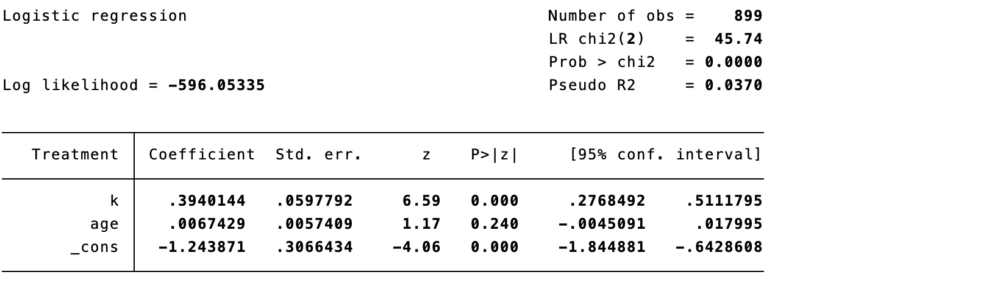
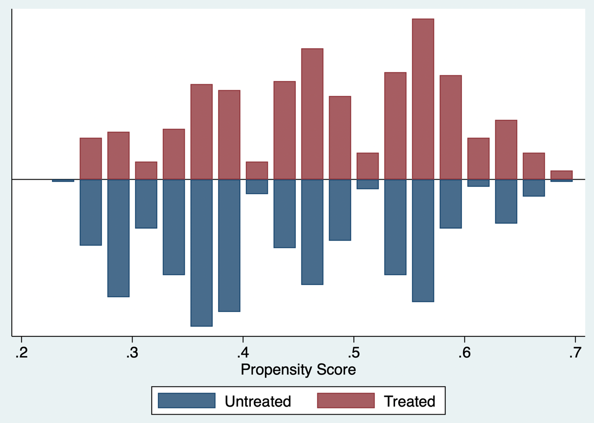
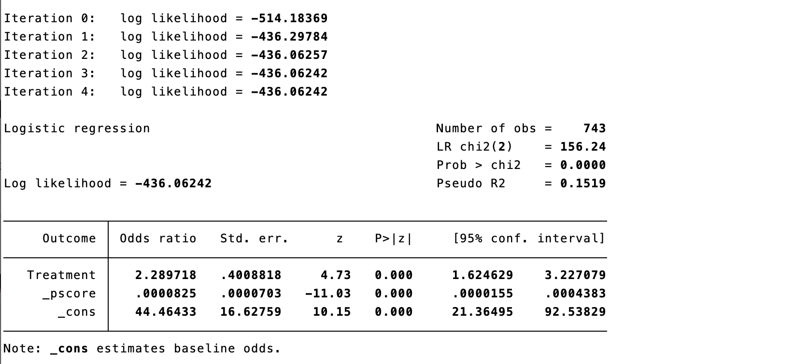
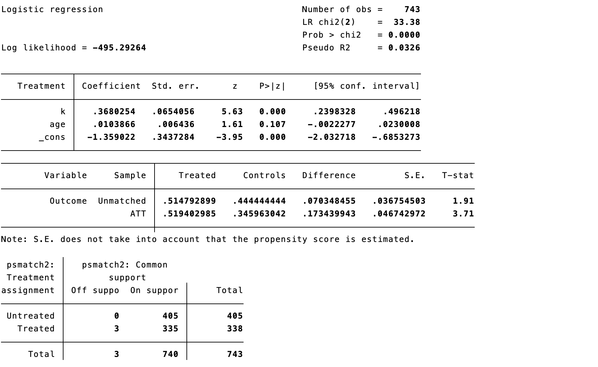
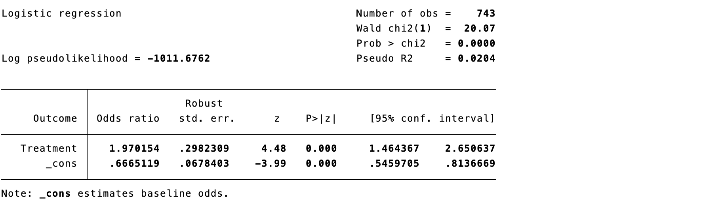
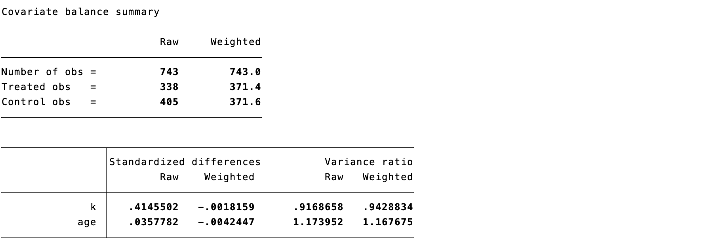
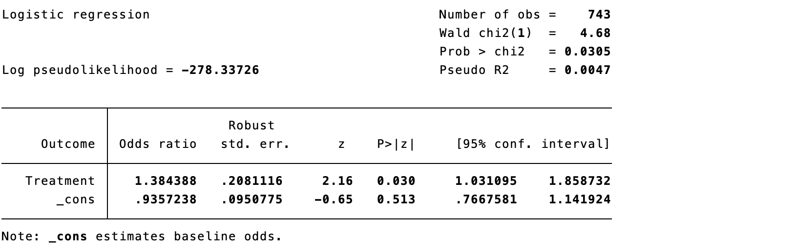

# 基于倾向评分的因果推断方法

在因果推断中，对于某个接受干预的个体，在对照组中找到与其各方面特征都一致的个体将其配对。对干预组中的其他个体采取同样的操作，在对照组中寻找相似的个体进行两两配对。如果能保证配对的两个组中个体的完全相似，那就可以在配对的个体中直接计算因果效应。简而言之，配对就是寻找对照组与干预组中相似的个体，在配对的个体中估计因果效应。配对过程大致上可以分为四个步骤：定义相似性，实施配对，检验配对效果，估计因果效应。配对优于回归之处在于：配对的时候研究者没有任何结局变量的信息，只有在完成配对以后才会用到结局变量，这样就保证了研究的科学性，避免了回归中的主观因素（即为了得到有意义的p值对纳入的控制变量反复多次调整）。这种“先设计、后分析”的做法有助于减少因查看结局后反复调整模型带来的主观性；但配对并不天然优于回归，仍须依赖协变量测量充分、模型设定合理和匹配后平衡可接受等条件。

利用协变量（x1，x2，……，xk）进行配对，一般使用标准化欧式距离来测量两个样本之间的相似性。

$$d(x_i,x_j)=\sqrt{\sum_{k=1}^{K}\frac{(x_{ki}-x_{kj})^2}{\sigma_k^2}}$$

表示两个样本 和 之间的距离， 是某个变量的标准差。那么以样本的哪些特征来测量他们的距离呢？临床研究中样本的特征常常是多个维度的，包括年龄、性别、疾病严重程度、治疗史等等。维度太多带来了计算的复杂性，因此，如果能找到一个简单的变量，用于衡量样本与样本之间的距离，就能大大简化计算。

## 倾向性评分（Propensity Score）

倾向性评分的含义是指接受某种干预的概率。在1:1分配的随机对照研究，每个个体接受该干预的概率都为50%，因此，每个个体的倾向性评分即为0.5，而非随机对照研究当中的倾向性评分需要去估计。估计的方程在考虑所有混杂因素的情况下接受某种干预的概率，即更严格地说，倾向评分是在给定处理前协变量 X 后接受处理的条件概率 e(X)=Pr(A=1\|X)；它用于构造协变量分布可比的样本或加权伪总体，而不是直接估计因果效应。

$$PS(x_i)=Pr[A=1\mid x_i]$$

是这个样本的混杂因素。

倾向性评分的估计一般采用回归方程，将干预变量对所有的混杂因素进行回归。然后得出干预的预测概率即为该干预的倾向性评分。也可以运用一些机器学习的方法来进行倾向性评分的估计。建模的首要目标不是提高对处理分配的预测准确性，而是使后续匹配或加权后的基线协变量达到平衡。协变量应在处理发生前测量，并结合临床知识与因果图选取；不应按单变量 P 值筛选，也不应纳入处理后的变量或碰撞因子。

采用案例9.1的数据，估计接受内窥镜手术的概率，并显示倾向性评分的分布。红色区域为干预组，即为内窥镜组，蓝色区域为对照组，即显微镜组。红色组和蓝色组的倾向性评分都基本分布在0.3到0.6之间，两组的重叠性较高。

::: {.callout-note appearance="simple" icon="false" title="代码10.1"}
``` stata
. psmatch2 Treatment k age, logit
. psgraph, bin(40)
```
:::

::::: {.callout-note appearance="simple" icon="false" title="代码10.1输出"}
::: text-center
{width="100%"}
:::

::: text-center
{width="85%"}
:::
:::::

倾向性评分提示肿瘤侵袭性越高（k），患者接受内窥镜治疗的概率越高。

与之前讨论过的所有因果推断方法一样，使用倾向性评分法需要具备可交换性、重叠性和一致性等识别条件。如果阻断混杂因素后可消除后门路径，那么阻断PS 也可消除后门路径。因此，在协变量水平内，干预组与对照组的可交换性意味着倾向性评分水平内的可交换性。此外，利用倾向性评分来进行因果推断的一个重要的前提是需要考虑倾向性得分的重叠性。图10.1中左边的曲线中，灰色的区域两条曲线有相当一部分的受试者重合，然而在右边的曲线中，两组人群区分的比较开，两者之间的重叠性较差。因此在右边的数据中进行因果推断就比较困难。当然，倾向性评分只平衡了测量的协变量，这并不能防止未测量因素的残留混杂。随机化同时平衡了测量的和未测量的协变量，因此它是消除混杂的首选方法。因此，实施匹配或加权前后均应检查倾向评分的分布与各基线协变量的平衡；倾向评分重叠本身不能替代协变量平衡诊断。

::: text-center
{width="100%"}

**图10.1 重叠性较好与较差的倾向性评分**
:::

利用倾向性评分来进行因果推断有三种方法。

## 直接将倾向评分加入到回归方程

作为回归方程中的唯一协变量

::: {.callout-note appearance="simple" icon="false" title="代码10.2"}
``` stata
. reg Outcome Treatment _pscore, or
```
:::

:::: {.callout-note appearance="simple" icon="false" title="代码10.2输出"}
::: text-center
{width="100%"}
:::
::::

回归结果提示内窥镜组显著增加内分泌缓解率，比值比为2.29，95%置信区间为1.62-3.22，p值0.000。此处报告的 OR 属于条件效应，未必等同于边际风险比或风险差；为便于临床解释，宜同时给出标准化后的绝对风险、风险差或风险比及其 95% 置信区间。

## 利用倾向性评分进行匹配

将倾向评分相同的干预组和对照组之间进行配对，在配对的新样本当中进行因果推断。利用倾向评分进行匹配的原理如图10.2所示，黑色小人代表干预组，黄色小人代表对照组。其倾向性评分在x轴上表示，靠近0代表被分配到干预组的概率很小，靠近1代表分配到干预组的概率较大。倾向性评分匹配第一步从干预组中抽取一个个体，计算其倾向性评分，在对照组中寻找倾向性评分与其最近的黄色小人，将这两个小人形成一个配对。利用同样的方法重复操作，反复进行配对。最后在匹配好的样本中进行因果效应估计。此过程可能会剩下一些没有匹配到的患者，比如说靠近倾向性评分为0附近的黄色小人没有匹配到。

::: text-center
{width="100%"}

**图10.2 倾向性评分匹配原理**
:::

实际的配对操作中可能会遇到四个问题：

一对一或一对多配对：一对一即干预组中的样本在对照组中寻找一个距离最近的样本与其匹配。一对多即干预组中的样本在对照组中寻找多个距离最近的样本与其匹配。一般而言，一对一匹配样本相似性比较好，但可能导致匹配后的样本量不足；而一对多匹配样本相似性没有较好满足，但匹配后的样本量充足。实际情况中，如果原始数据中对照组的样本量与干预组差距很大，可以选择一对多匹配。

如何定义距离最近？定义卡尺（caliper），允许两个样本进行匹配的最大距离。可以想象一下两个样本距离多近才能够匹配，如果卡尺太小，就会导致许多样本无法得到匹配，如卡尺定为0.001，即两样本相差0.001距离才能被匹配，就可能导致许多样本无法匹配。卡尺定太大，就会导致许多样本距离很大，也会被匹配到，可交换性得不到满足。实务中常以 logit(PS) 标准差的 0.2 作为 1:1 最近邻匹配的起始卡尺，并需结合匹配后协变量平衡、样本损失与临床可比性调整，而不应机械套用单一数值。

对照组中的个体是否可以重复匹配？如果原始数据中对照组的样本量远远小于治疗组，为了不损失治疗组的样本量，可以重复匹配对照组。

如果对照组中有多个样本与需要匹配的干预组样本距离一致如何操作？一对一匹配的前提下可以随机选择其中一个，也可以全部纳入，指定每个样本的权重，计算多个样本的加权平均值。

::: {.callout-note appearance="simple" icon="false" title="代码10.3"}
``` stata
. psmatch2 Treatment k age, logit outcome(Outcome) n(1) cal(0.01) ties
```
:::

:::: {.callout-note appearance="simple" icon="false" title="代码10.3输出"}
::: text-center
{width="100%"}
:::
::::

::: {.callout-note appearance="simple" icon="false" title="代码10.4"}
``` stata
. psmatch2 Treatment k age, logit outcome(Outcome) n(1) cal(0.001) ties
```
:::

:::: {.callout-note appearance="simple" icon="false" title="代码10.4输出"}
::: text-center
{width="100%"}
:::
::::

卡尺定为0.01时只有3例患者无法匹配，而卡尺定为0.001时有75例无法匹配。需要指出的是匹配后的纳入样本往往和原始数据中的样本不同，因此基于匹配方法得到的因果效应估计也是针对匹配后的样本，称为干预组中的因果效应（Average treatment effect in the treated，ATT）。干预组中的缓解率为56.7%，对照组中的缓解率为37.6%，计算比值比为2.17。匹配会改变分析人群，故应明确此处估计的目标人群（通常为可匹配治疗者的 ATT），并报告未匹配者的数量与基线特征。

配对分析后的检验如同随机对照临床研究一样需要给出配对后的干预组和对照组各个变量的分布情况，查看是否有变量存在不平衡。下表为输出，U 代表没有匹配的样本，M 代表匹配样本。侵袭度在没有匹配当的样本中，干预组是2.2，对照组为1.7， t检验的p值是0.000，代表两组之间有明显差别的。而在匹配的样本中干预组和对照组都为2.1，t检验的p值是1.000。匹配后的样本中，把侵袭性这样一个不均衡的指标给均衡了。同样倾向性评分方程中所有的指标在匹配以的样本中都均衡了。平衡诊断建议以每个协变量的绝对标准化均数差（absolute SMD）为主，常以 \<0.10 作为经验阈值；不应以 t 检验 P 值是否显著作为是否平衡的判据。

::: {.callout-note appearance="simple" icon="false" title="代码10.5"}
``` stata
. pstest k age, both graph
```
:::

:::: {.callout-note appearance="simple" icon="false" title="代码10.5输出"}
::: text-center
{width="100%"}
:::
::::

## 利用倾向性评分进行逆概率加权（inverse probability weighting, IPW）

给某每一个受试者分配一个权重，通过这样的一个权重我们就可以构建一个假人群，在这个假人群当中我们可以通过统计学的方法来证明不存在混杂效应，然后进行因果推断（图10.3）。例如，一个干预组中的患者，根据倾向性评分模型，只有25%的概率为干预组，所以这个患者的权重为4。理由是他不仅代表自己，还代表4个“类似”他的人。对于对照组中的患者，若根据倾向性评分模型，有90%的概率为干预组，则这个患者的权重为10。理由是他只有10%的概率为对照组，他还代表10个“类似”他的人。

::: text-center
{width="100%"}

**图10.3 逆概率加权原理**
:::

如果研究的问题只包含两种治疗方式（干预或对照），那么权重方程又可写成：

$$w_{ki}^{T=1}=\frac{1}{Pr(T=1\mid k_i)},\qquad w_{ki}^{T=0}=\frac{1}{1-Pr(T=1\mid k_i)}$$

计算权重后，将回归方程的权重指定为逆概率权重。

::: {.callout-note appearance="simple" icon="false" title="代码10.6"}
``` stata
. gen ipweight = 1/_pscore if Treatment == 1
. replace ipweight = 1/(1-_pscore) if Treatment == 0
. logistic Outcome Treatment [iweight = ipweight], vce(robust)
```
:::

:::: {.callout-note appearance="simple" icon="false" title="代码10.6输出"}
::: text-center
{width="100%"}
:::
::::

然而，如果说某个样本的倾向性评分很小，其权重就会变得很大，从而导致因果效应估计引入了一个不稳定的因素，从而得出的推断方差较大。因此实践中，比较常用的是稳定的权重，给逆概率乘一个分子，即干预的总体概率（干预组）或者对照的总体概率（对照组），得出稳定的逆概率：稳定权重可缓和、但不能完全消除极端权重带来的不稳定性。应报告权重分布与有效样本量，并预先说明是否进行截尾、修剪或敏感性分析。

$$SW_{ki}^{T=1}=\frac{Pr(T=1)}{Pr(T=1\mid k_i)},\qquad SW_{ki}^{T=0}=\frac{1-Pr(T=1)}{1-Pr(T=1\mid k_i)}$$

::: {.callout-note appearance="simple" icon="false" title="代码10.7"}
``` stata
. gen s_ipweight = (1/_pscore)*0.4516 if Treatment == 1
. replace s_ipweight = 1/(1-_pscore)*0.5484 if Treatment == 0
. logistic Outcome Treatment [iweight = s_ipweight], vce(robust) or
```
:::

:::: {.callout-note appearance="simple" icon="false" title="代码10.7输出"}
::: text-center
{width="100%"}
:::
::::

通过标化的均数差值（standardized mean difference，SMD）评估加权前后两组间协变量的差值。加权前两组的病例数分别为338和405，加权后为371.4和371.6。对于肿瘤侵袭性，加权前两组的差值为0.415，加权后为-0.002。一般，加权后的SMD需要控制在0.10之内。加权后病例数是加权伪样本量，并不等同于有效样本量。除 SMD 外，宜同时查看权重分布、有效样本量和协变量分布图。

::: {.callout-note appearance="simple" icon="false" title="代码10.8"}
``` stata
. teffects ipw (Outcome) (Treatment k age, logit)
. tebalance summarize
```
:::

:::: {.callout-note appearance="simple" icon="false" title="代码10.8输出"}
::: text-center
{width="100%"}
:::
::::

## 其他加权方法

拟概率加权的问题是极端值影响结果，常规逆概率加权对治疗组的权重为1/PS，未治疗组为1/(1−PS)，使得某个样本的倾向性评分很小或者很大，其权重就会变得很大。虽然可用拟概率加权截尾方法（截掉加权后两边的极值，如第95百分位数对第99百分位数），但这种方法却不能保证截尾位置是否合适，且样本量也减少了。

### 重叠加权（Overlap weighting）

重叠加权给予每个患者分配与该患者属于相反治疗组概率的权重，克服了这些限制。具体来说，接受治疗的患者以未接受治疗的概率【1−PS】为权重，而未接受治疗的患者以接受治疗的概率【PS】为权重。这些权值使得PS接近于1或者0的离群值不会像拟概率加权那样主导结果和降低精度。而那些人群特征在两种治疗方法中都兼容的患者则相对贡献更大，由此产生的目标人群模仿了实用性随机试验的特点。该方法的目标人群是两种治疗均具有合理可能性的重叠（临床均势）人群，而非整个入组人群；因此其效应应与所选 estimand 一并报告。

这种加权方法在结构上可以产生治疗组和参照组之间的精确协变量平衡。然而，推断的目标是重叠人群中的平均治疗效应（ATO），它可能与整个研究人群中的ATT或ATE不同。强调在临床均势情况下对患者进行比较（不考虑肯定会采取干预或肯定会采取对照的情况），结果可见效应较前面几种方法有所下降。 效应估计的改变通常源于目标人群改变，不能简单解释为效应“下降”。

::: {.callout-note appearance="simple" icon="false" title="代码10.9"}
``` stata
. gen o_weight = 1 - _pscore if Treatment == 1
. replace o_weight = _pscore if Treatment == 0
. logistic Outcome Treatment [iweight = o_weight], vce(robust) or
```
:::

:::: {.callout-note appearance="simple" icon="false" title="代码10.9输出"}
::: text-center
{width="100%"}
:::
::::

### 匹配加权（Match weighting）

这种方法是将接受干预或接受治疗的概率中较低的一个与实际接受治疗的预测概率之比对患者进行加权。匹配加权给予接受治疗的患者的权重为【Minimum(PS, 1 − PS) / PS】，而未接受治疗的患者以接受治疗的权重【Minimum(PS, 1 − PS) / (1 − PS)】。此方法排除了极端的权重，消除了权重截断的需要。当两个组群体大小相同，倾向性评分分布有很好的重叠时，推断的目标接近整个人口中的ATE；当两个组群体大小不均，但倾向性评分分布有很好的重叠时，推断的目标接近样本数较少群体中的ATT。在倾向性评分分布重叠度有限的情况下，这种方法的推断目标是在重叠子群体中进行治疗效果估计。匹配加权的估计目标取决于样本构成与倾向评分重叠的具体形态，报告时不宜仅以接近 ATE 或 ATT 代替对目标分布的描述。

::: {.callout-note appearance="simple" icon="false" title="代码10.10"}
``` stata
. gen m_weighting = min(_pscore, 1-_pscore)/_pscore
. replace m_weighting = min(_pscore, 1-_pscore)/(1-_pscore) if Treatment == 0
. logit Outcome Treatment [iweight = m_weighting], vce(robust) or
```
:::

:::: {.callout-note appearance="simple" icon="false" title="代码10.10输出"}
::: text-center
{width="100%"}
:::
::::

### 精细分层加权（Fine stratification weighting）

以平均治疗效果为目标的精细分层加权不直接使用倾向性评分来计算加权，而是用倾向性评分来创建精细分层。分层规则为固定的概率宽度（如0-0.02为分层1，0.02-0.04为分层2，以此类推）。没有干预患者或对照患者的分层被剔除后，根据剩余每个分层中的患者总数，计算出干预和对照组的权重。

以治疗人群中的平均治疗效果为目标的精细分层与上述精细分层方法类似，倾向评分被用来创建精细分层，但治疗组的权重被设定为1，对照组患者根据其所致分层中的干预组患者数量进行重新加权。

### 标准化死亡率加权（Standardized mortality ratio weighting）

这种方法是将接受治疗的病人的权重设置为1，并通过倾向性评分给予对照组患者的权重为【PS/（1-PS）】。与逆概率加权类似，标准化死亡率加权有可能受到极端权重的影响，因为倾向分数被直接用于计算权重。如果观察到大权重，可以考虑截断权重。

::: {.callout-note appearance="simple" icon="false" title="代码10.11"}
``` stata
gen smr_weighting = 1
. replace smr_weighting = _pscore/(1-_pscore) if Treatment == 0
. logit Outcome Treatment [iweight = smr_weight], vce(robust) or
```
:::

:::: {.callout-note appearance="simple" icon="false" title="代码10.11输出"}
::: text-center
{width="100%"}
:::
::::

## 以倾向评分为基础的各种方法的选择

干预组样本倾向性评分在预先指定的范围内（卡尺）将其与固定数量的对照值相匹配，这通常是使用倾向性评分进行混杂调整的首选方法。然而，这种方法有一个重要的局限性，即可能放弃未匹配的样本。在倾向性评分匹配后，协变量的不平衡性可能会增加。匹配并非普遍首选；若旨在整个可比研究样本的 ATE 或希望尽量保留样本，可在重叠和稳定性良好的前提下考虑加权。方法应由目标 estimand、重叠程度、可接受的样本损失及平衡结果共同决定。

对倾向性评分进行加权有几个优点。首先，与匹配不同，加权在分析中保留了大多数样本，因此，在估计治疗效果时可以提供更高的精度。其次，与倾向性评分的回归调整不同，加权很容易使治疗人群和参照人群之间的平衡得到透明的报告。最后，对倾向性评分的加权可以说是在分析中使用倾向性评分的最灵活的方法，有多种可用的变化，可以针对特定人群进行推断。除了使用逆概率治疗加权外，上述新的方法（包括倾向性评分精细分层加权、匹配加权和重叠加权）都可以克服传统加权方法的重要局限性。

推断目标（estimand）是指估计的治疗效果所适用的患者人群。研究者在构思特定研究的推断目标时应考虑以下核心问题——用感兴趣的干预方法治疗研究中所有符合条件的患者是否可行？如果可行，那么推断的目标就可以定义为平均治疗效果（ATE）。如果不可行，即临床上不会给人群中符合条件的每一个人提供治疗，只有具有某些特征的、并实际接受干预的患者才是理想的干预对象，因此推断的目标可定义为治疗人群的平均治疗效果（ATT）。下表总结了每种加权方法的主要特点。

**表10.1几种不同基于倾向性评分的加权方法**

| 方法 | 干预组 | 对照组 | 推断目标 | 说明 |
|:---|:---|:---|:---|:---|
| 逆概率加权 | 1/PS | 1/(1-PS) | ATE | 明确的推断目标，模拟了随机对照试验。然而，因为PS是直接用来创建权重，通常会出现极端的权重，可采用截尾解决极端权重。 |
| 标准死亡率加权 | 1 | PS/(1-PS) | ATT | 加权是通过对照组的倾向性评分进行的，可以自然地扩展到有\>2个治疗组的情况。可能需要对权重进行修剪。 |
| 重叠加权 | (1-PS) | PS | 重叠人群中的ATE | 避免了极端权重。这种方法的目标人群可以被描述为重叠人群或具有合理临床均衡性人群中的治疗效果估计，而这些人群并不反映在常规护理中接受治疗的整个研究人群。 |
| 匹配加权 | Min(PS, 1-PS) / PS | Min(PS, 1-PS) / (1-PS) | 较小组别中的ATT | 避免了极端权重。可以自然地扩展到有两个以上治疗组的情况。当组别大小相同且PS分布有很好的重叠时，推断目标接近整个人群的ATE；当组别大小不均但PS分布有很好的重叠时，推断目标接近较小组别中的ATT。 |

选择倾向性评分加权方法进行混杂调整时有若干考虑：

### 正确规范倾向性评分模型

在使用倾向性评分进行混杂调整的分析中，第一个关键步骤是避免倾向性评分模型的错误。由于研究者不可能知道治疗分配与所有协变量之间的真正结构性关联，因此，在从简单的逻辑回归模型中估计倾向性评分时，可能会出现模型的错误指定。可采用机器学习方法（参考）作为替代方法。 无论采用哪种方法构建倾向性评分模型，研究人员都应强调将结果风险因素纳入模型，并从模型中排除与结果无关但与治疗相关的强预测因素，以避免倾向性评分接近0或1。基于倾向分数分层的加权方法可能对倾向分数模型的错误指定更为稳健，因为它可以被概念化为倾向分数加权的半参数模型，只使用分数来创建分层，然后使用每个分层中的观察值计数来得出权重。倾向评分模型的优劣应由匹配或加权后的平衡判断，而非 c 统计量或预测精度。对于连续或非线性协变量，可考虑样条、交互项或灵活的机器学习模型，并保持模型选择与结局分析相对独立。

### 评估暴露组和参照组之间的倾向性评分分布重叠情况

倾向性评分分布的高重叠度通常表明，在比较组之间的治疗选择中存在合理程度的临床等值。在考虑基于倾向评分的加权时，对非重叠区域进行修剪以确保限制在患者接受任何一种治疗的概率不为零的区域尤为重要。接近0或1的概率可能会导致较大的权重，从而过度影响分析，因为非典型情况下的患者肯定会接受这两种治疗中的一种。如果在修剪了非重叠区域后，丢失了很大一部分样本，这可能表明分布之间的重叠度不够。此外，由于不重叠而通过修剪排除观测值，会导致研究人群的构成发生重要变化，因此，可能会改变推断的目标。修剪阈值会改变目标人群，建议同时报告修剪规则、被排除人数与修剪前后的协变量分布，并通过不同合理阈值开展敏感性分析。

### 推断目标的选择

由于基于倾向性评分的不同加权方法会导致针对不同人群的估计，研究者应密切关注他们的推断目标并选择相应的加权方法。人群平均治疗效应的目的是使治疗组和参照组的协变量分布相互类似，并与整个研究样本的分布类似。受治人群中的平均治疗效果ATT旨在使参考组中协变量的分布与治疗组中观察到的分布相似。具有临床均势子集的平均治疗效果，受倾向性评分分布重叠的影响很大，目标是总体人群中具有临床均势性子集的平均治疗效果（即排除了肯定会予以干预组或者肯定会予以对照组的患者，在这个子集中，临床上病人接受干预或对照有争议）

某些加权方法很容易扩展到两个以上治疗组的情况，包括逆概率加权、匹配权重和标准死亡率加权。所有这些方法都涉及到在多元逻辑回归模型中为三个或更多的治疗产生倾向性分数。逆概率加权是根据实际接受治疗的倾向性的倒数来计算的，无需考虑治疗组的数量如何。对于三组或更多组的匹配权重，分子包括每个病人的所有可用倾向分数的最小值，分母包括实际接受治疗的倾向。对于标准死亡率加权，研究者可以通过将接受目标治疗的病人的权重设置为1，并将其他治疗组的权重计算为目标治疗的倾向与实际接受的治疗的倾向之比，来确定特定治疗组的ATT。

## 利用倾向性评分进行因果推断的局限性

其局限性源于倾向性评分的方程，若估计错误会导致后续一系列的因果估计的错误。其次，存在未测量的混杂因素，利用倾向性评分也同样遗漏这些未测量的混杂因素，导致因果推断错误。第三、倾向性评分匹配需要考虑普适性问题，因为只有匹配的样本才能够被正确地估计因果效应，没有匹配的样本中的因果效应无法估计。未测量混杂无法由倾向评分修复，应结合领域知识、定量偏倚分析或 E-value 等敏感性分析讨论其潜在影响；外推到未匹配或缺乏重叠的人群时应谨慎。

## 参考文献

1.  Rosenbaum PR, Rubin DB. The central role of the propensity score in observational studies for causal effects. *Biometrika*. 1983;70(1):41-55. doi:10.1093/biomet/70.1.41.
2.  Brookhart MA, Schneeweiss S, Rothman KJ, et al. Variable selection for propensity score models. *Am J Epidemiol*. 2006;163(12):1149-1156. doi:10.1093/aje/kwj149. PMID: 16624967.
3.  Austin PC. Balance diagnostics for comparing the distribution of baseline covariates between treatment groups in propensity-score matched samples. *Stat Med*. 2009;28(25):3083-3107. doi:10.1002/sim.3697. PMID: 19757444.
4.  Austin PC. Optimal caliper widths for propensity-score matching when estimating differences in means and differences in proportions in observational studies. *Pharm Stat*. 2011;10(2):150-161. doi:10.1002/pst.433. PMID: 20925139.
5.  Austin PC, Stuart EA. Moving towards best practice when using inverse probability of treatment weighting (IPTW) using the propensity score to estimate causal treatment effects in observational studies. *Stat Med*. 2015;34(28):3661-3679. doi:10.1002/sim.6607. PMID: 26238958.
6.  Deb S, Austin PC, Tu JV, et al. A review of propensity-score methods and their use in cardiovascular research. *Can J Cardiol*. 2016;32(2):259-265. doi:10.1016/j.cjca.2015.05.015. PMID: 26315351.
7.  Li F, Thomas LE, Li F. Addressing extreme propensity scores via the overlap weights. *Am J Epidemiol*. 2019;188(1):250-257. doi:10.1093/aje/kwy201. PMID: 30189042.
8.  Elze MC, Gregson J, Baber U, et al. Comparison of propensity score methods and covariate adjustment: evaluation in 4 cardiovascular studies. *J Am Coll Cardiol*. 2017;69(3):345-357. doi:10.1016/j.jacc.2016.10.060. PMID: 28104076.
9.  Garrido MM, Kelley AS, Paris J, et al. Methods for constructing and assessing propensity scores. *Health Serv Res*. 2014;49(5):1701-1720. doi:10.1111/1475-6773.12182. PMID: 24779867.
10. VanderWeele TJ, Ding P. Sensitivity analysis in observational research: introducing the E-value. *Ann Intern Med*. 2017;167(4):268-274. doi:10.7326/M16-2607. PMID: 28693043.
