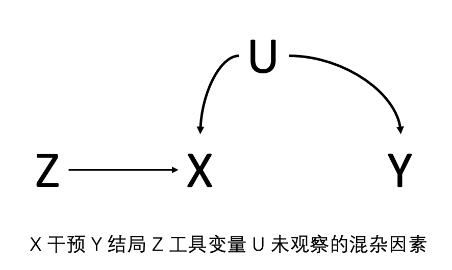
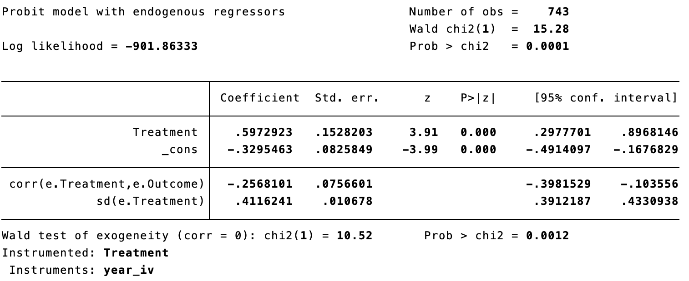
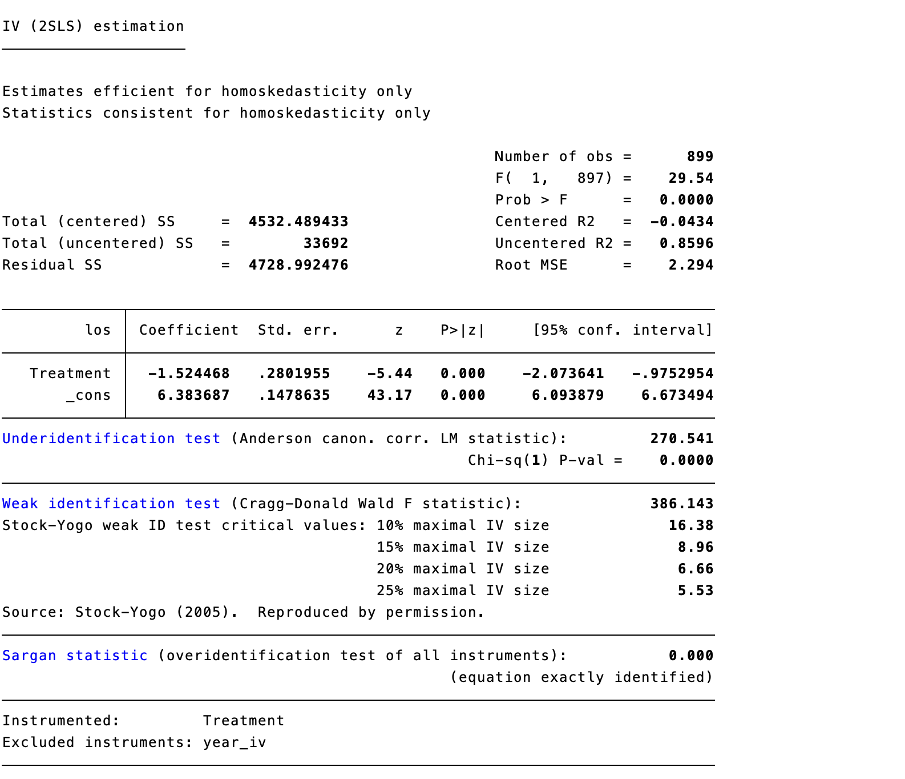
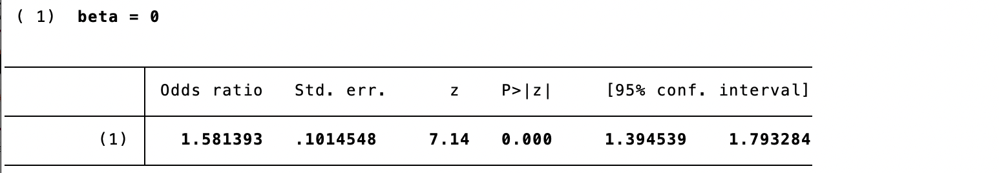

# 工具变量法

采用回归以及倾向性评分进行因果推断的最大局限性是存在未观察的混杂因素时，通过这两大类方法无法直接进行。 工具变量并不会自动消除未测量混杂；它把识别任务转化为对工具变量有效性的强假设。若这些假设不可信，IV 估计同样可能有偏。

## 工具变量法

这时引入工具变量 Z，借此估计 X 到 Y 的因果关系。工具变量 Z 通过影响 X 而间接影响因变量 Y。如果工具变量 Z 和 X 密切相关，那么，只要工具变量 Z 有了变化，就必然会对 X 产生变化。如果 X 和 Y 之间真的存在因果关系，那么 Z 对 X 带来的冲击也就势必传递到 Y。这样，在一系列的假说之下，只要 Z 对 Y 的间接冲击能够被统计证明是显著的，我们就可以推断出 X 对 Y 有因果关系。利用对 Z 与 X 相关的估算，以及 Z 与 Y 相关的估算，就可以推导出 X 和 Y 之间真实关系的大小。 相关性本身只说明 Z 能预测 X，并不等于工具变量有效；因果解释还取决于独立性和排除限制。对于线性模型，单个有效工具变量的 Wald 比值可理解为 Z 对 Y 的效应除以 Z 对 X 的效应，但二者均需有足够精度。

::: text-center
{width="42%"}

**图11.1 工具变量法示意图**
:::

然而，工具变量的成立需要满足三个统计学假设：

1.  工具变量与干预是相关的，即 Z 和 X 相关；
2.  工具变量对结局的影响只能通过干预来实现，Z 到 Y 的影响只能通过 A 来实现的，而不能通过其他路径去实现；
3.  工具变量与结局没有共同的原因，即 Z 和 Y 之间没有混杂因素。 在二元工具变量和二元处理的常用解释下，若希望把结果解释为“依从者”的局部平均处理效应（LATE），还需加入单调性假设：不存在因工具变量取值改变而总是反向接受处理的个体。Hernán 与 Robins（2006）及 Baiocchi 等（2014）强调，这些假设多数不能由数据本身证明。

在随机对照研究中，工具变量可以理解为随机分配。案例9.1假设为随机对照试验，Z 是随机分配为内窥镜组和显微镜组，X 为实际接受内窥镜手术和显微镜手术，Y 是手术后内分泌缓解。随机对照研究中的意向性分析所得意向性效应即是 Z 对 Y 的效应，随机分配后不管受试者是否依从所分配的方案，只考虑随机的结果。而符合方案分析得出的符合方案效应就是 X 到 Y 的效应，如果随机分配后的依从性是100%，则符合方案效应等于意向性效应。非随机对照研究中的因果效应取决于所采用的工具变量、识别假设与目标 estimand，不能直接等同于随机试验中的符合方案效应。

::: text-center
{width="42%"}

**图11.2 随机分配作为工具变量**
:::

## 工具变量法的实际应用

研究饮酒是否会导致冠脉综合症？X 是饮酒，Y 是冠脉综合症，U 是未观察到的一些混杂因素，比如说饮酒的人一般都会吸烟，吸烟会导致冠脉综合症。而饮酒本身无法进行随机分配。这时，可以引入工具变量 Z，表示与酒精代谢有关的基因型，如果患者携带酒精代谢差的基因型，一般来说饮酒量会比较少，如果能通过基因表型分析获取 Z 和 X 的关系，获取 Z 和 Y 的关系，就可以估算出 X 与 Y 的关系。 遗传工具变量还须特别讨论水平多效性、群体分层、亲代效应和选择偏倚；任一因素都可能产生 Z 到 Y 的非经由饮酒的路径，因此不能仅凭基因与饮酒相关就断言工具变量有效。

::: text-center
{width="42%"}

**图11.3 遗传变异作为候选工具变量**
:::

研究HIV感染患者中使用不同的逆转录逆转录抗病毒的疗法，预防AIDS或者死亡的因果关系，利用年历时间作为工具变量。在不同时间窗内采纳的治疗方法不同，借此可以估算对结局的效应。然而，年历时间作为工具变量时，工具变量与结局变量之间可能存在一些混杂因素，如年历可能通过其他医学技术的革新导致死亡率的下降。 年历时间往往尤其容易违反排除限制：诊断技术、围手术期管理、病例构成和随访制度可能同时随时间改变。将其用作工具变量前，应预先画出因果图、说明每一条替代路径，并以敏感性分析检验结论对这些设定的依赖。

::: text-center
{width="48%"}

**图11.4 年历时间作为候选工具变量**
:::

看电视过多是否会引发小儿自闭症？电视的普及与小儿自闭症发生率的攀升几乎同步。然而，有自闭倾向的儿童可能更经常看电视，而不喜欢户外活动或与人交往。使用降雨量作为电视观看时间的工具变量。即降雨越多的地区，人们待在室内的时间越长，故看电视时间也长；而降雨量很可能只通过看电视时间而影响被解释变量。 降雨量也未必天然有效：它可能通过户外活动、感染暴露、就医可及性或地区社会经济条件影响结局。所谓“自然工具”仍须针对研究场景逐项论证独立性和排除限制。

::: text-center
{width="42%"}

**图11.5 降雨量作为候选工具变量**
:::

## 工具变量法的分析步骤

通常采用两阶段的最小二乘法，首先将干预对工具变量做回归，获取干预的预测值，然后将结局对干预的预测值做第二次的回归，所得工具变量估计值为： 两阶段最小二乘的两个阶段应作为一个整体估计，不能把第一阶段的预测值当作普通已观测暴露后再使用常规第二阶段标准误；应采用 IV/2SLS 的联合估计与相应的稳健标准误。估计对象还应在分析前说明是总体效应、依从者效应还是其他局部效应。

**公式 11.1　Z 为分类变量时的工具变量估计量**

$$IV = \frac{E\left[Y \middle| Z = 1\right] - E\left[Y \middle| Z = 0\right]}{E\left[X \middle| Z = 1\right] - E\left[X \middle| Z = 0\right]}$$

Z为分类变量，或：

**公式 11.2　Z 为连续变量时的工具变量估计量**

$$IV = \frac{\operatorname{Cov}(Y,Z)}{\operatorname{Cov}(X,Z)}$$

Z为连续变量

沿用案例9.1中的数据，2016年之前的手术方案大多为显微镜手术，而2016年之后则转变为内镜手术，因此手术的年历时间可能用作工具变量来估算手术方案对疾病缓解的影响。

::: {.callout-note appearance="simple" icon="false" title="代码11.1"}
``` stata
prop Treatment if year <= 2016
prop Treatment if year > 2016
```
:::

:::: {.callout-note appearance="simple" icon="false" title="代码11.1输出（2016年及以前）"}
::: text-center
{width="100%"}
:::
::::

:::: {.callout-note appearance="simple" icon="false" title="代码11.1输出（2017年及以后）"}
::: text-center
{width="100%"}
:::
::::

2016年以前，显微镜手术的占比是80.6%，2016年之后，内窥镜手术的占比是74.1%。因此年历时间与接受何种手术方式存在相关性。

因为感兴趣的结局变量为二分类变量，然而采用逻辑回归进行工具变量分析存在可加性问题。故结局为二分类变量常利用ivprobit命令（即Probit回归，参考第9章），通过两步骤预测替代法进行分类变量结局的工具变量回归。 二分类结局不存在唯一的“标准”IV 模型。ivprobit、两阶段残差纳入法和结构均值模型依赖不同的函数形式与可加性假设；报告时应明确所用模型、效应尺度、第一阶段结果及其识别假设，而不宜将任何一种软件命令视为自动有效。

::: {.callout-note appearance="simple" icon="false" title="代码11.2"}
``` stata
gen year_iv = (year <= 2016)
ivprobit Outcome (Treatment = year_iv)
```
:::

:::: {.callout-note appearance="simple" icon="false" title="代码11.2输出"}
::: text-center
{width="100%"}
:::
::::

模型截距-0.330，表示显微镜组的概率单元值，β1 = 0.597表示内窥镜组与显微镜组的概率单元值差值，内窥镜组的概率单元值为-0.330+0.597=0.267。分别计算累积分布函数值，后代入比值比计算公式得出OR为2.60。同样，此处利用年历时间作为工具变量，需要讨论年历时间可能通过其他医学技术的革新（影像检查的普及导致患者能早期诊断）导致手术效果的提升。 因此，本例的数值结果应理解为在年历时间工具变量及其排除限制可信时的模型估计，而不是对手术方式总体因果效应的无条件证明。

此外，研究手术方式对住院时长的影响，亦可采用工具变量法，此时结局变量为连续变量，可采用两步骤最小二乘法回归。此时回归系数直接表示结局变量的变化幅度，即内窥镜组比显微镜组的住院时长少1.52天。

::: {.callout-note appearance="simple" icon="false" title="代码11.3"}
``` stata
ivregress 2sls los (Treatment = year_iv)
```
:::

:::: {.callout-note appearance="simple" icon="false" title="代码11.3输出"}
::: text-center
{width="100%"}
:::
::::

## 工具变量法的统计学检验

工具变量的使用受到诸多因素限制，因此需要进行统计学检验与假设：

1.  工具变量使用的第一个原则即工具变量与干预相关。工具变量与干预变量的相关性如很小存在弱工具变量问题，弱工具变量会导致因果推断稳定性差。检验弱工具变量的方法： 弱工具变量会使估计偏向常规回归并造成置信区间失真；应同时报告第一阶段效应、部分 R²、工具变量数量和弱工具诊断，而不只报告第二阶段 P 值。

    1.  第一阶段回归结果中工具变量的显著程度，是否与干预足够相关。
    2.  第一阶段回归的F值，用来检验工具变量是否显著，如果此检验的F统计量大于10，则可拒绝弱工具变量的原假设（本例F统计量为29.5）。亦可采用Cragg-Donald Wald F统计量以及Kleibergen-Paaprk Wald F统计量（可通过Stata ivreg2实现）。 F\>10 是单一内生变量、同方差情形下常见的经验规则，并非普适阈值。在异方差、聚类或多个工具变量时，应优先报告 Kleibergen-Paap 统计量并参考适用的临界值；必要时采用 Anderson-Rubin 等对弱工具更稳健的检验与区间。

::: {.callout-note appearance="simple" icon="false" title="代码11.4"}
``` stata
ivreg2 los (Treatment = year_iv)
```
:::

:::: {.callout-note appearance="simple" icon="false" title="代码11.4输出"}
::: text-center
{width="100%"}
:::
::::

2.  工具变量对结局的影响只能够通过干预，此原则无法通过统计学检验证实，只能通过定性讨论确定，排除其他可能的原因。在案例中年历对疾病缓解的影响可能通过增加内窥镜手术的比例，亦可以通过手术技术的提高，医疗水平的上升等因素，需要分别讨论。研究者所要做的就是找出工具变量影响结局的所有其他可能途径，然后一一反驳。 排除限制可以被反驳，却不能被数据完全验证。除专家论证外，可报告工具变量与基线协变量的关联、阴性对照结局或暴露、以及针对直接效应的定量敏感性分析；这些检查只能增加或削弱可信度，不能证明假设成立。

3.  工具变量与结局没有共同的原因，如，可能存在一个L，既导致了年历时间也导致了疾病缓解。本质上也无法检验这个条件，因为可能存在未观察到的工具变量与结局的共同原因，也就无法检验。主要方法都是间接的探讨，主要有两种方法：一种是定性讨论，另一种是过度识别检验。 过度识别检验只有在工具变量数量多于内生变量时才可进行，且其不显著结果并不证明每一个工具变量有效；若多个工具变量具有相似的违反方式，检验仍可能缺乏识别力。

4.  此外，工具变量还需要同质性假设，即假设干预对结局的效应在所有的样本中是一致的，即内窥镜的优势在所有个体中是一致的。这个假设通常也是无法证实的，内窥镜的优势可能在侵袭性肿瘤中更大一些，即存在修正效应。在工具变量的研究中，也是无法估算的。 同质性并非所有 IV 分析的必要条件。若采用单调性，二元工具变量通常识别的是依从者中的 LATE；只有在额外的效应同质性或可外推性假设下，才可把该局部效应推广为全体人群的 ATE。

## 工具变量的寻觅

合格的工具变量非常难以寻找。因此，前人对某一类工具变量的使用，在很大程度上对我们今后寻找工具变量能够带来重要启发甚至灵感：严密的逻辑和充分的想象力，是寻找到好的工具变量的必要条件 。

### 来自群体的工具变量

个体的干预结局，往往会受到所在集体的某个特征要素的影响。比如，一个人的成绩、收入、社会地位等等，会受到他所在的学校、班级、邻里的特征的影响。为解决这一内生性问题，经济学家和社会学家常常把州、县或大都会地区层面的集聚数据作为学校、班级和邻里等层面解释变量的工具变量。其理由是: 以都会为单位的失业率和贫困率必然和辖区内学校的贫困生比例有关，但又不直接影响学生的怀孕或辍学等行为。

### 来自自然界的工具变量

河流、地震、降雨、自然灾害等自然现象在一定地域范围内具有高度的随机，因此可以被假设为与个人和群体的异质性无关，同时，它们又能够影响一些干预过程。例如本章开篇描述的降雨量作为看电视与自闭症的工具变量。

### 来自生理现象的工具变量

人类的生老病死既是社会现象，也是生理上的自然现象。出生日期、季度、性别、基因改变等，虽仅仅是有机体的自然历程，但既具有随机性，又往往和特定的经济社会过程相关。饮酒基因型、脂质代谢基因型均可作为干预与冠状动脉综合征结局的工具变量。

### 来自社会空间的工具变量

社会空间的载体，包括具象性的城市、乡村，和非具象性的市场空间等，和人类的行为与结果息息相关，但往往又在特定分析层面上具有独立性、随机性。假设有这样一项研究，一个城市有两家医院提供不同的紧急治疗，位于城市东部的医院专门从事内窥镜手术，西部的医院专门从事显微镜手术。有部分患者将根据家到医院的距离来选择医院，从而选择对应的治疗方法。假设到两家医院的相对距离会影响治疗方法的选择，但是对治疗结局没有直接影响，那么这个相对距离就可以作为工具变量。烟草价格作为研究戒烟与体重增加之间的工具变量。烟草价格高则戒烟概率高，可能会出现体重增加。而烟草价格本身显然和体重没有其他任何的因果逻辑联系。

## 工具变量的局限性

第一，找到好的工具变量非常之难。它难寻的原因，恰恰就是它的力量所在: 因为它必须永远置身模型之外。当我们一心关注模型本身之时，注意力自然只会放在模型之内。因此，只要我们变换思维的角度，开始习惯从模型之外寻找解决问题的武器，多从前人巧妙使用工具变量的实例里获得启发，我们就会发现，工具变量虽然难寻，但绝非了无痕迹。

第二，工具变量对于模型不存在未观察的混杂因素无法用统计方法检验的。这一尴尬直接导致的结果就是: 不管熟悉还是不熟悉工具变量方法的读者，面对一篇工具变量分析的论文，其第一反应总是首先质疑其合法性。但凭心而论，和其他一些解决混杂因素的常用模型相比，工具变量分析承受了过多的挑刺和压力。当倾向值匹配模型假设一切偏误都来自可观察的变量，读者们往往能不假思索地接受这些武断的假设。

第三，工具变量估计量往往因工具变量的选取而异，工具变量对样本的影响，往往是非均质的，所以工具变量估计量带有权重性的特征，即局部干预效应。案例中存在一部分患者无论什么年份都会接受内窥镜手术或显微镜手术（比如，某个医生只会一种手术方式），另一部分患者如果在不同年份去医院可能接受不同的手术方式。因此，从工具变量分析里得到的结论，往往只适用于后面那部分患者。不过，与其说这是工具变量方法的不足，倒不如说是一种优势，使样本变得更加具有目标性，结论也更有说服力。 报告时应说明依从者在临床上的含义及其与总体样本的差异；LATE 具有明确目标人群，但不应被不加说明地外推给从不接受或总是接受某种治疗的患者。

第四，工具变量的使用看似难以举一反三，但哪怕是前人使用过的失败的工具变量，都可能具有借鉴和推广意义。案例中以2016年作为分界线，只在单个中心有效，而在其他中心情况就会大有不同。

## 孟德尔随机化

孟德尔随机化（Mendelian randomization，MR）是在观察性数据中使用遗传变异来估计暴露和结局之间的因果关系。暴露可以是生物标志物、人体测量指标或任何其他可能影响结果的风险因素。通常情况下，结局是疾病。之所以称为随机化，是因为基因的形成过程是随机的，随机化的结果形成一种基因型和另一种基因型，从而产生不同的表型。

孟德尔随机化也是一种工具变量法，同样需要满足工具变量的三个假设。基因型要与基因型的表达产物相关，即所感兴趣的干预、生物标志物或者其他风险因素；基因型对结局的影响只能通过此表达产物传递；基因型与结局之间，没有共同的原因。 对 MR 而言，第三项独立性假设还要求控制或评估祖源结构、遗传连锁和家系效应；排除限制则要求警惕横向多效性。垂直多效性若完全位于暴露的下游，通常不违反 IV 假设；横向多效性则会造成偏倚。

### 案例11.1

研究者感兴趣低密度脂蛋白（LDL）与冠脉综合症之间的关系，X 即 LDL，Y 为冠脉综合症，Z 为工具变量为引入的与 LDL 相关的基因型，如单核苷酸多态性（SNPs）。工具变量三个统计学假设中（图11.1），第一点可以被证实，只需计算基因型与LDL的相关性，而第二，第三点是不可证实的，需经过讨论。单个基因型的效应可能有很多，基因型对结局的影响，可能不通过所感兴趣的路径。单核苷酸多态性可以影响LDL的水平高低，亦或影响胆固醇水平高低。基因型与结局之间没有共同原因也无法证实。基因型可能和其他的基因位点形成遗传不平衡，导致多个基因形成遗传连锁，而其他基因型可能和结局相关；亦可能存在某个人群，该人群中基因型的某个等位基因出现高频突变，并且该人群中冠脉综合征发生风险比较低。

::: text-center
{width="100%"}

**图11.6 孟德尔随机化的假设**
:::

孟德尔随机化的研究方法大致有两种：

**独立样本MR：**该方法利用单一研究样本，通过使用两阶段最小二乘法回归模型，定量估计暴露因素与结局之间的关联效应大小。由于该方法局限于单个样本，把握度较小，工具变量的选择也比较局限，容易受到潜在混杂因素的影响。

**两样本MR：**基因型与暴露、基因型与结局的关联研究人群来自相同人群的两个独立样本，要求两样本具有相似的年龄、性别和种族分布特征。因为样本量较大，该方法可以获得更大的把握度。两样本MR因为全球大量全基因组关联分析（GWAS）合作组的公共数据而被广泛使用。 两样本 MR 还应说明样本重叠程度、祖源可比性、暴露和结局 GWAS 的测量定义及选择机制。样本重叠在弱工具存在时可使两样本估计向观察性关联偏移。

两样本MR的研究步骤分为四步：

1.  在GWAS数据库（https://www.ebi.ac.uk/gwas/）中寻找与研究干预相关的SNPs，获得一系列的已经发表的文章以及文章中的SNPs数据，查询这些SNPs的p值来筛选对应的SNPs（\< 10-8），剔除有遗传不平衡的SNPs，记录回归系数和标准差。 常用的全基因组显著性起点是 P\<5×10⁻⁸；随后通常进行连锁不平衡剔除（clumping）、等位基因协调（harmonization）和工具强度评估。阈值与 LD 参数应预先报告，并结合所研究性状的遗传结构解释。
2.  在数据库中输入结局，查询上述筛选出的SNPs与结局变量的相关性（回归系数和标准差）。
3.  估算因果效应方法，一般采取逆方差加权法，中位数法和Egger法。 主分析应预先指定；加权中位数、MR-Egger、加权模式、异质性检验、留一法和 MR-PRESSO 等应作为对不同多效性假设的敏感性分析，而非只挑选产生显著结果的方法。
4.  由于往往暴露会与多个SNPs存在相关性，即存在多个工具变量，需要合并多个SNPs的估算。孟德尔随机化的整合效应图中，点和十字是每一个SNP作为工具变量估算的干预与结局的关系，拟合所有的SNP绘制出了一条斜线，其斜率就是LDL对冠脉综合症发生的风险。

**案例11.1数据表**

|    rsid    | ldlcbeta | ldlcse |   ldlcp2 | acsbeta |   acsse |    acsp2 |
|:----------:|---------:|-------:|---------:|--------:|--------:|---------:|
| rs1010167  |   -0.025 | 0.0039 | 3.00E-10 |  -0.028 | 0.01897 |     0.14 |
| rs10102164 |    0.032 | 0.0045 | 3.00E-12 |   0.012 | 0.01661 |     0.47 |
| rs10401969 |     0.12 | 0.0073 | 2.00E-60 |    0.11 | 0.02958 |   0.0002 |
| rs10790162 |    0.076 | 0.0071 | 3.00E-26 |    0.13 | 0.02735 | 2.00E-06 |
| rs10832962 |    0.032 | 0.0040 | 2.00E-15 |   0.044 | 0.01564 |   0.0049 |
| rs10903129 |   -0.033 | 0.0036 | 4.00E-19 |  -0.012 | 0.01367 |     0.38 |
|     …      |        … |      … |        … |       … |       … |        … |

数据格式如上，每一行为一个工具变量（基因位点rsid标识），ldlcbeta、ldlcse、ldlcp2分别代表该基因位点与LDL的相关系数，标准差以及p值；而acsbeta、acsse、acsp2分别代表该基因位点与结局事件冠脉综合征的相关系数，标准差以及p值。这些数据来源于两个大型GWAS研究，即LDL的GWAS和冠脉综合征的GWAS研究。

::: {.callout-note appearance="simple" icon="false" title="代码11.5"}
``` stata
mregger acsbeta ldlcbeta [aw=1/(acsse^2)], ivw fe
lincom ldlcbeta, or
```
:::

:::: {.callout-note appearance="simple" icon="false" title="代码11.5输出"}
::: text-center
{width="100%"}
:::
::::

结果表明采取逆方差加权法合并多个SNPs分析得出1个单位LDL的增加会导致冠脉综合征风险增加1.63倍。

::: {.callout-note appearance="simple" icon="false" title="代码11.6"}
``` stata
mrmedian acsbeta acsse ldlcbeta ldlcse, weighted
lincom beta, or
```
:::

:::: {.callout-note appearance="simple" icon="false" title="代码11.6输出"}
::: text-center
{width="100%"}
:::
::::

::: {.callout-note appearance="simple" icon="false" title="代码11.7"}
``` stata
mregger acsbeta ldlcbeta [aw=1/(acsse^2)]
lincom slope, or
```
:::

:::: {.callout-note appearance="simple" icon="false" title="代码11.7输出"}
::: text-center
{width="100%"}
:::
::::

几种方法得出的结论基本一致。亦可以绘制出整合效应图和森林图。整合效应图上每一个十字星代表一个SNP作为工具变量，拟合的直线及其95%置信区间的斜率即代表效应大小。森林图的解读与荟萃分析一致，每个SNP类似荟萃分析中的一项研究。 图形与各 SNP 的效应估计应同时报告置信区间、异质性指标和离群变异的处理规则；不同 MR 方法结果一致只能提供支持性证据，不能替代对工具变量假设的论证。

::: {.callout-note appearance="simple" icon="false" title="代码11.8"}
``` stata
mreggerplot acsbeta acsse ldlcbeta ldlcse, gpci
mrforest acsbeta acsse ldlcbeta ldlcse, ivid(rsid) models(4)
```
:::

:::: {.callout-note appearance="simple" icon="false" title="代码11.8输出（整合效应图）"}
::: text-center
{width="100%"}
:::
::::

:::: {.callout-note appearance="simple" icon="false" title="代码11.8输出（森林图）"}
::: text-center
{width="100%"}
:::
::::

虽然MR应用广泛，需了解其优势和局限性。 MR 研究的报告可参考 STROBE-MR 声明：明确因果问题和 estimand，描述数据来源、SNP 选择和协调、三项 IV 假设的依据、主分析与敏感性分析、数据/代码可得性及外推边界（Skrivankova 等，2021）。

MR的优点是一个天然的随机化过程，没有反向的因果。当暴露与结果之间的关联不是由于暴露导致结果变化，而是由于结果导致暴露变化时，则发生反向因果关系。由于个体的基因型是在受孕时确定的，无法更改，因此不会存在因果关系与基因型相关联的反向因果关系，这也是孟德尔随机化的优势。

在某些情况下，许多感兴趣的风险无法可靠地衡量，亦或无法通过随机化方法实现干预，如腰围，体重等。在这种情况下，可以将遗传变异用作暴露的代理，并且可以追溯这些风险与结果的关联。

此外，工具变量估计值不会因暴露中的经典测量误差（包括个体内部差异）而衰减。这与观察性研究相反，在观察性研究中，暴露中的测量误差通常会导致回归系数朝着零值的方向衰减。

当然MR也存在诸多缺点，难以找到合适的SNPs，需要大样本的GWAS研究；单个SNP是一个弱工具，因此需要很多SNPs集合构成一个综合因果估计；MR为工具变量方法，统计学假设中需要考虑第二第三原则违反情况下的因果推断，可以通过估计工具变量和各种特征之间的关系来分析讨论，虽然这些评估不能证明这两个假设的成立，但可以提供有关其合理性的证据；MR无法解释生物学机制，发育过程中的一些代偿可能会导致表型的改变，表型也可能是多样性的。 尤其应避免把 MR 结果称为“天然随机试验的证明”。MR 估计反映遗传预测的、通常是长期的暴露差异；它未必等同于在特定年龄、剂量和持续时间实施临床干预所产生的效果。

## 附录：孟德尔随机化研究的关键评估清单

### 孟德尔随机化的核心假设

- 是否有足够的证据表明遗传变异与所关注的风险因素密切相关？
- 遗传变异是否与潜在的混杂因素有关？是否介绍了这种关系？
- 遗传变异是否有办法通过其他途径影响结果（横向多变性）？是否介绍了多种孟德尔随机化方法（如MR Egger、中位数和模式估计，或使用阴性对照人群），以更全面地调查这一问题？

### 方法报告

- 暴露和结果的效应和其他等位基因的编码方向是否相同？
- 两样本的研究：两个样本是否取自同一人群？
- 两样本是否独立？
- 分析是否只限于独立的工具变量（即删除了遗传连锁不平衡的SNPs）或分析是否允许工具变量之间的相关性？

### 数据展示

- 是否将结果表述为遗传关联、工具变量估计，或两者都是？
- 如果提供的是工具变量估计值，是否将其与传统的观察性估计值进行了比较？
- 是否提供敏感性分析，如MR Egger、加权中位数和模式孟德尔随机化，或使用阴性对照人群？
- 是否手动挑选哪些SNPs进入工具变量以解决多态性问题？如果是这样，其方法和理由是否清楚？
- 是否在补充材料中提供了使用的数据（特别是在群体水平上进行的孟德尔随机化分析），以便研究人员复制他们的发现？

### 解释

- 如果孟德尔随机化估计值与观察估计值相似，并提供了支持因果效应的证据，是否是由于单一研究中的弱工具偏倚或通过横向多态性的混杂造成的？
- 如果孟德尔随机化估计值与观察性估计值不同，并提供了因果效应的少量证据，是否是由于使用了弱工具造成的偏差或由于多态性造成的负向混杂？
- 孟德尔随机化提供了风险因素在群体一生中的影响估计，对特定年龄段的干预措施有同样大小的效果吗？
- 孟德尔随机化估计的95%置信区间是否足够精确，因果效应是否临床意义的差异？

### 临床意义

- 结果是否与其他形式的证据相互印证？能否像PCSK9抑制剂那样进行临床试验以提供明确的证据？
- 如果随机临床试验不可行（如饮酒和心脏病风险的情况）或不可能在短期内进行（如降低BMI和心脏病风险的生活方式干预的情况），并且现有的证据来自多个孟德尔随机化研究和其他稳健的研究设计，趋向于一个类似的结果，并显示出关联的一致性，这些信息可以用来指导病人护理；例如，建议减肥以预防心脏病，或建议不要适度饮酒以预防心血管疾病。 在用于临床建议前，还应结合干预试验、机制研究、观察性研究和不同人群中的 MR 结果进行证据三角验证，并清楚区分遗传预测的终生暴露效应与可操作的短期干预效应。

## 本章参考文献

1.  Hernán MA, Robins JM. Instruments for causal inference: an epidemiologist's dream? *Epidemiology*. 2006;17:360–372. [PMID: 16755261](https://pubmed.ncbi.nlm.nih.gov/16755261/)
2.  Baiocchi M, Cheng J, Small DS. Instrumental variable methods for causal inference. *Statistics in Medicine*. 2014;33:2297–2340. [PMID: 24599889](https://pubmed.ncbi.nlm.nih.gov/24599889/)
3.  Lousdal ML. An introduction to instrumental variable assumptions, validation and estimation. *Emerging Themes in Epidemiology*. 2018;15:1. [PMID: 29387137](https://pubmed.ncbi.nlm.nih.gov/29387137/)
4.  Garabedian LF, Chu P, Toh S, et al. Potential bias of instrumental variable analyses for observational comparative effectiveness research. *Annals of Internal Medicine*. 2014;161:131–138. [PMID: 25023252](https://pubmed.ncbi.nlm.nih.gov/25023252/)
5.  Bowden J, Davey Smith G, Burgess S. Mendelian randomization with invalid instruments: effect estimation and bias detection through Egger regression. *International Journal of Epidemiology*. 2015;44:512–525. [PMID: 26050253](https://pubmed.ncbi.nlm.nih.gov/26050253/)
6.  Bowden J, Davey Smith G, Haycock PC, Burgess S. Consistent estimation in Mendelian randomization with some invalid instruments using a weighted median estimator. *Genetic Epidemiology*. 2016;40:304–314. [PMID: 27061298](https://pubmed.ncbi.nlm.nih.gov/27061298/)
7.  Burgess S, Davey Smith G, Davies NM, et al. Guidelines for performing Mendelian randomization investigations. *Wellcome Open Research*. 2020;4:186. [PMID: 32760811](https://pubmed.ncbi.nlm.nih.gov/32760811/)
8.  Skrivankova VW, Richmond RC, Woolf BAR, et al. Strengthening the Reporting of Observational Studies in Epidemiology Using Mendelian Randomization: The STROBE-MR Statement. *JAMA*. 2021;326:1614–1621. [PMID: 34698778](https://pubmed.ncbi.nlm.nih.gov/34698778/)
