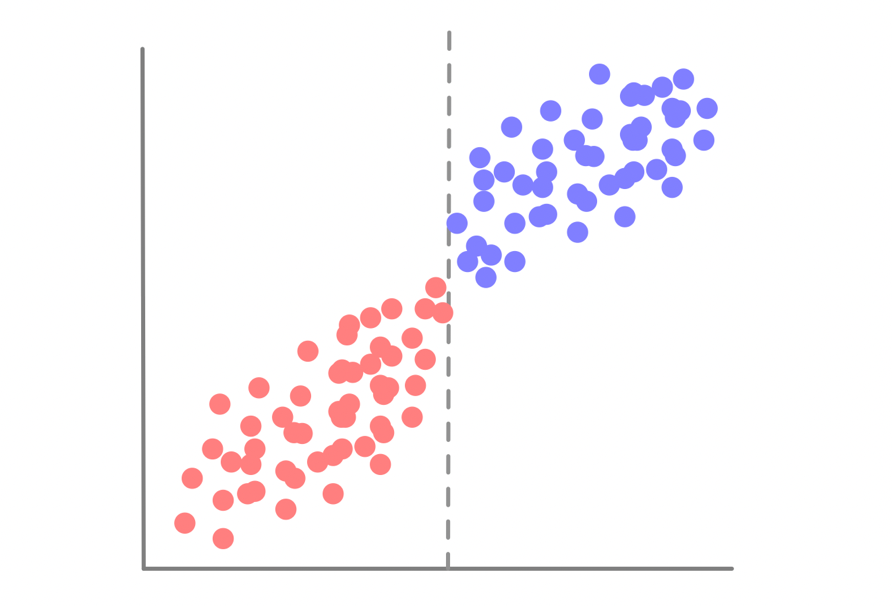
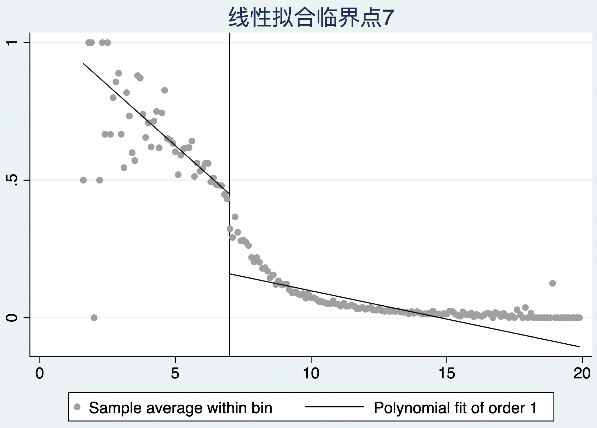
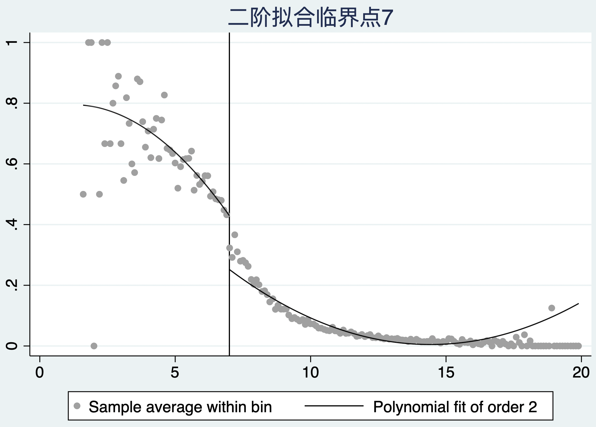
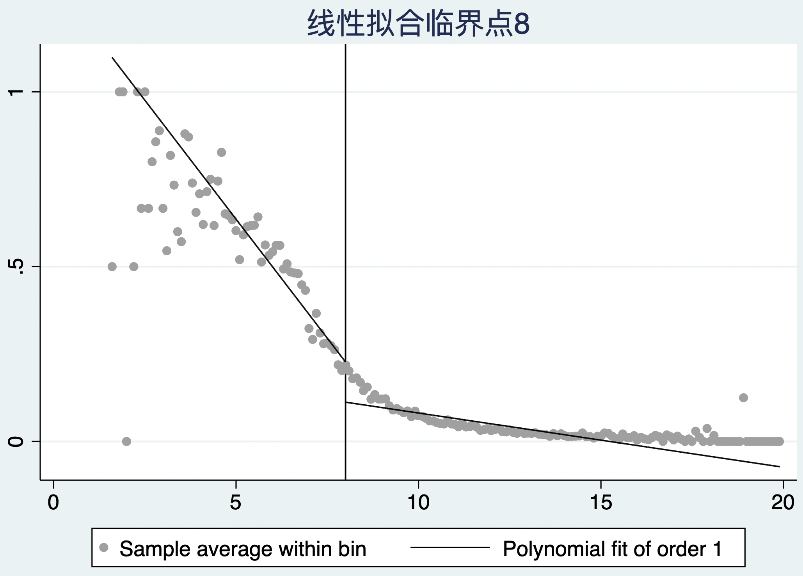
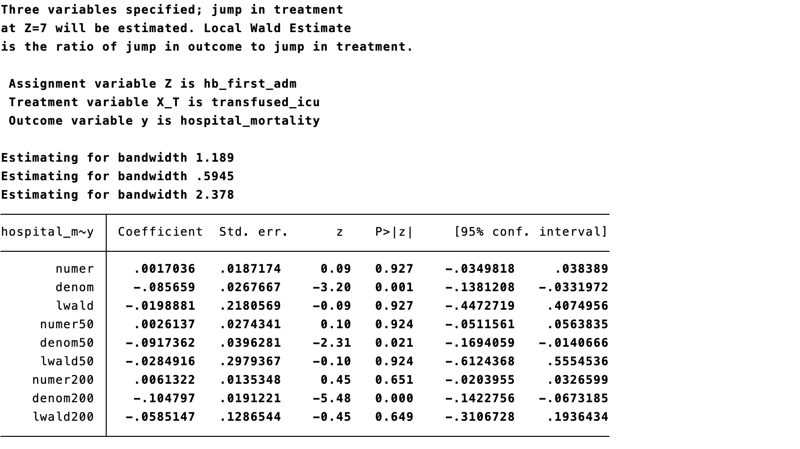
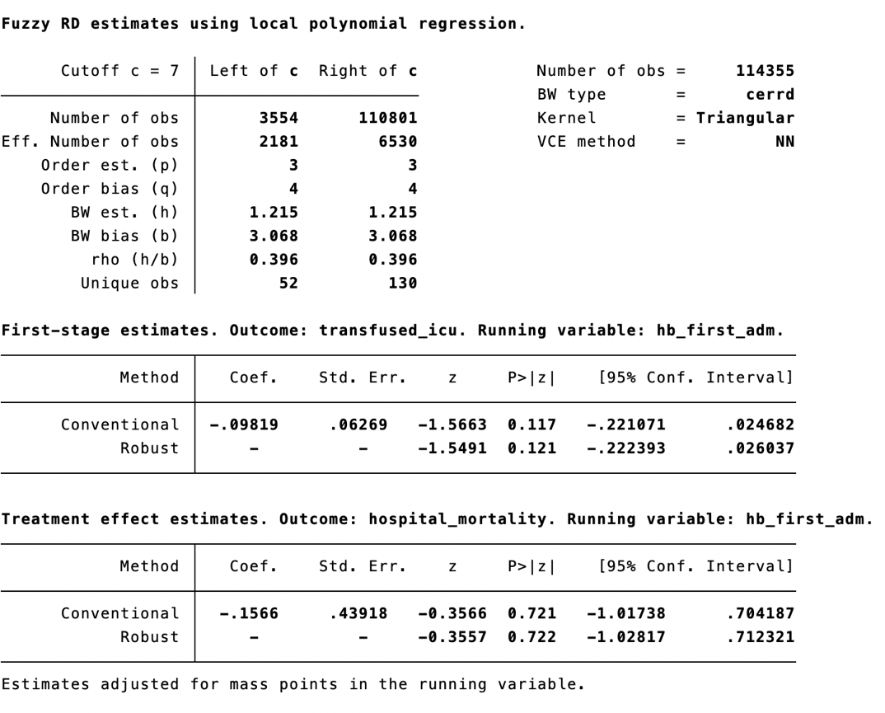
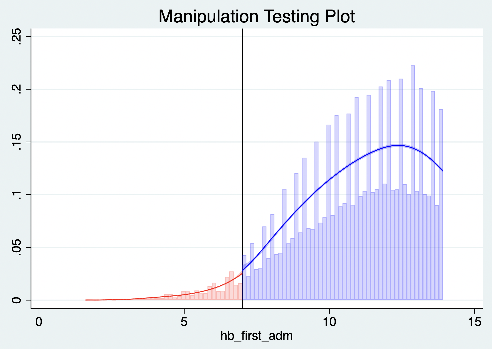

# 断点回归法

断点回归（Regression discontinuity，RD）的设计思想是存在一个连续变量（控制变量）, 该变量能决定个体在某一临界点两侧接受干预的概率, 由于处理分配（精确断点）或处理概率（模糊断点）在该临界点处出现不连续跳跃, 因此个体针对干预的取值落入该临界点任意一侧是随机发生的, 即不存在人为操控使得个体落入某一侧的概率更大, 则在临界值附近构成了一个准自然实验。 更准确地说，RD 的识别依赖于：在没有处理的反事实下，潜在结局及预处理协变量随运行变量在临界点处平滑变化，并且个体不能精确操纵运行变量跨越阈值；它并不要求阈值两侧的处理本身“连续”。

## 精确断点与模糊断点

1.  精确断点是指临界点左右接受不同干预措施的概率为 0 或 1

如果研究考上大学与否与工资收入的关系。假设上大学与否完全取决于高考成绩是否超过500分（图12.1灰色虚线），对于高考成绩为500分左右（495-505范围内）的考生，可以认为他们在各方面（包括可观测变量和不可观测变量）都没有系统差异。可以认为他们是否上大学只是由于“上帝之手”随机抽样的结果，考上大学的学生进入干预组（蓝色圆圈），而落榜的学生进入控制组（红色圆圈）。由此，由于存在假定的随机分组，故可估计在500分附近的平均效应（工资收入差异）。由于此效应只适用于部分学生或样本，故称为断点处的局部平均处理效应（local treatment effect at the cutoff）；在模糊断点的工具变量解释下，该局部效应通常才称为依从者局部平均处理效应（LATE）。

::: text-center
{width="65%"}

**图12.1 精确断点示意图**
:::

2.  模糊断点是指临界点左右接受不同干预措施的概率处于0-1之间

模糊断点的特征是，在断点处，个体得到处理的概率从a跳跃到b，其中0\<a\<b\<1。当个体控制变量的值大于临界值时，个体接受B干预为主。当其小于临界值时，个体接受A干预为主，在临界值附近的结局差异可以较好地反映不同干预对结果的影响。

此图显示控制变量为横轴，灰色虚线为临界点，左侧绝大部分的受试者都是采用了A干预（红色圆圈），灰色虚线右侧绝大部分的患者采用了B干预（蓝色圆圈）。实际上高考成绩上线并不能完全保证上大学，能否上大学还取决于填报志愿，甚至有些上线考生放弃上大学的机会；而即使成绩未上线，但也可能因某种特长而得到加分，从而得到上大学的机会。上大学的概率确实在分数线的位置上有一个不连续的跳跃。

::: text-center
{width="65%"}

**图12.2 模糊断点示意图**
:::

断点回归在对平均处理效应做出估计前，需要对一些关键假设做出检验：

1.  检验干预变量在断点c处是否存在跳跃（可通过绘图确认）；
2.  检验干预变量和结局变量在断点以外的其他点不存在跳跃；
3.  检验影响结果变量的其他变量在断点处不存在跳跃；
4.  检验干预变量在断点处的概率密度函数是连续的，也就是在断点附近，个体不能操控干预的取值，个体落入断点的左侧或右侧是随机发生的；
5.  检验平均处理效应不等于0。

这些图形与检验可支持设计假设，却不能单独证明因果识别；还必须排除在同一阈值处同时改变的政策、服务可及性或测量规则。医学应用指南建议同时报告运行变量的分布、处理第一阶段、协变量连续性、带宽选择和稳健偏倚校正推断（Cattaneo、Keele 与 Titiunik，2023；Calonico 等，2024）。

## 控制变量断点的识别

### 案例12.1

我们想要了解输血治疗能否降低重症监护室患者死亡率，因为接受输血治疗的患者往往有严重的基础疾病，其本身死亡率可能比未输血患者高。然而这些潜在的混杂因素可能有部分未观察（如基础疾病状况）。我们选取重症监护室数据库来说明如何使用断点回归检验关心的临床问题。数据集中记录了患者的年龄（age）、性别（male_gender，1为男性、0为女性）、入院时的血红蛋白值（hb_first_adm）、是否输血（transfused_icu，1为输血、0为未输血）以及是否死亡（hospital_mortality，1为死亡、0为未死亡）。 在本例中，hb_first_adm 是运行变量，7 g/dL 是候选阈值；实际输血并非由阈值完全决定，因此应按模糊断点设计处理，并先验证阈值处的输血概率是否存在足够大的跳跃。

**案例12.1数据集**

| age | male_gender | hb_first_adm | transfused_icu | hospital_mortality |
|:---:|:-----------:|:------------:|:--------------:|:------------------:|
| 59  |      1      |      14      |       0        |         0          |
| 86  |      1      |     11.8     |       0        |         0          |
| 78  |      1      |     10.5     |       0        |         0          |
| 75  |      0      |     12.9     |       0        |         0          |
| 88  |      0      |     12.1     |       0        |         0          |
| 53  |      0      |     10.8     |       0        |         0          |
|  …  |      …      |      …       |       …        |         …          |

如果单纯比较输血与未输血患者的死亡率可以看到输血患者的死亡率为9.3%，而未输血患者的死亡率为14.0%，卡方检验两者有明显差别。因此两者之间存在相关性。 这一粗略比较不能说明输血降低死亡率：输血与否由病情、出血、治疗时机等共同决定，且两组的血红蛋白分布明显不同；RD 的比较应限制在阈值附近，并以运行变量为横轴而非将全样本直接分组。

::: {.callout-note appearance="simple" icon="false" title="代码12.1"}
``` stata
tabulate transfused_icu hospital_mortality, chi2
```
:::

:::: {.callout-note appearance="simple" icon="false" title="代码12.1输出"}
::: text-center
{width="100%"}
:::
::::

再来比较一下输血与未输血患者的血红蛋白，输血患者的血红蛋白平均值为8.90，而未输血患者的血红蛋白平均值为12.06，t检验两者有明显差别。

::: {.callout-note appearance="simple" icon="false" title="代码12.2"}
``` stata
ttest hb_first_adm, by(transfused_icu)
```
:::

:::: {.callout-note appearance="simple" icon="false" title="代码12.2输出"}
::: text-center
{width="100%"}
:::
::::

因此，基线血红蛋白值可作为运行变量（赋值变量）。可以利用线性拟合方法，对控制变量临界点左右分别拟合，通过观察两侧拟合线的的差异来推测跳跃现象是否发生。下图中分别列出了利用线性拟合、二阶多项式拟合图和三阶多项式拟合图的结果，临界点选择7、8或9（临床实践中输血的指征各异，但一般情况下血红蛋白低于7可以输血）观察不同参数对跳跃的影响。 图形可用于探索第一阶段，但不宜据肉眼选择“三阶多项式效果最佳”。现代 RD 分析通常以局部线性估计为主、局部二次项用于偏倚校正，并以数据驱动的带宽与稳健偏倚校正置信区间作主要推断。

::: {.callout-note appearance="simple" icon="false" title="代码12.3"}
``` stata
rdplot transfused_icu hb_first_adm, c(7) p(1)
rdplot transfused_icu hb_first_adm, c(7) p(2)
rdplot transfused_icu hb_first_adm, c(7) p(3)
rdplot transfused_icu hb_first_adm, c(8) p(1)
rdplot transfused_icu hb_first_adm, c(8) p(2)
rdplot transfused_icu hb_first_adm, c(8) p(3)
rdplot transfused_icu hb_first_adm, c(9) p(1)
rdplot transfused_icu hb_first_adm, c(9) p(2)
rdplot transfused_icu hb_first_adm, c(9) p(3)
```
:::

:::: {.callout-note appearance="simple" icon="false" title="代码12.3输出"}
::: text-center
| `c(7) p(1)` | `c(7) p(2)` | `c(7) p(3)` |
|:--:|:--:|:--:|
| {width="100%"} | {width="100%"} | {width="100%"} |
| `c(8) p(1)` | `c(8) p(2)` | `c(8) p(3)` |
| {width="100%"} | {width="100%"} | {width="100%"} |
| `c(9) p(1)` | `c(9) p(2)` | `c(9) p(3)` |
| {width="100%"} | {width="100%"} | {width="100%"} |
:::
::::

从上图可以看出，控制变量的临界点选择7时跳跃最为明显，采用三阶多项式拟合效果最佳。在断点的左侧，输血的概率比较高（大于40%），而在切点的右侧，小于30%的受试者会接受输血治疗。这也和临床实践一致，输血干预措施是根据血红蛋白的高低来决定的，血红蛋白高于7时输血概率很低；但如果血红蛋白小于7，输血的概率相对来说会很高。

## 断点回归估计方法

### 带宽选择

带宽是指控制变量临界点左右两边的取值区间。带宽越大，则意味着有越多的样本被纳入检验中，参数估计更准确，但也意味着样本随机性要求越难满足，混杂问题可能更严重。另一方面，如果带宽选择很小，则可能不存在混杂问题，但由于样本量较小，估算其准确性降低。

在实践中，根据均方误差（MSE）或覆盖误差（CER）最小化选择带宽，可以使用 rdbwselect 考察。前五个结果均为均方误差最优的带宽，mserd 表示在断点两侧使用长度相同的带宽，mestwo 表示在断点两侧使用长度不同的带宽，msesum 表示最小化回归系数之和的均方误差带宽，msecomb1 是最小化 mserd 和 msesum 的带宽，msecomb2 取 msetwo、mserd 和 msesum 的中位数。其余结果的解释与上述内容相同，只不过选取准则从均方误差变成覆盖误差。 带宽应针对主要结局与拟采用的局部多项式估计器选择；若研究的是模糊 RD 的治疗效应，还应同时报告处理概率跳跃的强度及其不确定性，而不应只依据某一张输出表选择最有利的规格。

若在断点两侧使用长度相同的带宽1.189（cerrd），表示断点左侧的边界为7-1.189=5.811，断点右侧的边界为7+1.189=8.189。即选择血红蛋白5.811-8.189范围内的样本进行因果推断。 该区间仅说明某一带宽规则下用于局部估计的邻域，不是临床效应适用范围的硬边界；报告时应给出所用带宽、核函数、左右两侧有效样本量，以及常规和偏倚校正后的置信区间。

::: {.callout-note appearance="simple" icon="false" title="代码12.4"}
``` stata
rdbwselect transfused_icu hb_first_adm, c(7) kernel(triangular) p(3) all
```
:::

:::: {.callout-note appearance="simple" icon="false" title="代码12.4输出"}
::: text-center
{width="100%"}
:::
::::

### 局部线性回归法

使用局部线性回归法，是假定在断点邻域中的处理效应为线性，通过在左右两侧邻域分别进行线性回归并比较两侧回归系数差异来进行识别。局部回归检验的一个重要环节在于带宽的选择，可采用上述带宽选择结果。 对模糊断点，局部线性估计的目标是阈值处结局跳跃与输血概率跳跃之比，而不是将血红蛋白本身当作干预效应；若第一阶段很弱，该比值估计会不稳定。

::: {.callout-note appearance="simple" icon="false" title="代码12.5"}
``` stata
rd hospital_mortality transfused_icu hb_first_adm, z0(7) bw(1.189)
```
:::

:::: {.callout-note appearance="simple" icon="false" title="代码12.5输出"}
::: text-center
{width="100%"}
:::
::::

该命令不仅给出了指定带宽，还同时给出了带宽取指定带宽50%（0.59）和200%（2.38）的回归结果。观察结果可发现，50%、100%和200%带宽下回归系数也较为接近，分别为-0.028，-0.020和-0.059，均无统计学意义。可知断点回归结果对带宽选择并不敏感，这也表明回归结果是稳健的，200%带宽下的95%置信区间最窄。因此可以得到结论在所选带宽与模型下，未见输血对院内死亡率存在明确的局部因果效应；估计精度仍须结合置信区间判断。

### 局部多项式回归法

线性假设可能会错误估计了断点左右的回归系数，可以采取非线性拟合的办法进行弥补，即使用局部多项式断点回归方法。对于局部多项式断点回归，关键问题在于阶数的选择。可以利用上述图形观察不同多项式的拟合效果选择。 不建议以全局高阶多项式替代局部估计。实践中常以局部线性（p=1）点估计、局部二次（q=2）偏倚校正及 rdrobust 的稳健偏倚校正推断为默认报告，并说明核函数、带宽和有效样本量。

结果提示回归系数为-0.157，无统计学意义，可以得到结论在所选带宽与模型下，未见输血对院内死亡率存在明确的局部因果效应；估计精度仍须结合置信区间判断。

::: {.callout-note appearance="simple" icon="false" title="代码12.6"}
``` stata
rdrobust hospital_mortality hb_first_adm, ///
    fuzzy(transfused_icu) c(7) p(3) bwselect(cerrd)
```
:::

:::: {.callout-note appearance="simple" icon="false" title="代码12.6输出"}
::: text-center
{width="100%"}
:::
::::

## 断点有效性检验

### 局部平滑性检验

断点回归的一个重要统计学假设是除了干预变量和结果变量，所有其它变量在断点附近都不应该存在跳跃现象。在检验方法上，可以将其他协变量作为安慰剂使用断点回归方法进行检验，利用图形直接观察是否在给定的控制变量临界点周围存在跳跃。 协变量检验应预先列出并报告效应量与置信区间；“未显著”不等于协变量必然连续。更核心的识别假设是未观测潜在结局在阈值处连续，因此协变量平衡只能提供间接支持。

### 干预变量不受人为控制的检验

其思路在于，断点附近样本的数量应该相近才符合随机性。其潜在假定是，如果没有精确操纵控制变量的能力，那么略高于断点的观测值个数应当与略低于断点的观测值非常接近，换句话说，当控制变量没有受到精确的操纵时，控制变量的密度函数应当是连续的。当然这个检验在本案例中没有临床意义，因为血红蛋白的值是检验科自动化产生的，不存在人为干预因素。 不过，自动化检测并不能自动排除选择性检测、标本采集时间或数据记录规则在阈值附近改变；若运行变量离散、存在四舍五入或堆积，密度检验的解释也需要更谨慎。

统计上可以用 rddensity 命令来检验断点两侧样本密度是否相近。回归的 p 值为 0.534，不能拒绝断点附近两测样本量大致相等的假设，可知控制变量不受人为控制的假设满足。图形上亦可看出断点附近样本的数量没有明显差异（密度分布函数基本连续）。

::: {.callout-note appearance="simple" icon="false" title="代码12.7"}
``` stata
rddensity hb_first_adm, c(7) p(3) h(2.3) pl plot_range() plot_n(100 100)
```
:::

:::: {.callout-note appearance="simple" icon="false" title="代码12.7输出（密度检验）"}
::: text-center
{width="100%"}
:::
::::

:::: {.callout-note appearance="simple" icon="false" title="代码12.7输出（密度图）"}
::: text-center
{width="100%"}
:::
::::

### 断点稳健性检验

断点回归若提示干预变量与结局变量有明显相关性，则应该进行稳健性分析或敏感性分析。其思路在于选择一个或多个不同于断点的值作为安慰剂断点。若真实断点处的估计与安慰剂断点处不同，可为设计假设提供支持；安慰剂结果不能单独证明断点的真实性。可以分别取真实断点两侧20%、40%、60%和80%样本分位数处作为断点。

由于越接近断点的样本，越有动机去人为操控，可以删除最接近断点的样本（如，删除断点附近5%，10%，15%，25%和30%的样本），来观察回归是否显著。说明即使存在人为操控，断点效应仍旧存在。 来观察估计对断点邻域的依赖。此类“甜甜圈（donut）RD”分析应预先说明剔除宽度；结果相似可增强稳健性，但不能证明不存在操纵，也不能用显著性与否作为唯一判断标准。

### 带宽长度的稳健性检验

当我们的主要目的是解释点估计结果时，带宽选择的变动最好基于 MSE 最优带宽的小范围变动。与之对应的是，如果我们更加关注结果的推断，则带宽的选择应当围绕 CER 最优带宽进行。带宽长度亦会显著影响回归结果，一个稳健的结果要求对带宽长度不敏感。可以手动设置带宽为最优带宽的25%-400%倍，观察回归结果是否仍旧显著。 敏感性分析应比较点估计和置信区间，而非仅比较 P 值；带宽和多项式阶数的范围应依据方法学理由预先限定，避免在多种规格中事后挑选结果。

## 断点回归的应用

本节介绍医疗保健领域断点回归研究的案例，以说明使用断点回归研究的问题广泛性。总体而言，这些研究也显示了控制变量的多样性。 近年的医学方法学综述强调：临床指南阈值、检验值、年龄及政策资格线都可能提供 RD 机会，但只有在阈值规则确实改变治疗或暴露、且无其他同步跳跃时，才适合用于因果推断（Venkataramani、Bor 与 Jena，2016；Cattaneo 等，2023）。

在临床医学中，基于治疗目标或临界点的治疗决策无处不在。尽管如此，很少有已发表的研究使用断点回归来评估临床问题。Bor等人通过研究早期抗逆转录病毒治疗对HIV携带者的死亡率和免疫恢复的作用，显示了断点回归的作用。他们利用CD4细胞数低于200个/mm<sup>3</sup>时开始治疗的政策来设计模糊的断点回归，发现CD4细胞数略低于这个阈值的人的死亡危险比CD4细胞数略高于这个阈值的人低35%。基于连续测量的生物标志物的临床阈值规则是断点回归的特别有力的应用，因为阈值周围的治疗分配实际上是由随机测量误差驱动的（正如本章中的案例）。与此一致，Bor等人表明，略高于和略低于阈值的患者在基线特征方面是相同的。同样，为了估计使用他汀类药物对低密度脂蛋白胆固醇水平的影响，Geneletti等人利用了10年心血管事件风险作为控制变量，比较那些低于或高于标准风险计算器20%的患者在他汀类药物处方上的差异。他们发现低于或高于标准风险的患者确实存在他汀类药物处方上的差异，且此差异与患者的预后相关。 阈值附近的测量误差本身不是 RD 有效性的充分理由；仍需论证患者、临床医生或机构不能精确排序到阈值的一侧，并检查同时发生的诊疗变化。

为了研究新生儿重症监护对婴儿死亡率的影响，Almond等人将出生时体重小于1500克的婴儿指定为极低出生体重，这些患儿根据指南建议需要接受临床监护管理。Almond等人发现，略低于这一临界值的婴儿更有可能接受新生儿重症监护，而且与略高于临界值的婴儿相比，1岁前死亡的可能性要低18%。他们得出结论新生儿重症监护与其死亡率有因果关系。Bharadwaj等人用同样的分界线来评估新生儿重症监护对儿童期以后的认知发展和学习成绩的影响。

创造性的断点回归方法也被应用于预防医学和公共卫生。如，Smith等人探讨了HPV疫苗对宫颈发育不良和外生殖器疣的影响。由于疫苗引入的时间以及年龄资格准则，作者将特定的出生季度设为控制变量，上半年出生的接触疫苗的机会增加，并发现宫颈发育不良和外生殖器疣在断点周围有明显跳跃。该研究提供了对HPV疫苗接种实际效果的人口水平的洞察。Callaghan研究了酒精对年轻成年人死亡率的影响，研究了高于和低于法定饮酒年龄的死亡率。地理边界在断点回归研究中也被利用。Chen等利用中国的数据估计了空气污染对健康的影响。作者利用了一项国家政策所产生的污染变化，该政策为居住在淮河以北的人提供免费的煤基冬季取暖。他们发现淮河以北的环境污染水平明显高于淮河以南，并估计由于污染的结果，淮河以北的人的预期寿命要低5.5年。一些研究已经应用断点回归来评估健康保险对结果的影响。De La Mata研究了略高于和略低于美国Medicaid收入资格门槛的家庭的儿童健康结果。

断点回归方法最重要的局限性为普适性。断点回归可视为“局部随机试验”，通过考察协变量在断点两侧的分布是否有差异来检验随机性，但断点回归仅推断在断点处的因果关系，不能推广到其他样本值，故外部有效性受局限。本章案例中的因果效应是基于血红蛋白5.811-8.189范围内的样本做出的，这些样本数量有限，无法代表整个群体。此外，临界点的选择是人为的，根据临床知识决定，其本身也具有争议。断点回归可以认为是一种特殊的工具变量法，即利用了“是否大于断点”在局部满足无混杂因素、可作为工具变量这一特点，运用两步回归方法最终去评估干预实施效果。 更严格地说，模糊 RD 可在额外的排除限制、单调性等条件下表述为以“是否跨越阈值”为工具变量的局部 Wald 估计；精确 RD 则直接估计阈值处的处理效应，并不需要两阶段回归。两类设计的结论都主要适用于临界点附近的人群。

## 本章参考文献

1.  Venkataramani AS, Bor J, Jena AB. Regression discontinuity designs in healthcare research. *BMJ*. 2016;352:i1216. [PMID: 26977086](https://pubmed.ncbi.nlm.nih.gov/26977086/)
2.  Cattaneo MD, Keele L, Titiunik R. A guide to regression discontinuity designs in medical applications. *Statistics in Medicine*. 2023;42:4785–4805. [PMID: 37528626](https://pubmed.ncbi.nlm.nih.gov/37528626/)
3.  Calonico S, Jawadekar N, Kezios K, et al. Regression discontinuity design studies: a guide for health researchers. *BMJ*. 2024;384:e072254. [BMJ](https://www.bmj.com/content/384/bmj-2022-072254)
4.  Moscoe E, Bor J, Bärnighausen T. Regression discontinuity designs are underutilized in medicine, epidemiology, and public health: a review of current and best practice. *Journal of Clinical Epidemiology*. 2015;68:122–133. [PMID: 25579639](https://pubmed.ncbi.nlm.nih.gov/25579639/)
5.  Imbens GW, Lemieux T. Regression discontinuity designs: a guide to practice. *Journal of Econometrics*. 2008;142:615–635. [NBER](https://www.nber.org/papers/t0337)
