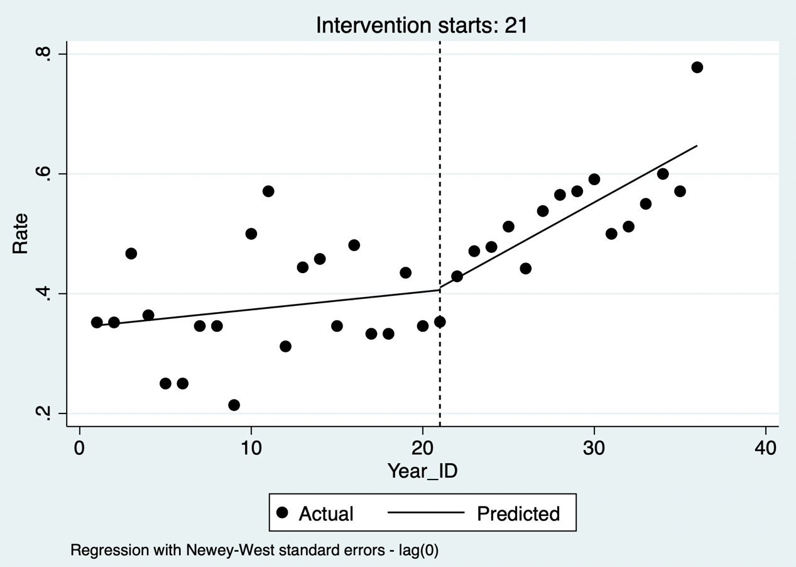
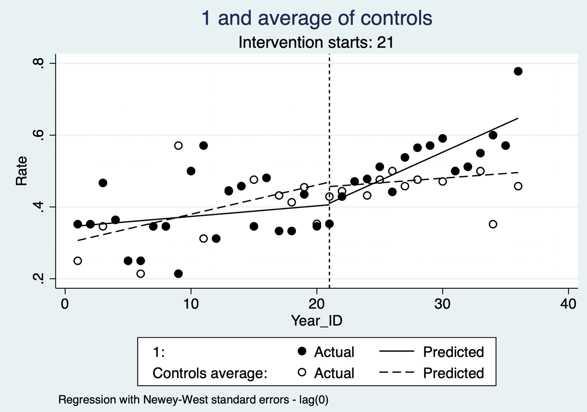

# 时间序列分析

时间序列是按时间顺序的一组数字序列，其随时间变化而变化。因为时间序列是某个指标数值长期变化的数值表现，所以时间序列数值变化背后必然蕴含着数值变换的规律性，这些规律性就是时间序列分析的切入点。

给定一组时间序列数据，通常会研究一个或多个有关它的问题。依靠时间序列数据解决的主要问题取决于数据的上下文以及收集数据的原因，包括：

描述：描述时间序列的主要特征，例如：序列是递增还是递减；是否有季节性模式（例如，夏季较高，冬季较低）？

预测：从当前值预测时间序列的未来值，并量化这些预测中的不确定性，比如根据今天的气温预测未来几天的温度。

分类：给定多个时间序列，将它们按照相似性进行分类。

因果推断：检测时间序列行为何时发生变化，并评估与某项措施的因果关系。

本章重点介绍通过时间序列分析进行因果推断的方法：中断时间序列设计。 ITS 不是只要在政策前后画出两条趋势线便可作因果解释；其核心是以干预前趋势构造反事实，并要求干预时点明确、结果测量方式稳定，且没有与干预同时发生并只影响研究对象的其他重大变化。[@kontopantelis2015; @taljaard2014]

## 简单中断时间序列

中断时间序列（interrupted time series, ITS）是评估干预前后回归趋势的变化，即通过比较和检验序列在干预前后两段回归线斜率改变，进而评价干预措施的有效性。分段回归是回归分析中最常用的一种方法，它通常以时间作为自变量，并以干预时点将时间轴划分为若干区间，对每个区间进行单独的线段拟合；其目标是每个线段的最小平方误差最小，从而使预测和真实结果之间的误差最小。分析中最基本、最常见的回归分析形式是线性回归法，即试图通过对观察到的数据拟合一个线性方程来建立两个变量之间的关系。当有一个参数出现非线性时，可使用非线性分段回归，但这样的模型可能难以解释。 分段回归可估计干预发生时的即时水平变化和干预后趋势（斜率）变化；仅比较两段斜率会遗漏可能存在的即时效应。

进行中断时间序列必不可少地要考虑到自相关性带来的影响，实践中两种常见的解决方法是ARIMA 等时间序列模型，或采用适当误差结构（如 Newey--West 或广义最小二乘）的分段回归。对于干预前后数据点呈线性或近似线性的序列，中断时间序列分析采用分段线性回归，通常更灵活。

**公式 13.1**

$$Y = \beta_{0} + \beta_{1}*T + \beta_{2}*X + \beta_{3}*X*T + \varepsilon$$

上述公式中，Y 为结局变量，T 是等时间间隔，X 是干预变量，即政策开展前后（0值是前，1值是后）；T和X的交互项表示表示干预前后回归斜率的变化。通过回归计算后可得到上述公式中的回归系数，其中 β~1~ 是指干预前 Y 的变化斜率，β~1~+β~3~ 是指干预后 Y 的变化斜率，β~3~ 是指干预前后Y变化趋势的斜率改变量。 β2 表示在假定即时起效时干预时点的水平变化；若干预存在滞后或逐步实施，模型应预先设定过渡期、滞后项或更合适的非线性函数，而不宜事后根据显著性选择。

在此模型中，干预前的趋势被认为是线性的。随着时间的推移，趋势的线性需要被可视化的图像评估和确认。其次是通过适当的统计工具，才能使中断时间序列的分析结果具有可信度。然而，当干预前只有几个时间点时，验证线性可能是一个问题，此时开展此分析可能性不大。 数据点数没有普适的固定阈值：Cochrane EPOC 对 ITS 的最低设计标准是干预前后各至少3个时间点，但用于评估季节性、非线性和自相关通常需要远多于这一最低数量。[@cochraneepoc2017; @bernal2017]

案例13.1

回想案例9.1中内窥镜与显微镜治疗生长激素型垂体腺瘤的疗效对比研究，内窥镜虽然从2010年即开始使用，但其大规模开展是在2016年1月以后。因此研究目的是比较内窥镜大规模开展之前的疾病缓解率和之后的疾病缓解率差异，即内窥镜大规模开展是否提高了疾病的缓解率。可以在原数据集的基础上计算每月、每半年或每年平均缓解率数据。此处我们计算了从2010年开始每季度的评价疾病缓解率记为Rate，并指定2016年第一季度开始为干预组（Treatment），Year_ID表示时间间隔变量，设为从1开始的连续变量。 将2016年第一季度定义为干预时点还需有明确的临床或管理依据，并检查同期是否伴随术者构成、影像技术、病例选择、随访或结局定义的变化；这些共时变化不能由单组 ITS 自动排除。

**案例13.1数据集**

|     Year     | Rate  | Year_ID | Treatment |
|:------------:|:-----:|:-------:|:---------:|
|     ...      |  ...  |   ...   |    ...    |
| 2015第一季度 | 0.333 |   17    |     0     |
| 2015第二季度 | 0.333 |   18    |     0     |
| 2015第三季度 | 0.435 |   19    |     0     |
| 2015第四季度 | 0.346 |   20    |     0     |
| 2016第一季度 | 0.353 |   21    |     1     |
| 2016第二季度 | 0.429 |   22    |     1     |
|     ...      |  ...  |   ...   |    ...    |

::: {.callout-note appearance="simple" icon="false" title="代码13.1"}
``` stata
. regress rate year_id i.treatment treatment#c.year_id
```
:::

::: {.callout-note appearance="simple" icon="false" title="代码13.1输出"}
| Source | SS | df | MS | Number of obs | = | **36** |
|:---|:---|:---|:---|:---|:---|:---|
| Model | **.303109333** | **3** | **.1010364** | F(3, 32) | = | **16.37** |
| Residual | **.197548986** | **32** | **.0061734** | Prob \> F | = | **0.0000** |
| Total | **.500658319** | **35** | **.0143045** | R-squared | = | **0.6054** |
|  |  |  |  | Adj R-squared | = | **0.5684** |
|  |  |  |  | Root MSE | = | **.07857** |
| rate | Coefficient | Std. err. | t | P\>\|t\| | \[95% conf. interval\] |  |
| year_id | **.0039544** | **.003291** | **1.20** | **0.238** | **-.0027491** | **.0106579** |
| 1.treatment | **-.2879237** | **.1167636** | **-2.47** | **0.019** | **-.5257633** | **-.050084** |
| treatment# | **.0127956** | **.0050952** | **2.51** | **0.017** | **.002417** | **.0231743** |
|  |  |  |  |  |  |  |
| c.year_id |  |  |  |  |  |  |
| \_cons | **.3369825** | **.0375229** | **8.98** | **0.000** | **.2605508** | **.4134141** |
:::

分阶段回归将时间间隔与干预政策的交互项加入回归方程，提示时间间隔与干预政策分类变量交互项的系数为0.013，p值0.017，提示干预前后疾病缓解概率变化趋势的改变有显著差别。干预前每季度疾病缓解率增加0.004，干预后每季度疾病缓解增加率比干预前增加0.013，干预后每季度疾病缓解率增加0.017。 这些系数描述了模型内的水平或趋势差异；若未充分排除同期改变及模型设定错误，应表述为与内窥镜大规模开展相关的变化，而非直接认定为其因果效应。

此外，还可以按照Stata中的面板数据格式进行分析。首先将数据声明为时间序列数据，时间变量为year_id。itsa命令进行参数估计，指定结局变量为rate，single表示单组设计，trperiod表示干预的时间，即从哪个year_id开展干预。

::: {.callout-note appearance="simple" icon="false" title="代码13.2"}
``` stata
. tsset year_id

. itsa rate, single trperiod(21) fig posttrend
```
:::

::: {.callout-note appearance="simple" icon="false" title="代码13.2输出"}
| Regression with Newey--West standard errors | Number of obs | = | **36** |   |   |   |
|:---|:---|:---|:---|:---|:---|:---|
| Maximum lag = 0 | F(3, 32) | = | **14.24** |  |  |  |
|  |  |  |  | Prob \> F | = | **0.0000** |
|  | Coef. | Newey-West | t | P\>\|t\| | \[95% Conf. Interval\] |  |
|  |  |  |  |  |  |  |
|  |  | Std. Err. |  |  |  |  |
| \_t | **.0029534** | **.0025593** | **1.15** | **0.257** | **-.0022598** | **.0081666** |
| \_x21 | **.004313** | **.0400688** | **0.11** | **0.915** | **-.0773044** | **.0859304** |
| \_x_t21 | **.0128451** | **.0046241** | **2.78** | **0.009** | **.0034262** | **.0222641** |
| \_cons | **.3469429** | **.0335119** | **10.35** | **0.000** | **.2786813** | **.4152044** |

| Postintervention Linear Trend: 21  |
|:-----------------------------------|
|                                    |
| Treated: \_b\[\_t\]+\_b\[\_x_t21\] |

| Linear Trend | Coef. | Std. Err. | t | P\>\|t\| | \[95% Conf. Interval\] |
|:---|:---|:---|:---|:---|:---|
| Treated | **.0157985** | **.0038512** | **4.10** | **0.000** | **.0079539 .0236432** |
:::

::: text-center
{width="92%"}

**代码13.2输出：中断时间序列的图形显示**
:::

该命令所得回归系数为0.013（\_x_t21），p值0.009，与分段回归方法一致。干预后的系数为0.016。该命令可以直接得出中断时间序列的图形显示，每个点代表每个季度的平均缓解率，虚线左侧为2016年之前的手术，拟合的曲线提示该时期疾病缓解概率随时间变化不大。虚线右侧为2016年及之后的手术，内窥镜手术大量开展，拟合的曲线提示疾病缓解概率随时间变化显著提升。 图形应同时呈现观测值、拟合值及其不确定性，并明确"显著"来自何种已校正自相关和季节性的模型推断；仅凭图形不能判断因果关系。

此外，自相关是时间序列的一个重要概念，指的是时间序列中某一个时刻的值和另一个时刻的值具有一定的相关性。自相关导致最小二乘法计算得到的预测区间不可靠。研究者需检验误差项的自相关，因为自相关滞后的期数对于模型的选择至关重要。本例通过自相关检验（原假设为不存在自相关），p值为0.929，故未能拒绝原假设；这并不证明不存在自相关，尤其在仅36个季度观测点时检验把握度有限。 除单一检验的 P 值外，还应检查残差 ACF/PACF、季节性与异方差，并报告所选误差结构或 Newey--West 滞后阶数的依据。[@zhang2009]

::: {.callout-note appearance="simple" icon="false" title="代码13.3"}
``` stata
. actest, lags()
```
:::

::: {.callout-note appearance="simple" icon="false" title="代码13.3输出"}
| Cumby-Huizinga test for autocorrelation (Breusch-Godfrey) |
|:----------------------------------------------------------|
|                                                           |
| H0: variable is MA process up to order q                  |
|                                                           |
| HA: serial correlation present at specified lags \>q      |

| H0: q=0 (serially uncorrelated) | H0: q=specified lag-1 |   |   |   |   |   |   |
|:---|:---|:---|:---|:---|:---|:---|:---|
|  |  |  |  |  |  |  |  |
| HA: s.c. present at range specified | HA: s.c. present at lag specified |  |  |  |  |  |  |
| lags | chi2 | df | p val | lag | chi2 | df | p val |
| **1-1** | **0.008** | **1** | **0.9280** | **1** | **0.008** | **1** | **0.9280** |

| Test allows predetermined regressors/instruments |
|:-------------------------------------------------|
|                                                  |
| Test requires conditional homoskedasticity       |
:::

然而，简单的中断时间序列模型的估计值没有对协变量进行控制。这些模型假设人群的特征在整个研究期间保持不变，而可能解释结果变化的基线数据没有被考虑进去。且没有对照来调整那些不应该归因于干预措施本身的变化的结果。 加入合适的未受干预对照序列可形成受控 ITS，帮助调整共同的时间冲击；但对照组仍需满足可比的干预前趋势、稳定的测量方式，并避免溢出效应或其自身同时发生政策变化。

通过一些建模变化，可以评估干预措施是否与人群特征相关联而变化（多见于连续性结局变量，本例中二分类结局变量以季度为单位形成平均值，难以加入基线变量）。此外，估计的干预前斜率可以用来计算如果没有进行干预，结果在干预后的时间点上会是什么值。然后，这些估计值可以与特定时间点的观察值进行比较，并获得归因于干预的总体提升。 这类反事实预测应报告具体预设时间点的绝对差、相对差及置信区间，并说明它依赖于"若未干预，干预前趋势会继续"的外推假设。

## 多时间点中断时间序列分析

若先后存在两种干预措施，干预实施一段时间后又实施了一个新的干预措施，在这种情况下，可拟合依次的两种干预措施的中断时间序列模型：

**公式 13.2**

$$Y = \beta_{0} + \beta_{1}*T + \beta_{2}*X + \beta_{3}*X*T + \beta_{4}*T_{2} + \beta_{5}*X_{2}*T_{2} + \varepsilon$$

其中 X~2~ 是第二个干预指示变量，0为干预前，1为干预后； T~2~ 为第二次干预时间计数变量，第二次干预前以及第二次干预的第一个观察点取值为0，第二次干预后的第二个观察点取值为1，依此类推。β~5~ 为第二次干预前后的斜率改变量。

itsa可以适应观测期内有多项干预存在的情况，例如一项政策被实施、撤回和再次引入，或一项大范围的干预由多项具体政策汇集而成。假设2018年为另一项干预的发生时间。将新的时间点添加到模型中（即trperiod中指定两个时间点），重新进行单组的干预分析。 多个干预时点应有预先说明的政策机制和足够的每段观察值；若干预效应重叠、逐步实施或存在滞后，简单加入多个哑变量可能难以区分各干预的独立贡献。[@cruz2017]

::: {.callout-note appearance="simple" icon="false" title="代码13.4"}
``` stata
. itsa rate, single trperiod(21; 29) fig posttrend
```
:::

::: {.callout-note appearance="simple" icon="false" title="代码13.4输出"}
| Regression with Newey--West standard errors | Number of obs | = | **36** |   |   |   |
|:---|:---|:---|:---|:---|:---|:---|
| Maximum lag = 0 | F(3, 32) | = | **12.99** |  |  |  |
|  |  |  |  | Prob \> F | = | **0.0000** |
|  | Coef. | Newey--West Std. Err. | t | P\>\|t\| | \[95% Conf. Interval\] |  |
| \_t | **.0029534** | **.0026433** | **1.12** | **0.273** | **-.0024449** | **.0083516** |
| \_x21 | **-.0148439** | **.039179** | **-0.38** | **0.707** | **-.094858** | **.0651702** |
| \_x_t21 | **.0205704** | **.0054289** | **3.79** | **0.001** | **.0094831** | **.0316578** |
| \_x29 | **-.0655238** | **.0513253** | **-1.28** | **0.212** | **-.170344** | **.0392964** |
| \_x_t29 | **-.0034405** | **.0146172** | **-0.24** | **0.816** | **-.0332928** | **.0264119** |
| \_cons | **.3469429** | **.034611** | **10.02** | **0.000** | **.2762579** | **.4176278** |

| Postintervention Linear Trend: 21  |
|:-----------------------------------|
|                                    |
| Treated: \_b\[\_t\]+\_b\[\_x_t21\] |

| Linear Trend | Coef. | Std. Err. | t | P\>\|t\| | \[95% Conf. Interval\] |
|:---|:---|:---|:---|:---|:---|
| Treated | **.0235238** | **.004742** | **4.96** | **0.000** | **.0138394** |

| Postintervention Linear Trend: 29                 |
|:--------------------------------------------------|
|                                                   |
| Treated: \_b\[\_t\]+\_b\[\_x_t21\]+\_b\[\_x_t29\] |

| Linear Trend | Coef. | Std. Err. | t | P\>\|t\| | \[95% Conf. Interval\] |
|:---|:---|:---|:---|:---|:---|
| Treated | **.0200833** | **.0138267** | **1.45** | **0.157** | **-.0081545** |
:::

::: text-center
{width="92%"}

**代码13.4输出：多时间段中断时间序列分析**
:::

结果提示，2016年引入的政策较引入前（2016年以前）有明显差别，而2018年引入的政策与引入之前（2016-2018）无明显差别。2016年之前疾病缓解率的增长速度为每季度0.003（\_t的系数），2016至2018年每季度疾病缓解率的增长速度为0.024，较干预前增加0.021（\_x_t21的系数），而2018年之后每季度疾病缓解率的增长速度为0.021, 较前减少0.003（\_x_t29的系数）。

## 多组中断时间序列分析

上述分析的一个不足之处在于无法排除可能存在其他因素在两个时间段出现不同，如影像技术的提升可促进肿瘤的早期发现从而提高疗效。针对这一问题，在上述设计的基础上，再加入一个对照机构，该机构并没有大规模使用内窥镜手术，然后比较本中心与对照中心的差异。这种设计方法可有效规避上述问题。 这种受控设计可以减少共同时间冲击的影响，但并不能自动"规避"混杂：仍应比较两组干预前水平与趋势，并考察对照中心是否受到干预扩散、转诊结构变化或不同的同期政策影响。[@lopezbernal2019]

数据中增加一列Center，代表机构，1为本机构，0为对照机构。同时收集该机构在不同时间段内的平均缓解概率。

**案例13.1数据集增补**

|     Year     | Rate  | Year_ID | Treatment | Center |
|:------------:|:-----:|:-------:|:---------:|:------:|
|     ...      |  ...  |   ...   |    ...    |        |
| 2015第一季度 | 0.333 |   17    |     0     |   0    |
| 2015第二季度 | 0.333 |   18    |     0     |   0    |
| 2015第三季度 | 0.435 |   19    |     0     |   0    |
| 2015第四季度 | 0.346 |   20    |     0     |   0    |
| 2016第一季度 | 0.353 |   21    |     1     |   0    |
| 2016第二季度 | 0.429 |   22    |     1     |   0    |
|     ...      |  ...  |   ...   |    ...    |        |

拟合方程为：

**公式 13.3**

$$Y = \beta_{0} + \beta_{1}*T + \beta_{2}*Z + \beta_{3}*Z*T + \beta_{4}*X + \beta_{5}*X*T + \beta_{6}*Z*X$$

$$+ \beta_{7}*Z*X*T + \varepsilon$$

其中 Z 表示哪个中心；β~1~+β~3~ 表示本中心干预前 Y 的变化斜率，β~1~ 表示对照中心干预前 Y 的变化斜率，β~1~+β~3~+β~5~+β~7~ 是指本中心干预后 Y 的变化斜率，β~1~+β~5~ 是对照中心干预后 Y 的变化斜率，β~5~ 是本中心干预前后Y变化趋势的斜率改变量，β~3~+β~7~ 是对照中心干预前后Y变化趋势的斜率改变量。β~7~ 表示两组斜率干预前后变化差异的组间差异。采用面板数据分析方法，指定面板变量为Center，时间变量为year_id。因为涉及多组，itsa需要指定哪个中心为感兴趣的组，即treatid设为1。

::: {.callout-note appearance="simple" icon="false" title="代码13.5"}
``` stata
. tsset center year_id

. itsa rate, treatid(1) trperiod(21) fig posttrend
```
:::

::: {.callout-note appearance="simple" icon="false" title="代码13.5输出"}
| Regression with Newey--West standard errors | Number of obs | = | **72** |   |   |   |
|:---|:---|:---|:---|:---|:---|:---|
| Maximum lag = 0 | F(3, 32) | = | **9.84** |  |  |  |
|  |  |  |  | Prob \> F | = | **0.0000** |
|  | Coef. | Newey--West Std. Err. | t | P\>\|t\| | \[95% Conf. Interval\] |  |
| \_t | **.0081316** | **.0025087** | **3.24** | **0.002** | **.0031199** | **.0131432** |
| \_z | **.0403429** | **.0463565** | **0.87** | **0.387** | **-.0522649** | **.1329507** |
| \_z_t | **-.0051782** | **.0035838** | **-1.44** | **0.153** | **-.0123376** | **.0019812** |
| \_x21 | **-.0124963** | **.0343512** | **-0.36** | **0.717** | **-.0811207** | **.0561282** |
| \_x_t21 | **-.0055213** | **.0040246** | **-1.37** | **0.175** | **-.0135613** | **.0025188** |
| \_z_x21 | **.0168093** | **.0527779** | **0.32** | **0.751** | **-.0886268** | **.1222453** |
| \_z_x_t21 | **.0183664** | **.0061302** | **3.00** | **0.004** | **.00612** | **.0306129** |
| \_cons | **.3066** | **.0320293** | **9.57** | **0.000** | **.242614** | **.370586** |

| Comparison of Linear Postintervention Trends: 21                        |
|:------------------------------------------------------------------------|
|                                                                         |
| Treated : \_b\[\_t\] + \_b\[\_z_t\] + \_b\[\_x_t21\] + \_b\[\_z_x_t21\] |
|                                                                         |
| Controls : \_b\[\_t\] + \_b\[\_x_t21\]                                  |
|                                                                         |
| Difference : \_b\[\_z_t\] + \_b\[\_z_x_t21\]                            |

| Linear Trend | Coef. | Std. Err. | t | P\>\|t\| | \[95% Conf. Interval\] |   |
|:---|:---|:---|:---|:---|:---|:---|
| Treated | **.0157985** | **.0038512** | **4.10** | **0.000** | **.0081048** | **.0234922** |
| Controls | **.0026103** | **.003147** | **0.83** | **0.410** | **-.0036766** | **.0088972** |
| Difference | **.0131882** | **.0049735** | **2.65** | **0.010** | **.0032525** | **.023124** |
:::

结果可以看到，干预政策发生前，本中心的变化为0.003（\_t的系数加_z_t的系数），对照中心为0.008（\_t的系数），两者在疾病缓解率的上升速度上具有可比性（\_z_t的系数为-0.005，p值为0.175）。干预政策发生后（2016年及之后），本中心的变化为0.008-0.005-0.006+0.018=0.016（\_t的系数加_z_t的系数加_x_t21的系数加_z_x_t21的系数），对照中心的变化为0.008-0.005=0.003（\_t的系数加_x_t21的系数）。上表的最后一行提示干预政策发生后两组斜率有明显差别，差值为0.013（p值0.010）。两组斜率干预前后变化的组间差异_z_x_t21系数为0.018，有统计学显著性，说明本中心在干预政策前后疾病缓解率的改变较对照中心高。

::: text-center
{width="92%"}

**代码13.5输出：多组中断时间序列分析**
:::

此外，从中断时间序列分析图的结果亦可以看到，本中心在2016年后疾病缓解率的上升速度显著高于对照中心在同期的上升速度。

计量经济学中的另一种模型称为双重差分法（Difference in difference，DID），其基本思想是利用干预的准自然实验将研究对象分成干预组（在随访时间窗内接受感兴趣的干预，并兼备干预前与干预后的数据）和对照组（在随访时间窗内没有接受感兴趣的干预），通过观察两组治疗数据的差异考察干预对结局的因果效应。双重差分法通过分别计算干预组和对照组在干预时间点前后结局变量的平均变化，并比较两组的差值进行统计推断。

双重差分法设计是在单一的基线（干预前）时间点和单一的干预后时间点进行测量的，或者是对干预前和干预后的平均值进行比较，时间因素没有被纳入模型中。其前提性要求通常是希望满足平行趋势假设，即干预组如果未受到干预处理，其趋势应与对照组一样。因此，这种方法非常容易受到组间差异的干扰影响。虽然可以使用一些方法来确保两组尽可能的相似（倾向性评分匹配后的双重差分法）。 更准确地说，DID 并不局限于一个干预前和一个干预后时间点；现代 DID 可使用多个时期及事件研究规格。其关键识别假设是未经干预时的平行趋势（或经条件化后的平行趋势），而不是两组在基线完全相同。

反之，中断时间序列分析在单一人群中使用多个连续的干预前和干预后观察，并纳入了时间的影响。多组中断时间序列分析允许组内和组间比较，并加强对混杂因素的控制。因此，它提供了一个更加灵活和结构化的框架，并被认为是比双重差分法更强大的设计。多组中断时间序列分析可以认为是双重差分法和中断时间序列法的结合，作为双重差分法的延伸，它允许非平行趋势，并允许调整两组之间的趋势差异；作为中断时间序列法的延伸，它允许控制影响两组的时间变化的混杂因素。 多组 ITS 与 DID 均无普遍的优劣关系：前者在明确中断点、丰富时间序列及可信对照下特别有用；后者在多单位、错位实施和适当的趋势假设下也可提供稳健估计。两者都应明确 estimand、趋势假设和对照组的作用。

## 中断时间序列分析的注意事项

中断时间序列分析中有若干注意事项，统计时需谨慎处理。

1.  时间点需要等距离。 实际研究中应尽量使用等间隔时间点；如存在缺失或间隔不等，模型应使用真实经过时间并说明数据缺口和聚合规则，不能把不等间隔误当作等间隔。

2.  模拟研究显示如果数据点较少或平均因果效应较小时作中断时间序列分析，其结果解释应慎重。根据经验法则，中断时间序列需收集40\~50个数据点，或至少20个点在干预前、20个点在干预后，并且干预前后的观察点变化呈线性或近似线性。如果只有几个观察点，不适合用中断时间序列分析，可改为重复测量方差分析、多重t检验、广义估计方程、Poisson回归或面板数据模型。 观察点少时，上述替代模型并不会自动解决 ITS 的反事实和时间依赖问题；应根据数据生成过程、结局分布和研究设计选择方法，并避免把多个简单前后比较当作 ITS。

3.  中断时间序列分析做因果推断时需要任何随时间变化的干扰因子都是缓慢而平稳变化的，根据干预前的趋势预测到的值即为反事实结果。但需要排除可能存在的、与干预同时发生的其他因素，这些因素导致结局发生变化。因此可设置阴性对照组排除这些因素。 阴性对照或受控 ITS 能增强证据，但不能完全排除共时事件。研究报告应列出干预期的其他政策、季节、疫情、编码或测量变化，并进行安慰剂中断点、替代结局或替代对照的敏感性分析。

4.  本例中的中断时间序列分析结局变量为率或构成比，一般不要小于5%\~10%或大于90%\~95%；如果这些情况发生，需改用Poisson回归，否则可能得出错误的结论。对于结果变量与时间不呈线性关系，可将结果变量进行线性变换，在线性框架下拟合模型。对于非平稳序列可进行差分使序列平稳，对于具有季节性的结果变量可使用季节差分消除季节趋势。通常情况下，中断时间序列分析都需校正序列一阶自相关，长序列还要检验二阶或更高阶自相关，忽略自相关可能导致高估干预效果。 对于计数、比例或二分类聚合结局，还应报告每个时间点的分母，并考虑 Poisson、负二项、二项或准二项等与结局分布相符的模型；"率接近0或1"不是只改用 Poisson 的充分理由。

5.  在有些情况下，干预存在滞后效应，干预的效果不能立刻显现，存在过渡期，之后干预效果才完全显现。在分析时，可以去掉过渡期内的观察点，或将过渡期作为单独的一段，拟合线性回归，但这需要足够的数据点。 过渡期的长度、滞后形状和是否剔除观察点应在查看结果前尽可能预先规定；删去过渡期数据会降低精度，也可能改变估计对象，宜作为敏感性分析一并报告。

参考文献：

1.  Kontopantelis E, Doran T, Springate DA, Buchan I, Reeves D. Regression based quasi-experimental approach when randomisation is not an option: interrupted time series analysis. BMJ. 2015 Jun 9;350:h2750.

2.  Lopez Bernal J, Cummins S, Gasparrini A. Difference in difference, controlled interrupted time series and synthetic controls. Int J Epidemiol. 2019 Dec 1;48(6):2062-2063.
