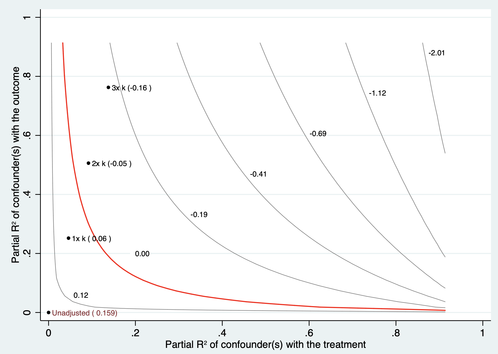

# 观察性研究的敏感性分析

使用观察数据进行评估时的一个基本问题，混杂因素可能会被误认为是处理效应。因此，研究人员在进行分析时，可运用上述多种设计与统计方法减轻已测量混杂。然而，在观察性研究中，不太可能获得所有潜在混杂变量的数据。因此，应开展针对关键假设的敏感性分析，以评估未测量的混杂因素与处理分配之间，以及与结果之间的关系有多强，从而解释观察到的处理效应的稳健性。

敏感性分析应在方案中预先说明其目的、主要估计目标、将改变的定义或参数范围，以及哪些结果将被视为支持或削弱主要结论；它不是在多种分析中挑选最有利结果的过程。[@greenland1996]

## 观察性研究的敏感性分析

### 干预的定义

多数观察性研究根据干预与否分为干预组和非干预组进行比较；但如果干预是可以量化的，比如某个指标的水平，或者用药的剂量等，可以根据不同的干预水平/剂量分组，比较组间结局发生率的关系，是否存在剂量依赖关系（剂量越高，疗效越好）。

剂量或连续暴露的敏感性分析宜预先设定有临床意义的阈值，并同时以连续形式（例如限制性立方样条）检验非线性；任意分组可能丢失信息并制造阈值效应。

### 结局的定义

敏感性分析可以通过改变研究结局的定义来看研究结果的稳健性。比如肿瘤的发生，可以通过病历中的诊断，可以通过病理的结果，还可以通过影像学的结果等等。案例9.1中内分泌缓解的定义可以通过生长激素指标判断，亦可以通过胰岛素样生长因素判断，如果这两种判断方法得出的结论一致，则可增加研究的稳健性。

替代结局定义应尽量基于预先验证的算法，并报告诊断窗口、测量误差和各定义下事件数；结论一致支持稳健性，但不能排除两种定义共享的系统性偏倚。

### 数据的来源

目前大规模的观察性研究大多基于已有的注册登记库数据开展，甚至有些研究会通过整合多个这样数据库进行分析，这时，数据的来源可以作为敏感性分析的一个切入口，可以既在不同的亚群中进行数据分析，也进行综合分析，查看研究结果的敏感性。

除重复分析外，还应比较各数据源的纳入标准、时间零点、变量编码、缺失模式与随访方式；数据源不同并不自动意味着偏倚更小。

### 协变量的定义

尤其那些连续分布的协变量（如年龄），通常研究者会将其以连续分布变量的形式纳入多因素分析模型中，但其实这些变量与结局之间不一定是线性关系，这时如果把这些协变量划分成不同的层（如年龄层），再放入多因素分析模型中进行分析，来查看研究结果的敏感性。

对连续协变量，优先比较合理的非线性函数（如样条）与线性设定；仅把变量切成若干层通常不能充分检验模型设定，并可能降低统计效率。

### 分析方法

可采用多种控制混杂因素的方法，包括回归，倾向性评分配对，逆概率加权。若可获得工具变量，还可使用工具变量方法。存在时间因素可选择中断时间序列方法。如果数据存在缺失，亦可采用多种缺失数据插补方法以检验缺失数据对结果的敏感性。

这些分析应围绕同一因果问题和预先规定的估计目标进行；不同方法得到相近结果可增强可信度，但不能单独证明不存在残余混杂、选择偏倚或模型错设。

## 未测量混杂因素

观察性研究中存在未测量混杂因素时，回归、倾向性评分配对和逆概率加权等方法不能在不增加额外假设或信息的情况下识别无偏的因果效应。这时深入探索的思路是：未测量混杂是否能全部或部分解释研究中观察到的干预因素的效应。即当未测量混杂因素达到何种强度时，之前的结果才不可信？若这种要求显然过于苛刻，则说明之前的结果大致可信。

这里的“苛刻”必须与现实中可能存在的混杂强度比较，而不能仅依据统计量数值作出结论；定量偏倚分析应明确其偏倚参数、方向与情景范围。Ding和VanderWeele（2016）提出了在较少分布假设下构造未测量混杂界限的框架。[@ding2016]

### 边界因子法（E值）

E值用于量化：在给定已调整协变量后，一个未测量混杂因素须同时与处理和结局具有多强的关联，才可能将观察到的相对效应完全解释为无效应。E值针对相对风险尺度；对非罕见结局的比值比或风险比以外的效应尺度，应说明所采用的尺度转换及其假设。研究者不必预先指定某一个具体混杂因素，但应结合临床和流行病学知识判断如此强度的混杂是否可信。

采用案例9.1中回归结果估计E值。由于E值得估计采用相对危险度，因此需根据结局变量发生频率进行调整，案例9.1结局变量发生频率介于15%和85%之间，因此指定为common（非小概率结局变量）。

报告时应同时给出点估计及最接近无效应的置信区间界限的E值；后者通常更能反映统计不确定性。VanderWeele和Ding（2017）强调，大E值表示需要较强的未测量混杂来完全解释关联，而非对因果效应的证明。[@vanderweele2017]

::: {.callout-note appearance="simple" icon="false" title="代码14.1"}
``` stata
. evalue or 2.3, lcl(1.6) ucl(3.3) common
```
:::

::: {.callout-note appearance="simple" icon="false" title="代码14.1输出"}
| 指标                |        值 |
|:--------------------|----------:|
| E-value（点估计）   | **2.402** |
| E-value（置信区间） | **1.844** |
:::

该 E 值可解释为：观察到的比值比2.3可以通过与处理和结果相关的未测量的混杂因素来解释，其比值比为2.4倍，与干预相当。因此，这些基于E值的因果关系证据看起来一般，因为需要相当的混杂因素来将观察到的关联降低至无效应，或使置信区间中最接近无效应的界限移动到无效应值。

如同任何一种统计学方法都有其局限性一样，E值方法也存在其局限性。E值与研究结果相对风险度值的大小是密切相关的，当相对风险度较小时，E值也较小。不能因为相对风险度较小，同时E值也较小就认为研究结果可能是错误的，也不能因为获得了较大的E值就认为结果一定是稳健的。E值是基于相对风险尺度的界限指标，表示未测量混杂因素与处理、结局的关联都至少达到某一强度时才足以将估计解释为无效应；它不要求这两种关联恰好相同。E值仅仅提供了一种敏感性分析结果，不能替代观察性研究所必须的，严谨的科研设计，其在评价过程中只能起一定的辅助作用。

E值不是对实际混杂大小的估计，也不能处理测量误差、选择偏倚或错误的时间顺序；解释时应说明研究中最可能的未测量混杂因素及其可实现的强度。

### 混杂函数法

混杂函数法是一套用于线性回归模型中敏感性分析的工具，来探索未观察到的混杂因素，这套工具不需要假设治疗分配机制的功能形式，也不需要假设未观察到的混杂因素的分布，可以自然地处理多个混杂因素，可能以非线性方式发挥作用，利用专家知识来约束敏感性参数，并且可以通过仅使用标准回归结果来轻松计算。

该方法引入了两个适合于常规报告的新的敏感性措施。稳健性值描述了以改变研究结论的未观察到的混杂因素与治疗和结果之间需要有的最小关联强度。干预对结局的偏R方解释了所有未观察到的混杂因素与治疗的关联程度。该方法提供图形工具来阐述有问题的混杂因素，检查点估计和t值的敏感性，以及极端情况。

仍然采用案例9.1的数据，检验未观察混杂因素的影响。

需要注意，sensemakr的标准实现对应线性回归及其偏R方参数化；若Outcome为二分类变量，这里的解读依赖于线性概率模型近似，不应直接外推至逻辑回归的比值比。Cinelli和Hazlett（2020）的框架应与所拟合模型及效应尺度一致。[@cinelli2020]

::: {.callout-note appearance="simple" icon="false" title="代码14.2"}
``` stata
. sensemakr Outcome Treatment k age, treat(Treatment) benchmark(k)
```
:::

::: {.callout-note appearance="simple" icon="false" title="代码14.2输出"}
| 参数  |       值 | 参数   |       值 |
|:------|---------:|:-------|---------:|
| DOF   |  **739** | q      | **1.00** |
| alpha | **0.05** | reduce | **TRUE** |
| H0    |    **0** |        |          |

| Treatment |      Coef. |       S.E. |      t(H0) |     R2yd.x |       RV_q |      RV_qa |
|:----------|-----------:|-----------:|-----------:|-----------:|-----------:|-----------:|
| Treatment | **0.1589** | **0.0335** | **4.7437** | **0.0296** | **0.1599** | **0.0971** |
:::

R2yd.x表示在已调整协变量后，干预与结局之间的偏R方，即干预可解释的结局剩余变异比例；它不是未测量混杂因素本身的强度。评估未测量混杂时，关键在于该混杂因素与干预、结局各自的偏R方及其联合情景，而不是把0.0296直接解释为混杂因素需要解释的固定比例。

RV_q表示使得干预变量的估计系数恰好为零的稳健性值。此处等于0.1599，意味着未测量混杂因素需要最少同时解释15.99%的干预变量与结局变量的剩余方差，才能彻底去除之前观察到的干预变量引起的效应。

这一稳健性值是在所指定线性模型、已调整协变量和对称强度设定下的界限；它不说明现实中不存在更复杂的多重混杂结构。

RV_qa使得估计系数不再在95%水平上显著的稳健性值。此处等于0.0971，意味着未测量混杂因素需要最少同时解释9.71%的干预变量与结局变量的剩余方差，才能使得95%置信区间下限为零。

然而，上述指标不够直观，并且很难论证为什么未测量混杂因素确实能够达到上述要求，并以此说明模型的稳健性。为此引入对比变量（本案例中加入侵袭性），尝试论证当未测量混杂因素强度只要小于对比变量时，之前的估计结果是有效的。

基准变量比较只是帮助校准情景：未测量混杂弱于侵袭性并不能保证估计有效，因为其与处理和结局的联合关联结构可能不同。

::: {.callout-note appearance="simple" icon="false" title="代码14.3"}
``` stata
. sensemakr Outcome Treatment k age, treat(Treatment)

> benchmark(k) contourplot
```
:::

::: text-center
{width="92%"}

**代码14.3输出：未测量混杂强度的等高线图**
:::

随着混杂函数值的增大（等同于1倍侵袭性的混杂因素、等同于2倍侵袭性的混杂因素、等同于3倍侵袭性的混杂因素），效应值逐渐减少，理论上是合理的。因为未测量到的未知混杂越多，混杂函数校正的效应值就越小。假设不存在未测量的混杂，治疗的绝对风险差为0.159（图中左下角）。红线代表治疗的绝对风险差归为0。加入等同于1倍侵袭性的混杂因素时治疗的绝对风险差降为0.06、加入等同于2倍和3倍侵袭性的混杂因素时绝对风险差为负。可以观察加入与侵袭性强度1.5倍左右的混杂因素可使得原估计系数由正转负。

该图展示的是预设偏R方情景下的模型推演，而不是对某个真实未测量混杂因素存在或效应大小的直接估计；应同时报告每个情景的参数设定。

::: {.callout-note appearance="simple" icon="false" title="代码14.4"}
``` stata
. sensemakr Outcome Treatment k age, treat(Treatment)

> benchmark(k) extremeplot
```
:::

::: text-center
{width="92%"}

**代码14.4输出：未测量混杂的最坏情况图**
:::

最坏情况图：三条数值线分别指当未测量混杂因素解释剩余方差的 100%、75%和50%的情况。横轴的小黑点分别指未测量混杂因素是侵袭性1-3倍强度的情况。图中可以看到，即使是最坏情况（未测量混杂因素解释剩余方差的100%，图中实线），未测量混杂因素都需要大致与侵袭性强度等同才能推翻之前结论。

### 混淆百分比

混淆百分比评价估计中使因果推断无效的偏差比例。通过量化使估计结果达到预先指定无效应阈值所需的偏倚程度或替代样本比例。如样本中多少病例的效应为0才能逆转总体因果效应。案例9.1中如果需要逆转总体因果效应，58.85%（437个）的样本必须用效果为0的样本来代替。

::: {.callout-note appearance="simple" icon="false" title="代码14.5"}
``` stata
. konfound Treatment, non_li(1)
```
:::

::: {.callout-note appearance="simple" icon="false" title="代码14.5输出"}
| 输出项目 | 结果 |
|:---|:---|
| 使推论无效所需的偏倚比例 | **58.85%** |
| 需要替代的病例数 | **437** |
| 非线性模型提示 | 建议采用平均偏效应计算，并在选项中使用 `non_li(1)` |
| 可选的标准误估计 | 可考虑 bootstrap 方法 |
| 遗漏变量与结局的相关性阈值 | **0.330** |
| 遗漏变量与感兴趣预测变量的相关性阈值 | **0.330** |
| 相应遗漏变量影响（Frank 2000 定义） | **0.330 × 0.330 = 0.1087** |
:::

konfound命令还可来计算未观察的混杂因素可能使因果推断回归系数失效的影响，计算未观察的混杂因素对干预变量以及结局变量的影响，以此来判断因果推断的有效性。案例9.1中一个未观察的混杂因素必须与结果有0.330的相关性，同时与感兴趣的干预因素有0.330的相关性，才能使推论无效。

这类阈值依赖于所用模型、样本量和预设无效应界限，应作为稳健性描述而不是对未测量混杂的检验结果。

## 阴性对照法

在进行队列研究时，通过额外设置合适的阴性对照，即形成了阴性对照法（negative control methods，NCM）。阴性对照的定义是：不参与拟研究的因果假设，但具有与研究假设相同的潜在人群对照。阴性对照可分为3种：阴性干预、阴性时期和阴性结局。

更常用的分类是阴性暴露（或阴性干预）和阴性结局；阴性时期可视为安慰剂时间窗。合格的阴性对照应与研究问题共享相关偏倚结构，但不应存在研究处理到阴性结局、或阴性暴露到研究结局的真实因果路径。Lipsitch等（2010）指出，阴性对照选择本身依赖强烈且不可完全检验的领域知识。[@lipsitch2010]

### 阴性干预

阴性干预对照法即阴性干预和结局在理论上为零效应，同时设置阴性干预和待研究干预，可以检验干预和结局之间的内部有效性是否受到偏倚的影响。如Surén等在孕期母亲补充叶酸与儿童自闭症风险的关系研究中，把其他维生素补充（不含叶酸）者作为阴性干预对照组。[@suren2013] Ruckart等研究孕妇饮用化学物污染水与新生儿神经管畸形和口唇裂疾病风险的相关性，发现神经管及口唇发育在早中期已发育完成，妊娠晚期孕妇的污水暴露可作为阴性干预。案例9.1中未观察的混杂因素是年历所致的技术进步是否是导致手术效果增加的原因。此时可采用2016年之后的显微镜手术作为阴性干预对照组，与2016年之前的显微镜手术比较。若两者没有明显差别，说明年历所致技术进步在改善预后方面作用不大。结果提示2016年之后的显微镜手术并不能显著增加手术效果，提示年历所致的技术进步作为未观察的混杂因素可能与手术效果增加无关，客观上反应了之前结果的稳健性。

这一结果只能说明该阴性对照未发现与年历相关的偏倚信号；若显微镜病例的构成、术者或随访方式亦随年份改变，阴性干预的假设仍可能不成立。

::: {.callout-note appearance="simple" icon="false" title="代码14.6"}
``` stata
. logistic Outcome calendar k if Treatment == 0, or
```
:::

::: {.callout-note appearance="simple" icon="false" title="代码14.6输出"}
| Logistic regression | Number of obs  |      =       |    **405** |
|:--------------------|:---------------|:------------:|-----------:|
| Log likelihood      | **-238.42607** |  LR chi2(2)  |  **79.59** |
|                     |                | Prob \> chi2 | **0.0000** |
|                     |                |  Pseudo R2   | **0.1430** |

| Outcome  |   Odds ratio |    Std. err. |         z |  P\>\|z\| | 95% conf. interval     |
|:---------|-------------:|-------------:|----------:|----------:|:-----------------------|
| calendar | **1.421627** | **.3359399** |  **1.49** | **0.137** | **.8946248, 2.259072** |
| k        | **.4379935** | **.0455046** | **-7.95** | **0.000** | **.3573004, .5369104** |
| \_cons   | **2.758148** | **.5677786** |  **4.93** | **0.000** | **1.84244, 4.128969**  |

注：`_cons` 估计基线优势（baseline odds）。
:::

### 阴性时期

对于某些慢性干预，从干预到结局，必须有相应的时间或时期，才能保证干预有足够的时间导致结局产生。采用不同时期，研究干预-结局间的关系，不同时期这二者之间的关联若不同，将提示着偏倚存在的可能。如老年人群流感疫苗接种对死亡风险的影响研究中，将流感流行前期或夏季作为阴性对照时期（因在此时期流感尚未开始流行或一般无较大规模传播）。此时期研究接种流感疫苗与死亡或住院风险的关系，如果出现死亡或住院风险下降，则并非因接种流感疫苗而产生的效果，提示混杂因素存在。再例如急性心肌梗死的强化治疗是否能降低长期死亡率研究中，用治疗后的短期死亡情况（如第1天）做阴性对照。

### 阴性结局

阴性结局又称为伪终点（falsification end points），设置阴性结局对照，通过干预与阴性结局对照间是否为零关联，判断感兴趣的干预对照的内部有效性是否受偏倚的影响。如肺炎球菌疫苗有效性评价中，Broome等将研究人群的结局分为3组：疫苗型感染组，发生疫苗所覆盖血清型的肺炎球菌感染；非疫苗型感染组，发生非疫苗所覆盖血清型的肺炎球菌感染；健康人群：未接种疫苗所致肺炎球菌感染。阴性结局要求疫苗接种与非疫苗型感染组的风险无关。

阴性对照也有其局限性，阴性对照设立基于因果关联的先验知识，即不参与因果假设和相同的偏倚结构。因此，实际研究中单纯采用统计检验等来探测混杂及其他偏倚是否存在，来进行因果关联估计的做法，值得商榷。阴性对照不能证实不存在偏倚；阴性对照不出现关联，也不意味着感兴趣的因果关系无偏，亦有可能有残存或未测量混杂因素无法控制而相互抵消的情形。阴性对照出现关联，可能是阴性对照两变量间存在着效应修饰，这并不意味着真正因果关联有偏倚。

也可能是阴性对照的“零效应”或共同偏倚结构假设不成立。因此，阴性对照应与因果图、时间顺序和临床机制一并论证；阳性信号提示需要进一步调查，阴性信号则只能有限地增加可信度。[@devries2023]

## 参考文献 {.unnumbered}

::: {#refs}
:::
