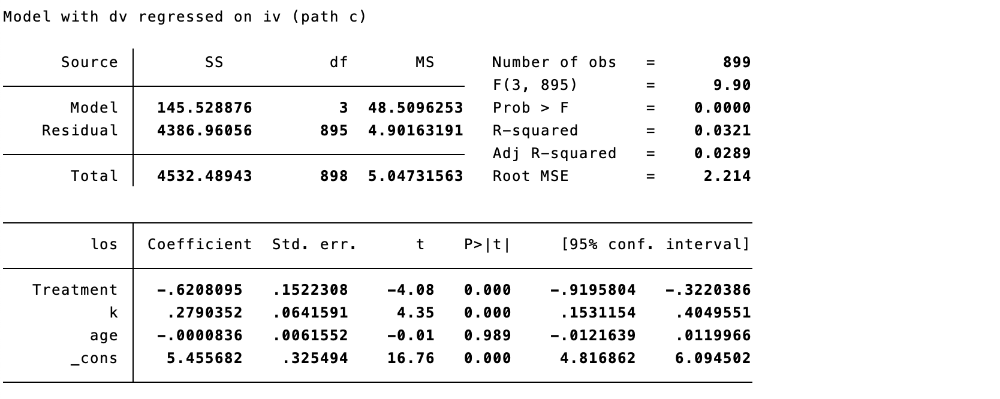
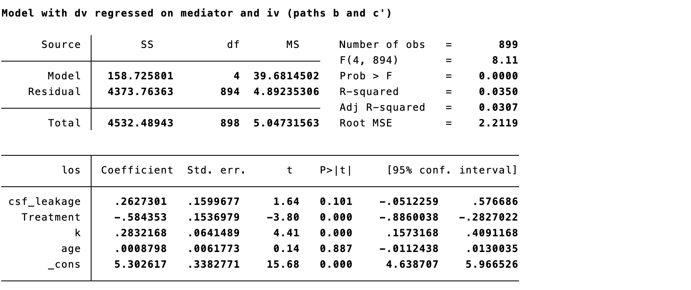
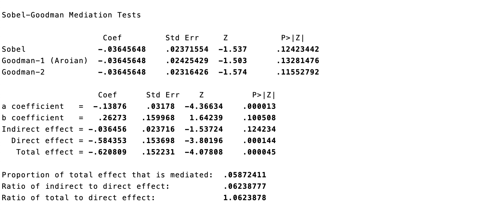
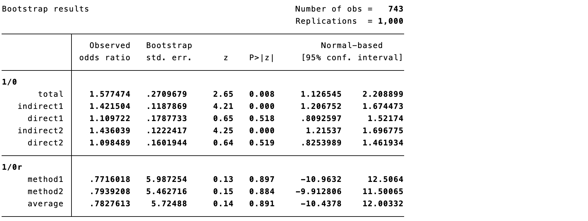
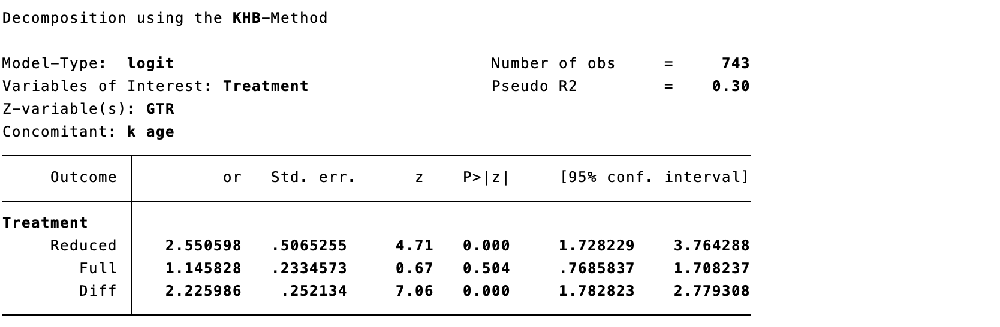
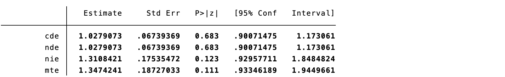
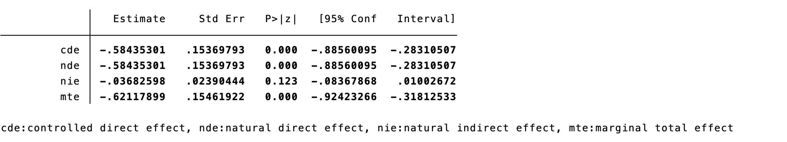

# 因果中介分析

健康和医疗干预的效果通常被认为是通过特定的生物或社会心理机制发挥作用。可能的机制可以用中介分析来评估。例如，尽管问题解决教育对抑郁症的有效性已得到证实，但中介这一效果的心理机制却不为人知。Silverste等对他们的随机试验进行了有计划的中介分析，以了解问题解决教育减少抑郁症状的机制，对中介机制的了解可能有助于创造更高效或有效的问题解决教育干预措施。

## 传统中介分析

传统的中介分析是基于对下图所示的路径的估计。左图代表无中介因素下的干预-结果效应。右图表示有中介因素下的效应，虚线代表干预-中介-结果效应，实线路径代表直接干预-结果效应。

::: text-center
{width="3.728682195975503in" height="1.384002624671916in"}
:::

通过回归方程可直观的理解中介分析。没有中介效应时，T 的效应直接作用到 Y，对 Y 的效应是直接效应，用方程表示为

$$Y = \ \beta_{0} + \beta_{1}*T$$

当中介变量和结局变量都是连续的，以上路径是用以下线性回归公式估计的。其中，$\beta_{1}^{‘}$ 代表直接效应，$\beta_{2}^{’}$ 和 $\theta_{1}^{‘}$ 的积就代表间接效应。中介效应的相对大小可以用中介比例来评估，它代表了间接效应估计值相对于总效应估计值的大小。若在上述因果图中包含混杂因素，应该始终将混杂因素纳入公式，所以在基于观察数据进行中介分析时，应始终考虑混杂因素。 在线性、无干预---中介交互且相关混杂已充分控制的特殊条件下，系数乘积法和系数差异法可对应同一效应分解；离开这些条件时，回归系数本身不应自动解释为自然直接或间接效应。

$$Y = \ \beta_{0}^{‘} + \beta_{1}^{‘}*\ T + \beta_{2}^{’}*M$$

$$M = \ \theta_{0}^{‘} + \theta_{1}^{‘}*\ T$$

中介分析是基于干预、中介因素和结局的时间优先性假设，即假设干预的变化先于中介因素的变化，而中介因素的变化又先于结局的变化。可以通过在模型中加入交互项（即干预\*协变量或中介因素\*协变量），并随后估计不同效应修饰因子的直接和间接效应来考虑效应修饰因子。可以通过在所有估计的回归方程中加入混杂变量，对测量的混杂因素调整效果估计。

然而，当使用传统的中介分析来估计具有非连续中介变量和结局变量的效果时，就会出现模糊不清的情况。例如，当基于非线性回归模型（如逻辑回归或Cox比例风险模型）的系数时，系数乘积法和系数差异法提供了不同的间接效应估计。

## 因果中介效应定义

因果中介分析澄清了传统中介分析中出现的模糊之处，基于反事实框架，并将因果效应定义与因果效应估计区分开来。因果效应定义的一个优点是它们是非参数性的，因此可以应用于任何类型的中介模型，以得出因果效应估计值。这包括具有干预中介交互作用的模型和具有非连续中介变量或非连续结果变量的模型。 自然直接效应与自然间接效应涉及"同一个体在不同干预情形下本会出现的中介值"，属于交叉世界反事实量；其因果解释依赖较强且不可由数据完全检验的假设。

当因果效应被运用到中介模型时，结局的平均潜在结果可基于不同的中介取值以及不同的干预取值来定义和估计。也就是说，E\[Y(T, M)\] 表示将个体固定在预定的中介值M时，在T组中观察到的个体的结局，对于中介变量和干预变量都为二分类的情况，两者皆可取0或1。因此，因果直接效应、间接效应和总效应被定义为两种潜在结果之间的差异，具体如下： 以下定义同时区分以对照组中介分布为参照的自然直接效应和以干预组中介分布为参照的总体直接效应；报告时应写明所选参照值及效应尺度，而不宜把不同定义混用。

① 总体间接效应（TIE，total indirect effect），表示干预组中 T 通过 M 对 Y 的影响：

$$TIE = \ E\left\lbrack Y\left( 1,M(1) \right) \right\rbrack - E\left\lbrack Y\left( 1,M(0) \right) \right\rbrack\ $$

② 自然间接效应（NIE，natural indirect effect），表示对照组中 T 通过 M 对 Y 的影响：

$$NIE = \ E\left\lbrack Y\left( 0,M(1) \right) \right\rbrack - E\left\lbrack Y\left( 0,M(0) \right) \right\rbrack\ $$

③ 总体直接效应（TDE，total direct effect），表示个体的中介变量被固定在1时，T 对 Y 的效应；

$$TDE = \ E\left\lbrack Y\left( 1,M(1) \right) \right\rbrack - E\left\lbrack Y\left( 0,M(1) \right) \right\rbrack\ $$

④ 自然直接效应（NDE，natural direct effect），表示个体的中介变量被固定在0时，T 对 Y 的效应；

$$NDE = \ E\left\lbrack Y\left( 1,M(0) \right) \right\rbrack - E\left\lbrack Y\left( 0,M(0) \right) \right\rbrack\ $$

⑤ 控制直接效应（CDE，controlled direct effect），表示个体的中介变量被控制时，T 对 Y 的效应，是将个体的干预值从0改为1，同时保持中介值不变的直接效应；

$$CDE = \ E\left\lbrack Y(1,M) \right\rbrack - E\left\lbrack Y(0,M) \right\rbrack\ $$

⑥ 总效应（TE，total effect），表示不考虑中介效应时，T 对 Y 的效应。

$$TE = \ E\left\lbrack Y(T = 1) \right\rbrack - E\left\lbrack Y(T = 0) \right\rbrack = TIE + NDE = NIE + TDE\ $$

对于线性模型，交互效应为0时，

$NDE = TDE$，

$NIE = TIE$。

对于结局变量为二元变量：

自然直接效应（NDE，natural direct effect）定义为：

$${OR}^{NDE} = \frac{P(Y_{1,M = 0} = 1)/P(Y_{1,M = 0} = 0)}{P(Y_{0,M = 0} = 1)/P(Y_{0,M = 0} = 0)}$$

自然间接效应（NIE，natural indirect effect）定义为：

$${OR}^{NIE} = \frac{P(Y_{1,M = 1} = 1)/P(Y_{1,M = 1} = 0)}{P(Y_{1,M = 0} = 1)/P(Y_{1,M = 0} = 0)}$$

总效应：

$${OR}^{TE} = {OR}^{NDE}*{OR}^{NIE}$$

## 因果中介效应的统计学假设

为了确保NDE、TDE、NIE和TIE在人群平均水平上有因果解释，需要有以下四个假设。

1.  干预与结局间没有未测量的混杂。

2.  中介与结局间没有未经测量的混杂。

3.  干预与中介间没有未经测量的混杂。

4.  存在多个中介效应时，中介结局效应不会通过其他中介因素产生混杂。

假设4也被称为跨世界的独立假设。在实践中，这通常是一个很强的假设，例如，经常会有干预结局中的多个中介因素。当存在多个中介因素时，必须考虑到所有这些中介因素，因为它们可能是相关的，即违反第四个无混杂假设。对于CDE来说，只有假设1和2必须成立，而对于TE来说，只有假设1必须成立。 此外，还需要一致性、可交换性与正值性；对自然效应，尤其要排除受干预影响的中介---结局混杂。若存在这类干预后混杂，传统自然直接／间接效应通常不可由观察数据识别，可考虑联合中介、路径特异效应或随机化干预性（interventional）效应等替代目标。VanderWeele、Vansteelandt和Robins（2014）对此给出了可识别的分解策略。[@vanderweele2014]

## 中介效应的估计

已经开发了各种估计方法来估计人口平均水平上的因果直接效应、间接效应和总效应。

### 逐步回归法

通常采用的中介效应分析是Baron和Kenny在1986年提出的方法（简称BK法），包括4个回归步骤。第一步：将Y对T进行回归，估计总效应。第二步：将M对T进行回归，估计干预与中介的关联。第三步：将Y对M进行回归，同时控制T，估计中介与结局的关联。第四步：比较纳入中介前后T的回归系数。上述显著性检验步骤只是描述性线索：总效应不显著并不排除间接效应（例如直接与间接效应方向相反时），而"完全中介"也不能仅凭T系数不显著来判定；仍须明确估计目标、混杂控制和置信区间。[@baron1986]

回忆案例9.1中比较两种方案（内窥镜手术和显微镜手术）的住院时长LOS，内窥镜手术患者比显微镜手术患者平均住院时长少0.62天。关心手术方式通过什么因素导致了住院时间的缩短，进而可以优化术后管理。然而手术可导致术中脑脊液鼻漏发生，若发生则术后需要住院时长较长。因此提出问题，此平均住院时长的减少是否是由于脑脊液鼻漏发生率减少所致？

::: {.callout-note appearance="simple" collapse="false" icon="false"}
### 代码15.1：逐步回归法

``` stata
gen csf_leakage = (csf_leak == "Yes")
sgmediation los, mv(Treatment) iv(csf_leakage) cv(k age)
```
:::

:::: {.callout-note appearance="simple" icon="false" title="代码15.1输出"}
::: text-center
{width="5.768055555555556in" height="2.3027777777777776in"}
:::
::::

第一步回归，干预的系数为-0.62，统计显著，说明干预的总体效应存在。

:::: {.callout-note appearance="simple" icon="false" title="代码15.1输出"}
::: text-center
{width="5.768055555555556in" height="2.3027777777777776in"}
:::
::::

第二步回归，中介变量对干预做回归，系数为-0.14，统计显著，证明干预变量和中介变量存在关系。

:::: {.callout-note appearance="simple" icon="false" title="代码15.1输出"}
::: text-center
{width="5.768055555555556in" height="2.4277777777777776in"}
:::
::::

第三步回归，结局变量同时对干预和中介变量做回归，中介变量的系数为-0.14，统计不显著。说明控制干预变量后，结局变量与中介变量的相关性不高。

:::: {.callout-note appearance="simple" icon="false" title="代码15.1输出"}
::: text-center
{width="5.768055555555556in" height="2.4277777777777776in"}
:::
::::

最后，Sobel检验p值0.124，说明不存在中介效应，其置信区间可由自助法得出。亦可观察到中介比例较低，为5.9%。 Sobel检验不显著表示在该模型和样本量下未观察到足够证据支持间接效应，并不等同于"证实不存在中介效应"；建议报告间接效应及其 bootstrap 置信区间，并说明中介比例仅在总效应远离零且方向一致时较易解释。

### 结构方程法

首先构建结构方程模型，然后进行中介分析。medsem有两种方法作为其程序的基础。第一种方法是众所周知的BK法，Iacobucci等对其进行了调整，以用于结构方程建模。第二种方法是Zhao等提出的方法。

::: {.callout-note appearance="simple" collapse="false" icon="false"}
### 代码15.2：结构方程法

``` stata
qui sem (csf_leakage <- Treatment k age)(los <- csf_leakage Treatment k age), nocapslatent
medsem, indep(Treatment) med(csf_leakage) dep(los)
    stand mcreps(5000) rit zlc
```
:::

:::: {.callout-note appearance="simple" icon="false" title="代码15.2输出"}
::: text-center
{width="5.768055555555556in" height="4.481944444444444in"}
:::
::::

BK法发现中介变量→结局变量的系数无统计显著性，因此不存在中介效应。Zhao法得出同样结论，按照Monte-Carlo抽样z检验无统计显著。中介比例与第一种方法一致，为5.9%。

### ldecomp

以上两种方法结局变量为连续变量，对结局变量为二分类变量可以采用ldecomp程序包。案例9.1中比较两种方案（内窥镜手术和显微镜手术）的内分泌缓解，内窥镜手术患者比显微镜手术患者缓解率高，提出问题增加的缓解率是否是由于增加手术的全切率所致？

ldecomp方法将逻辑回归中分类变量的总效应分解为直接和间接效应。我们怀疑，总效应的一部分可以由全切率之间的差异来解释，全切的患者更容易缓解。这就是间接效应。手术的直接效应是在控制全切的情况下产生的效应。默认情况下，ldecomp使用bootstrap计算标准误差。

::: {.callout-note appearance="simple" collapse="false" icon="false"}
### 代码15.3：ldecomp

``` stata
gen GTR = (extend == "GTR")
ldecomp Outcome k age, direct(Treatment) indirect(GTR) ///
    or rindirect reps(1000)
```
:::

:::: {.callout-note appearance="simple" icon="false" title="代码15.3输出"}
::: text-center
{width="5.768055555555556in" height="2.1798611111111112in"}
:::
::::

总体效应的度量尺度为比值比，结果为1.58，表示内窥镜手术患者比显微镜手术患者缓解率高，直接效应为1.11和1.10（分别采用两种方法），通过增加全切率间接部分为1.42和1.44（分别采用两种方法），平均占比为78.3%。值得注意的是，有中介效应的总效应与一般逻辑回归中的效应没有可比性。二分类结局变量的问题与以下事实有关，即逻辑回归使用的是比值比，而比值比是一种不可加的测量方法，因此边际比值和条件比值不能直接进行比较。 因此边际比值和条件比值不能直接比较；该结果应表述为所指定模型与假设下的效应分解，而非单凭比例宣称某一生物学机制已被证实。

### KHB方法

二分类结局并不必然要求以对数二项式模型代替逻辑回归；应先规定目标效应尺度。对数二项式或稳健泊松模型可估计风险比尺度的效应，逻辑回归可估计比值比尺度的效应。结局罕见时比值比可近似风险比，但不存在适用于所有研究的固定10%界线。由于比值比具有非可折叠性，不能把嵌套逻辑回归系数的变化直接解释为中介作用；若使用风险比尺度，本章第二节的风险比表达式才适用。

KHB方法比较两个嵌套非线性概率模型之间的估计系数。该方法针对二元、Logit和Probit模型开发的。如前所述，线性模型所描述的策略不能用于非线性概率模型。

::: {.callout-note appearance="simple" collapse="false" icon="false"}
### 代码15.4：KHB方法

``` stata
khb logit Outcome Treatment || GTR, concomitant(k age) or
```
:::

:::: {.callout-note appearance="simple" icon="false" title="代码15.4输出"}
::: text-center
{width="5.768055555555556in" height="1.8881944444444445in"}
:::
::::

Reduced代表总效应比值比为2.55；Full代表直接效应比值比为1.15；Diff中介效应比值比为2.23。可以看出中介效应所占比例很大。

### paramed

以上均为传统中介分析，对于因果中介分析，Stata中利用paramed这样一个命令可以完成，使用参数化回归模型进行分析。估计两个模型：一个是以干预和混杂因素为条件的中介模型，一个是以干预、中介因素和混杂因素为条件的结果模型。使用直接和间接效应的反事实定义的结果回归模型。paramed提供控制直接效应、自然直接效应、自然间接效应和总效应的估计值，其标准误以及默认情况下使用delta方法得出的置信区间，也可使用bootstrap选项。 运行 paramed 前应以因果图预先界定基线混杂因素，并检查干预---中介交互；参数化模型正确设定、一致性、正值性及无未测量混杂仍是该结果具有因果解释的前提。Valeri和VanderWeele（2013）提供了含干预---中介交互时的参数化实施框架。[@valeri2013]

::: {.callout-note appearance="simple" collapse="false" icon="false"}
### 代码15.5：paramed（二分类结局）

``` stata
paramed Outcome, avar(Treatment) mvar(GTR) cvars(k age) ///
    a0(0) a1(1) m(1) yreg(loglinear) mreg(logistic) nointer boot
```
:::

:::: {.callout-note appearance="simple" icon="false" title="代码15.5输出"}
::: text-center
{width="5.768055555555556in" height="0.8854166666666666in"}
:::
::::

由于案例中的结局变量非罕见概率，因此因果中介分析推荐使用loglinear回归。mte表示总体效应，其度量单位为相对危险度（RR），为1.35；cde和nde表示控制直接效应和自然直接效应，均为1.03；nie为自然间接效应，为1.31。

paramed也支持结局变量为连续变量的中介分析，平均住院时长的减少是否是由于脑脊液鼻漏发生率减少所致？

::: {.callout-note appearance="simple" collapse="false" icon="false"}
### 代码15.6：paramed（连续结局）

``` stata
paramed los, avar(Treatment) mvar(csf_leakage) cvars(k age) ///
    a0(0) a1(1) m(1) yreg(linear) mreg(logistic) nointer boot
```
:::

:::: {.callout-note appearance="simple" icon="false" title="代码15.6输出"}
::: text-center
{width="5.768055555555556in" height="1.0472222222222223in"}
:::
::::

总体效应与回归方程估计的一致。内窥镜的总体效应将住院时间减少为0.62天，其中直接效应为0.58天；间接效应仅为0.04天。

### medeff

medeff是用于估计各种数据类型的中介效应的命令。对于连续的中介变量和连续的结果变量，其结果将与通常的BK法相同。然而，该命令可以适应其他数据类型，包括二元结果和中介变量，并计算出正确的估计值。在进行中介分析后，可进行正式的敏感性分析。然而，该方法无法计算比值比。

::: {.callout-note appearance="simple" collapse="false" icon="false"}
### 代码15.7：medeff

``` stata
medeff (logit Mediator Treatment k age) ///
    (regress los Treatment Mediator k age), ///
    mediate(Mediator) treat(Treatment)
```
:::

:::: {.callout-note appearance="simple" icon="false" title="代码15.7输出"}
::: text-center
{width="5.768055555555556in" height="0.9805555555555555in"}
:::
::::

干预对结局的总效应是-0.627，平均直接效应为-0.581，平均中介效应为-0.045，中介效应在总校应中占比仅7.4%。

## 中介效应报告推荐

尽管传统中介分析和因果中介分析对某些模型提供了相同的效应估计，但因果中介分析通常比传统中介分析更受欢迎。因果中介分析明确列出了对效应估计的因果解释所需的所有假设。尽管其中一些因果假设与其他中介分析方法提出的参数化假设相同，但因果中介分析也为这些假设不成立时提供了指导。例如，当存在无法测量的混杂因素时，可使用敏感性分析来评估效果估计值在一系列关于混杂因素对中介模型中的变量影响大小的合理假设基础上如何变化。澄清因果假设是因果中介分析的一个重要贡献，因为中介模型本身就是因果模型。 报告时可按 AGReMA 声明交代因果问题、估计目标、时间顺序、混杂控制策略、效应尺度、模型设定、缺失数据处理、敏感性分析与不确定性区间；这有助于读者判断结论的适用范围。[@lee2021]

传统中介估计最初是基于线性回归系数得出的。只要无（未测量的）混杂假设成立，传统的中介分析为用线性回归估计的中介模型提供因果效应估计。然而，用非线性回归（如逻辑回归或Cox比例风险模型）估计时，传统中介分析和因果中介分析只有在中介因素遵循正态分布、结果罕见、不存在相互作用的情况下才会提供相同的效应估计。

一般建议评估和讨论相关的参数和因果假设。无混杂假设对于确保效应估计值的因果解释至关重要，对于观察性研究尤其重要，因为中介模型中的所有路径都是观察性的，对中介因素的调整对于确保效应估计值的因果解释至关重要。有向无环图可用于帮助确定中介模型中路径的混杂因素，因为其直观地显示了中介模型中的因果路径，包括这些路径的混杂因素。未测量的混杂因素对效应估计的潜在影响可以通过敏感性分析进行评估。当第四个无混杂假设被违反时，可以估计多中介模型以考虑额外的中介变量。

协变量干预、协变量中介、干预中介和中介中介的相互作用的存在，可以通过在统计模型中加入交互项来评估。此点很重要，因为如果不考虑具有统计学意义的或与临床相关的相互作用，总体效应就会忽略直接和间接效应估计的重要信息。

最后，在使用基于回归的估计方法分析具有二分类或时生存结局的中介模型时，必须评估罕见结果假设，因为只有当结局的发生率在干预和中介变量的所有分层中都很低时，比值比和危险比的效果估计才有因果关系的解释。当违反罕见结果假设时，建议用对数线性回归估计二分类结局模型的效应，用加速失效时间模型估计生存结局模型的效应。 更准确地说，效应尺度应由研究问题预先决定：比值比和风险比都可以报告，但应避免把条件比值比的变化直接当作中介比例；生存结局还需处理删失、竞争风险和中介发生时间，不能仅以"罕见结局"作为充分条件。

建议根据间接效应估计值的非正态抽样分布的置信区间来确定间接效应估计值的统计学意义，如乘积置信区间、蒙特卡洛置信区间和自助法置信区间的分布，因为这些区间具有较高的检测统计学意义。

## 中介分析局限性

中介分析的目标是在明确研究问题和可识别假设下估计路径相关的因果效应，而不是仅凭统计分解"证明"因果关系，这一目标要求满足特定的假设。在中介分析中，干预结局、干预中介变量和中介变量结局的效应必须是不混淆的，以允许有效的因果推断。这一要求通常被称为无混杂或可忽略的假设。

在随机试验中，参与者被随机分配到干预组，所以干预结局和干预中介效应可以被假定为无混淆的。然而，试验参与者通常不会被随机分配到接受或不接受中介变量。因此，即使在随机试验中，中介结局效应也可能被混淆。为了克服这种潜在的偏见，研究者可以通过使用回归调整等技术来控制中介变量-结果效应的已知混杂因素。即使对已知的混杂因素进行了调整，未测量的混杂因素仍可能带来偏倚。敏感性分析可以而且应该用来评估中介分析中未测量的混杂因素所引起的潜在偏差。 随机分配干预并不能解决由干预后变量造成的中介---结局混杂；也不保证中介测量无误或中介先于结局。因而即使在随机试验中，仍需以时间线和因果图说明中介分析假设，并对关键未测量混杂开展敏感性分析。

观察性研究中的混杂风险比随机试验中的混杂风险要大，因为观察性研究的参与者不是随机分配来接受暴露的。在观察性研究中，与随机试验不同的是，不能假设干预中介或干预结局效应是不受干扰的。因此，在观察性研究的中介模型中，对所有效应的估计可能是有偏差的，可能需要对所有效应进行混杂控制。一个例子是在一项观察性研究中，Cheng等人用中介分析来检验脑功能连接是否中介了抑郁症对睡眠质量的影响。由于参与者没有被随机分配到抑郁症（干预）或脑功能连接（中介）的水平，研究者在模型中调整了所有效应的已知混杂因素。尽管有这些努力，未测量的混杂因素可能会使间接和直接效应的估计出现偏差。如果中介分析没有调整混杂因素或使用敏感性分析技术探讨未测量的混杂因素的影响，则应谨慎地解释其结果。随机或非随机研究的中介分析只有在有把握排除混杂因素的情况下才能证明因果效应。 随机或非随机研究的中介分析都应将结果解释为在所陈述假设下的因果估计；若关键混杂、测量误差或时间顺序无法令人信服地排除，应将结论限定为机制相容的关联，并报告敏感性分析。

如果干预措施有多个相互影响的中介因素，中介因素可能作为其他中介物的随机化后混杂因素。在这些情况下，在解释从单一中介因素的中介分析中得出的间接和直接效应的估计值时，必须谨慎行事。此外，对中介因素和结局的测量时间也很重要，如果中介因素与结局同时测量，可能会出现反向因果关系。也就是说，结局可能导致中介因素，而不是中介因素导致结局。 对于多个中介，不能仅因变量在统计上显著就逐个分解路径；应预先说明中介之间的因果顺序或采用适合并行／序列中介的估计目标。

对于中介比例，虽然有一个直观的解释，但存在一些重要的局限性。首先，没有适用于所有研究的固定样本量阈值；当总效应接近零、估计不精确或直接与间接效应方向相反时，中介比例尤其不稳定。其次，中介比例的估计值可能低于零或高于一。第三，当总体效应估计值较小且与临床无关时，中介比例的估计值可能具有误导性。

## 参考文献 {.unnumbered}

::: {#refs}
:::
