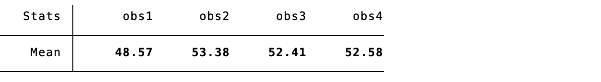
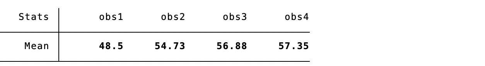
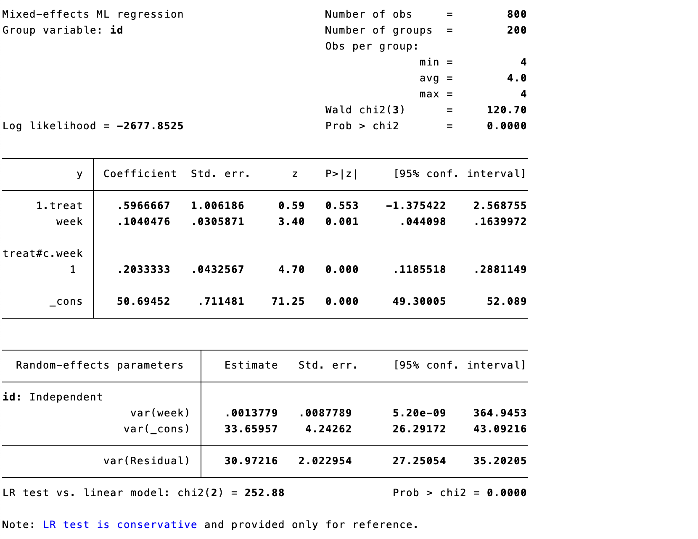
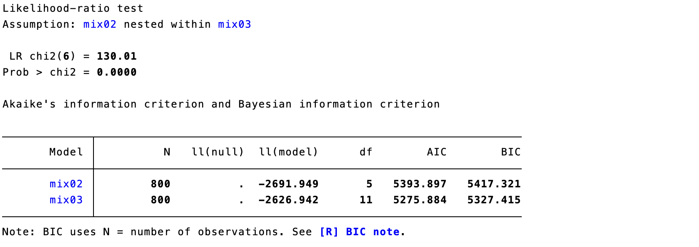
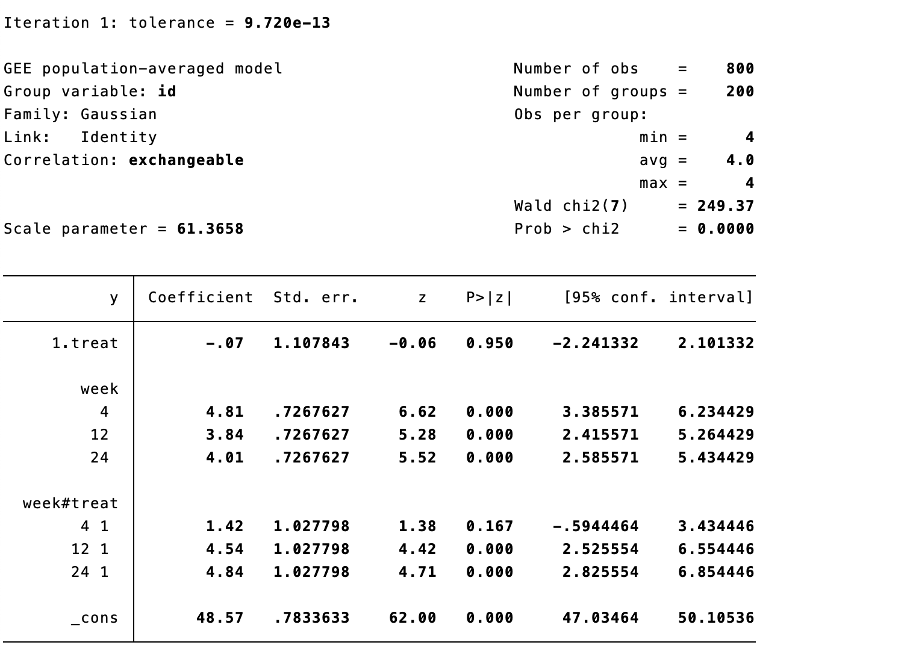

# 重复测量数据的统计分析

本书前几章介绍的大多数分析中，每个研究的结局变量都是有单一的衡量标准，通常使用适合结果数据类型的回归方法，如连续变量结局采用线性回归、二分法结局采用逻辑回归。然而，在临床医学研究中，一些干预研究经常会涉及到同一研究对象的多次观察，并记录资料，产生的数据称为重复测量数据。对于重复测量数据，开展统计分析有若干方法。

## 传统方法

### 简单回归

偶尔，研究人员汇集来自多个受试者的多个记录，然后使用传统的回归方法将结局事件对干预以及时间轴做回归。每个受试者的每个观察点被视为一个单独的记录。尽管系数估计值对于类似参照总体中的参数可能是无偏倚的，但不建议使用此方法，计算出的标准误差估计值有非常大的偏差，基于此的统计显著性检验也是如此。每个受试者自身的自相关被完全忽略，且此方法严重违反了观测值独立的假设。此外，使用这种方法可能会掩盖效应，因为样本内部和样本之间的关系可能不同。 更准确地说，未处理个体内相关性通常会使标准误与置信区间失真，并可能夸大统计学显著性；若研究问题关注随时间的平均变化或个体轨迹，应使用能够明确处理聚类相关性的纵向模型。

### 协方差分析

协方差（analysis of covariance，ANCOVA）模型是将那些对结局指标 Y 有影响的变量 X 作为协变量，建立应变量 Y 随协变量 X 变化的线性回归关系，并利用这种回归关系把 X 值化为相等后再进行各组 Y 的修正均数间比较的假设检验。其结局指标必须为连续变量。经典的重复测量ANCOVA适用于部分纵向研究设计，这些设计通常平衡良好，每个受试者具有相同的，相对较少且通常均匀分布的时间点，并且没有缺失值。

重复测量协方差分析的一个常见问题是，样本的重复观测之间的相关性违反了方差分析的重要假设，即观察结果不相关。如果受试者的多次测量结果与时间无关，则此问题通常不重要。然而，纵向研究中通常存在的问题是受试者多次测量与时间相关，相邻测量值相关性普遍比非相邻测量值相关性高。

用于纵向研究的协方差分析最大缺点是仅限于某些情况，如，几个时间点（通常\<10）的平衡数据，多次测量的时间点一致。大多数软件算法不允许存在缺失值。 重复测量方差分析还依赖球形性等较强假设；即使采用校正，也难以解决不平衡随访和可能与结局相关的失访问题，因此在临床纵向研究中通常更适合作为受限情形下的补充分析。

### 分析结局事件的变化

在这种方法中，分析纵向数据通过计算结局事件的纵向变化幅度，然后可以使用任何传统的统计方法。例如，对于每个受试者，可以计算随访评分减去基线评分的差值，然后对这些差值进行t检验，比较治疗组与对照组的差别。这不是一种好的纵向分析方法，因为每个受试者只使用了两个可用的信息点，并没有考虑其他时间点的差异。

以上所有这些分析方法都存在缺陷，临床研究中无法推荐其中的任何一种。但作为一种快速的探索性方法，可为更复杂但不太直观的方法提供一些信息。

## 混合效应模型

混合效应模型应用于纵向数据分析，又称为混合固定随机效应模型，因为在纵向设计中，除了随机的截距，固定回归系数几乎总是包含在模型中。在不同的领域或情况下，该模型也有很多别名，如多水平模型，分层线性模型，随机系数模型，方差成分模型等等。随机效应模型适用于研究参与者的结果随时间变化的个体轨迹既受到干预措施的影响，也受到患者本身因素的影响。随机效应模型明确考虑了每个样本重复测量之间的相关性。

对许多样本有相同影响的因素被称为固定效应，而可能因样本与样本间差异而有很大变化的因素被称为随机效应。例如，一种新的治疗方法对所有病人的影响可能是相同的，作为固定效应建模；而病人间可能有明显不同的基线功能或固有的恢复率，这些可作为随机效应建模。混合模型之所以被称为混合，是因为它们通常同时包含固定和随机效应。在模型中同时考虑固定效应和随机效应的能力，可以灵活地确定多种因素的影响，解决具有临床重要性的具体问题。

通常，模型中包含随机截距、与时间相关的变量及对应的多项式。该模型首先估计个体的回归直线或曲线，描述这些直线或曲线的系数（直线的截距和斜率，或者曲线的多项式系数）。用随机截距拟合受试者数据的平均截距，用随机多项式系数或非线性模型参数拟合平均斜率或非线性系数。在纵向研究中，缺失数据很常见，例如，由于受试者错过了访视或退出了研究，这种情况不能用ANCOVA分析来解决。混合模型可以适应不平衡的数据模式，并在分析中使用所有可用的观察值和病人。混合模型假设缺失与未观察到的测量结果无关，但取决于观察到的测量结果。这种假设被称为随机缺失。使用混合模型，即使在缺失值不完全随机的情况下，也常常可以得到合理有效的治疗效果估计，而且一般不需要额外的处理缺失数据的方法。 这里的随机缺失（MAR）应理解为：在纳入已观察到的基线资料和既往结局后，缺失概率不再额外依赖于同一时点未观察到的结局。MAR不能由数据本身证实；应描述各时间点的缺失比例与原因，纳入与失访相关的已观察变量，并针对缺失非随机（MNAR）情形进行敏感性分析。在线性混合模型正确设定且满足MAR时，基于最大似然的估计可利用可用观测值；失访较多或组间不平衡时，不宜仅因使用混合模型而省略缺失数据评估。[@kim2026]

案例16.1

一项临床试验，评估治疗多发性硬化患者的认知功能变化，采用听觉测试（PASAT3）作为结局事件，分别在基线（0周），干预后4周，12周和24周进行评估。科学问题是治疗组和对照组的PASAT3评分如何随时间变化？数据中id表示受试者的唯一标识，treat代表接受何种干预（1为干预组，0为对照组），obs1\~4代表四次随访的PASAT3测试值。

**案例16.1数据表**

| id  | treat | obs1 | obs2 | obs3 | obs4 |
|:---:|:-----:|:----:|:----:|:----:|:----:|
|  1  |   0   |  56  |  56  |  57  |  49  |
|  2  |   0   |  53  |  54  |  60  |  55  |
| ... |  ...  | ...  | ...  | ...  | ...  |
| 101 |   1   |  49  |  54  |  57  |  59  |
| 102 |   1   |  48  |  54  |  60  |  51  |
| 103 |   1   |  48  |  61  |  51  |  52  |
| ... |  ...  | ...  | ...  | ...  | ...  |

为了确定干预措施如何影响PASAT3评分的变化，可以查看每个时间点每组的汇总统计数据，平均值与方程的变化趋势。

::: {.callout-note appearance="simple" collapse="false" icon="false"}
### 代码16.1：对照组描述统计

``` stata
tabstat obs1 obs2 obs3 obs4 if treat==0, stat(mean)
tabstat obs1 obs2 obs3 obs4 if treat==0, stat(sd)
```
:::

:::: {.callout-note appearance="simple" icon="false" title="代码16.1输出"}
::: text-center
{width="5.768055555555556in" height="0.7909722222222222in"}
:::
::::

:::: {.callout-note appearance="simple" icon="false" title="代码16.1输出"}
::: text-center
{width="5.768055555555556in" height="0.7909722222222222in"}
:::
::::

::: {.callout-note appearance="simple" collapse="false" icon="false"}
### 代码16.2：干预组描述统计

``` stata
tabstat obs1 obs2 obs3 obs4 if treat==1, stat(mean)
tabstat obs1 obs2 obs3 obs4 if treat==1, stat(sd)
```
:::

:::: {.callout-note appearance="simple" icon="false" title="代码16.2输出"}
::: text-center
{width="5.768055555555556in" height="0.7909722222222222in"}
:::
::::

:::: {.callout-note appearance="simple" icon="false" title="代码16.2输出"}
::: text-center
{width="5.768055555555556in" height="0.7909722222222222in"}
:::
::::

分别在两组中绘制均值变化曲线，可以看到PASAT3评分随时间变化的趋势在治疗组与对照组间完全不同。从图中亦可看出PASAT3评分随时间的变化不呈线性，对照组在0到4周有明显增加，而干预组在0到12周有明显增加，对照组4周后无明显变化，而干预组在12周之后变化亦不明显。

::: {.callout-note appearance="simple" collapse="false" icon="false"}
### 代码16.3：按组绘制均值变化曲线

``` stata
twoway (mband y obs), by(treat)
```
:::

:::: {.callout-note appearance="simple" icon="false" title="代码16.3输出"}
::: text-center
{width="5.768055555555556in" height="4.047916666666667in"}
:::
::::

本书前几章介绍的案例均在结局时间点测量，所有测量是独立的。然而，重复测量中由于随着时间的推移重复测量受试者，造成多次测量存在相关性，需要在分析中考虑到这一点。

由于每个个体有四个观察结果，因此可以进行多种分析：如第24周两组间有差异吗？可以利用两个样本的t检验或线性回归。亦可以分析第0周和24周之间的变化幅度两组之间是否存在差异？然而，如果想分析所有的观察结果，解释相关的观察结果，需要用到纵向分析。

在上述数据格式中（宽格式），使用多个列来表示结局事件的多个测量值，然而为了在大多数标准统计软件中进行纵向分析，需要将数据转换为长格式。在长格式数据中，每一行代表个体某一次测量值，每个个体产生四行数据，分别代表四次测量。

**案例16.1数据表长格式**

| id  | treat | obs |  y  | week |
|:---:|:-----:|:---:|:---:|:----:|
| ... |  ...  | ... | ... | ...  |
| 100 |   0   |  1  | 58  |  0   |
| 100 |   0   |  2  | 56  |  4   |
| 100 |   0   |  3  | 45  |  12  |
| 100 |   0   |  4  | 48  |  24  |
| 101 |   1   |  1  | 49  |  0   |
| 101 |   1   |  2  | 54  |  4   |
| 101 |   1   |  3  | 57  |  12  |
| 101 |   1   |  4  | 59  |  24  |
| ... |  ...  | ... | ... | ...  |

### 建立零模型

混合效应模型多从零模型开始探索平均效应趋势, 使用mixed命令（若按照面板数据分析可选用xtset以及xtreg命令），因变量指定为obs；暂不选入任何自变量；方程的层次变量选入id。构建的方程以下式表达，其中*Y~ij~* 代表第 i 个个体的第 j 次观察，β~0~ 是所有个体所有测量的平均值。

$$Y_{ij} = \beta_{0}$$

::: {.callout-note appearance="simple" collapse="false" icon="false"}
### 代码16.4：零模型

``` stata
mixed obs || id:
```
:::

:::: {.callout-note appearance="simple" icon="false" title="代码16.4输出"}
::: text-center
{width="5.768055555555556in" height="3.29375in"}
:::
::::

模型采用混合效应回归，根据变量id进行分层，共800条记录，按id分层后有200个水平。当前模型含有0个自变量，因此未给出相应检验结果。固定效应结果反映的是不考虑各因素的影响，所有参与研究的受试者的平均PASAT3评分为53.05分。随机效应结果用方差来表示，var(\_cons) 是随机截距的误差项，代表的是个体间差异，估计值为34.03。var(Residual) 是残差，代表个体内每次测量之间的差异, 估计值为37.02。与普通线性回归的似然比（LR）检验提示当前模型跟普通线性模型是有差异的（p = 0.000），提示个体差异是PASAT3重要的变异来源。为方便后续的模型比较，我们可以将此模型结果存为mix00。 似然比检验的原假设是随机效应方差为零；该方差参数位于参数空间边界，p值应谨慎解释，并结合方差估计值、置信区间及其对预测和固定效应推断的实际影响判断是否保留随机效应。

::: {.callout-note appearance="simple" collapse="false" icon="false"}
### 代码16.4a：保存零模型

``` stata
estimates store mix00
```
:::

### 建立只含时间因素的混合模型（随机截距）

自变量选择week。构建的方程以下式表达，其中*Y~ij~* 代表第 i 个个体的第 j 次观察，β~1~ 是所有个体的基线平均值，β~1~ 是所有个体每周测量变化的平均值。

$$Y_{ij} = \beta_{0} + \beta_{1}*{week}_{ij}$$

::: {.callout-note appearance="simple" collapse="false" icon="false"}
### 代码16.5：随机截距模型

``` stata
mixed y week || id:
```
:::

:::: {.callout-note appearance="simple" icon="false" title="代码16.5输出"}
::: text-center
{width="5.768055555555556in" height="3.4125in"}
:::
::::

新纳入week变量后，即week的系数不为0，每增加一周，PASAT3平均增加0.206分。与零模型相比，在纳入变量week后，个体内变异变小 (37.02 vs 35.22)，表明只有小部分个体内的变异被week变量解释了。个体内每次测量之间的差异仍然存在（32.28）。同时我们也发现当前模型与采用一般回归模型的似然比检验有统计学差异（p = 0.000），说明当前模型个体间差异仍是差异来源。为方便后续的比较，可将此模型结果存为mix01。

::: {.callout-note appearance="simple" collapse="false" icon="false"}
### 代码16.5a：保存随机截距模型

``` stata
estimates store mix01
```
:::

### 建立只含时间因素的混合模型（随机截距与斜率）

此模型认为个体发展趋势不仅截距不同，斜率也不同（图16.1）。

::: text-center
{width="5.768055555555556in" height="2.4875in"}

**图16.1 随机截距 vs 随机截距+随机斜率**
:::

分层变量选择id和week。

::: {.callout-note appearance="simple" collapse="false" icon="false"}
### 代码16.6：随机截距与随机斜率模型

``` stata
mixed y week || id:week
```
:::

:::: {.callout-note appearance="simple" icon="false" title="代码16.6输出"}
::: text-center
{width="5.768055555555556in" height="3.808333333333333in"}
:::
::::

将时间变量的斜率设为随机后，误差部分分解的更为细致。个体间截距方差34.08，个体间斜率方差0.01，个体内残差30.89。与不含随机斜率和随机截距的模型相比，当前模型具有统计学意义。将此模型结果存为mix02。

::: {.callout-note appearance="simple" collapse="false" icon="false"}
### 代码16.6a：保存随机截距与随机斜率模型

``` stata
estimates store mix02
```
:::

### 建立包含干预与时间因素的混合模型

考虑时间因素本身以及时间与干预措施的交互作用。引入交互项的目的是从图上看，两组的增长趋势不同，治疗组更快一些。

$$Y_{ij} = \beta_{0} + \beta_{1}*{treat}_{i} + \beta_{2}*{week4}_{i} + \beta_{3}*{week12}_{i} + \beta_{4}*{week24}_{i} +$$

$$\beta_{5}*{treat}_{i}*{week4}_{i} + \beta_{6}*{treat}_{i}*{week12}_{i} + \beta_{7}*{treat}_{i}*{week24}_{i} + e_{ij}$$

其中，*Y~ij~* 代表第 i 个个体的第 j 次观察，*treat~i~* 代表第 i 个个体的干预，*week4~i~*、*week12i* 和*week24i* 分别代表第 i 个在干预后不同时间点。在此模型中：

1)  β~0~ 是第0周对照组中的平均值，β~0~+β~1~ 是第0周治疗组的平均值；因此，β~1~是第0周治疗组与对照组的差值。

2)  β~0~+β~2~ 是第4周对照组中的平均值，β~0~+β~1~+β~2~+β~5~ 是第4周治疗组的平均值；因此，β~2~ 是对照组第4周和第0周的平均值之差，β~2~+β~5~ 是治疗组第4周和第0周的平均值之差，β~5~ 是治疗组与对照组第4周和第0周之间平均值变化的差异。

3)  β~0~+β~3~ 是第12周对照组中的平均值，β~0~+β~1~+β~3~+β~6~ 第12周治疗组的平均值；因此，β~3~ 是对照组第12周和第0周的平均值之差，β~3~+β~6~ 是治疗组第12周和第0周的平均值之差，β~6~ 是治疗组与对照组第12周和第0周之间平均值变化的差异。

4)  同理，β~7~ 是治疗组与对照组第24周和第0周之间平均值变化的差异。

纵向分析的原假设通常为各组随时间的变化是否相同？该假设不要求治疗在基线时相同，而是关注从基线到后续时点间的差异。两组并行时，结局事件随时间的变化是相同的；两组没有并行时，结局事件随着时间的变化是不同的。正如之前所见，交互项（β~5~、β~6~、β~7~）评估了随时间变化的差异，当交互项都等于0时，组间随时间的变化是相同的，当任一交互项不等于0时，随时间的变化是不同的。

自变量选择treat和week的交互。

::: {.callout-note appearance="simple" collapse="false" icon="false"}
### 代码16.7：干预与时间交互模型

``` stata
mixed y treat##i.week || id:week
```
:::

:::: {.callout-note appearance="simple" icon="false" title="代码16.7输出"}
::: text-center
{width="5.768055555555556in" height="4.878472222222222in"}
:::
::::

整个模型纳入3个变量后，具有统计学意义的（Wald卡方240.13，p = 0.000）。var(week) 表示每个个体的PASAT3随时间改变的幅度（斜率）是否有差异，var(cons) 表示的则是个体的截距是否不同。将以上结果代入方程可得：

$$Y_{ij} = 48.57 - 0.07*{treat}_{i} + 4.81*{week4}_{i} + 3.84*{week12}_{i} + 4.01*{week24}_{i}$$

$$+ 1.42*{treat}_{i}*{week4}_{i} + 4.54*{treat}_{i}*{week12}_{i} + 4.84*{treat}_{i}*{week24}_{i}$$

因此，第0周治疗组与对照组的差值为0.07。治疗组与对照组第4周和第0周之间平均值变化的差异为1.42，治疗组与对照组第12周和第0周之间平均值变化的差异为4.54，治疗组与对照组第24周和第0周之间平均值变化的差异为4.84。β~5~ 的p值为0.154，因此可以得出结论，治疗组与对照组第4周和第0周之间平均值变化没有显著差异。β~6~ 和 β~7~ 的p值均小于0.05，可以得出结论，治疗组与对照组第12周、第24周和第0周之间平均值变化均有显著差异。

为了评估案例16.1中两组随时间的变化是否存在显着差异，原假设设定为H~0~: β~5~ = β~6~ = β~7~ = 0。在上述的输出中，可以发现β~5~ (1.42) ≠ β~6~ (4.54) ≠ β~7~ (4.84) ≠ 0，即两组随时间的变化存在显着差异。将此模型结果存为mix03。 当时间按连续变量建模时，组别×时间交互项（β3）才检验两组每周平均变化率是否不同；β2检验的是对照组的平均时间趋势。若时间趋势明显非线性，连续线性项可能掩盖早期与晚期的不同变化，应优先以研究设计中的访视时点作为分类时间变量，或预先规定并检验合适的非线性函数。

::: {.callout-note appearance="simple" collapse="false" icon="false"}
### 代码16.7a：保存干预与时间交互模型

``` stata
estimates store mix03
```
:::

如果想要估计干预组和对照组每周的评分变化改变，则可以将时间设为连续变量。

$$Y_{ij} = \beta_{0} + \beta_{1}*{treat}_{i} + \beta_{2}*{week}_{ij} + \beta_{3}*{treat}_{i}*{week}_{ij} + e_{ij}$$

::: {.callout-note appearance="simple" collapse="false" icon="false"}
### 代码16.8：连续时间交互模型

``` stata
mixed y treat##c.week || id:week
```
:::

:::: {.callout-note appearance="simple" icon="false" title="代码16.8输出"}
::: text-center
{width="5.768055555555556in" height="4.461805555555555in"}
:::
::::

代入方程

$$Y_{ij} = 50.69 + 0.60*{treat}_{i} + 0.10*{week}_{ij} + 0.20*{treat}_{i}*{week}_{ij} + e_{ij}$$

对照组在第0周的平均PASAT3评分为50.69；第0周干预组与对照剂相比平均评分的差异为0.60；对照组平均评分的每周变化为0.10；干预组与对照组相比，每周平均评分变化的差异为0.20。由于 $\beta_{2}$ 的p值为0.000，因此干预组与对照组相比每周平均评分变化显著不同。

若想要比较两个模型的优劣，可以采用似然检验，以及AIC，BIC信息准则（值越小，模型拟合优度越好）。 比较固定效应不同的嵌套混合模型时，应以最大似然（ML）而非限制最大似然（REML）拟合；AIC、BIC只能用于在同一数据集、同一似然框架下比较候选模型，还应结合残差诊断、协方差结构的合理性与临床可解释性，而非仅凭一个数值选模。

::: {.callout-note appearance="simple" collapse="false" icon="false"}
### 代码16.9：模型比较

``` stata
lrtest (mix03) (mix02), stats
```
:::

:::: {.callout-note appearance="simple" icon="false" title="代码16.9输出"}
::: text-center
{width="5.768055555555556in" height="2.0430555555555556in"}
:::
::::

### 设置合适的残差的协方差结构

上述命令可通过附加cov设定适当的协方差矩阵，从个体内变异的角度来建模，可以考虑独立（independent）、等相关（exchangeable）、非结构性（unstructured）、自相关系数矩阵（autoregressive）。等相关表示数据之间有着相关性，而且相关性相等，此种情况使用较多；自相关表示数据之间有着相关性，而且相邻时间点相关性越大，时间间隔越大相关性越小；独立表示数据之间完全独立，同一对象的不同测量数据之间没有关系。可以尝试建立多个模型，根据其结果比较选择合适的结构。 随机效应结构与残差协方差结构描述的是不同层次的相关性：前者刻画个体间截距或斜率的异质性，后者刻画给定随机效应后同一受试者测量值的剩余相关。候选结构应由随访间隔、相关图形、收敛状况和信息准则共同决定；过度复杂的非结构化矩阵在时间点较多或样本较小时可能不稳定。

::: {.callout-note appearance="simple" collapse="false" icon="false"}
### 代码16.10：协方差结构

``` stata
mixed y treat##i.week || id:week, cov(unstructured)
```
:::

与任何统计模型一样，如果混合模型的基本假设没有得到满足，那么它的有效性将是有限的。例如，如果一种治疗的效果在不同的受试者之间有很大的不同（如遗传差异不同），那么将治疗效果视为固定可能不合理。但由于模型的复杂性、参数的数量，可能会导致估计迭代无法收敛。

## 广义估计方程

广义估计方程（generalized estimating equations, GEE）由Liang和Zeger于1986年提出，[@liang1986]适用于正态分布、二项分布、Poisson分布等多种分布的统计模型。对于纵向数据、不满足方差分析条件的重复测量设计资料可以采用广义估计方程来进行分析。

在分析重复测量纵向数据时，使用广义估计方程或随机效应模型已成为常见做法。虽然许多研究人员经常交替使用这两种方法，但在确定使用哪种方法进行研究时，有几个重要的考虑因素。

首先，在线性模型中，广义估计方程的参数估计值与随机效应模型相同。Stata中需采用xtset声明数据结构为面板数据，个体为id，时间结构为week。然后采用xtgee进行广义估计方程参数估计，方程结构与上述相同，结局变量为y，自变量为treat、week以及treat和week的交互项。由于结局变量为连续变量，family设定为gaussian，link设定为identity，协方差矩阵可设定为独立（independent）、可交换（exchangeable）、非结构性（unstructured）、自相关系数矩阵（ar）等。

::: {.callout-note appearance="simple" collapse="false" icon="false"}
### 代码16.11：连续结局的GEE

``` stata
xtset id week
xtgee y i.treat i.week i.week#i.treat, ///
    family(gaussian) link(identity) corr(exchangeable)
```
:::

:::: {.callout-note appearance="simple" icon="false" title="代码16.11输出"}
::: text-center
{width="5.768055555555556in" height="4.131944444444445in"}
:::
::::

本例中可见利用广义估计方程估计的参数与随机效应模型完全一致。然而，对于非线性模型，情况并非如此。例如，逻辑回归模型中使用的 logit 链接为非线性变换，这意味着随机效应的均值是在 logit 尺度上估计的，与广义估计方程估计值不同。案例12.1中假设PASAT3评分55分以上为正常，将结局指标定为二分类变量（正常/异常），由此举例说明结局指标为分类变量时如何进行纵向数据分析。由于结局变量为分类变量，family设定为binomial，link设定为logit，eform表示结果输出为比值比的形式。 在线性恒等链接且模型设定相近时，两类模型的部分回归系数可能相近，但并非必然完全一致；更关键的差别是估计目标：GEE给出人群平均（边际）效应，混合模型给出给定随机效应条件下的个体特异效应。对于二分类等非线性结局，两者的效应尺度与数值一般不同，不能直接互换。

::: {.callout-note appearance="simple" collapse="false" icon="false"}
### 代码16.12：二分类结局的GEE

``` stata
gen y_cat = (y > 55)
xtgee y_cat i.treat i.week i.week#i.treat, ///
    family(binomial 1) link(logit) corr(exchangeable) eform
```
:::

:::: {.callout-note appearance="simple" icon="false" title="代码16.12输出"}
::: text-center
{width="5.768055555555556in" height="3.995138888888889in"}
:::
::::

结果解读可参照上述第一节，此处不再赘述。

广义估计方程模型结果的解释与混合效应模型的解释不同。广义线性方程模型估计的是人群平均效应，其斜率是如果自变量变化一个单位，对整个人群的变化影响。混合效应模型估计的是条件化效应，其斜率是如果自变量变化一个单位，对特定个体的影响。对于缺失数据，混合效应模型假设为随机缺失，而广义估计方程假设为完全随机缺失，后者在实际数据中是一个更为严格的假设。 这一表述适用于未加权、基于可用观测的标准GEE；在完全随机缺失（MCAR）下其估计通常一致。若缺失可视为MAR，可考虑逆概率加权GEE或多重插补后GEE，并在权重／插补模型中纳入与缺失和结局有关的变量。对于二分类重复结局，近年的方法学比较提示，在MAR情形下，似然法广义线性混合模型通常比标准GEE更稳健；当缺失比例较高或治疗组间失访不平衡时，应预先说明估计目标并开展敏感性分析。[@harris2022]

广义估计方程优于混合效应模型的一个优点是不需要结局变量呈正态分布，因此可应用与二分类以及多分类的结局。然而混合效应允许建立更复杂的假设，包括随机斜率、多级群组，以及随机截距和斜率之间的协方差不同。因而，混合模型中很重要的一点是，如果数据偏离了模型假设，推断的有效性就会受到影响。

## 潜在类别模型

潜在类别模型（LCA）允许研究人员识别具有类似特征的人群，它可以确定由观察变量的特定组合所定义的群体。潜伏类分析根据最大似然估计，给每个参与者分配一个属于每个子群体的概率。然后，每个参与者被分配到他们所属概率最高的组。其统计学假设是可观察到的变量的概率分布可以由少数互斥的潜变量（Latent variable）来解释。

当聚类模式难以用传统方法辨别时，潜在类别模型就很有用。例如，败血症的临床异质性使其难以确定某个亚群是否对某种治疗方法反应更有利。研究人员使用潜在类别模型作为确认性分析，找到了新的脓毒症表型。他们根据血液动力学、实验室和末梢器官功能参数的组合，确定了具有不同治疗反应的脓毒症临床表型。

组基轨迹分析是潜在类别模型的一种方法，特定于重复测量数据。通过最大似然估计形成亚群样本结局变量的轨迹，其轨迹形状可以是直线或曲线的形式。原理是假定总体存在异质性，即总体中存在若干个不同发展轨迹或模式的潜在亚组，目的是探索总体中包含有多少个发展趋势不同的亚组，并确定各亚组的发展轨迹。

案例16.1数据中增加week1\~4代表四次随访的时间，0周、6周、12周以及24周。

案例16.1数据

| id  | treat | obs1 | obs2 | obs3 | obs4 | week1 | week2 | week3 | week4 |
|:---:|:-----:|:----:|:----:|:----:|:----:|:-----:|:-----:|:-----:|:-----:|
|  1  |   0   |  56  |  56  |  57  |  49  |   0   |   6   |  12   |  24   |
|  2  |   0   |  53  |  54  |  60  |  55  |   0   |   6   |  12   |  24   |
|  3  |   0   |  47  |  50  |  40  |  58  |   0   |   6   |  12   |  24   |
|  4  |   0   |  51  |  49  |  60  |  58  |   0   |   6   |  12   |  24   |
|  5  |   0   |  46  |  40  |  54  |  55  |   0   |   6   |  12   |  24   |
|  6  |   0   |  61  |  63  |  55  |  62  |   0   |   6   |  12   |  24   |
| ... |  ...  | ...  | ...  | ...  | ...  |  ...  |  ...  |  ...  |  ...  |

确定亚组数及其轨迹需要多次重复拟合，才能获得最佳轨迹数目及形状。一般先从较少亚组数开始拟合，每一亚组先从高阶开始，若高阶参数无统计学意义则去除，继续拟合低阶参数。拟合效果评价采用贝叶斯信息标准（Bayesian information criterion，BIC），BIC值绝对值越小，表示模型拟合程度越好；亦可选择平均验后分组概率（average posterior probability，AvePP），判定每一个体被归属为特定轨迹的概率，反映每一个体被分到相应亚组的验后概率，大于0.7时，作为模型可以接受的标准。 类别数和轨迹形状不能仅凭BIC或AvePP的单一阈值决定；还应报告各类样本量与比例、熵或分类不确定性、轨迹图及残差诊断，并结合临床可解释性、外部验证和敏感性分析综合选择。潜在类别轨迹模型的类别是对连续异质性的近似描述，不应自动解释为真实且边界清晰的生物学亚型。

潜在类别模型几个局限性值得考虑。首先，尽管基于潜变量的分组有利于数据的呈现和解释，但样本的类别是根据属于某个潜变量的最高概率来分配的。队列的不同可能导致潜在类别模型产生不同数量的类，并具有不同的模式。因此，报告这种方法的验证和可重复性非常重要。研究人员应通过使用不同的源数据来测试所识别的分组是否可以重现。组基轨迹分析中只能对轨迹进行多项式函数建模，不具备对不符合其他形状的轨迹（如周期性轨迹）建模的能力。 此外，最大后验概率分组会忽略分类不确定性；若后续要比较类别与临床结局或预测因素的关联，应使用能纳入后验概率／分类误差的方法，或至少报告该不确定性。模型选择对分布假设、时间尺度、缺失处理和初始值均可能敏感，宜在独立样本或重抽样中评估可重复性。[@nagin2010; @lennon2018]

## 参考文献 {.unnumbered}

::: {#refs}
:::
