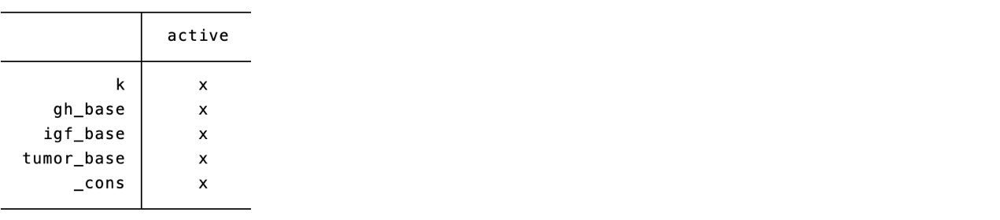
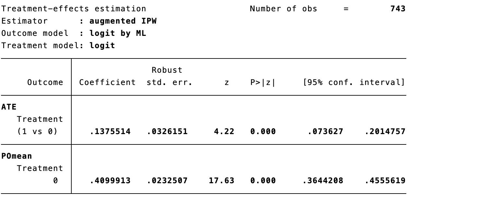
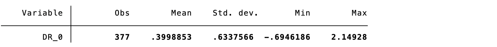
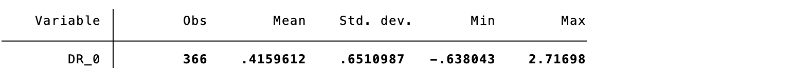
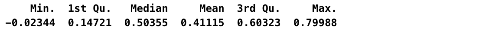
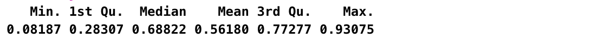

# 因果推断与机器学习的交融

## 机器学习模型纳入倾向评分的拟合

在真实世界研究中，干预相关协变量往往维度很高且关系复杂。若把所有变量的高阶项和交互项都放入传统参数模型，参数数目可能接近或超过样本量，导致倾向评分估计不稳定。机器学习可用于灵活估计倾向评分 $e(X)=Pr(A=1\mid X)$，但其目标是控制混杂而不是单纯最大化治疗预测准确性；协变量选择应首先依据时间顺序和临床知识，避免纳入治疗后的变量、碰撞变量或仅为提高治疗预测而损害重叠性的变量。

机器学习算法能够在高维协变量中拟合非线性和交互作用，可用于估计倾向评分、结局回归或删失模型等"干扰参数"。LASSO（least absolute shrinkage and selection operator）是在回归中同时进行收缩和变量选择的方法，可将部分系数压缩至0；随机森林、梯度提升和神经网络等也可用于该类预测任务。需要强调的是：用于因果估计时，模型选择和调参不能只看AUC、准确率或均方误差，还应检查加权/匹配后的协变量平衡、倾向评分分布与极端权重，并预先保留临床上重要的混杂因素。

案例9.1中，以LASSO估计倾向评分，纳入较多基线变量。该示例用于说明流程；实际分析还应报告各变量的缺失处理、倾向评分重叠情况、权重分布及加权后的协变量平衡。

::: {.callout-note appearance="simple" collapse="false" icon="false"}
### 代码18.1：LASSO 倾向评分建模

``` stata
. lasso logit Treatment k age duration gh_base igf_base tumor_base
. lassocoef
```
:::

:::: {.callout-note appearance="simple" icon="false" title="代码18.1输出"}
::: text-center
{width="5.768055555555556in" height="1.2715277777777778in"}
:::
::::

LASSO回归筛选出四个变量用于倾向评分建模。在更高维的场景中，LASSO可减少模型复杂度，但不能把"未被选择"直接解释为"不是混杂因素"；变量是否应纳入仍需结合因果图、测量时点与临床知识判断。

::: {.callout-note appearance="simple" collapse="false" icon="false"}
### 代码18.2：基于倾向评分的逆概率加权

``` stata
. predict _pscore
. gen _ipweight = 1/_pscore if Treatment == 1
. replace _ipweight = 1/(1-_pscore) if Treatment == 0
. logistic Outcome Treatment [iweight = _ipweight], vce(robust)
```
:::

:::: {.callout-note appearance="simple" icon="false" title="代码18.2输出"}
::: text-center
{width="5.768055555555556in" height="1.8604166666666666in"}
:::
::::

示例中得到的加权比值比为1.80。多种机器学习方法已被用于从电子病历中的高维、稀疏和纵向信息估计治疗机制；例如，可先将诊断、处方和实验室检查的历史编码为特征表示，再与基线信息共同用于估计每个时点的治疗或删失概率。无论采用何种表示学习方法，因果解释仍依赖于无未测混杂、正值性、一致性以及正确的时间顺序，而不能由模型的预测性能本身保证。

## 双重稳健估计器

上一节的机器学习模型可用于估计倾向评分或结局回归，但把预测值直接代入因果效应公式常受正则化偏倚和过度拟合影响。增强逆概率加权（augmented inverse probability weighting，AIPW）将两类模型结合：在可交换性、正值性和一致性等识别假设成立时，只要倾向评分模型或结局回归模型中至少一个正确指定，估计量即可保持一致性，因此称为"双重稳健"。在高维或非参数场景，还应配合正交得分与交叉拟合，形成双重/去偏机器学习（double/debiased machine learning，DML），以支持有效的标准误和置信区间。

令A为二分类干预，$e(X)=Pr(A=1\mid X)$为倾向评分，$m_a(X)=E(Y\mid A=a,X)$为结局回归。对每名研究对象，AIPW的两个潜在结局均值可写为：$DR_1=m_1(X)+\frac{A}{e(X)}[Y-m_1(X)]$，$DR_0=m_0(X)+\frac{1-A}{1-e(X)}[Y-m_0(X)]$；对$DR_1$和$DR_0$取样本均值即可得到两种干预策略下的风险估计（表18.1）。

**表18.1 双重稳健估计器**

|   | *DR~1~* | *DR~0~* |
|:---|:---|:---|
| 通用表达式 | $\frac{Y^{X = 1}*X - \widehat{Y_{1}}*(X - PS)}{PS}$ | $\frac{Y^{X = 0}*(1 - X) + \widehat{Y_{0}}*(X - PS)}{1 - PS}$ |
| 干预组 | $\frac{Y^{X = 1} - \widehat{Y_{1}}*(1 - PS)}{PS}$ | $\widehat{Y_{0}}$ |
| 对照组 | $\widehat{Y_{1}}$ | $\frac{Y^{X = 0} - \widehat{Y_{0}}*PS}{1 - PS}$ |

::: {.callout-note appearance="simple" collapse="false" icon="false"}
### 代码18.3：估计干预组的双重稳健风险

``` stata
. logit Outcome k age duration gh_base igf_base tumor_base
>>> if Treatment == 1
. predict Y_hat_1
. logit Outcome k age duration gh_base igf_base tumor_base
>>> if Treatment == 0
. predict Y_hat_0
. gen DR_1 = Y_hat_1
. replace DR_1 = Y_hat_1 + (Outcome - Y_hat_1)/_pscore if Treatment == 1
. gen DR_0 = Y_hat_0
. replace DR_0 = Y_hat_0 + (Outcome - Y_hat_0)/(1-_pscore) if Treatment == 0
. summarize DR_1 if Outcome != .
```
:::

:::: {.callout-note appearance="simple" icon="false" title="代码18.3输出"}
::: text-center
{width="5.768055555555556in" height="0.5986111111111111in"}
:::
::::

::: {.callout-note appearance="simple" collapse="false" icon="false"}
### 代码18.4：估计对照组的双重稳健风险

``` stata
. summarize DR_0 if Outcome != .
```
:::

:::: {.callout-note appearance="simple" icon="false" title="代码18.4输出"}
::: text-center
{width="5.768055555555556in" height="0.5986111111111111in"}
:::
::::

*DR1和DR0的点估计分别为0.550和0.411；两者之差为风险差0.139。由两种风险可进一步计算风险比或比值比，且应同时报告其95%置信区间。Stata的teffects aipw命令可在两个括号中分别指定结局回归与倾向评分模型；如需使用LASSO、随机森林等学习器，则应采用能够实现交叉拟合和稳健推断的专门程序，或自行进行可重复的样本分割、估计与合并。*

::: {.callout-note appearance="simple" collapse="false" icon="false"}
### 代码18.5：Stata 的 AIPW 估计

``` stata
. teffects aipw (Outcome age igf_base gh_base k duration, logit)
>>> (Treatment age igf_base gh_base k duration, logit)
```
:::

:::: {.callout-note appearance="simple" icon="false" title="代码18.5输出"}
::: text-center
{width="5.768055555555556in" height="2.326388888888889in"}
:::
::::

## 因果推断中引入交叉验证

机器学习与双重稳健估计结合时，关键不只是常规预测意义上的交叉验证，而是交叉拟合（cross-fitting）。其目的在于让每名研究对象的倾向评分和结局回归预测都来自不包含该对象的训练样本，从而降低同一样本既训练又估计效应所造成的过拟合偏倚。DML进一步使用Neyman正交得分，使干扰参数的小误差对目标因果效应的一阶影响减弱；二者共同为有效推断提供条件，而不是自动消除未测混杂或正值性不足。

### 样本分割

样本分割可将研究对象随机分为训练样本和估计样本：在训练样本中拟合m_1(X)、m_0(X)和e(X)，再将这些模型应用于独立的估计样本，计算AIPW/正交得分。这样可避免对同一对象的结果信息重复使用；但单次二分法只在一半样本中估计最终效应，精度会下降，因此通常采用K折交叉拟合。

::: {.callout-note appearance="simple" collapse="false" icon="false"}
### 代码18.6：第一折样本分割估计

``` stata
. gen group = runiformint(0,1)
. logit Outcome k age duration gh_base igf_base tumor_base
>>> if (Treatment == 1 & group == 0)
. predict Y_hat_1
. logit Outcome k age duration gh_base igf_base tumor_base
>>> if (Treatment == 0 & group == 0)
. predict Y_hat_0
. lasso logit Treatment k age duration gh_base igf_base tumor_base if group == 0
. predict _pscore
. gen DR_1 = Y_hat_1
. replace DR_1 = Y_hat_1 + (Outcome - Y_hat_1)/_pscore if Treatment == 1
. gen DR_0 = Y_hat_0
. replace DR_0 = Y_hat_0 + (Outcome - Y_hat_0)/(1-_pscore) if Treatment == 0
. summarize DR_1 if (Outcome != . & group == 1)
```
:::

:::: {.callout-note appearance="simple" icon="false" title="代码18.6输出"}
::: text-center
{width="5.768055555555556in" height="0.5534722222222223in"}
:::
::::

::: {.callout-note appearance="simple" collapse="false" icon="false"}
### 代码18.7：第一折的对照组风险汇总

``` stata
. summarize DR_0 if (Outcome != . & group == 1)
```
:::

:::: {.callout-note appearance="simple" icon="false" title="代码18.7输出"}
::: text-center
{width="5.768055555555556in" height="0.5534722222222223in"}
:::
::::

在一半的样本中（377例），*DR~1~* 和 *DR~0~* 的点估计分别为0.508和0.400。

### 交叉验证

为避免单次分割损失效率，可调换两部分样本的角色，或更常用地进行K折交叉拟合：每一折均用其余K−1折拟合干扰参数，再在保留折计算正交得分，最后合并所有折的得分。这里的"交叉拟合"不同于仅为选择超参数而进行的预测交叉验证；其核心是保证效应估计所用预测为样本外预测。

::: {.callout-note appearance="simple" collapse="false" icon="false"}
### 代码18.8：第二折交叉拟合

``` stata
. drop Y_hat_1 Y_hat_0 _pscore DR_1 DR_0
. logit Outcome k age duration gh_base igf_base tumor_base
>>> if (Treatment == 1 & group == 1)
. predict Y_hat_1
. logit Outcome k age duration gh_base igf_base tumor_base
>>> if (Treatment == 0 & group == 1)
. predict Y_hat_0
. lasso logit Treatment k age duration gh_base igf_base tumor_base if group == 1
. predict _pscore
. gen DR_1 = Y_hat_1
. replace DR_1 = Y_hat_1 + (Outcome - Y_hat_1)/_pscore if Treatment == 1
. gen DR_0 = Y_hat_0
. replace DR_0 = Y_hat_0 + (Outcome - Y_hat_0)/(1-_pscore) if Treatment == 0
. summarize DR_1 if (Outcome != . & group == 0)
```
:::

:::: {.callout-note appearance="simple" icon="false" title="代码18.8输出"}
::: text-center
{width="5.768055555555556in" height="0.5534722222222223in"}
:::
::::

::: {.callout-note appearance="simple" collapse="false" icon="false"}
### 代码18.9：第二折的对照组风险汇总

``` stata
. summarize DR_0 if (Outcome != . & group == 0)
```
:::

:::: {.callout-note appearance="simple" icon="false" title="代码18.9输出"}
::: text-center
{width="5.768055555555556in" height="0.5534722222222223in"}
:::
::::

在另一半的样本中（366例），*DR~1~* 和 *DR~0~* 的点估计分别为0.605和0.416。

将各折的正交得分合并后，可得到整个研究人群的平均因果效应估计；本示例中DR1和DR0的点估计约为0.557和0.408。区间估计可由影响函数方差、适当的自助法或软件实现获得。应固定随机种子、报告折数和学习器调参规则，并在敏感性分析中考察不同学习器、截尾规则和折分方式对结论的影响。

## 因果森林算法

因果森林（causal forest）是随机森林在异质性治疗效应估计中的扩展，目标是条件平均治疗效应CATE：$\tau(X)=E[Y(1)-Y(0)\mid X]$。它并非把普通聚类或普通预测树直接解释为因果分析；因果解释仍需在给定X后满足无未测混杂、正值性和一致性。森林可视为用树诱导的自适应邻域为每位患者寻找可比较的对照信息，再在这些邻域内估计治疗效应。

因果森林通过大量树的加权邻域来估计治疗效应异质性，并在分裂时兼顾治疗组与对照组的样本量及可比性。叶节点不是天然的随机对照试验：若叶内仍存在未控制混杂、治疗组极少或协变量重叠不足，叶内差异仍可能有偏。总体平均效应可由森林的相应估计器获得；CATE预测则主要用于描述经预先规定并经验证的效应异质性。

"诚实性"（honesty）是指在同一棵树内将抽样数据分为两部分：一部分用于选择分裂规则，另一部分用于叶内效应估计与推断。它不是完全禁止使用结局信息，也不等同于无混杂；其作用是降低因同一数据既寻找异质性又估计效应而产生的适应性偏倚。现代广义随机森林还可先对结局和治疗机制进行正交化，再在残差上学习异质性，并对不平衡分裂进行惩罚。

下面以R语言grf软件包为例，结合结局与倾向评分的初步估计构建因果森林；Y为数值型结局、W为二分类干预、X为基线混杂因素。实际应用宜使用较多树、报告honesty与调参设置，并通过总体平均效应、校准检验、变量重要性和外部/时间验证综合评价，而不应只展示某一棵树。

::: {.callout-note appearance="simple" collapse="false" icon="false"}
### 代码18.10：构建因果森林

``` r
. library(grf)
. data <- read.csv("a_impute_CF.csv")
. Y <- ifelse(data$Y == "Yes",1,0)
. W <- ifelse(data$T == "Endoscopy",1,0)
. X <- matrix(c(data[,"K"],data[,"Age"]),743,2)
. forest.Y <- regression_forest(X, Y)
. Y.hat <- predict(forest.Y)$predictions
. forest.W <- regression_forest(X, W)
. W.hat <- predict(forest.W)$predictions
. c.forest <- causal_forest(X, Y, W, Y.hat, W.hat)
. tau.hat <- predict(c.forest)$predictions
. mu.hat.0 <- Y.hat - W.hat * tau.hat
. mu.hat.1 <- Y.hat + (1 - W.hat) * tau.hat
. summary(mu.hat.0)
```
:::

:::: {.callout-note appearance="simple" icon="false" title="代码18.10输出"}
::: text-center
{width="5.768055555555556in" height="0.3888888888888889in"}
:::
::::

::: {.callout-note appearance="simple" collapse="false" icon="false"}
### 代码18.11：干预策略下的预测结局汇总

``` r
. summary(mu.hat.1)
```
:::

:::: {.callout-note appearance="simple" icon="false" title="代码18.11输出"}
::: text-center
{width="5.768055555555556in" height="0.3888888888888889in"}
:::
::::

计算比值比为

$$OR = \frac{0.562/(1 - 0.562)}{0.411/(1 - 0.411)} = 1.84$$

所得总体效应与上一节接近时，只能说明本数据和这些设定下的结果相似；它不是方法正确性的充分证据。可绘制单棵树帮助理解算法，但单棵树不稳定，不能据此作临床亚组结论。

::: {.callout-note appearance="simple" collapse="false" icon="false"}
### 代码18.12：绘制因果树

``` r
. tree <- get_tree(c.forest, 3)
. plot(tree)
```
:::

:::: {.callout-note appearance="simple" icon="false" title="代码18.12输出"}
::: text-center
{width="5.768055555555556in" height="2.908333333333333in"}
:::
::::

因果树通过重复划分特征空间形成局部相似的患者邻域，但"相似"不等于已经无混杂。某叶中如侵袭性大于2级、年龄33至40岁的患者有36例，治疗比例和观察到的缓解率可用于描述该叶；若要把其中的差异解释为亚组因果效应，仍须检查叶内重叠、有效样本量、协变量平衡和不确定性，并在独立数据中验证。

## 机器学习引入因果推断的局限性

机器学习可扩展因果分析中干扰参数的建模能力，并帮助探索效应异质性；但它并不替代研究设计和因果识别。应用前应先明确目标人群、干预策略、随访起点、结局、估计目标和可识别假设，再选择学习器与估计器。以下局限性尤其需要在方案、结果报告和临床解释中透明说明。

第一，任何学习器都不能从观测数据中证明已控制全部混杂。临床上重要的混杂因素可能对治疗预测贡献有限，因而被纯数据驱动的选择过程忽略；反之，治疗后的变量、碰撞变量或某些工具变量可能被模型优先利用。应在建模前用临床知识和因果图界定候选混杂集，并把不同合理变量集作为敏感性分析。

第二，直接把同一数据训练出的预测模型代入效应公式，确实可能使标准误和置信区间失效；但这并不意味着机器学习必然无法推断。采用正交得分、交叉拟合和适当的影响函数/自助法后，DML与广义随机森林可在其正则条件下给出有效推断。研究者仍需报告学习器、折分、随机种子、方差估计方法以及有限样本的不稳定性，避免把模型输出当作天然可信的置信区间。

第三，时间变化治疗、时间依赖混杂、竞争风险与删失会显著增加建模和计算难度。纵向双重稳健、目标学习和因果生存森林等方法正在发展，但不应因复杂而忽略目标试验的时间零点、治疗策略、动态正值性和删失机制；在样本量或重叠不足时，较复杂的学习器可能比预先规定的简化模型更不稳定。

第四，强学习器可能产生接近0或1的倾向评分，从而形成极端权重和高方差；这常提示目标人群中缺乏可比患者，而非单纯的算法故障。应展示倾向评分与权重分布，预先规定限制共同支持区、截尾/稳定化权重或改变目标人群的规则，并说明这些选择对估计目标的影响。不能在看到结果后任意删去"造成问题"的变量来追求更稳定的数值。

## 在机器学习中进行因果思考

在临床医学中，预测模型与因果模型回答的问题不同。预测模型关心"在当前资料下谁更可能发生结局"；因果模型关心"若同一目标人群接受策略a而不是策略a′，结局会如何改变"。机器学习可以服务于两类问题，但不能把高预测准确性直接解释为治疗有效或某患者会从治疗中获益。

### 预测问题与因果问题不是同一问题

预测通常估计$P(Y\mid X)$，其目的是在已观察到的环境中准确预测结局。例如，模型可利用治疗、检查频率或医院编码来预测死亡风险；这些变量即使提高预测性能，也可能是治疗后的结果、选择过程的标志或不可干预的代理变量。

因果问题则要求比较潜在结局Y(a)与Y(a′)。若目标是评价某药物的疗效，应先规定治疗策略、时间零点、目标人群、随访、结局和效应尺度，再判断现有数据是否足以在合理假设下识别该比较。仅把治疗变量加入预测模型，或比较模型给出的两个预测值，并不能自动得到因果效应。

### 估计目标与可行动性

因此，因果分析的起点应是可复现的研究方案或"目标试验"框架，而不是先运行算法。机器学习宜用于估计其中的干扰函数、处理高维协变量或探索经过约束的异质性；识别假设、变量的时间顺序和估计目标必须由研究问题与临床知识决定。

### 变量角色与时间顺序

基线共同原因可作为混杂因素候选；治疗后变量不应被常规调整，因为它们可能是中介或碰撞变量。对于电子病历中的高维特征，应记录其测量时间、临床含义、缺失和生成过程，而不能只依据变量重要性或预测贡献决定是否调整。

当存在未测混杂、选择进入队列的机制不清，或某些协变量组合下几乎只接受一种治疗时，再复杂的深度学习模型也无法从数据本身恢复不可识别的因果效应。此时应考虑补充测量、改变目标人群、工具变量/负对照设计或明确的敏感性分析。

### 机器学习在因果分析中的合适位置

机器学习最适合承担倾向评分、结局回归、删失模型和高维特征表示等干扰参数的预测任务；随后用AIPW、TMLE、DML或适当的纵向估计器将这些预测嵌入预先定义的因果估计方程。这样既可利用非线性和交互作用，也能保留对目标效应、标准误和假设的清晰解释。

无论使用LASSO、提升树、随机森林还是神经网络，都应预先说明候选学习器、调参和集成规则，使用样本外预测，并报告重叠、协变量平衡、权重和残差诊断。选择"预测最好"的单一算法并不等于选择"因果偏倚最小"的分析。

交叉拟合与正交得分能缓解正则化和过拟合对估计的影响，但不能修复错误的因果图、错误的治疗时间零点或缺失的重要混杂信息。因果机器学习的可信度来自设计、诊断、敏感性分析与可重复性，而不是算法名称。

### 异质性治疗效应与个体化决策

CATE描述的是在协变量X给定时的平均治疗效应，而不是可被无误观察到的单个患者"真实获益"。当数据量有限、治疗重叠差或同时搜索大量亚组时，CATE图形和单棵树的分裂极易产生偶然发现。

若研究目的为个体化治疗，应区分探索和验证：先在训练数据中学习候选异质性，再在独立数据、外部队列或前瞻性研究中评价其校准、净获益与临床后果。除展示异质性图外，还应报告总体效应、亚组有效样本量、区间估计和治疗规则的决策曲线/价值评估。

### 数据漂移、选择偏倚与外部有效性

训练集与目标临床人群在就诊路径、疾病严重度、编码规则、设备、治疗可及性或结局判定上不一致时，预测关系和因果效应都可能改变。样本量更大并不能自动消除这种数据漂移；选择进入数据库的过程本身可能引入选择偏倚。

因此应明确来源人群和目标人群，优先开展时间外、地域外或机构外验证；比较关键协变量、治疗概率、随访和结局定义，并在必要时重新估计模型。若模型将用于指导治疗，还应监测模型部署后临床行为改变所造成的反馈效应。

### 公平性、透明报告与临床评价

应按年龄、性别、种族/族群、疾病严重度和医疗可及性等相关亚组评估重叠、误差与治疗建议，避免把历史资源分配不均直接固化为算法建议。报告中应说明数据来源、时间窗、缺失处理、变量时间顺序、识别假设、学习器、调参与代码可获得性。

真正的临床转化仍需评价因果机器学习辅助决策是否改善患者重要结局，而不仅是离线预测指标。对于高风险干预，应优先使用外部验证、前瞻性影响评估或嵌入式随机试验来检验安全性、有效性和公平性。

### 小结

机器学习能增强因果分析的建模能力，却不能替代因果问题的定义、研究设计和识别假设。一个可信的工作流程是：先定义目标试验与估计目标；再根据因果图和时间顺序确定变量角色；用交叉拟合的正交估计器结合学习器；最后检查重叠、平衡、敏感性、外部有效性和临床影响。

## 参考文献 {.unnumbered}

1.  Chernozhukov V, Chetverikov D, Demirer M, et al. Double/debiased machine learning for treatment and structural parameters. Econometrics Journal. 2018;21:C1-C68. doi:10.1111/ectj.12097.

2.  Wager S, Athey S. Estimation and inference of heterogeneous treatment effects using random forests. Journal of the American Statistical Association. 2018;113:1228-1242. doi:10.1080/01621459.2017.1319839.

3.  Athey S, Tibshirani J, Wager S. Generalized random forests. Annals of Statistics. 2019;47:1148-1178. doi:10.1214/18-AOS1709.

4.  McConnell KJ, Lindner S. Estimating treatment effects with machine learning. Health Services Research. 2019;54:1273-1282. doi:10.1111/1475-6773.13212. PMID:31602641.

5.  Feuerriegel S, Frauen D, Melnychuk V, et al. Causal machine learning for predicting treatment outcomes. Nature Medicine. 2024;30:958-968. doi:10.1038/s41591-024-02902-1. PMID:38641741.

6.  Dockès J, Varoquaux G, Poline JB. Preventing dataset shift from breaking machine-learning biomarkers. GigaScience. 2021;10:giab055. doi:10.1093/gigascience/giab055. PMID:34585237.

7.  Hernán MA, Robins JM. Causal Inference: What If. Boca Raton: Chapman & Hall/CRC; 2020.
