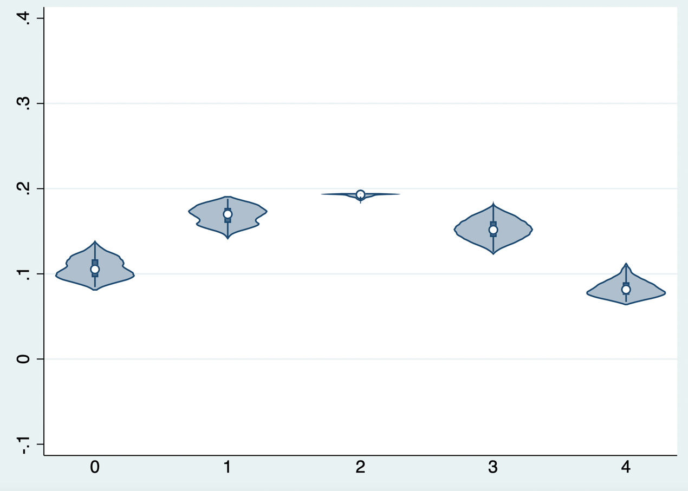
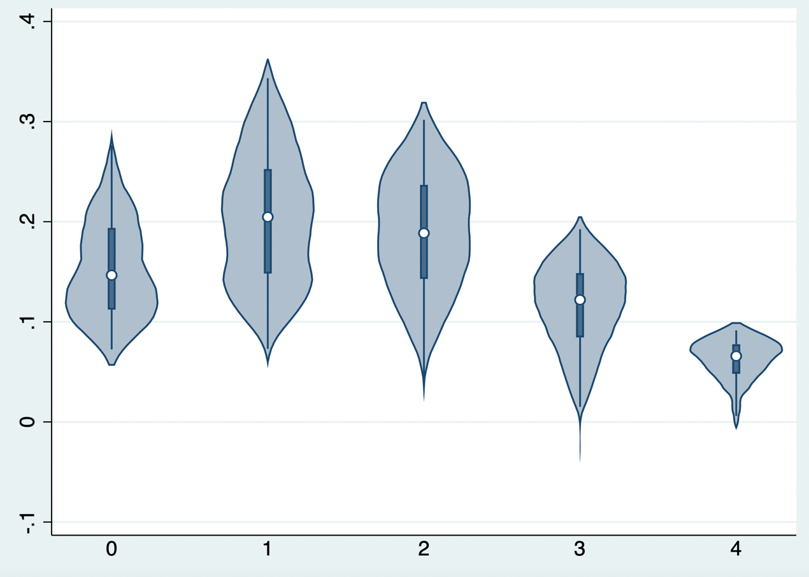
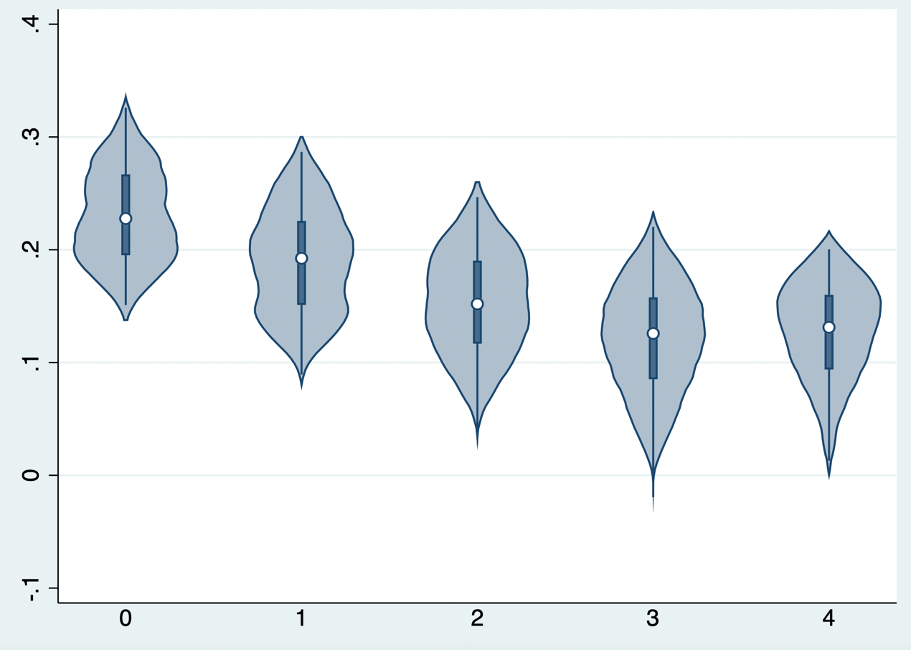
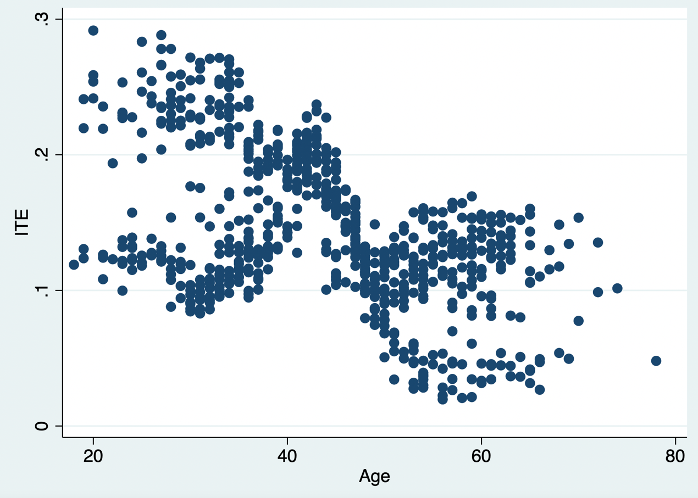

# 异质性与个体因果效应

异质性治疗效应广泛存在，但要证明其存在并量化其规模十分困难。关键原因是：同一患者在同一时点不可能既接受治疗又不接受治疗，因此不能直接观察其两种潜在结局之差。例如，一名接受干预后存活的重症 COVID-19 患者，其未接受该干预时是存活还是死亡仍不可知。

随机对照研究通常提供接受治疗组与对照组之间的平均治疗效应。将这一平均效应直接用于某一患者，隐含了治疗效应在相关人群中近似同质的假设；这一假设常不成立。异质性治疗效应（heterogeneous treatment effect，HTE）通常指随基线特征而变化的条件平均治疗效应（conditional average treatment effect，CATE）。应特别注意：模型可以估计给定协变量条件下的平均效应，但单个患者的真实个体治疗效应（individual treatment effect，ITE）仍不能被直接观察或逐例验证。

## 亚组分析

探讨治疗效果是否因人而异的传统做法，是分别估计不同患者亚组的治疗效应，例如按性别、年龄或疾病严重程度分层。亚组内的平均效应有时比总体平均效应更贴近临床决策，但亚组分析只能描述预先定义人群中的平均治疗效应，并不等同于识别某一具体患者的真实获益。亚组结果常以森林图呈现；理解其统计学局限性是正确解读异质性治疗效应的基础。

评估异质性治疗效应应检验治疗与基线变量的交互作用（参见本书第九章），并在预先说明的效应尺度上报告各亚组效应及其置信区间。不能仅因“一个亚组的 P 值显著、另一个亚组不显著”便声称存在亚组差异；真正需要比较的是交互作用。多数试验的样本量和统计效能是为总体平均效应设计的，检验交互作用通常效能较低，且亚组不平衡会进一步加剧不确定性。若在多个变量、多个切点和多个结局中反复探索，偶然发现的风险很高。因此，亚组分析应尽量预先设定、具有临床或生物学依据，并对多重比较和估计精度保持谨慎。

个体化医疗的重要前提是：治疗效应的差异可能具有系统性，而非纯属随机波动。传统亚组分析一次只考察一个变量，但患者往往在多种预后因素上同时不同；仅做单变量分层可能遗漏具有临床意义的效应模式。将多个预后因素整合为风险评分，或在严格验证条件下使用治疗效应模型，可作为补充性的探索工具，但不能以复杂模型取代预先定义和可重复验证。

如本书第三章所述，亚组分析应事先充分定义，以临床推理或既往证据为基础，采用交互作用检验，并完整报告估计值和不确定性。除统计学问题外，还应关注研究结论的可推广性：即使某个亚组在试验中显示出差异，其定义、治疗可及性和基线风险在目标临床人群中是否相似，仍需单独判断。

## 风险建模

异质性治疗效应的风险建模旨在克服单变量、逐次亚组分析的局限。其核心是先基于多个基线变量刻画患者的预后风险，再考察不同风险水平患者的绝对获益与危害，从而帮助回答在两种或多种治疗方案中哪一种对某类患者更合适。

风险建模是利用多变量预后模型对试验患者进行风险分层，再估计各风险层内的治疗效应。模型可以是外部已验证的风险评分，也可以在研究数据中开发。许多临床结局的预测风险分布并不均匀：多数患者风险较低，少数患者风险很高。因此，即使相对治疗效应近似恒定，绝对风险降低也可能在高风险患者中更大；当治疗同时带来危害或负担时，风险分层尤其有助于权衡净获益。

对于二分类结局，风险分层常比逐一检验大量“治疗×协变量”交互项更稳定。即使预后模型的判别能力只是中等，只要其校准合理，也可能揭示绝对获益随基线风险变化的模式。不过，这一发现仍应报告为风险层内的平均效应，并在独立数据中检验其可重复性。

风险模型可在临床研究数据中内部开发，但构建预后模型时原则上不应使用治疗分配信息，而应仅利用治疗前可获得的基线变量预测结局。随机试验中，随后在风险层内比较各治疗组可得到有效的治疗效应估计。应通过重抽样、交叉验证或样本分割减少过度拟合，并报告模型的校准与风险分布；若要用于临床实践，还需在不同时间、中心或人群中进行外部验证。

## 治疗效果建模（增益建模）

治疗效果建模（亦常称增益建模）直接利用试验数据预测两种治疗条件下的结局风险，并以其差值作为给定协变量下的预测治疗效应。例如，可分别预测患者在接受与不接受某治疗时的结局风险，再计算两者之差。该差值是模型估计的 CATE 或预测获益，而不是可以在该患者身上被直接观察到的真实 ITE。

传统回归模型可依据先验临床知识纳入治疗变量、基线变量及治疗×基线变量交互项，以估计治疗效应随协变量变化的模式。交互项不应仅凭单次显著性检验机械地全部保留或删除；大量交互项极易过度拟合并造成治疗错误分配。可采用惩罚回归、样本分割或交叉拟合，并在独立数据中检验校准、区分度和临床决策价值。

以内窥镜与显微镜治疗生长激素型垂体腺瘤为例，若在理想的反事实框架下每位患者都能接受两种治疗并观察结局，则可将患者概念性地分为四类：仅内窥镜能缓解、两种治疗均能缓解、两种治疗均不能缓解，以及仅显微镜能缓解。现实中每位患者只能观察到其中一种治疗下的结局，图示用于说明估计目标，而非可直接观察到的患者分类。

:::: {.content-visible when-format="html"}
::: text-center
{width="3.18in"}

图19.1 治疗效应建模的目标人群
:::
::::

因此，某种干预未必对所有患者具有相同的临床价值。前面章节主要评估总体平均因果效应，即内窥镜相较显微镜在研究人群中的平均效果。若内窥镜资源有限，临床上更关心的是：在可比较且符合治疗条件的患者中，哪些特征所定义的人群可能具有更大的预期绝对获益，哪些患者使用显微镜可能已足够。此时的分析目标是比较治疗 A 与治疗 B 在给定基线特征条件下的预测结局差异（增益），并同时考虑可及性、手术风险和患者偏好。

异质性治疗效应通常以条件平均因果效应表示，即在具有相同或相似测量协变量的人群中比较不同治疗的平均结果。不能把单个患者简单视为一个可验证的“亚组”：患者层面的两种潜在结局不能同时观察。近年来的机器学习方法能够更灵活地寻找预测变量和交互模式，但其输出仍是基于已测量协变量的模型化 CATE；其可信度取决于随机化或无混杂、可交换性、阳性性、模型稳定性和外部验证。

## 以回归算法为基础的增益建模

### S-learner

S-learner 较为简单：用治疗变量和基线变量共同拟合一个结局预测模型。对同一患者分别将治疗变量设为接受治疗和未接受治疗，即可得到两种模型预测结局；两者之差构成该患者协变量条件下的预测治疗效应。模型输出应称为预测 CATE 或预测增益，而不宜表述为已经观察到的个体因果效应。

**公式19.1**

$$Y=f(X,U)$$

$$ITE=\widehat{Y}^{x=1}-\widehat{Y}^{x=0}=f\left(Y^{x=1},U\right)-f\left(Y^{x=0},U\right)$$

::: {.callout-note appearance="simple" collapse="false" icon="false"}
### 代码19.1

``` stata
. gen Treatment = (t == "Endoscopy")
. gen Outcome = 1 if y == "Yes"
. replace Outcome = 0 if y == "No"
. lasso logit Outcome Treatment age k
. replace Treatment = 1
. predict Outcome_x1, pr penalized
. replace Treatment = 0
. predict Outcome_x0, pr penalized
. gen ITE = Outcome_x1 - Outcome_x0
. summarize ITE
```
:::

::: {.callout-note appearance="simple" icon="false" title="代码19.1输出"}
| Variable | Obs |     Mean | Std. dev. |       Min |     Max |
|:---------|----:|---------:|----------:|----------:|--------:|
| ITE      | 899 | .1535538 |  .0351515 | 0.0670325 | .194139 |
:::

模型预测的治疗效应从 0.07 至 0.19，均值为 0.15，计算尺度为风险差（risk difference）。这些数值反映模型在本示例数据中的预测增益，是否符合临床经验仍需结合机制、估计不确定性和验证数据判断。临床上，内窥镜相对显微镜的潜在优势可能来自更好的术中照明和假包膜切除；对侵袭性很强的肿瘤，即使使用内窥镜也未必能够完全切除，预期增益可能有限；对很小的肿瘤，显微镜本身疗效已较好，绝对增益也可能较小。因而，中等侵袭程度患者是否具有较大获益，应作为可检验的假设而非既定结论（参见第九章第4节边际效应）。

可进一步查看不同肿瘤侵袭性条件下的预测治疗效应分布（以小提琴图展示）。图中 K=4 代表侵袭性较大的情况，预测增益较低；K=0 代表较小肿瘤，预测增益亦有限；K=1～3 的预测增益较高。该模式仅为模型在当前数据中的描述，需结合置信区间、重抽样稳定性及独立验证后，方可用于治疗分配建议。

::: {.callout-note appearance="simple" collapse="false" icon="false"}
### 代码19.2

``` stata
. vioplot ITE, over(k) ylabel(-0.1(0.1)0.4)
```
:::

:::: {.callout-note appearance="simple" icon="false" title="代码19.2输出：S-Learner个体治疗效应随侵袭性分布"}
::: text-center
{width="5.77in"}

（横轴为侵袭性、纵轴为个体治疗效应）
:::
::::

### T-learner

T-learner 与 S-learner 不同：它分别在治疗组和对照组建立结局预测模型，再将两个模型应用于同一目标人群，分别预测两种治疗条件下的结局，二者之差即为预测治疗效应。该方法在两组结局函数明显不同且每组样本充足时较灵活，但仍需避免将模型预测误认为逐例可观察的个体效应。

**公式19.2**

$$Y_1=f^{X=1}(U)$$

$$Y_0=f^{X=0}(U)$$

$$ITE=\widehat{Y}^{X=1}-\widehat{Y}^{X=0}=f^{X=1}(U)-f^{X=0}(U)$$

::: {.callout-note appearance="simple" collapse="false" icon="false"}
### 代码19.3

``` stata
. lasso logit Outcome age k if Treatment == 1
. predict Outcome_x1, pr penalized
. lasso logit Outcome age k if Treatment == 0
. predict Outcome_x0, pr penalized
. gen ITE = Outcome_x1 - Outcome_x0
. summarize ITE
```
:::

::: {.callout-note appearance="simple" icon="false" title="代码19.3输出"}
| Variable | Obs |     Mean | Std. dev. |       Min |      Max |
|:---------|----:|---------:|----------:|----------:|---------:|
| ITE      | 899 | .1566132 |  .0695787 | -.0283419 | .3432962 |
:::

T-learner 的局限是双模型误差会累积；当治疗组与对照组样本量不平衡或其中一组预测困难时，估计可能不稳定。本示例中预测治疗效应从 -0.03 至 0.34，均值为 0.16。使用相同的作图代码绘制预测效应随肿瘤侵袭性的分布，可见 K=4 时预测增益较小，K=1～3 时较高；这一现象应在留出样本或外部数据中复核。

:::: {.callout-note appearance="simple" icon="false" title="代码19.4输出：T-learner 预测治疗效应随侵袭性分布"}
::: text-center
{width="5.77in"}

（横轴为侵袭性、纵轴为个体治疗效应）
:::
::::

### X-learner

X-learner 与 T-learner 一样先分别拟合两组的结局模型，但随后进行交叉预测：用治疗组模型预测对照组、用对照组模型预测治疗组，构造伪效应后再进行建模，并结合倾向评分加权。其目标仍是估计协变量条件下的平均治疗效应；在观察性数据中还必须谨慎建模倾向评分并检查重叠性。

**公式19.3**

$$Y_1=f^{X=1}(U)$$

$$Y_0=f^{X=0}(U)$$

$$D_1=Y_1-\widehat{Y}_0=Y^{X=1}-f^{X=0}(U)$$

$$D_0=\widehat{Y}_1-Y_0=f^{X=1}(U)-Y^{X=0}$$

$$D_1=f^{x=1}(U)$$

$$D_0=f^{x=0}(U)$$

$$ITE=PS*d_0+(1-PS)*d_1$$

::: {.callout-note appearance="simple" collapse="false" icon="false"}
### 代码19.5

``` stata
. lasso logit Outcome age k if Treatment == 1
. predict Outcome_x1, pr penalized
. lasso logit Outcome age k if Treatment == 0
. predict Outcome_x0, pr penalized
. gen D1 = Outcome - Outcome_x0 if Treatment == 1
. gen D0 = Outcome_x1 - Outcome if Treatment == 0
. reg D1 age k
. predict D1_hat
. reg D0 age k
. predict D0_hat
. logit Treatment age k
. predict _pscore, pr
. gen ITE = _pscore*D0_hat + (1-_pscore)*D1_hat
. summarize ITE
```
:::

::: {.callout-note appearance="simple" icon="false" title="代码19.5输出"}
| Variable | Obs |     Mean | Std. dev. |       Min |      Max |
|:---------|----:|---------:|----------:|----------:|---------:|
| ITE      | 899 | .1629466 |  .0599442 | -.0194199 | .3257553 |
:::

X-learner 在两组样本量不平衡时可能较有优势，但其估计过程涉及多个模型，误差亦可能累积。本示例中预测治疗效应从 -0.02 至 0.33，均值为 0.16；按侵袭性分层的图形提示 K=4 时内窥镜预测增益较小。对于小肿瘤的增益模式，不同算法可能给出不同结论，这正说明需要以验证集的校准和临床效用，而非单一图形来选择模型。

:::: {.callout-note appearance="simple" icon="false" title="代码19.6输出：X-learner 预测治疗效应随侵袭性分布"}
::: text-center
{width="5.77in"}

（横轴为侵袭性、纵轴为个体治疗效应）
:::
::::

## 以决策树算法为基础的增益建模

我们可以采用第18章介绍的因果树与因果森林算法估计给定协变量条件下的治疗效应。因果森林通过大量“诚实”因果树聚合，可同时给出 CATE 估计及其不确定性；其结果仍应解释为具有相似协变量患者的平均预测增益，而非单个患者已知的反事实差异。

::: {.callout-note appearance="simple" collapse="false" icon="false"}
### 代码19.7

``` r
library(grf)
data <- read.csv("a_impute_CF.csv")
Y <- ifelse(data$Y == "Yes",1,0)
W <- ifelse(data$T == "Endoscopy",1,0)
X <- data.frame(data$K, data$Age, data$Duration, data$IGF_base,
                data$GH_base, data$Tumor_base)
forest.Y <- regression_forest(X, Y)
Y.hat <- predict(forest.Y)$predictions
forest.W <- regression_forest(X, W)
W.hat <- predict(forest.W)$predictions
c.forest <- causal_forest(X, Y, W, Y.hat, W.hat)
tau.hat <- predict(c.forest)$predictions
mu.hat.0 <- Y.hat - W.hat * tau.hat
mu.hat.1 <- Y.hat + (1 - W.hat) * tau.hat
ITE = mu.hat.1 - mu.hat.0。
summary(ITE)
```
:::

::: {.callout-note appearance="simple" icon="false" title="代码19.7输出"}
|    Min. | 1st Qu. |  Median |    Mean | 3rd Qu. |    Max. |
|--------:|--------:|--------:|--------:|--------:|--------:|
| 0.01964 | 0.11074 | 0.13454 | 0.14557 | 0.18774 | 0.29163 |
:::

此处预测治疗效应从 0.02 至 0.29，均值为 0.15。与 X-learner 相比，因果森林可能给出不同的区间宽度；区间变窄不必然代表估计更可靠，还需检查样本重叠、诚实估计设置和验证表现。按肿瘤侵袭性分层，K=4 的预测增益较小，K=1～2 的预测增益较高。年龄与预测增益的关系也可作为探索结果呈现（参见第九章边际效应），但不应据此直接作出未经验证的个体化推荐。

::: {.callout-note appearance="simple" collapse="false" icon="false"}
### 代码19.8

``` stata
. vioplot ite, over(k) ylabel(-0.1(0.1)0.4)
. twoway (scatter ite age)
```
:::

:::: {.callout-note appearance="simple" icon="false" title="代码19.8输出：因果森林的预测治疗效应随侵袭性分布"}
::: text-center
{width="5.77in"}

（横轴为侵袭性、纵轴为个体治疗效应）
:::
::::

:::: {.callout-note appearance="simple" icon="false" title="代码19.9输出：因果森林的预测治疗效应随年龄分布"}
::: text-center
{width="5.77in"}

（横轴为年龄、纵轴为个体治疗效应）
:::
::::

## 增益模型的评估与临床决策价值

与标准预后预测模型不同，增益模型没有可逐例观测的“真实治疗效应”标签：每位患者只观察到其实际接受治疗下的一个结局。因此，不能以预测概率模型的常规方法直接验证 ITE。评价应在独立的随机试验数据，或满足无混杂等因果识别条件的观察性数据中进行，并明确评估的是给定协变量下的预测 CATE。

第一类评估关注临床决策价值。假设内窥镜资源有限，只能为一定数量的患者提供治疗；可将基于预测增益选择患者的策略，与治疗全部患者、治疗无人、随机分配或其他临床规则进行比较。比较必须在开发模型之外的留出集、交叉验证框架或外部队列中完成，且应估计各策略下的结局、治疗危害、资源消耗和不确定性。仅在建模数据内按预测增益排序后再计算累计“增益”，会产生乐观偏倚，不能证明模型可改善实际结局。

::: {.callout-note appearance="simple" collapse="false" icon="false"}
### 代码19.10

``` stata
. gsort -ITE
. gen cum_ITE = sum(ITE)
. list cum_ITE in 50
. gen order_random = runiform()
. gsort order_random
. gen cum_ITE_random = sum(ITE)
. list cum_ITE_random in 50
```
:::

下表列出给予 50、100 和 200 名患者治疗时的示例性累计增益。随机策略下不同模型的结果接近总体平均治疗效应乘以治疗人数；按模型排序的策略在本数据中显示出更高的表观增益。但这些数值来自演示性数据，若排序与结局在同一数据中形成，只能作为开发阶段的表观性能，不能据此认定 T-learner 优于其他模型或已经具备临床应用价值。应在独立验证数据中同时报告策略效应及其置信区间。

::: {.callout-note appearance="simple" icon="false" title="代码19.10输出"}
| 增益模型策略 | S-learner | T-learner | X-learner | Causal forest |
|:-------------|----------:|----------:|----------:|--------------:|
| 50例         |      9.74 |     15.09 |     14.07 |         12.81 |
| 100例        |     19.45 |     28.25 |     26.55 |         24.15 |
| 200例        |     38.58 |     51.88 |     48.77 |         44.05 |
| 随机策略     |           |           |           |               |
| 50例         |      7.56 |      7.37 |      8.20 |          7.40 |
| 100例        |     15.53 |     16.34 |     16.14 |         15.20 |
| 200例        |     31.04 |     32.51 |     32.53 |         29.49 |
:::

第二类评估考察预测获益的校准和区分度。校准可按预测增益分组，在每一组内比较随机治疗组与对照组的观察结局差异，并绘制预测获益与观察平均获益的关系。区分度可采用 c-for-benefit：在治疗分配不同、但基线特征相近的患者对中构造观察获益，再检验模型是否能把观察获益较大的患者对赋予更高预测获益。此指标依赖匹配方式和结局定义，且配对观察获益本身存在随机误差；因此应报告匹配规则、置信区间和敏感性分析。c-for-benefit 反映排序能力，不能单独证明模型具有临床净获益。

除校准与区分度外，还应评估临床应用后的净获益。可在预先设定的资源阈值下，比较“按模型优先治疗”“全部治疗”“均不治疗”等策略的预期结局，并将并发症、费用、可及性和患者偏好纳入决策权衡。若模型拟用于真实临床流程，最好进一步开展时间外、地域外验证，并在条件允许时进行前瞻性影响研究。

异质性分析还应检查公平性与可推广性：在不同年龄、性别、疾病严重程度和医疗中心中，治疗重叠性是否充分，预测获益是否校准，模型驱动的分配是否可能扩大不公平。缺乏重叠或验证不足时，模型应限制在数据支持的患者范围内使用，而不应对所有符合入组标准者作外推。

## 参考文献 {.unnumbered}

1.  Kent DM, Steyerberg EW, van Klaveren D. Personalized evidence based medicine: predictive approaches to heterogeneous treatment effects. *BMJ*. 2018;363:k4245. doi:10.1136/bmj.k4245. PMID:30530757.

2.  Rekkas A, Paulus JK, Raman G, et al. Predictive approaches to heterogeneous treatment effects: a scoping review. *BMC Med Res Methodol*. 2020;20:264. doi:10.1186/s12874-020-01145-1. PMID:33096986.

3.  Wager S, Athey S. Estimation and inference of heterogeneous treatment effects using random forests. *J Am Stat Assoc*. 2018;113(523):1228-1242. doi:10.1080/01621459.2017.1319839.

4.  Kent DM, Paulus JK, van Klaveren D, et al. The Predictive Approaches to Treatment effect Heterogeneity (PATH) Statement. *Ann Intern Med*. 2020;172(1):35-45. doi:10.7326/M18-3667. PMID:31711134.

5.  Künzel SR, Sekhon JS, Bickel PJ, Yu B. Metalearners for estimating heterogeneous treatment effects using machine learning. *Proc Natl Acad Sci U S A*. 2019;116(10):4156-4165. doi:10.1073/pnas.1804597116. PMID:30770453.

6.  van Klaveren D, Steyerberg EW, Serruys PW, Kent DM. The proposed concordance-statistic for benefit provided a useful metric when modeling heterogeneous treatment effects. *J Clin Epidemiol*. 2018;100:132-141. doi:10.1016/j.jclinepi.2017.10.021. PMID:29132832.

7.  van Klaveren D, Balan TA, Steyerberg EW, Kent DM. Models with interactions overestimated heterogeneity of treatment effects and were prone to treatment mistargeting. *J Clin Epidemiol*. 2019;114:72-83. PMID:31195109.
