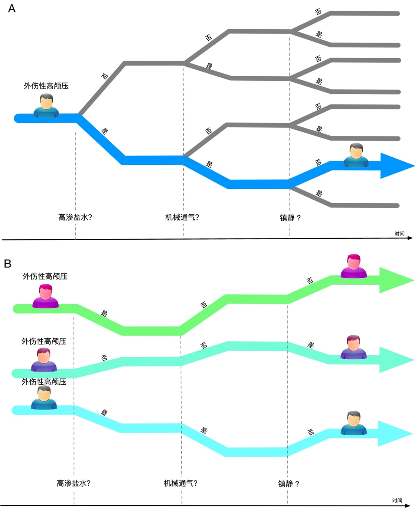
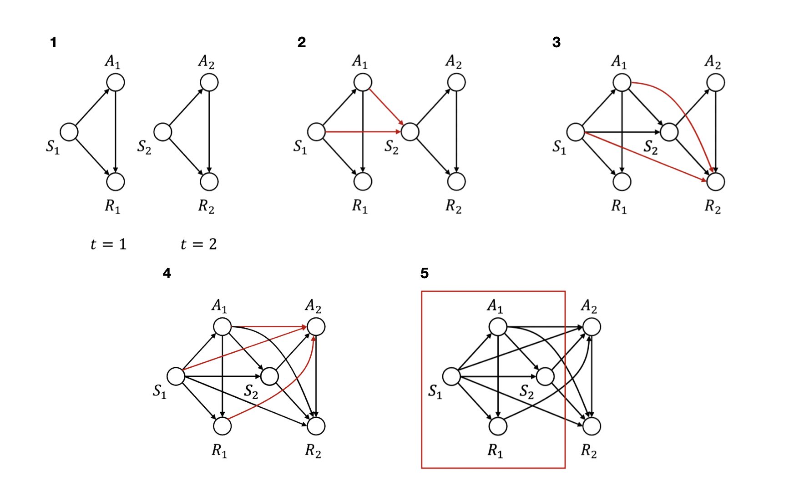
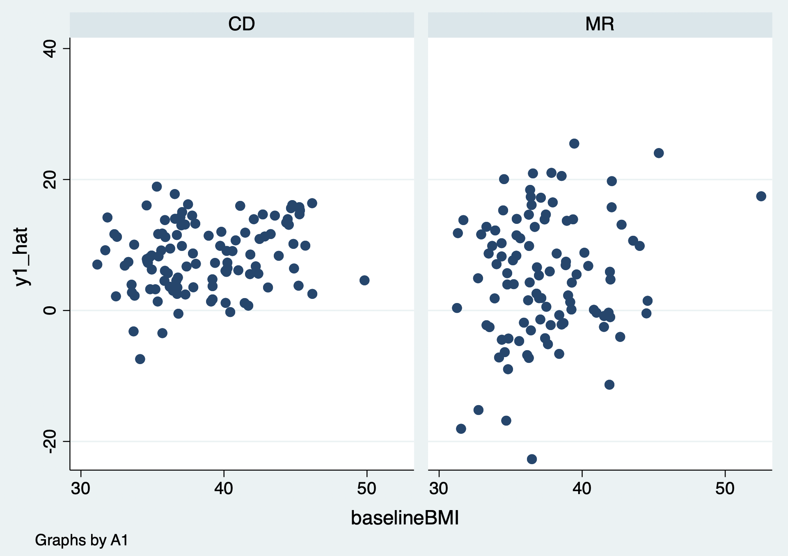

# 序贯决策方案

序贯决策（动态治疗方案，dynamic treatment regime，DTR）是由一系列按时间顺序执行的决策规则组成的策略：每一阶段的治疗选择依赖于该时点及既往可获得的患者信息，同时又可能改变后续状态、治疗选择和最终结局。临床问题的目标不是在每个时点孤立地选择“当下最好”的治疗，而是在预先定义的患者重要结局、治疗负担和安全约束下，使整个治疗轨迹的预期净获益最大。DTR 可作为临床决策支持的一种形式，但必须以清晰的临床问题、可识别的因果效应和可验证的策略表现为基础，而非仅由既往医疗经验或算法预测性能决定。

例如，外伤性颅脑损伤患者出现颅内压增高时，临床可考虑高渗盐水、机械通气或镇静等措施。医生会依据患者在不同阶段的神经状态、生命体征、既往治疗和不良反应决定下一步方案；早期选择还可能影响之后的状态与可选治疗。因此，序贯治疗策略应明确每个决策时点、可用信息、候选治疗、升级/停药规则及兼顾短期稳定与长期预后的结局。

::: text-center
{width="3.45in"}

图20.1 外伤性颅脑损伤患者的序贯治疗策略
:::

在计算机科学中，强化学习（reinforcement learning，RL）研究如何通过与环境交互学习连续决策策略。智能体依据状态选择行动、获得奖励并据此更新策略，目标是优化预先定义的累计回报。临床 DTR 与强化学习在“多阶段、依赖历史信息的决策”上相通，但二者并不等同：临床研究还必须处理治疗分配的因果识别、时间变化混杂、缺失与删失、可行性及患者安全。

## 强化学习的基本概念

强化学习可借助“状态—行动—奖励—策略”的框架描述连续决策，但临床应用不应把患者简单视为可反复试错的环境。其目标不是仅预测下一步会发生什么，而是在明确的因果假设和临床约束下，比较不同治疗策略下的预期结局。应用于临床医学时，通常至少需要明确以下要素：

患者在时间 t 的状态或可用历史：H_t（可包括 S_t 及既往治疗、反应和测量信息）

患者在时间 t 接受的治疗或行动：A_t

治疗后的即时反馈或奖励：R_t

动态治疗策略：π，即由 H_t 映射到行动 A_t 的规则

::: text-center
{width="3.72045in" height="2.88911in"}

图20.2 强化学习基本概念
:::

S_t 可理解为某一时点的患者指标集合，如生命体征、实验室检查和症状；H_t 则更完整地包含截至该时点的可用历史。A_t 是该时点实际接受的一种或多种治疗；R_t 是治疗后的即时反应或预先规定的奖励。策略 π 是根据 H_t 推荐 A_t 的规则。临床策略的“奖励”应由患者重要结局、治疗伤害和资源负担共同定义，而不能只由易获得的代理指标决定。

强化学习根据数据来源可以分为以下两类：

1.  在线学习（On-Policy）

在线学习指策略在部署过程中依据新获得的数据不断更新。直接在患者身上探索治疗的风险和伦理约束很高，通常只可能在严格方案、监测规则和伦理审查下实施。适应性临床试验或反应适应性随机化可以借鉴其思想，但其设计、随机化概率更新和推断方法必须预先规定，不能简单理解为“根据前一位患者的结局决定下一位患者的治疗”。

2.  离线学习（Off-Policy）

离线学习（off-policy learning）利用既往随机试验或观察性数据学习策略，而不在学习阶段改变患者治疗。它更贴近多数临床数据库研究，但只能在数据支持的状态—治疗组合内可靠学习；若历史治疗选择受未测量因素影响，或某些治疗几乎从未给予特定患者，离线算法的价值估计和推荐可能产生严重偏倚。

根据训练的方法又可以将强化学习分为以下几类：

1.  基于策略的强化学习（Policy based）

基于策略的方法直接参数化或搜索决策规则，并输出不同干预的选择概率或确定性推荐；其效果取决于策略空间、约束和价值评估是否合理。

2.  基于值的强化学习（Value based）

基于价值的方法估计状态—行动价值函数，再选择预期累计回报最高的行动；Q-learning 属于这一类。价值函数的高低不是观察到的因果效应本身，而是在模型、数据和识别假设下对策略价值的估计。

3.  无模型的强化学习

无模型方法不显式建立状态转移和奖励生成机制，而是直接从经验轨迹估计价值或策略；这并不免除对数据质量、重叠性和因果识别的要求。

4.  有模型的强化学习

有模型方法显式估计状态转移与奖励机制，并在模型中模拟不同干预路径以比较策略。模型错设、未测量变量和分布漂移会使模拟结果偏离真实临床后果，因此应进行模型诊断、敏感性分析和外部验证。

## 统计学强化学习

统计学中的动态治疗方案方法将单阶段治疗比较扩展到多阶段决策。顺序多重分配随机试验（sequential multiple assignment randomized trial，SMART）在预先规定的关键节点对符合条件的患者再次随机分配，可高效比较嵌入式 DTR。Q-learning、A-learning、边际结构模型、g 公式和结构嵌套模型等方法可用于随机或观察性纵向数据；在观察性数据中，结论还依赖序贯可交换性、正值性、一致性及正确处理删失等假设。

Q 函数可理解为在给定历史 H_t 下采取行动 A_t，并在之后遵循某一策略时的预期累计临床回报。在单阶段研究中，它可退化为给定协变量下不同治疗的预期结局；在多阶段研究中，Q 值必须纳入后续最优或规定策略下的回报，因而不能把它简单等同于某一次治疗的孤立因果效应。

**公式20.1**

$$Q^{opt}(H,A) = E\lbrack Y|H,A\rbrack$$

多阶段干预的目标是在预先定义的时间范围内选择使策略价值最大的治疗序列。对每个阶段，比较的不是该阶段即时 Q 值，而是该阶段行动及后续行动共同决定的累计回报；这也是通常采用从最后阶段向前递推（backward induction）的原因。

在两阶段随机或观察性研究中（图20.3），可记第一阶段的基线/历史、治疗与阶段性反应为 H_1、A_1、R_1，第二阶段的历史、治疗与结局为 H_2、A_2、Y。H_2 应包括截至第二次决策前可获得的基线状态、第一阶段治疗和中间反应/测量。随机试验中，各阶段随机化使相应治疗在已知历史条件下可比较；观察性研究中，若 A_2 同时受既往治疗、病情变化和医生判断影响，则这些共同原因必须被充分测量并纳入序贯混杂控制。

两阶段的序贯决策规则记为 d_1、d_2。最后阶段的规则选择使给定 H_2 时预期结局最优的 A_2；第一阶段规则则选择使第一阶段后、并在其后遵循 d_2 时的预期累计回报最优的 A_1。据此可定义两阶段的 Q 方程：

**公式20.2**

$$Q_{2}^{opt}\left( H_{2},A_{2} \right) = E\lbrack Y_{2}|H_{2},A_{2}\rbrack$$

$$Q_{1}^{opt}\left( H_{1},A_{1} \right) = E\lbrack Y_{1} + \max_{A_{2}}Q_{2}^{opt}(H_{2},A_{2})|H_{1},A_{1}\rbrack$$

若两个 Q 方程已知或被可靠估计，可在每个可观测历史下选择 Q 值最大的行动，组成候选最优治疗策略。应同时报告策略的适用范围、估计不确定性和对未测量混杂/模型设定的敏感性。

**公式20.3**

$$d_{1}^{opt} = arg\max_{A_{1}}{Q_{1}^{opt}(H_{1},A_{1})}$$

$$d_{2}^{opt} = arg\max_{A_{2}}{Q_{2}^{opt}(H_{2},A_{2})}$$

::: text-center
{width="5.76806in" height="3.2849in"}

图20.3 多阶段干预的混杂
:::

### 案例20.1

这是一个序贯多重分配随机试验，基线状况记录受试者的性别（gender）、种族（race）、体重指数（baselineBMI）以及父母体重指数（parentBMI）。该实验分两个阶段，第一阶段首先将患者随机分配到为干预组（A1表示，替餐组，MR）和对照组（A2表示，常规饮食组，CD），四个月后记录受试者的体重指数（month4BMI）；第二阶段重新进行随机分配，十二个月后记录受试者的体重指数（month12BMI）。

### 案例20.1数据表

| gender | race | parentBMI  | baselineBMI | month4BMI  | month12BMI | A1  | A2  |
|:-------|:-----|:-----------|:------------|:-----------|:-----------|:----|:----|
| 0      | 1    | 31.5968318 | 35.8400506  | 34.2271673 | 34.2726268 | CD  | MR  |
| 1      | 0    | 30.1756357 | 37.3039587  | 36.3801392 | 36.3840057 | CD  | MR  |
| 1      | 0    | 30.2791806 | 36.8388927  | 34.4216825 | 34.4144739 | MR  | CD  |
| 1      | 0    | 27.492564  | 36.7067889  | 32.5201128 | 32.5239747 | CD  | CD  |
| 1      | 1    | 26.4235031 | 34.8420685  | 33.7292175 | 33.735464  | CD  | CD  |
| …      | …    | …          | …           | …          | …          | …   | …   |

临床问题是第一阶段和第二阶段采用何种干预措施才能使体重指数得到明显下降。统计学强化学习采用两步回归方法，首先将第二阶段结局（12个月体重指数与4个月体重指数变化幅度，正值代表减重、负值代表增重）对第二阶段决策以及第二阶段患者的治疗历史回归。

**公式20.4**

$$Y_{2} = \varepsilon_{0} + \beta_{21}*A_{1} + \beta_{22}*A_{1}*S_{1} + \beta_{23}*A_{2} + \beta_{24}*A_{2}*S_{2} + \beta_{25}*S_{1} + \beta_{26}*S_{2}$$

纳入第一阶段随机分配与基线和第二阶段随机分配治疗与第二次分配前基线的交互项。回归模型建立后代入第二阶段治疗的值计算第二阶段的最大Q值，并加上第一阶段随机分配后的结局以计算第一阶段随机分配后的假结局：

**公式20.5**

$${\widehat{Y}}_{1} = Y_{1} + \widehat{Y_{2}} = Y_{1} +$$

$$\max_{{Treatment}_{2}}\begin{array}{r}
\left( \varepsilon_{0} + \beta_{21}*A_{1} + \beta_{22}*A_{1}*S_{1} + \beta_{23}*A_{2} + \beta_{24}*A_{2}*S_{2} + \beta_{25}*S_{1} + \beta_{26}*S_{2} \right)
\end{array}$$

用第一的假结局对第一次治疗历史做回归：

**公式20.6**

$${\widehat{Y}}_{1} = \varepsilon_{0} + \beta_{11}*A_{1} + \beta_{12}*A_{1}*S_{1} + \beta_{13}*S_{1}$$

最后得出第一次和第二次治疗的最优策略：

**公式20.7**

$$d_{2}^{opt} = \underset{{Treatment}_{2}}{argmax}\widehat{Y_{2}}$$

$$d_{1}^{opt} = \underset{{Treatment}_{1}}{argmax}\widehat{Y_{1}}$$

::: {.callout-note appearance="simple" collapse="false" icon="false"}
### 代码20.1

``` stata
. gen y12 = -100*(month12bmi - month4bmi)/month4bmi
. gen A1 = (a1 == "MR")
. gen A2 = (a2 == "MR")
. reg y12 A2 A1 A2#c.month4bmi A1#c.baselinebmi c.month4bmi c.baselinebmi
```
:::

::: {.callout-note appearance="simple" icon="false" title="代码20.1输出"}
+---------------+-----------------+--------------+---------------+---------------+------------------------+--------------+
| Source        | SS              | df           | MS            | Number of obs | =                      | **210**      |
+==============:+:===============:+:============:+:=============:+===============+:======================:+:============:+
| Model         | **12.3427503**  | **6**        | **2.057125**  | F(3, 32)      | =                      | **90.80**    |
+---------------+-----------------+--------------+---------------+---------------+------------------------+--------------+
| Residual      | **.4.60417904** | **203**      | **.02268068** | Prob \> F     | =                      | **0.0000**   |
+---------------+-----------------+--------------+---------------+---------------+------------------------+--------------+
| Total         | **16.9469294**  | **209**      | **.08108578** | R-squared     | =                      | **0.7283**   |
+---------------+-----------------+--------------+---------------+---------------+------------------------+--------------+
|               |                 |              |               | Adj R-squared | =                      | **0.7203**   |
+---------------+-----------------+--------------+---------------+---------------+------------------------+--------------+
|               |                 |              |               | Root MSE      | =                      | **.1506**    |
+---------------+-----------------+--------------+---------------+---------------+------------------------+--------------+
| rate          | Coefficient     | Std. err.    | t             | P\>\|t\|      | \[95% conf. interval\] |              |
+---------------+-----------------+--------------+---------------+---------------+------------------------+--------------+
| A2            | **-4.201988**   | **.1825362** | **-23.02**    | **0.000**     | **-4.56189**           | **-3.84207** |
+---------------+-----------------+--------------+---------------+---------------+------------------------+--------------+
| A1            | **-.1950291**   | **.2126561** | **-0.92**     | **0.360**     | **-.6143272**          | **.224269**  |
+---------------+-----------------+--------------+---------------+---------------+------------------------+--------------+
| A2#           | **.1176601**    | **.0051116** | **23.02**     | **0.000**     | **.1075816**           | **.1277387** |
|               |                 |              |               |               |                        |              |
| c.month4bmi   |                 |              |               |               |                        |              |
+---------------+-----------------+--------------+---------------+---------------+------------------------+--------------+
| A1#           | **.0057149**    | **.0055766** | **1.02**      | **0.307**     | **-.0052807**          | **.0167104** |
|               |                 |              |               |               |                        |              |
| c.baselinebmi |                 |              |               |               |                        |              |
+---------------+-----------------+--------------+---------------+---------------+------------------------+--------------+
| month4bmi     | **-.0570188**   | **.0043428** | **-13.13**    | **0.000**     | **-.0655816**          | **-.048456** |
+---------------+-----------------+--------------+---------------+---------------+------------------------+--------------+
| baselinebmi   | **.0005309**    | **.0047231** | **0.11**      | **0.911**     | **-.0087816**          | **.0098434** |
+---------------+-----------------+--------------+---------------+---------------+------------------------+--------------+
| \_cons        | **1.963313**    | **.174191**  | **11.27**     | **0.000**     | **1.619858**           | **2.306769** |
+---------------+-----------------+--------------+---------------+---------------+------------------------+--------------+
:::

结果提示：在该回归模型和示例数据中，第二阶段替餐相对常规饮食与更大的体重指数下降相关（A2 系数为 -4.2，P\<0.001）；4 个月时体重指数与之后体重变化有关（month4BMI 系数为 -0.06，P\<0.001）。A2 与 month4BMI 的交互项系数为 0.12（P\<0.001），提示第二阶段治疗效应可能随 4 个月时体重指数而变化。这里的终点是 4 至 12 个月的体重指数变化，而不是“12周”的变化；具体临床解释还应与变量编码及结局方向一致。

可进一步观察两种第二阶段治疗下，4 个月时体重指数与随后体重变化的模型预测关系。图形提示在当前模型中，4 个月时体重指数约低于 35 的受试者在常规饮食下的预测变化较优，而高于 35 者在替餐下的预测变化较优。该阈值来自示例性模型，不应视为可直接推广的临床切点；应在独立数据中评估其稳定性和策略价值。

::: {.callout-note appearance="simple" collapse="false" icon="false"}
### 代码20.2

``` stata
. twoway (scatter y12 month4bmi), by(a2)
```
:::

:::: {.callout-note appearance="simple" icon="false" title="代码20.2输出：第二阶段干预措施与4周体重指数的交互"}
::: text-center
{width="5.76806in" height="4.10417in"}
:::
::::

第二步，将第二阶段回归模型分别代入替餐和常规饮食的取值，计算两种行动下的预测体重变化，并取较优值作为第二阶段的预测最优 Q 值；再与第一阶段至第二阶段的变化合并，构造第一阶段的伪结局。此递推过程要求结局方向、治疗编码与“较优”的定义保持一致。

::: {.callout-note appearance="simple" collapse="false" icon="false"}
### 代码20.3

``` stata
. replace A2=1
. predict y1_A2_1
. replace A2=0
. predict y1_A2_0
. gen y01 = -100*(month4bmi - baselinebmi)/baselinebmi
. gen y1_hat = y01 + max(y1_A2_1, y1_A2_0)
```
:::

最后，将第一阶段伪结局对第一阶段治疗、基线变量及预先规定的交互项进行回归，以估计第一阶段的候选决策规则。

::: {.callout-note appearance="simple" collapse="false" icon="false"}
### 代码20.4

``` stata
. reg y1_hat A1 A1#c.parentbmi A1#c.baselinebmi c.parentbmi c.baselinebmi
```
:::

::: {.callout-note appearance="simple" icon="false" title="代码20.4输出"}
+---------------+---------------+--------------+---------------+---------------+------------------------+--------------+
| Source        | SS            | df           | MS            | Number of obs | =                      | **210**      |
+==============:+:=============:+:============:+:=============:+===============+:======================:+:============:+
| Model         | **6623.3245** | **5**        | **1324.6649** | F(3, 32)      | =                      | **46.22**    |
+---------------+---------------+--------------+---------------+---------------+------------------------+--------------+
| Residual      | **5846.1556** | **204**      | **28.657625** | Prob \> F     | =                      | **0.0000**   |
+---------------+---------------+--------------+---------------+---------------+------------------------+--------------+
| Total         | **12469.480** | **209**      | **59.662584** | R-squared     | =                      | **0.5312**   |
+---------------+---------------+--------------+---------------+---------------+------------------------+--------------+
|               |               |              |               | Adj R-squared | =                      | **0.5197**   |
+---------------+---------------+--------------+---------------+---------------+------------------------+--------------+
|               |               |              |               | Root MSE      | =                      | **5.3333**   |
+---------------+---------------+--------------+---------------+---------------+------------------------+--------------+
| rate          | Coefficient   | Std. err.    | t             | P\>\|t\|      | \[95% conf. interval\] |              |
+---------------+---------------+--------------+---------------+---------------+------------------------+--------------+
| A1            | **9.741562**  | **7.707874** | **1.26**      | **0.208**     | **-5.455751**          | **24.93888** |
+---------------+---------------+--------------+---------------+---------------+------------------------+--------------+
| A1#           | **-1.241542** | **.1411901** | **-8.79**     | **0.000**     | **-1.519921**          | **-.963163** |
|               |               |              |               |               |                        |              |
| c.parentbmi   |               |              |               |               |                        |              |
+---------------+---------------+--------------+---------------+---------------+------------------------+--------------+
| A1#           | **.7835519**  | **.214443**  | **3.65**      | **0.000**     | **.3607431**           | **1.206361** |
|               |               |              |               |               |                        |              |
| c.baselinebmi |               |              |               |               |                        |              |
+---------------+---------------+--------------+---------------+---------------+------------------------+--------------+
| parentbmi     | **-.0758288** | **.1061661** | **-0.71**     | **0.476**     | **-.2851524**          | **.1334947** |
+---------------+---------------+--------------+---------------+---------------+------------------------+--------------+
| baselinebmi   | **.3243268**  | **.1440423** | **2.25**      | **0.025**     | **.0403241**           | **.6083294** |
+---------------+---------------+--------------+---------------+---------------+------------------------+--------------+
| \_cons        | **-1.801225** | **5.032545** | **-0.36**     | **0.721**     | **-11.7237**           | **8.121247** |
+---------------+---------------+--------------+---------------+---------------+------------------------+--------------+
:::

结果提示：在该模型中，第一阶段治疗的总体主效应没有统计学证据；但基线体重指数和父母体重指数与治疗的交互项具有统计学证据。交互项的发现应结合效应大小、区间估计、模型选择过程和独立验证解释，不能仅以 P 值决定个体化治疗。

可分别观察两种第一阶段治疗下，基线体重指数及父母体重指数与伪结局的模型预测关系。当前示例提示基线体重指数较高时替餐的预测效果较好，而父母体重指数较高时替餐的预测效果较差。该结论是本样本、该模型和该结局定义下的候选规则；在临床使用前需进行样本外验证并评估可操作性与潜在伤害。

::: {.callout-note appearance="simple" collapse="false" icon="false"}
### 代码20.5

``` stata
. twoway (scatter y1_hat baselinebmi), by(a1)
. twoway (scatter y1_hat parentbmi), by(a1)
```
:::

:::: {.callout-note appearance="simple" icon="false" title="代码20.5输出：基线体重指数以及父母体重指数与第一阶段干预的交互"}
::: text-center
{width="2.78731in" height="1.9685in"} {width="2.78731in" height="1.9685in"}
:::
::::

## 随时间变动的治疗和混杂

以上两步回归以顺序随机化的试验为背景，因此在正确执行随机化且处理失访后，各阶段治疗在既往历史条件下可比较。观察性纵向数据中，疾病状态和中间指标常同时影响后续治疗与结局，且这些指标又可能受到既往治疗影响，形成时间变化混杂；此时仅在常规回归、混合模型或广义估计方程中直接调整中间变量，通常不能估计所关心的动态策略总效应。

本书已介绍回归与倾向评分等控制混杂的方法；但当时间变化协变量既受既往治疗影响，又影响后续治疗和结局时，直接条件化可能产生两类问题：一是阻断既往治疗经该协变量作用于结局的路径，导致总效应估计改变；二是在不恰当的结构中条件化可引入选择偏倚。正确处理应先用因果图和时间顺序明确研究问题与估计目标，而不是机械地“把所有随访变量都调进去”。图号应为图20.3。

处理受既往治疗影响的时间变化混杂，需要详细的纵向治疗、协变量、结局和删失数据，并明确比较的静态或动态策略。逆概率加权边际结构模型、参数 g 公式与结构嵌套模型的 g 估计统称为 g 方法。它们在一致性、序贯可交换性、正值性和模型/估计器条件成立时，可用于估计“总是治疗/从不治疗”或“当 CD4 低于某阈值时开始治疗”等策略的反事实结局；这些假设不能仅由统计模型本身检验。

1.  逆概率加权

研究随时间变动的治疗时，比较对象通常是完整的治疗策略，而非孤立的一次治疗。例如，“基线 BMI 大于35 时给予替餐，4个月后 BMI 小于35 时改为常规饮食”是一种动态策略。若案例20.1来自观察性数据，则应先明确每个策略的决策时点、允许治疗、测量频率与结局；随后可用逆概率加权、g 公式或其他适当方法控制时间变化混杂。

**公式20.8**

$$W^{\overline{A}} = \ \frac{1}{Pr(A_{1}|S_{1})}*\frac{1}{\Pr\left( A_{2} \middle| {S_{1}{,S}_{2},A}_{1} \right)}$$

$${SW}^{\overline{A}} = \ \frac{\Pr(A_{1})}{\Pr\left( A_{1} \middle| S_{1} \right)}*\frac{Pr(A_{2}{|A}_{1})}{Pr(A_{2}|{S_{1}{,S}_{2},A}_{1})}$$

上述权重可扩展至多个时间点，并通常包含治疗与删失机制。估计时应检查每个时点的治疗概率、权重分布和极端权重；极端或不稳定权重常提示正值性不足或模型错设。截尾、稳定化或改变目标人群可降低方差，但会改变估计目标或引入偏倚，必须预先说明并做敏感性分析。

**公式20.9**

$$W^{\overline{C}} = \frac{1}{Pr(C_{2}|{S_{1}{,S}_{2},A}_{1},A_{2})}$$

$${SW}^{\overline{C}} = \frac{Pr(C_{2}|A_{1},A_{2})}{Pr(C_{2}|{S_{1}{,S}_{2},A}_{1},A_{2})}$$

治疗与删失权重相乘可构造加权的伪总体；在正确的权重模型及识别假设下，既往测量的时间变化混杂在该伪总体中不再预测后续治疗分配。加权分析不是“没有混杂”的证明，仍须报告权重诊断、协变量平衡、有效样本量及对模型设定的敏感性。

为提高效率，可在加权的边际结构模型中纳入基线协变量，但不应再以会受既往治疗影响的随访协变量作为普通调整变量来估计策略总效应。置信区间可采用稳健/夹心方差或自助法；当存在克隆—删失—加权、重复入组或复杂抽样时，方差估计应与分析设计相匹配。

多中心艾滋病队列的经典示例显示，针对时间变化混杂的加权 Cox 模型与常规时间依赖 Cox 模型可给出不同的效应估计。差异本身并不能证明哪一个结果“天然正确”，而是提醒研究者：必须明确目标策略、检查权重和可比性，并将结果放在相应因果假设下解释。

2.  参数G公式

参数 g 公式是一种基于纵向标准化与模型模拟的方法，用于估计每个预先规定治疗策略下的平均反事实结局。它需要建模随访期间协变量、治疗、删失和结局的条件分布，再在“所有参与者遵循某策略”的模拟世界中递推生成后续协变量与结局。可通过蒙特卡洛模拟得到风险、均值或生存概率，并通常用非参数自助法构建区间；其可靠性取决于模型设定、数据支持和识别假设。

3.  G估计

g 估计通常用于结构嵌套均值模型或结构嵌套失效时间模型。其基本思想是寻找一个因果效应参数，使在“去除”既往治疗效应后的反事实结局与实际治疗分配在既往历史条件下独立。它可处理时间变化混杂，但需要明确结构模型和治疗模型，且结果解释与实现相对复杂。

g 估计的应用可用于在存在时间变化混杂时研究肥胖、代谢因素与冠心病等长期关系。与常规时间依赖回归估计不同的结果，往往反映两类方法对应的因果问题和调整方式不同；应报告目标策略、模型形式、诊断与敏感性分析，而不应把单一数值差异简单归因于“传统模型一定有偏”。

下表总结了三种G方法的优点和缺点。

**表20.1 三种G方法的优缺点**

|   | 优点 | 缺点 |
|:---|:---|:---|
| 逆概率加权 | 类似于常规的逆概率加权法，简单易懂；几乎所有的统计软件都有；当干预分配的原因是已知时（如，存在适应症混淆的情况）是有用的。 | 如果存在所有参与者都有的混杂因素，则不能使用；在存在极端权重的情况下不稳定；对于研究干预和时间变化的混杂物之间的交互作用不太有用。 |
| 参数G方程 | 研究对多个风险因素的联合干预和取决于变化的风险因素的干预措施（动态干预）的理想选择；可计算出相对风险比和风险差。 | 需耗费计算力，需要额外的编程，并可能导致拟合问题；需要混杂因素和结局的模型；受到G零悖论 的影响：在足够大的样本中，该方法拒绝零假设，即使真实情况下因果效应确实为零的，所以只能用于干预确实有效的情况。 |
| G估计 | 即使存在所有参与者都有的混杂因素，也可以使用该方法；对于研究干预和时间变化的混杂物之间的交互作用很有用。 | 需耗费计算力，需要额外的编程，并可能导致拟合问题；方法和产生的效应变量有些难以理解 |

## 计算性强化学习

统计学 Q-learning 常从两阶段例子讲起，但也可扩展到更多阶段；真正困难在于治疗历史、状态和行动空间随阶段数增长而迅速增大，简单参数回归可能不稳定或难以充分表达非线性与交互。计算性强化学习尝试用函数逼近、动态规划或深度学习处理高维、多阶段问题，但其预测能力不自动带来临床策略的因果有效性。

1.  马科夫决策过程（Markov Decision Process）

强化学习的常用模型，马尔可夫决策过程是一个五元组，其中

S 是状态空间；在临床中可为离散状态，也可为连续、高维的患者历史表示；

A 是行动/治疗空间；应明确可行治疗、剂量范围与安全约束；

P 是状态转移机制，例如在时间 t 的状态为 S_t、采取行动 A_t 后进入 S\_{t+1} 的条件分布；

R 是状态转移后得到的即时奖励或其期望；奖励应反映患者重要获益与伤害；

γ 是折现系数，用于规定不同时间点回报的相对权重；临床分析中应由研究时限和临床价值设定，而不能仅为算法收敛方便而任意选择。

2.  贝尔曼方程（Bellman function）

在给定策略下，可先评估状态—行动价值函数；再依据该函数选择当前状态下的候选行动。若用于临床，该优化还应受安全、可行性、公平性和不确定性约束，并与真实可实施的治疗规则一致。

Q-learning 通过贝尔曼最优性方程递推估计状态—行动的累计价值：即时奖励加上下一状态可获得的最优折现回报。该递推依赖状态表示足以概括与未来有关的历史；在医疗数据中这一假设常不完全满足，因此应明确历史窗口、缺失处理和部分可观测性带来的风险。

**公式20.10**

$$Q(S,A) = R_{t} + \gamma*maxQ(S_{t + 1},A_{t + 1})$$

折现因子 γ 体现即时与未来回报的相对权重。若状态和行动空间有限，表格型 Q-learning 可迭代更新 Q 表；但临床数据常具有连续、高维、缺失和不规则测量等特征，通常需要函数逼近。维度增加会使估计不稳定、加重分布外行动的外推风险，不能仅因算法收敛就认为策略安全有效。

计算性强化学习可处理多阶段、多治疗和高维数据，并已在重症、血液透析、HIV、抗凝和糖尿病等场景中被探索。此类研究多数属于回顾性方法学或决策支持探索；当训练数据中存在未测量混杂、治疗重叠不足、奖励错设或医院间流程差异时，学得策略可能不具备可迁移性。所需样本量取决于状态—行动空间、有效重叠和策略复杂度，不能以“数据量大”替代严格验证。

## 因果强化学习

传统强化学习侧重于从观察到的轨迹中优化状态—行动的预测价值，却不必然回答“若改用另一种治疗策略，结局会怎样”的因果问题。在医疗数据中，医生往往依据病情严重度、治疗偏好和难以测量的临床信息选择治疗，这些因素也影响结局；若不处理这种混杂，算法可能把临床处置模式误学为最优策略。

因果强化学习尝试将结构因果模型、目标试验或 g 方法的识别思想嵌入策略学习。例如，可明确治疗、时间变化协变量、删失与结局的因果图，再估计不同策略下的反事实价值。其关键不是在训练中加入一个“因果系数”，而是明确估计目标、处理时间顺序与混杂、检验数据支持并量化不确定性。

**公式20.11**

$$C\left( Y|do(X) \right) = P\left( Y|X = 1 \right) - P\left( Y|X = 0 \right)$$

$$= P(Y \cap X = 1)*P(X = 1) - P(Y \cap X = 0)*(1 - P(X = 1))$$

因果效应可在满足识别假设时用 g 公式、加权、双重稳健估计或结构嵌套模型等方法估计。因果效应估计为正并不能单凭数值“证明”存在因果关系；仍需依赖研究设计、无未测混杂/随机化、正值性、一致性以及模型诊断。离线因果强化学习在部署前还面临策略分布外外推、奖励错设和未观察混杂等挑战。

## 强化学习的策略评估

当强化学习方法给出候选干预策略后，必须评价其表现。医学中的大多数强化学习属于离线学习，无法直接观察“若所有患者都遵循该策略”的结局。离线策略评估（off-policy evaluation，OPE）应使用与策略学习分开的验证数据或嵌套交叉验证，并同时报告价值估计、置信区间、权重/重叠诊断及与临床现行策略的可比较性。

1.  重要性加权（importance sampling，IS）

重要性采样（importance sampling，IS）借鉴逆概率加权思想，利用目标策略与历史行为策略在每个阶段采取实际行动的概率比，对观察到的轨迹回报重新加权。若行为策略概率被正确估计、满足正值性并具有适当的有限方差条件，IS 价值估计可具有无偏或渐近无偏性质；但当目标策略与历史医生策略差异大时，权重会高度不稳定，估计方差可能极大。

可计算算法策略 e 与历史行为/医生策略 b 所对应的加权平均回报差异。每阶段权重应基于在给定既往历史下，实际行动在目标策略和行为策略中的条件概率；连续剂量、多行动策略和确定性规则会使概率建模及重叠诊断更困难。

**公式20.12**

$$V^{e} = \frac{1}{N}\sum_{n = 1}^{N}{w_{n}^{e}R_{n}}\ \ \ \ \ \ \ \ w_{n}^{e} = \prod_{t = 1}^{k}\frac{1}{\Pr_{e}(A_{t}|S_{t})}$$

$$V^{b} = \frac{1}{N}\sum_{n = 1}^{N}{w_{n}^{b}R_{n}}\ \ \ \ \ \ \ \ \ w_{n}^{b} = \prod_{t = 1}^{k}\frac{1}{\Pr_{b}(A_{t}|S_{t})}$$

其中 N 为患者数；策略价值估计依赖于观察到的累计奖励、实际行动轨迹及目标/行为策略概率。应注意，行为策略概率通常需要从数据估计，不能把医生实际选择的频率直接当作充分的因果校正。

2.  PU学习法

PU（positive-unlabeled）学习利用“已标记为阳性”和“未标记”样本进行半监督分类。它可在奖励为二分类、阳性结果稀少的特定设定下作为探索性工具，但不是临床离线策略评估的通用替代方法；其标签机制、类别先验、行为策略和因果识别假设均需明确。

在二分类奖励示例中，可将与成功结局相关的观察到行动称为“阳性”行动，将缺少成功标签的行动视为未标记。然而，观察到成功或失败不等于该行动必然导致成功或失败，因为患者基础风险、治疗选择和未测量因素可能不同。任何基于此类标签的策略推荐都应接受因果诊断与独立验证。

## 强化学习的局限性

强化学习在医疗研究中的应用增加，但其价值取决于问题定义、数据生成过程、因果识别与临床验证。以下问题尤其应在阅读文献和实际应用时透明报告与尽可能改进：

1.  反馈的定义

将强化学习用于医疗的第一步，是在临床、患者和方法学团队共同参与下定义状态、治疗、决策时间点、奖励和安全边界。状态应区分基线信息、既往治疗、随访测量与缺失机制；未记录的医生判断、资源可及性或患者偏好都可能同时影响治疗与结局。连续剂量的离散化、测量频率与延迟、以及缺失值处理应预先规定并做敏感性分析。

奖励函数是最重要也最易被错设的环节之一。脓毒症等急危重症中，临床决策需在短期生理稳定、并发症、舒适度与长期生存之间权衡；若只使用单一长期终点，算法可能忽略有临床意义的中间伤害或产生不合常规的治疗建议。奖励应由临床专家和患者价值共同制定，明确各结局的方向与权重，并对不同合理定义进行敏感性分析。

2.  治疗重叠性

与其他因果研究一样，正值性/重叠性是离线策略学习的基本限制：对每一种由策略可能推荐的状态—行动组合，数据中应有足够概率观察到相应行动。若严重低钠血症患者几乎总被给予高渗盐水，历史数据无法可靠估计“不给予高渗盐水”在相同状态下的后果。算法在缺乏数据支持的区域提出“不行动”等建议属于分布外外推，应通过限制策略空间、设定临床安全规则、报告重叠诊断或重新定义目标人群加以避免。

3.  算法验证

在真实临床环境中部署前，必须系统评价所学策略。内部重抽样或外部数据上的 OPE 只能提供间接证据，且受行为策略建模、未测量混杂和分布漂移影响；不应把“估计总奖励高于医生策略”直接当作临床获益。应进行时间外和地域外验证，评估校准、重叠、亚组安全性、临床可行性与公平性。对高风险或会改变治疗标准的策略，最终需要在严格监督下开展前瞻性影响研究或随机化比较，并设置暂停规则和人工覆盖机制。

4.  马科夫性质

贝尔曼方程常假设当前状态已充分概括与未来有关的历史（马尔可夫性质）。在游戏中这一假设可能近似成立；在医疗中，病程、既往治疗、累积毒性和未记录的临床判断常使其不成立。可通过纳入合理的历史窗口、状态表示学习或部分可观测马尔可夫决策过程缓解，但这些技术并不能恢复未记录的关键混杂信息。

多时点干预还面临时间变化混杂、治疗依从性、竞争事件和信息性删失。若算法只从观察性轨迹学习相关模式而不以目标试验和因果图界定比较策略，可能把“病情越重越接受强化治疗且结局越差”的关联误解为应避免强化治疗。因果强化学习应与纵向 g 方法、策略价值的敏感性分析及临床安全约束结合，而不能取代它们。

临床部署前还应建立完整的治理与监测流程：记录训练数据范围、决策逻辑、版本更新、人工覆盖、异常建议和患者结局；对新中心、新设备或临床路径变化进行再校准和再验证。策略的效益、伤害与不平等影响应持续监测，出现分布漂移或安全信号时应暂停或回退到标准治疗流程。

因此，动态治疗方案研究的推荐工作流是：先以目标试验形式明确目标人群、时间零点、决策节点、候选策略、结局与随访；再用因果图判断时间顺序和混杂；在训练集学习候选规则，在独立数据评价策略价值及不确定性；最后在可行时开展前瞻性影响评估。算法复杂度不能替代透明的研究设计、临床可解释性与患者安全。

## 参考文献 {.unnumbered}

1.  王硕汝等. 强化学习离线策略评估研究综述. 计算机学报.

2.  Liu Y, Qiao N, Altinel Y. Reinforcement Learning in Neurocritical and Neurosurgical Care: Principles and Possible Applications. Comput Math Methods Med. 2021;2021:6657119. doi:10.1155/2021/6657119. PMID:33727970.

3.  Komorowski M, Celi LA, Badawi O, Gordon AC, Faisal AA. The Artificial Intelligence Clinician learns optimal treatment strategies for sepsis in intensive care. Nat Med. 2018;24(11):1716-1720. doi:10.1038/s41591-018-0213-5. PMID:30349085.

4.  Chakraborty B, Moodie E. Statistical Methods for Dynamic Treatment Regimes: Reinforcement Learning, Causal Inference, and Personalized Medicine. Springer; 2013.

5.  Murphy SA. A generalization error for Q-learning. J Mach Learn Res. 2005;6:1073-1097

6.  Chakraborty B, Murphy SA. Dynamic treatment regimes. Annu Rev Stat Appl. 2014;1:447-464. doi:10.1146/annurev-statistics-022513-115553. PMID:25401119.

7.  Collins LM, Nahum-Shani I, Almirall D. Optimization of behavioral dynamic treatment regimens based on the sequential, multiple assignment, randomized trial (SMART). Clin Trials. 2014;11(4):426-434. doi:10.1177/1740774514536795. PMID:24902922.

8.  Hernán MA, Robins JM. Causal Inference: What If. Boca Raton: Chapman & Hall/CRC; 2020.

9.  Lendle SD, Schwab J, Petersen ML, van der Laan MJ. ltmle: An R Package Implementing Targeted Minimum Loss-Based Estimation for Longitudinal Data. J Stat Softw. 2017;81(1):1-21. doi:10.18637/jss.v081.i01.

10. Tang S, Wiens J. Model Selection for Offline Reinforcement Learning: Practical Considerations for Healthcare Settings. Proc Mach Learn Res. 2021;149:2-35. PMID:35702420.

11. Birnie K, Tomson C, Caskey FJ, et al. Comparative Effectiveness of Dynamic Treatment Strategies for Medication Use and Dosage: Emulating a Target Trial Using Observational Data. Epidemiology. 2023;34(6):879-887. doi:10.1097/EDE.0000000000001649. PMID:37757876.
